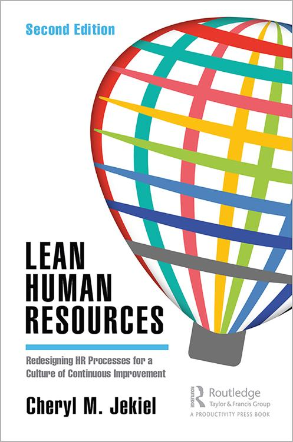
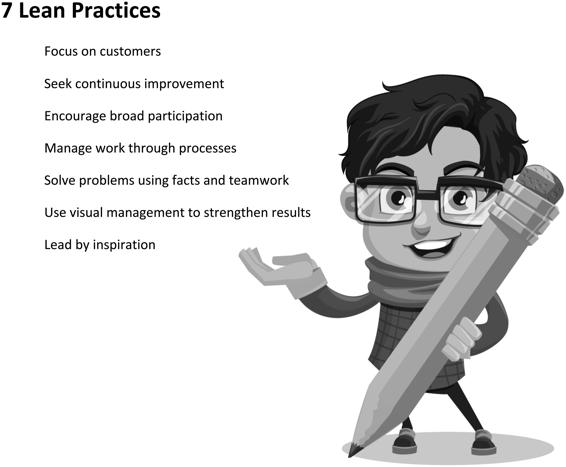
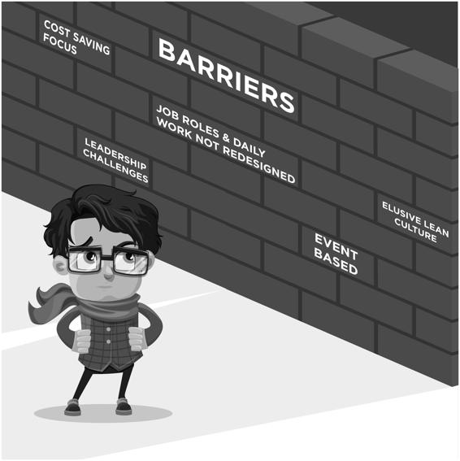
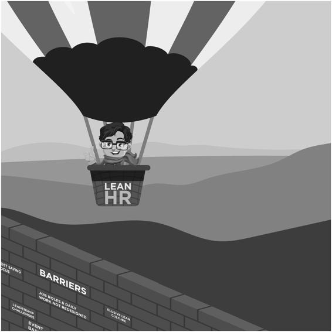
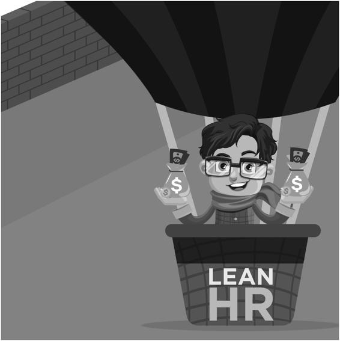

Lean Human Resources

“Businesses succeed or fail on the backs of their people, and particularly by their level of motivation and inspiration from leadership. Leaders who wish to practice lean need to read, study and understand the thinking and practices provided by _Lean Human Resources_.” 

**– Ron Harper, President/CEO Cogent Power Inc.** 

“People are the single biggest factor necessary to ensure business success. 

They drive results, access to capital and innovation. Jekiel’s powerful combination of Lean practice with the functional impact of Human Resources, for organizations who embrace this principle, creates sustainable growth and value creation.” 

**– Sylvia Wulf, CEO AquaBountysino**

“Seek to create an organization that attracts and retains top performers? It begins with building the foundation for excellence—and not just operationally. Human resource’s role in an organization must shift from transactional work to being vital partner in the transformation process. Jekiel’s _Lean_ _Human Resources_ is a must-read for accomplishing this transition and places HR where it should be—at the center of transformation.” 

**– Karin Martin, TKMG**

“Lean at its core is a people development system. Further the objective of Lean is to create an adaptive culture that makes continuous improvement a way of life. This is why HR must be ‘at the table’ and be a true partner of any Lean transformation. The author provides clarity of HR’s role and a path to get there. Cheryl’s rich experience fuels a powerful and passionate voice. 

It is a must read for anyone interested in creating a highly performing HR 

function in his or her organization.” 

**– Drew Locher, Change Management Associates**

Lean Human Resources

Redesigning HR Processes for a 

Culture of Continuous Improvement

Second Edition

By 

Cheryl M. Jekiel

A P R O D U C T I V I T Y P R E S S B O O K

Second edition published in 2020

by Routledge/Productivity Press

52 Vanderbilt Avenue, 11th Floor New York, NY 10017

2 Park Square, Milton Park, Abingdon, Oxon OX14 4RN, UK

© 2020 by Cheryl M. Jekiel

_Routledge/Productivity Press is an imprint of Taylor & Francis Group, an Informa business_ No claim to original U.S. Government works

Printed on acid-free paper

International Standard Book Number-13: 978-1-138-59538-5 (Paperback) International Standard Book Number-13: 978-1-138-59541-5 (Hardback) International Standard Book Number-13: 978-0-429-32595-3 (eBook) This book contains information obtained from authentic and highly regarded sources. Reasonable efforts have been made to publish reliable data and information, but the author and publisher cannot assume responsibility for the valid-ity of all materials or the consequences of their use. The author and publisher have attempted to trace the copyright holders of all material reproduced in this publication and apologize to copyright holders if permission to publish in this form has not been obtained. If any copyright material has not been acknowledged, please write and let us know so we may rectify in any future reprint. 

Except as permitted under U.S. Copyright Law, no part of this book may be reprinted, reproduced, transmitted, or utilized in any form by any electronic, mechanical, or other means, now known or hereafter invented, including photocopying, microfilming, and recording, or in any information storage or retrieval system, without written permission from the publisher. 

For permission to photocopy or use material electronically from this work, please access [www.copyright.com](./http___www.copyright.com) ([http://](./http___www.copyright.com)

[www.copyright.com/](./http___www.copyright.com)) or contact the Copyright Clearance Center, Inc. (CCC), 222 Rosewood Drive, Danvers, MA 01923, 978-750-8400\. CCC is a not-for-profit organization that provides licenses and registration for a variety of users. For organizations that have been granted a photocopy license by the CCC, a separate system of payment has been arranged. 

**Trademark Notice**: Product or corporate names may be trademarks or registered trademarks, and are used only for identification and explanation without intent to infringe. 

**Library of Congress Cataloging in Publication Data**

Names: Jekiel, Cheryl M., author. 

Title: Lean human resources : redesigning HR processes for a culture of continuous improvement / Cheryl M. Jekiel. 

Description: Second edition. | New York, NY : Taylor & Francis, 2020\. | 

Includes bibliographical references and index. 

Identifiers: LCCN 2019048870 (print) | LCCN 2019048871 (ebook) | ISBN 

9781138595385 (paperback) | ISBN 9781138595415 (hardback) | ISBN 

9780429325953 (ebook) 

Subjects: LCSH: Personnel management. | Quality control--Management. | 

Organizational effectiveness. 

Classification: LCC HF5549 .J457 2020 (print) | LCC HF5549 (ebook) | DDC 

658.3/01--dc23 

LC record available at [https://lccn.loc.gov/2019048870](./https___lccn.loc.gov)

LC ebook record available at [https://lccn.loc.gov/2019048871](./https___lccn.loc.gov)

**Visit the Taylor & Francis Website at**

<http://www.taylorandfrancis.com>

**and the CRC Press Website at**

<http://www.crcpress.com>

**Contents**

[**Acknowledgments** ................................................................................... xv](id114)

[**About the Author** ...................................................................................xvii](id114)

[**Introduction** ............................................................................................xix](id114)

[**SeCtion i tHe LeAn HR MAniFeSto**](id114)

[ **1 What Is Lean HR? ........................................................................3**](id114)

[What Is Possible with a Lean Transformation? ..........................................4](id114)

[What Is True Today About the Role of HR in Lean? .................................4](id114)

[Why HR Has Failed to Achieve This Vision ..............................................5](id114)

[What Is Lean HR? ........................................................................................6](id114)

[Differing Viewpoints of HR ........................................................................7](id114)

[Myth #1: Lean HR Refers to Improving the Nonstrategic, ](id114)

[Transactional Work of HR .......................................................................8](id114)

[Reality: Applying Lean Methods to HR Should Only Be the ](id114)

[Beginning of a Lean HR Initiative. Doing so Provides a ](id114)

[Foundation That Prepares HR to Become a Valuable Resource ](id114)

[for Companywide Improvement .........................................................9](id114)

[Opportunity: Optimize HR’s Leadership Potential, Expertise, ](id114)

[and Areas of Responsibility to Advance the Strategies and ](id114)

[Activities of Lean Transformation .......................................................9](id114)

[Myth #2: With a Focus on Reducing Costs, Lean Initiatives Do ](id114)

[Not Require HR involvement ................................................................10](id114)

[Reality: Increasingly, Lean Is Seen as a Cultural Initiative and, ](id114)

[Therefore, Clearly Requires HR to Maximize Its Benefits ...............10](id114)

[Opportunity: Allow HR to Drastically Reduce the Waste of ](id114)

[Human Capabilities ...........................................................................11](id114)

**v**

**vi** ◾   _Contents_

[Myth #3: HR Professionals Are Fundamentally Incapable of ](id114)

[Contributing to Non-HR-Related Business Strategies, ](id114)

[Including Lean .......................................................................................12](id114)

[Reality: Many Aspects of HR Are Capable of Driving Game-](id114)

[Changing Financial Results ...............................................................12](id114)

[Opportunity: Build the Skills and Capabilities of HR to ](id114)

[Increase Its Contribution to Exceptional Business Results ..............13](id114)

[Two Sides of HR........................................................................................13](id114)

[Preparing to Expand HR’s Strategic Role .................................................15](id114)

[ **2 A New Way to View Lean HR .....................................................19**](id114)

[Defining Lean: The Seven Common Practices.........................................20](id114)

[Practice 1: Maintain Customer Focus ...................................................21](id114)

[Common Customer Focus Practices .................................................21](id114)

[Practice 2: Measure Improvements .......................................................21](id114)

[Common Measurable Improvement Practices ..................................22](id114)

[Practice 3: Foster Broad Participation ...................................................22](id114)

[Common Broad Participation Practices ............................................23](id114)

[Practice 4: Standardize Processes .........................................................23](id114)

[Common Standardized Processes Practices .....................................24](id114)

[Practice 5: Solve Problems Methodically ..............................................24](id114)

[Common Problem-Solving Practices .................................................25](id114)

[Practice 6: Utilize Visual Management .................................................25](id114)

[Common Visual Management Practices ...........................................26](id114)

[Practice 7: Lead Through Inspiration ...................................................26](id114)

[Common Inspirational Leadership Practices ....................................27](id114)

[The Problem: Most Organizations Fail to Achieve a Successful Lean ](id114)

[Transformation ..........................................................................................27](id114)

[The Barriers That Block Successful Transformations ..............................28](id114)

[Barrier 1: The Shortsightedness of a Cost-Saving Focus .....................29](id114)

[Barrier 2: The Struggle to Move Beyond Improvement ‘Events’ .........30](id114)

[Barrier 3: Job Roles and Daily Work Don’t Get Redesigned for ](id114)

[Improvement Practices ..........................................................................30](id114)

[Barrier 4: Developing a Lean Culture Can Be Elusive .........................31](id114)

[Barrier 5: Leadership Changes Are Extremely Difficult .......................32](id114)

[HR Leaders Can Help Remove Barriers and Boost Results .....................33](id114)

[HR Can Take the Lead for Developing a Lean Culture ...........................33](id114)

[HR Can Redefine Work Roles for a Lean Culture ................................35](id114)

[HR Can Support the Transformation of Leadership .............................36](id114)

[How Lean HR Creates Results ..................................................................37](id114)

_Contents_ ◾ **vii**

[ **3 Expand Lean Results with HR ...................................................41**](id114)

[Potential Improvement Value of Lean (PIV) ............................................42](id114)

[Three Aspects of Calculating Potential Improvement Value (PIV) .........47](./2-Three_Aspects_of_Calculating_Potential_Improvement_Value_(PIV).md#p72)

[PIV Type 1: Estimating the PIV of Better Operating Margins .............48](./2-Three_Aspects_of_Calculating_Potential_Improvement_Value_(PIV).md#p73)

[PIV Type 2: Estimating the PIV of Increased Revenue ........................49](./2-Three_Aspects_of_Calculating_Potential_Improvement_Value_(PIV).md#p74)

[PIV Type 3: Estimating the PIV of Greater Financial Performance .....50](./2-Three_Aspects_of_Calculating_Potential_Improvement_Value_(PIV).md#p75)

[HR Needs to Learn to Quantify the Financial Value of Lean .................50](./2-Three_Aspects_of_Calculating_Potential_Improvement_Value_(PIV).md#p75)

[How Lean HR Helps Achieve Optimal Lean Results ...............................51](./2-Three_Aspects_of_Calculating_Potential_Improvement_Value_(PIV).md#p76)

[Lean Cultures That Deliver BIG Results ...................................................51](./2-Three_Aspects_of_Calculating_Potential_Improvement_Value_(PIV).md#p76)

[**SeCtion ii iMPLeMentinG LeAn CULtUReS**](./2-Three_Aspects_of_Calculating_Potential_Improvement_Value_(PIV).md#p82)

[ **4 Defining Lean Culture: Values and Behaviors ...........................59**](./2-Three_Aspects_of_Calculating_Potential_Improvement_Value_(PIV).md#p84)

[What Is a Lean Culture? ............................................................................59](./2-Three_Aspects_of_Calculating_Potential_Improvement_Value_(PIV).md#p84)

[Organizations Create Culture by Design or Default ................................60](./2-Three_Aspects_of_Calculating_Potential_Improvement_Value_(PIV).md#p85)

[A Strong Culture Drives Greater Success .................................................60](./2-Three_Aspects_of_Calculating_Potential_Improvement_Value_(PIV).md#p85)

[Lean Cultures Are More Than a Group of Activities ...............................60](./2-Three_Aspects_of_Calculating_Potential_Improvement_Value_(PIV).md#p85)

[Lean HR Has a Key Role in Driving a Lean Culture ...............................61](./2-Three_Aspects_of_Calculating_Potential_Improvement_Value_(PIV).md#p86)

[Seven Common Lean Practices: Values and Behaviors ...........................62](./2-Three_Aspects_of_Calculating_Potential_Improvement_Value_(PIV).md#p87)

[Lean Cultural Element #1: Maintain Customer Focus ..........................62](./2-Three_Aspects_of_Calculating_Potential_Improvement_Value_(PIV).md#p87)

[Lean Cultural Element #2: Measure Improvements .............................63](./2-Three_Aspects_of_Calculating_Potential_Improvement_Value_(PIV).md#p88)

[Lean Cultural Element #3: Foster Participation ....................................64](./2-Three_Aspects_of_Calculating_Potential_Improvement_Value_(PIV).md#p89)

[Lean Cultural Element #4: Standardize Processes ................................65](./2-Three_Aspects_of_Calculating_Potential_Improvement_Value_(PIV).md#p90)

[Lean Cultural Element #5: Solve Problems Methodically ....................66](./2-Three_Aspects_of_Calculating_Potential_Improvement_Value_(PIV).md#p91)

[Lean Cultural Element #6: Utilize Visual Management ........................67](./2-Three_Aspects_of_Calculating_Potential_Improvement_Value_(PIV).md#p92)

[Lean Cultural Element #7: Lead Through Inspiration ..........................67](./2-Three_Aspects_of_Calculating_Potential_Improvement_Value_(PIV).md#p92)

[The Many Ways Lean HR Drives a Lean Culture ....................................68](./2-Three_Aspects_of_Calculating_Potential_Improvement_Value_(PIV).md#p93)

[Not Involving HR Can Damage Company Culture ..................................69](./2-Three_Aspects_of_Calculating_Potential_Improvement_Value_(PIV).md#p94)

[Lean Cultures Are the Foundation for Engagement ................................69](./2-Three_Aspects_of_Calculating_Potential_Improvement_Value_(PIV).md#p94)

[ **5 Leverage Lean to Drive Employee Engagement .........................73**](./2-Three_Aspects_of_Calculating_Potential_Improvement_Value_(PIV).md#p98)

[What Engagement Looks Like ..................................................................74](./2-Three_Aspects_of_Calculating_Potential_Improvement_Value_(PIV).md#p99)

[Engagement Versus Motivation .............................................................74](./2-Three_Aspects_of_Calculating_Potential_Improvement_Value_(PIV).md#p99)

[The Overlap Between Engagement and Lean .....................................76](./2-Three_Aspects_of_Calculating_Potential_Improvement_Value_(PIV).md#p101)

[Lean HR Activities to Drive Engagement .................................................78](./2-Three_Aspects_of_Calculating_Potential_Improvement_Value_(PIV).md#p103)

[Use the 1% Method for ROI of Engagement ............................................79](./2-Three_Aspects_of_Calculating_Potential_Improvement_Value_(PIV).md#p104)

[Lean Can Create Disengagement ..............................................................80](./2-Three_Aspects_of_Calculating_Potential_Improvement_Value_(PIV).md#p105)

[Ignoring or Mishandling Ideas..............................................................80](./2-Three_Aspects_of_Calculating_Potential_Improvement_Value_(PIV).md#p105)

[Potential Disengagement with Low Participation ................................80](./2-Three_Aspects_of_Calculating_Potential_Improvement_Value_(PIV).md#p105)

[Replacing Lean Leaders with a Top-Down Leadership Style ..............81](./2-Three_Aspects_of_Calculating_Potential_Improvement_Value_(PIV).md#p106)

**viii** ◾   _Contents_

[Three Best Practices for Measurably Improving Engagement .............81](./2-Three_Aspects_of_Calculating_Potential_Improvement_Value_(PIV).md#p106)

[Measuring Engagement .........................................................................82](./2-Three_Aspects_of_Calculating_Potential_Improvement_Value_(PIV).md#p107)

[Increasing Engagement Requires Change Management ......................83](./2-Three_Aspects_of_Calculating_Potential_Improvement_Value_(PIV).md#p108)

[ **6 Lean Is a Culture Change ..........................................................87**](./2-Three_Aspects_of_Calculating_Potential_Improvement_Value_(PIV).md#p112)

[Lean as a Change Management Initiative ................................................88](./2-Three_Aspects_of_Calculating_Potential_Improvement_Value_(PIV).md#p113)

[Difficulties Related to a Lean Culture Change .........................................89](./2-Three_Aspects_of_Calculating_Potential_Improvement_Value_(PIV).md#p114)

[Overcoming Difficulties with Effective Strategies ....................................91](./2-Three_Aspects_of_Calculating_Potential_Improvement_Value_(PIV).md#p116)

[Effective Strategy #1: Focus on Opportunities with the Greatest ](./2-Three_Aspects_of_Calculating_Potential_Improvement_Value_(PIV).md#p116)

[Impact ....................................................................................................91](./2-Three_Aspects_of_Calculating_Potential_Improvement_Value_(PIV).md#p116)

[Leverage the People Most Engaged with Lean ................................91](./2-Three_Aspects_of_Calculating_Potential_Improvement_Value_(PIV).md#p116)

[Don’t Be Distracted By Those Who Disagree ..................................92](./2-Three_Aspects_of_Calculating_Potential_Improvement_Value_(PIV).md#p117)

[Optimize Opportunities to Influence Positive Change ....................92](./2-Three_Aspects_of_Calculating_Potential_Improvement_Value_(PIV).md#p117)

[Effective Strategy #2: Understand the Realities of Change Readiness ..... 93](./2-Three_Aspects_of_Calculating_Potential_Improvement_Value_(PIV).md#p118)

[Effective Strategy #3: Encourage an Individual Relationship with ](./2-Three_Aspects_of_Calculating_Potential_Improvement_Value_(PIV).md#p118)

[Lean .......................................................................................................93](./2-Three_Aspects_of_Calculating_Potential_Improvement_Value_(PIV).md#p118)

[Effective Strategy #4: Ensure Policies and Practices Align with ](./2-Three_Aspects_of_Calculating_Potential_Improvement_Value_(PIV).md#p119)

[Lean Principles ......................................................................................94](./2-Three_Aspects_of_Calculating_Potential_Improvement_Value_(PIV).md#p119)

[Evaluate Your Policies for Their Impact and Relationship with ](./2-Three_Aspects_of_Calculating_Potential_Improvement_Value_(PIV).md#p120)

[Lean Principles and Practices ............................................................95](./2-Three_Aspects_of_Calculating_Potential_Improvement_Value_(PIV).md#p120)

[Actively Blur the Lines Between Management and People ](./2-Three_Aspects_of_Calculating_Potential_Improvement_Value_(PIV).md#p121)

[Who Make Products or Provide Services .........................................96](./2-Three_Aspects_of_Calculating_Potential_Improvement_Value_(PIV).md#p121)

[Encourage Accountability Versus Control ........................................96](./2-Three_Aspects_of_Calculating_Potential_Improvement_Value_(PIV).md#p121)

[Effective Strategy #5: Seek Opportunities to Align Messages .............98](./2-Three_Aspects_of_Calculating_Potential_Improvement_Value_(PIV).md#p123)

[Verify That Hiring and Selection Practices are Supportive ..............98](./2-Three_Aspects_of_Calculating_Potential_Improvement_Value_(PIV).md#p123)

[Align Performance Management Systems to Lean Values ...............98](./2-Three_Aspects_of_Calculating_Potential_Improvement_Value_(PIV).md#p123)

[Align Bonus Plan Criteria by Revising Misalignments .....................98](./2-Three_Aspects_of_Calculating_Potential_Improvement_Value_(PIV).md#p123)

[Communicate Clear and Consistent Messaging................................99](./2-Three_Aspects_of_Calculating_Potential_Improvement_Value_(PIV).md#p124)

[Treat Celebrations as an Opportunity ..............................................99](./2-Three_Aspects_of_Calculating_Potential_Improvement_Value_(PIV).md#p124)

[Utilize Physical Surroundings to Reflect Teamwork and ](./2-Three_Aspects_of_Calculating_Potential_Improvement_Value_(PIV).md#p124)

[Participation .......................................................................................99](./2-Three_Aspects_of_Calculating_Potential_Improvement_Value_(PIV).md#p124)

[Ensure Safety Programs Precisely Communicate What’s ](./2-Three_Aspects_of_Calculating_Potential_Improvement_Value_(PIV).md#p125)

[Important .........................................................................................100](./2-Three_Aspects_of_Calculating_Potential_Improvement_Value_(PIV).md#p125)

[Effective Strategy #6: Strengthen Alignment with Strategy ](./2-Three_Aspects_of_Calculating_Potential_Improvement_Value_(PIV).md#p125)

[Deployment .........................................................................................100](./2-Three_Aspects_of_Calculating_Potential_Improvement_Value_(PIV).md#p125)

[Effective Strategy #7: Measure, Monitor, and Manage Culture ](./2-Three_Aspects_of_Calculating_Potential_Improvement_Value_(PIV).md#p126)

[Change ................................................................................................. 101](./2-Three_Aspects_of_Calculating_Potential_Improvement_Value_(PIV).md#p126)

[Surveys Measure Culture Change but Also Need to Build ](./2-Three_Aspects_of_Calculating_Potential_Improvement_Value_(PIV).md#p127)

[Relationships and Identify Improvement Opportunities ................102](./2-Three_Aspects_of_Calculating_Potential_Improvement_Value_(PIV).md#p127)

[The Benefits of Mastering Lean Culture Changes .................................102](./2-Three_Aspects_of_Calculating_Potential_Improvement_Value_(PIV).md#p127)

_Contents_ ◾ **ix**

[**SeCtion iii iMPLeMentinG A LeAn tALent MAnAGeMent SYSteM**](./2-Three_Aspects_of_Calculating_Potential_Improvement_Value_(PIV).md#p132)

[ **7 Lean Talent Management Optimizes Success...........................109**](./2-Three_Aspects_of_Calculating_Potential_Improvement_Value_(PIV).md#p134)

[Defining a Talent Management System .................................................. 110](./2-Three_Aspects_of_Calculating_Potential_Improvement_Value_(PIV).md#p135)

[Lean Talent Management Systems .......................................................... 110](./2-Three_Aspects_of_Calculating_Potential_Improvement_Value_(PIV).md#p135)

[Obstacles to Lean Talent Management Systems ..................................... 111](./2-Three_Aspects_of_Calculating_Potential_Improvement_Value_(PIV).md#p136)

[HR Focus Is Internal Rather Than External ....................................... 112](./2-Three_Aspects_of_Calculating_Potential_Improvement_Value_(PIV).md#p137)

[Underestimating the Power of HR ......................................................... 112](./2-Three_Aspects_of_Calculating_Potential_Improvement_Value_(PIV).md#p137)

[Traditional Systems Work in Silos .......................................................... 113](./2-Three_Aspects_of_Calculating_Potential_Improvement_Value_(PIV).md#p138)

[HR Is Unfamiliar with How to Drive Lean ............................................ 113](./2-Three_Aspects_of_Calculating_Potential_Improvement_Value_(PIV).md#p138)

[Talent Management Components Are Not Well Aligned ....................... 113](./2-Three_Aspects_of_Calculating_Potential_Improvement_Value_(PIV).md#p138)

[LASER Approach Solves Lean Talent Management Challenges ............. 114](./2-Three_Aspects_of_Calculating_Potential_Improvement_Value_(PIV).md#p139)

[Phase 1: Leverage HR Capabilities to Achieve Business Priorities .... 115](./2-Three_Aspects_of_Calculating_Potential_Improvement_Value_(PIV).md#p140)

[Lean HR Can Drive Results ............................................................. 115](./2-Three_Aspects_of_Calculating_Potential_Improvement_Value_(PIV).md#p140)

[Phase 2: Align Your Culture with Lean Business Strategies .............. 116](./2-Three_Aspects_of_Calculating_Potential_Improvement_Value_(PIV).md#p141)

[The Difference Between Traditional and Lean Business Strategies .....117](./2-Three_Aspects_of_Calculating_Potential_Improvement_Value_(PIV).md#p142)

[Lean Business Strategies and the Seven Common Practices ......... 119](./2-Three_Aspects_of_Calculating_Potential_Improvement_Value_(PIV).md#p144)

[Phase 3: Structure the Organization to Support ](./2-Three_Aspects_of_Calculating_Potential_Improvement_Value_(PIV).md#p145)

[a Lean Approach .................................................................................120](./2-Three_Aspects_of_Calculating_Potential_Improvement_Value_(PIV).md#p145)

[Phase 4: Expand Job Roles to Include Increased Responsibilities ....121](./2-Three_Aspects_of_Calculating_Potential_Improvement_Value_(PIV).md#p146)

[Phase 5: Redesign Each Component of the Talent ](./2-Three_Aspects_of_Calculating_Potential_Improvement_Value_(PIV).md#p148)

[Management System ............................................................................123](./2-Three_Aspects_of_Calculating_Potential_Improvement_Value_(PIV).md#p148)

[Utilize Seven Practices to Strengthen HR Systems .........................124](./2-Three_Aspects_of_Calculating_Potential_Improvement_Value_(PIV).md#p149)

[Redesigning Components Provides a Strategic Opportunity .........125](./2-Three_Aspects_of_Calculating_Potential_Improvement_Value_(PIV).md#p150)

[A Five-Year Strategic Plan is Helpful to a Lean HR Journey ..........126](./2-Three_Aspects_of_Calculating_Potential_Improvement_Value_(PIV).md#p151)

[Benefits of a Lean Talent Management System .....................................127](./2-Three_Aspects_of_Calculating_Potential_Improvement_Value_(PIV).md#p152)

[Begin by Developing Lean Leaders........................................................128](./3-Begin_by_Developing_Lean_Leaders.md#p153)

[ **8 Developing Lean Leaders .........................................................133**](./3-Begin_by_Developing_Lean_Leaders.md#p158)

[A New Vision for the Workplace Requires a New Way to Lead ...........133](./3-Begin_by_Developing_Lean_Leaders.md#p158)

[The Magnitude of Implementing Lean Leadership ................................134](./3-Begin_by_Developing_Lean_Leaders.md#p159)

[The Reciprocal Relationship Between Leaders and ](./3-Begin_by_Developing_Lean_Leaders.md#p161)

[the Workplace .....................................................................................136](./3-Begin_by_Developing_Lean_Leaders.md#p161)

[Transforming Leadership Is Challenging ................................................137](./3-Begin_by_Developing_Lean_Leaders.md#p162)

[Lack of Knowledge and Absence of a Robust Plan ...........................137](./3-Begin_by_Developing_Lean_Leaders.md#p162)

[Underestimated the Need for Building Adequate Skills ....................138](./3-Begin_by_Developing_Lean_Leaders.md#p163)

[Misaligned Talent Management Systems ............................................138](./3-Begin_by_Developing_Lean_Leaders.md#p163)

[Resistance to Necessary Changes .......................................................139](./3-Begin_by_Developing_Lean_Leaders.md#p164)

[Applying the LASER Approach to Developing Leaders .........................139](./3-Begin_by_Developing_Lean_Leaders.md#p164)

[Establish the Expanded Role of Leadership .......................................139](./3-Begin_by_Developing_Lean_Leaders.md#p164)

**x** ◾   _Contents_

[Revising Leadership Job Descriptions with a New Design ............ 141](./3-Begin_by_Developing_Lean_Leaders.md#p166)

[Completing a Cohesive Job Design with a Job Skill Matrix .......... 141](./3-Begin_by_Developing_Lean_Leaders.md#p166)

[Relationship Between Job Design and Leader Standard Work...... 143](./3-Begin_by_Developing_Lean_Leaders.md#p168)

[Redesign Talent Management Systems ............................................... 143](./3-Begin_by_Developing_Lean_Leaders.md#p168)

[Hiring the Right Leaders: An Often Missed Opportunity ................. 143](./3-Begin_by_Developing_Lean_Leaders.md#p168)

[Start by Looking for Improvement-Oriented Leaders ....................144](./3-Begin_by_Developing_Lean_Leaders.md#p169)

[Use Lean Tools to Select the Right People .....................................144](./3-Begin_by_Developing_Lean_Leaders.md#p169)

[Allow Teams to Be Highly Involved in Selecting Their Leaders .......144](./3-Begin_by_Developing_Lean_Leaders.md#p169)

[World-Class Cultures Demand World-Class Onboarding .............. 145](./3-Begin_by_Developing_Lean_Leaders.md#p170)

[Ensure That Training Lean Leaders Adds Value ............................ 145](./3-Begin_by_Developing_Lean_Leaders.md#p170)

[The Controversy Surrounding Performance Management................. 147](./3-Begin_by_Developing_Lean_Leaders.md#p172)

[Performance Management Systems Need to Protect ](./3-Begin_by_Developing_Lean_Leaders.md#p172)

[Psychological Safety ........................................................................ 147](./3-Begin_by_Developing_Lean_Leaders.md#p172)

[Consider Performance Review Approaches Carefully ....................148](./3-Begin_by_Developing_Lean_Leaders.md#p173)

[Optimize the Benefits of Recognition and Rewards ......................148](./3-Begin_by_Developing_Lean_Leaders.md#p173)

[The Power of Recognition ..............................................................148](./3-Begin_by_Developing_Lean_Leaders.md#p173)

[Financial Reward Systems ............................................................... 149](./3-Begin_by_Developing_Lean_Leaders.md#p174)

[Additional Strategies for Overcoming Lean Leadership Obstacles ........ 150](./3-Begin_by_Developing_Lean_Leaders.md#p175)

[Benefits of Lean Leadership Translate to Expanded Workforce ........... 150](./3-Begin_by_Developing_Lean_Leaders.md#p175)

[ **9 Developing a Fully Engaged Workforce ................................... 155**](./3-Begin_by_Developing_Lean_Leaders.md#p180)

[The Pursuit of a Fully Engaged Workforce ............................................ 156](./3-Begin_by_Developing_Lean_Leaders.md#p181)

[Lean Represents a Spectrum of Involvement Levels ............................. 157](./3-Begin_by_Developing_Lean_Leaders.md#p182)

[Impediments to Full Involvement ...................................................... 157](./3-Begin_by_Developing_Lean_Leaders.md#p182)

[Getting over the Leadership Hurdle ............................................... 157](./3-Begin_by_Developing_Lean_Leaders.md#p182)

[Failure to Amend the Flow of Work ............................................... 158](./3-Begin_by_Developing_Lean_Leaders.md#p183)

[Team Member Resistance to Higher Levels of Involvement .......... 158](./3-Begin_by_Developing_Lean_Leaders.md#p183)

[Lack of a Clear Vision ..................................................................... 159](./3-Begin_by_Developing_Lean_Leaders.md#p184)

[The Price of Failure ............................................................................. 159](./3-Begin_by_Developing_Lean_Leaders.md#p184)

[Failure of Lean Initiatives ................................................................160](./3-Begin_by_Developing_Lean_Leaders.md#p185)

[Damage to the Culture ....................................................................160](./3-Begin_by_Developing_Lean_Leaders.md#p185)

[Demoralization of Specific Individuals ...........................................160](./3-Begin_by_Developing_Lean_Leaders.md#p185)

[The LASER Approach to Implementing Lean Organization-Wide ........ 161](./3-Begin_by_Developing_Lean_Leaders.md#p186)

[Establish a Vision for Expanded Roles ............................................... 161](./3-Begin_by_Developing_Lean_Leaders.md#p186)

[Redesign the Talent Management Programs ...................................... 162](./3-Begin_by_Developing_Lean_Leaders.md#p187)

[Better Hiring ....................................................................................163](./3-Begin_by_Developing_Lean_Leaders.md#p188)

[Involved Employees Demand More Training .................................163](./3-Begin_by_Developing_Lean_Leaders.md#p188)

[Performance Management as Accountability Systems ...................164](./3-Begin_by_Developing_Lean_Leaders.md#p189)

[The Tremendous Power of Recognition and Rewards ...................164](./3-Begin_by_Developing_Lean_Leaders.md#p189)

_Contents_ ◾ **xi**

[Additional Strategies for Connecting with Your Workforce ............... 165](./3-Begin_by_Developing_Lean_Leaders.md#p190)

[The Many Benefits of an Engaged Workforce .......................................168](./3-Begin_by_Developing_Lean_Leaders.md#p193)

[Create a Team of Problem Solvers ......................................................169](./3-Begin_by_Developing_Lean_Leaders.md#p194)

[Make Lean Sustainable ........................................................................169](./3-Begin_by_Developing_Lean_Leaders.md#p194)

[Improve Financial Performance ..........................................................169](./3-Begin_by_Developing_Lean_Leaders.md#p194)

[Increase in Value over Time ............................................................... 170](./3-Begin_by_Developing_Lean_Leaders.md#p195)

[The Role of HR in Driving Expanded Work Roles ................................ 170](./3-Begin_by_Developing_Lean_Leaders.md#p195)

[**SeCtion iV HR AS A MoDeL oF LeAn PRACtiCeS AnD BeHAVioRS**](./3-Begin_by_Developing_Lean_Leaders.md#p200)

[ **10 Applying Lean to HR ...............................................................177**](./3-Begin_by_Developing_Lean_Leaders.md#p202)

[The Typical Beginning of the Lean HR Journey ................................... 178](./3-Begin_by_Developing_Lean_Leaders.md#p203)

[Purpose of Applying Lean to HR ........................................................... 178](./3-Begin_by_Developing_Lean_Leaders.md#p203)

[Purpose #1: Build Valuable Lean Skills Through Practice ................. 179](./3-Begin_by_Developing_Lean_Leaders.md#p204)

[Purpose #2: Improve the Value of HR Contributions ........................180](./3-Begin_by_Developing_Lean_Leaders.md#p205)

[Purpose #3: Improved HR Leads to Happier People and ](./3-Begin_by_Developing_Lean_Leaders.md#p205)

[Better Performance .............................................................................180](./3-Begin_by_Developing_Lean_Leaders.md#p205)

[Purpose #4: The Remedy for Being Overwhelmed and Reactive .....181](./3-Begin_by_Developing_Lean_Leaders.md#p206)

[Lean HR Management Systems .............................................................. 181](./3-Begin_by_Developing_Lean_Leaders.md#p206)

[Be Guided by the Needs of the Customer .........................................181](./3-Begin_by_Developing_Lean_Leaders.md#p206)

[Cadences for Learning and Measurable Improvement ..................182](./3-Begin_by_Developing_Lean_Leaders.md#p207)

[Base Lean HR on Standardized Processes .........................................183](./3-Begin_by_Developing_Lean_Leaders.md#p208)

[Lean HR Leadership ............................................................................184](./3-Begin_by_Developing_Lean_Leaders.md#p209)

[Your Team’s Lean HR Journey ................................................................184](./3-Begin_by_Developing_Lean_Leaders.md#p209)

[Move Forward by Developing Lean HR Leaders ...................................185](./3-Begin_by_Developing_Lean_Leaders.md#p210)

[ **11 Development of Lean HR Professionals ...................................189**](./3-Begin_by_Developing_Lean_Leaders.md#p214)

[Highly Developed HR Professionals Are Essential ................................190](./3-Begin_by_Developing_Lean_Leaders.md#p215)

[Skilled Lean HR Professionals Assist in Optimizing the Value ](./3-Begin_by_Developing_Lean_Leaders.md#p215)

[of Lean .................................................................................................190](./3-Begin_by_Developing_Lean_Leaders.md#p215)

[Because Lean Focuses on People, It Impacts the Value of HR .........190](./3-Begin_by_Developing_Lean_Leaders.md#p215)

[The Evolution of HR Is Toward Being More Strategic .......................190](./3-Begin_by_Developing_Lean_Leaders.md#p215)

[Lean Advances the Careers of HR Professionals ................................ 191](./3-Begin_by_Developing_Lean_Leaders.md#p216)

[The Complexities of Developing Lean HR Skills ................................... 191](./3-Begin_by_Developing_Lean_Leaders.md#p216)

[As a Newer Field of Study, Lean HR as a Body of Knowledge ](./3-Begin_by_Developing_Lean_Leaders.md#p216)

[Is Widely Unknown ............................................................................ 191](./3-Begin_by_Developing_Lean_Leaders.md#p216)

[The Quantity and Difficulty of the Skills Demand Extensive ](./3-Begin_by_Developing_Lean_Leaders.md#p216)

[Training, Mentoring, Practice, and Support ........................................ 191](./3-Begin_by_Developing_Lean_Leaders.md#p216)

[Lean HR Aligns Tightly with Organizational Development (OD) ](./3-Begin_by_Developing_Lean_Leaders.md#p216)

[Capabilities, in Addition to Traditional HR Competencies ................ 191](./3-Begin_by_Developing_Lean_Leaders.md#p216)

[Lean HR Competencies ........................................................................... 192](./3-Begin_by_Developing_Lean_Leaders.md#p217)

**xii** ◾   _Contents_

[SHRM HR Competencies .................................................................... 193](./3-Begin_by_Developing_Lean_Leaders.md#p218)

[SHRM OD Competencies .................................................................... 193](./3-Begin_by_Developing_Lean_Leaders.md#p218)

[Business Acumen Skills ...................................................................... 193](./3-Begin_by_Developing_Lean_Leaders.md#p218)

[Lean Culture Elements and Implementations ....................................194](./3-Begin_by_Developing_Lean_Leaders.md#p219)

[Ability to Increase Customer Perceived Value ...............................194](./3-Begin_by_Developing_Lean_Leaders.md#p219)

[Organizational Development Consulting Skills ..............................194](./3-Begin_by_Developing_Lean_Leaders.md#p219)

[Strategies for Optimizing Engagement ...........................................194](./3-Begin_by_Developing_Lean_Leaders.md#p219)

[Effective Change Management ........................................................ 195](./4-Effective_Change_Management.md#p220)

[Inspirational or Empowering Leadership ........................................... 195](./4-Effective_Change_Management.md#p220)

[Lean Leadership Competencies ...................................................... 195](./4-Effective_Change_Management.md#p220)

[Leadership Development Strategies ................................................196](./4-Effective_Change_Management.md#p221)

[Personal Growth and Development ...............................................196](./4-Effective_Change_Management.md#p221)

[Lean Methods ......................................................................................196](./4-Effective_Change_Management.md#p221)

[Identification and Elimination of Waste ......................................... 197](./4-Effective_Change_Management.md#p222)

[Ability to Stabilize and Sustain Standard Work .............................. 197](./4-Effective_Change_Management.md#p222)

[Team-Based Problem-Solving ......................................................... 197](./4-Effective_Change_Management.md#p222)

[Strategy Deployment .......................................................................198](./4-Effective_Change_Management.md#p223)

[HR Is Stepping into New Roles ..............................................................198](./4-Effective_Change_Management.md#p223)

[Stronger Strategic Roles .......................................................................198](./4-Effective_Change_Management.md#p223)

[A Champion for Improvement ............................................................199](./4-Effective_Change_Management.md#p224)

[Development Plans for Lean HR Professionals ......................................199](./4-Effective_Change_Management.md#p224)

[Options for Developing Lean HR Skills .............................................200](./4-Effective_Change_Management.md#p225)

[Seek Out Educational Institutions ..................................................200](./4-Effective_Change_Management.md#p225)

[Benchmark Yourself: Learn from Other Organizations .................200](./4-Effective_Change_Management.md#p225)

[Work with Mentors ..........................................................................200](./4-Effective_Change_Management.md#p225)

[Join Professional Associations .........................................................200](./4-Effective_Change_Management.md#p225)

[Building Lean HR Skills Through Survey Processes .............................201](./4-Effective_Change_Management.md#p226)

[ **12 Lean HR Survey Processes .......................................................205**](./4-Effective_Change_Management.md#p230)

[Difficulties in Measuring the Work of Lean HR ....................................205](./4-Effective_Change_Management.md#p230)

[Culture Surveys ...................................................................................206](./4-Effective_Change_Management.md#p231)

[Employee Engagement or Satisfaction Surveys ..................................207](./4-Effective_Change_Management.md#p232)

[Internal Customer Feedback ...........................................................207](./4-Effective_Change_Management.md#p232)

[External Customer Surveys .................................................................208](./4-Effective_Change_Management.md#p233)

[Surveys Do More Than Measure ............................................................208](./4-Effective_Change_Management.md#p233)

[Build Stronger Relationships ...............................................................208](./4-Effective_Change_Management.md#p233)

[A Tool for Fostering Leadership Skills ................................................209](./4-Effective_Change_Management.md#p234)

[Feedback for Improvement .................................................................209](./4-Effective_Change_Management.md#p234)

[Dangers of Poorly Handled Surveys ...................................................... 210](./4-Effective_Change_Management.md#p235)

[Damage to Relationships and Credibility ........................................... 211](./4-Effective_Change_Management.md#p236)

_Contents_ ◾ **xiii**

[Surveys Become Unmanageable ........................................................ 211](./4-Effective_Change_Management.md#p236)

[Fail to Achieve Business Results .........................................................212](./4-Effective_Change_Management.md#p237)

[Basics of Effective Survey Practices........................................................ ](./4-Effective_Change_Management.md#p237)

[212](./4-Effective_Change_Management.md#p237)

[Reflecting Strategic Alignment ............................................................213](./4-Effective_Change_Management.md#p238)

[Effective Listening ...............................................................................213](./4-Effective_Change_Management.md#p238)

[Multiple Cycles of Communication .....................................................213](./4-Effective_Change_Management.md#p238)

[Comprehensive Leadership Involvement ............................................ 214](./4-Effective_Change_Management.md#p239)

[From Issues to Actions ........................................................................ 214](./4-Effective_Change_Management.md#p239)

[Survey Processes Can Be Key to Lean Cultures .................................... 215](./4-Effective_Change_Management.md#p240)

[**SeCtion V SUMMARY**](./4-Effective_Change_Management.md#p244)

[ **13 The Big Picture ........................................................................221**](./4-Effective_Change_Management.md#p246)

[Limited Understanding of the Potential of Lean ....................................222](./4-Effective_Change_Management.md#p247)

[Lean Is Limited to Cost Savings ..........................................................222](./4-Effective_Change_Management.md#p247)

[Leaders Have a Simplistic Concept of a Lean Mindset ......................223](./4-Effective_Change_Management.md#p248)

[Companies Are Oblivious to the Benefits of Engaging in ](./4-Effective_Change_Management.md#p249)

[Lean Initiatives ....................................................................................224](./4-Effective_Change_Management.md#p249)

[Leaders Underestimate the Risk of Getting Implementation ](./4-Effective_Change_Management.md#p249)

[Wrong ..................................................................................................224](./4-Effective_Change_Management.md#p249)

[Limited Understanding of HR Capabilities .............................................225](./4-Effective_Change_Management.md#p250)

[HR Capabilities Hide Behind Non-Value-Added Work ......................225](./4-Effective_Change_Management.md#p250)

[Some People Get Stuck in a Negative View of HR ...........................225](./4-Effective_Change_Management.md#p250)

[HR Professionals Require Advanced Skill Sets ...................................226](./4-Effective_Change_Management.md#p251)

[Lean HR Reveals What’s Possible ...........................................................226](./4-Effective_Change_Management.md#p251)

[Lean HR Promises ...................................................................................227](./4-Effective_Change_Management.md#p252)

[Lean Goes Beyond Cost Savings ........................................................227](./4-Effective_Change_Management.md#p252)

[Lean Fully Integrates into the Organization .......................................228](./4-Effective_Change_Management.md#p253)

[Leadership Is Prepared to Address Risks ...........................................228](./4-Effective_Change_Management.md#p253)

[HR Is a Highly Valued Strategic Partner ............................................228](./4-Effective_Change_Management.md#p253)

[Even Better: Lean HR Delivers a Triple Win ..........................................228](./4-Effective_Change_Management.md#p253)

[Increased Customer Benefits ..............................................................229](./4-Effective_Change_Management.md#p254)

[Increased Employee Benefits ..............................................................230](./4-Effective_Change_Management.md#p255)

[Increased Organizational Benefits ......................................................230](./4-Effective_Change_Management.md#p255)

[Poor Cultures Can Deliver Increasingly Negative Performance ............230](./4-Effective_Change_Management.md#p255)

[Lean HR Requires Stakeholder Support .................................................230](./4-Effective_Change_Management.md#p255)

[ **14 It Takes a Village .....................................................................231**](./4-Effective_Change_Management.md#p256)

[A Village of Lean HR Stakeholders ........................................................231](./4-Effective_Change_Management.md#p256)

[HR Professionals’ Perspectives on Lean HR .......................................232](./4-Effective_Change_Management.md#p257)

[Calling on CEOs to Insist That HR Meets Needs ...............................234](./4-Effective_Change_Management.md#p259)

**xiv** ◾   _Contents_

[Operations and Other Business Partners of HR ................................235](./4-Effective_Change_Management.md#p260)

[Leveraging Improvement Function Partners ......................................237](./4-Effective_Change_Management.md#p262)

[Creating the Lean HR Movement ...........................................................238](./4-Effective_Change_Management.md#p263)

[Get on the Journey and Stay on It .....................................................238](./4-Effective_Change_Management.md#p263)

[Participate in Improvement Outside HR ............................................239](./4-Effective_Change_Management.md#p264)

[Connect with Others ...........................................................................239](./4-Effective_Change_Management.md#p264)

[Lean HR Teams ...............................................................................239](./4-Effective_Change_Management.md#p264)

[Other People-Centric Cultures ........................................................240](./4-Effective_Change_Management.md#p265)

[Other Lean or Improvement-Based Enterprises .............................240](./4-Effective_Change_Management.md#p265)

[Share Your Experience ........................................................................240](./4-Effective_Change_Management.md#p265)

[Embrace the Learning Process ...............................................................241](./4-Effective_Change_Management.md#p266)

[**Index ..............................................................................................243**](./4-Effective_Change_Management.md#p268)

[**Acknowledgments**](id114)

Thanks to Cathy Fyock, Ellie Rose, Pamela Schoessling, Mark Ray, and Pat Panchak for your help in putting this book together. Thank you to Mary Pat, Cindy, and the many others in my network of support, which makes it all possible. In addition, I’d like to extend my appreciation to Samantha, Phil, and Stewart for your coaching and counsel that was helpful in the rewrite of my book. 

One thing that hasn’t changed since the first edition is that, Ted, you are still my best friend and your loving encouragement continues to cheer me on. 

**xv**

[**About the Author**](id114)

**Cheryl M. Jekiel** is the Founder of the Lean Leadership Resource Center (LLRC). Her team helps innovative companies and organizations weave principles of operational excellence into the fabric of their company’s culture to get sustainable, improving results. 

Ms. Jekiel has held senior executive roles as a Chief Operating Officer, Vice President of HR, and several other leadership roles in manufacturing. 

Ms. Jekiel has developed an expertise in lean manufacturing, with a particular focus on lean cultures. 

As the author of _Lean Human Resources: Redesigning HR Practices for_ _a Culture of Continuous Improvement_, Ms. Jekiel is committed to building Lean HR as a recognized field of work. 

Cheryl resides in the Chicagoland area with her husband and two playful dogs. 

**xvii**

Lean Human Resources

Introduction

[**introduction**](id114)

On one level, this book is a methodology to involve the HR department in attaining improved business results by providing necessary support to those who require it for lean transformations. However, the more important aspect of Lean HR is that organizations generally fail to appreciate what lean transformations can achieve. Hence, they underinvest in time, funds, and resources. Reaching the full potential of lean transformations requires a drastically improved approach to utilizing people’s abilities, something that has largely eluded organizations to date. While years have gone by since the first edition, what hasn’t changed is the mission to create a Lean HR movement—expanding not only the understanding of what Lean HR can do for organizations, but what lean can do for them in general. 

**not Your typical Second edition**

Many updated business books only add a bit more material to the first edition. It took five years to write the second edition. It contains a revised view based upon working and becoming familiar with a multitude of organizations’ Lean HR experiences. This edition reflects the way the material is currently in use in the field (which has evolved since the first edition). My viewpoint changed, based on hundreds of conversations about Lean HR 

with people from all over the world. So, this second edition represents an almost complete rewrite and begins by debunking myths about Lean HR 

that arose in many of those conversations. 

The differences include a value-added approach to the ‘how-to’ components of the work, some new material, and the removal of other material (now available as online resources). The original book contained everything I knew about Lean HR, including my personal practices over the prior **xix**

**xx** ◾   _Introduction_

decade of work. In putting the second edition together, it became apparent that the book itself is ill-designed to include practical, detailed information on practicing Lean HR, which led to my developing significant online resources for the readers to access. 

_**Online Resources**_

The online resources are more developed than the material in the first edition and available to anyone interested in learning more about Lean HR. The resources include materials, such as:

◾ Lean job design templates; 

◾ Interview templates; 

◾ Training and development templates; 

◾ Lean culture survey; 

◾ Lean HR skill assessments; 

◾ Examples of Lean HR A-3s. 

Several chapters contain specific references to a website that offers a wide variety of free resources to support this book’s text (se[e www. ](./http___www.leanhumanresources.com)

[leanhumanresources.com t](./http___www.leanhumanresources.com)o review this content). 

_**New Material**_

This edition contains new material on several topics, including:

◾ [Chapter 5: W](./2-Three_Aspects_of_Calculating_Potential_Improvement_Value_(PIV).md#p98)ays to leverage the overlap between lean and employee engagement initiatives; 

◾ [Chapter 6](./2-Three_Aspects_of_Calculating_Potential_Improvement_Value_(PIV).md#p112): Approaches to lean as a change management initiative; 

◾ [Chapter 7: P](./2-Three_Aspects_of_Calculating_Potential_Improvement_Value_(PIV).md#p134)rovides a newer method for developing a lean talent management system. 

_**Structural Differences Between the Two Editions**_

The overall organization of the two editions differs considerably, as the study of Lean HR has matured over the past ten years. In general, the second edition simplifies many of the concepts. It puts forward a basic model 

_Introduction_ ◾ **xxi**

for understanding how Lean HR can drive levels of success far beyond current expectations or common results. 

In addition, this book on Lean HR is utilized as a textbook by some organizations so it seemed more important to improve the layout of the material. The second edition also moved the focus from the problem and keeps the discussion more squarely on what’s working or the path forward. 

**Who this Book Can Help**

Although this book assumes the reader knows about continuous improvement (CI) or lean implementation, it can be of great help to any reader who wants to better understand how strengthening the HR department can optimize the application of people’s abilities in the workplace. 

_**Human Resources Executives and Professionals**_ 

Many HR professionals working in organizations pursuing continuous improvement or lean cultures will benefit from gaining a game plan for the role of HR in lean implementations. However, HR professionals working in any organization ready to be better business partners with HR would be well served by many of the concepts laid out in the material and by strengthening HR as a business partner. 

_**Business Owners, CEOs, or General Managers**_

This book is for anyone who wants to create an improved vision of the role of the HR professional. CEOs of organizations pursuing lean or continuous improvement initiatives will find this book helpful in knowing what to have HR contribute to the effort, as well as more about what it takes to create a continuous improvement culture. 

_**Operations Executives and Managers**_

Operations continually seeks improved results, whether or not as a formal part of process improvement or lean implementations. Yet, these professionals need to raise their expectations on how to enlist their HR professionals 

**xxii** ◾   _Introduction_

to create a function that provides the value needed to achieve their objectives. The time has come for operations to insist HR be fully part of the charge toward progress. 

_**Lean Practitioners**_

Working full-time to improve functions is the task of some professionals in external or internal consulting roles. I have found many of these individuals to be quite knowledgeable about the potential role of HR. But, they are frustrated by the fact that HR is often not included in improvement activities. This book provides more insight into seeking HR involvement, as well as ideas to identify what might be in the way of accomplishing that. Most importantly, the book lays out the real risk of leaving HR out of the process. 

**Using this Book**

This material provides a range of strategies, methods, and techniques for improving the contribution of Human Resources, the implementation of an effective work culture, and the redesign of basic HR processes and programs. As an aid to implementing these ideas, each chapter contains a summary page, highlighting its principles in key ideas, strategic questions, and specific actions. 

◾ The highlights are a brief recap of the concepts to strengthen understanding. 

◾ The strategic questions provide material for consideration and discussion to develop appropriate next steps. 

◾ The action steps guide efforts for moving forward with that chapter’s concepts. 

I’ve written this book as a way to thoroughly understand the multitude of ways HR is a necessary component of lean implementations or business improvement. My hope is that you will see not only the missed opportunity from underutilizing the HR function, but will also come to a fuller realization of how we waste people’s talents. I want you to hear the call to action to make real changes so that more of the people’s abilities get utilized in 

_Introduction_ ◾ **xxiii**

their routine jobs. As you prepare to read this book, ask yourself the following question:

How would your results change if you tapped into the talents of your workforce by making human resources one of the most effective groups in your organization? 

**Section i**

[**tHe LeAn HR** ](id114)

[**i**](id114)

[**MAniFeSto**](id114)

The greatest waste … is failure to use the abilities of people … to learn about their frustrations and about the contributions that they are eager to make. 

– **W. Edwards Deming**

[Section I o](id114)pens the topic of Lean HR with a manifesto that declares the real value it can provide organizations[. Chapter 1](id114) defines Lean HR, in part by exposing the myths, realities and opportunities related to Lean HR. 

Once there is some clarity on what Lean HR is and isn’t[, Chapter 2](id114) sets the stage for a clearer definition of Lean HR that can be used as a model for a wide range of applications. Beyond just being clearer about the seven common practices of lean, this chapter explores the overall barriers to higher levels of success and how Lean HR becomes a key to overcoming them. This section ends with [Chapter 3, w](id114)hich makes a case for using Lean HR to achieve results far beyond what is typically expected. Specifically, this chapter describes the Potential Improvement Value (PIV) of continuous improvement. 

As the manifesto for Lean HR, this section puts forth the justification for ensuring every organization seeking optimal results can use Lean HR to go well beyond their expectations. 

Lean Human Resources

What Is Lean HR? 

[ _**Chapter 1**_](id114)

[**What is Lean HR?** ](id114)

I first fell in love with the topic of lean or continuous improvement while working with a company that brought in a consulting firm to teach and help implement total quality management (TQM). We spent a week learning different quality concepts, and within a few months had changed how the people in the plant worked. 

Our company manufactured a variety of disposable goods, so the workforce had typical jobs, such as forklift driver, machine operator, and packer. 

The company also maintained the traditional—and what I came to believe, artificial—division between people in management roles and what we called hourly positions, which were narrowly defined. As an HR coordi-nator, I observed when walking through the plant that those employees repeated the same task all day. 

But when we introduced TQM, people became skilled at working together in a different way. They learned how to improve quality and operations and, in the process, had life-changing experiences. 

One gentleman was a machine operator on a complex piece of equip-ment, and he quickly became one of the more prominent leaders of the team. One morning, he described to us how, the night before, he had talked to his family about the work he had been doing to improve the product, to make the right amount, and to perfect the quality of production. As he talked, it became clear to me that by embracing TQM, he had developed his leadership skills, and that the experience was improving his quality of life. 

Without the opportunity offered by TQM, he wouldn’t have realized he had leadership capabilities. 

**3**

**4** ◾   _Lean Human Resources_ That’s when I realized that the most important work I could do was to help people have a worklife experience that more truly represented and valued each individual’s talents. 

Of course, our company celebrated that we saved a lot of money by having better levels of inventory and higher levels of quality. However, to me, it was evident that, with TQM, we had begun to address the most significant waste: **the amount of human potential locked away in narrowly** **defined jobs and traditional hierarchies**. 

Since then, I have devoted my career to “Lean HR” to help companies break out of the traditional ways of work, so they can reduce the waste of human potential by building and developing the undiscovered, untapped talent of their workforce. 

[**What is Possible with a Lean transformation?** ](id114)

From my perspective, even companies that practice lean management not only fall short of developing their workforce, but also set their goals and expectations too low. What is possible is generally well beyond what most organizations are seeking. It is feasible to have every single person in an organization addressing every known problem and focusing on ensuring their work meets the needs of the customer. 

When I think of the pinnacle, the goal to shoot for, it’s that a business optimizes every aspect by utilizing the talents and capabilities of 100% of the workforce. 

Early in my career, I had the privilege of working with a group that considered 100% of its workforce members of management. They were deliberate about viewing machine operators as equally able to make decisions and solve problems as were those in traditional leadership roles. When I first saw this, it became clear to me that this should be true for all companies. When everyone in a company is a member of a management team, the business can achieve exponentially higher levels of success. What’s even more exciting to me is that the people working in that organization are likely enjoying a fulfilling work experience and a much higher quality of life. 

[**What is true today About the Role of HR in Lean?** ](id114)

Today, the role of HR in lean is all over the board. I rarely see companies where HR plays a strategic role—where it drives critical components of the 

 _What Is Lean HR?_ ◾ **5**

company’s improvement journey or business strategy. Instead, most organizations keep HR, for all intents and purposes, uninvolved, working within its narrowly-defined traditional function. In most companies, the HR team has a vague awareness of the CI work, but doesn’t value it as essential to their work. Obviously, this is on a continuum; I see everything in between, too. That said, my assertion, in general, is that any organization that doesn’t use HR as a critical strategic leader in its improvement efforts is missing one of the most vital components needed to achieve its lean vision. 

Why is HR so critical to lean success? Fundamentally, the primary basis of CI is in improving how people work. HR needs to help the workforce better understand how the business operates across processes, how to identify waste or problems and make changes, and how the work they’re doing aligns with business objectives. It also needs to help hire and develop managers and supervisors who understand how to lead in a lean culture. 

**You can’t achieve a lean transformation without involving the** **department that manages everything related to people.** 

**You just can’t.** 

[**Why HR Has Failed to Achieve this Vision**](id114)

Why hasn’t HR taken its proper place in lean efforts? I think it’s because lean improvements traditionally begin in operations and are linked to the goal of reducing production costs. Because HR isn’t viewed as integral to that process, it’s not been clear how or why HR should be involved. 

For more than a decade, a relatively small percentage of companies have made some progress with involving HR in their improvement work. Many now understand that lean is more about developing continuous improvement than about promoting the use of lean tools, projects, and events. These companies are working to make CI part of day-to-day life, to instill it into their culture. And many understand the need to develop people to achieve this. 

Still, most organizations have not grasped that the real value of lean management lies in optimizing the full capabilities of their people. 

Therefore, HR is left out of the lean management equation. 

Much of this inability to understand the value of developing the workforce comes from the historical, ingrained assumptions about management 

**6** ◾   _Lean Human Resources_ and workers. The hierarchy of top-down management continues to limit the potential of the workforce. Managers are expected to define workers’ jobs narrowly and micromanage their work, while workers are trained to “follow orders.” Because workers are limited in how they do their jobs, their ability to contribute more is wasted. 

Similarly, I think HR has failed to identify its role in lean because HR professionals tend to be preoccupied with their own traditional work processes. 

They are focused on hiring people, doing performance reviews, handling employee problems, preparing promotions, and handling merit increases or annual bonus payments. These activities typically keep them swamped with work. Having done this kind of work for much of my career, I understand how this happens. The HR processes alone can easily eat up every full-time hour, plus overtime. 

Also, the way lean is traditionally introduced as an operational initiative makes it difficult for HR to understand what its role should be. 

The potential is that if HR professionals could understand that the value of lean lies in developing people, they’ll quickly see that with Lean HR, they could make their greatest strategic contribution to the company. 

[**What is Lean HR?** ](id114)

Most often, people use the term “Lean HR” to refer to the application of lean practices   _to_ HR in the hopes that HR activities—recruiting, hiring, training, reviewing, etc.—can be carried out more efficiently. But this is a complete understatement of Lean HR’s value. While applying lean to HR work is important, it is not the full picture. 

The fundamental reason for HR to take an active leadership role in the area of lean is that it is in the best position to support the organization as it makes a lean transformation. 

First, HR is in the best position to redefine job roles to ensure that all the elements of how people work align with higher-level lean skills and the company’s vision, mission, and goals. Second, HR typically holds ownership of developing leaders, which is paramount to a successful lean transformation. 

Third, HR plays a significant role in developing and maintaining a company’s culture. For all these reasons, the department devoted to people needs to be front and center with lean, because lean is fundamentally about people. 

Many executives I’ve met over the years believe that HR has no driving role in lean because so many companies have implemented lean without 

 _What Is Lean HR?_ ◾ **7**

involving HR. However, that perspective does not prove that the department is unnecessary to a lean transformation. Rather, it suggests an oversight: Perhaps the lack of HR involvement is the reason so many companies fail to sustain lean practices to the degree they desire. 

An assumption, not often articulated, is that many HR professionals are unprepared to support a lean transformation, let alone capable of having a significant impact on lean results. Perhaps. But to the true lean practitioner, this is a problem to be exposed and solved, not ignored. 

Nine times out of ten, when I talk to someone about Lean HR, we start with this type of confusion. For example, I was preparing to teach a workshop about Lean HR and a participant indicated that he thought we would be discussing how to apply lean to HR. It took quite a bit of explaining to open his eyes to the broader conversation. 

Once I started sharing my ideas about Lean HR, I realized many people are hesitant to tell me that HR is not respected. I find it almost amusing that people often think I’m unaware of this. The purpose of my Lean HR 

work is both to explain how HR can contribute to a lean transformation and to elevate the function’s stature. Indeed, a meeting with someone who expressed a negative attitude about HR, in general, prompted the development of my Lean HR philosophy. When I asked this person about HR’s role in his work, his face scrunched up into an expression of disappointment. 

He shrugged and said, “We simply work around them.” This inspired my pursuit of promoting the role of HR in lean enterprises. I believe this unacceptable, though common, view of HR is one reason lean efforts—and many business strategies—fail. 

[**Differing Viewpoints of HR**](id114)

Understanding why HR is held in such low regard and seen as only tangen-tial to lean transformation efforts is critical to implementing Lean HR. One approach is to address the common myths and misconceptions about HR. 

Until we can move beyond the negative stereotypes and attitudes about HR 

and how it functions, we’ll never begin to optimize the power this work could bring to lean efforts. 

As we explore the myths, realities, and opportunities, be aware that each stakeholder group holds different assumptions about the issues. HR stakeholders include CEOs, senior leadership team members, employees of all types, and HR personnel themselves. 

**8** ◾   _Lean Human Resources_ If you are in a leadership role that strategically directs the HR function, how do you see your HR department? Do you see it as a team of professionals with strong business skills whom you can trust to achieve strategic goals? Have you charged them with the responsibility of actively helping to improve employee productivity or the quality of the company’s products and services? Do you expect them to take on the challenge of contributing directly to the business’ financial success? 

The most common answer to these questions is a disappointing “no.” 

Yet, most business executives, from the C-suite to other functional leaders, including lean champions, agree that they would like to derive more value from HR’s work or engage with the department as a strategic function able to support “people-related” initiatives (by whatever name). 

If you are in an HR role, would you like to contribute more to your organization’s success? Would you like to spend more of your time helping the company achieve its strategic goals? Do you find yourself loaded down with more tactical work than you can get done? Do you sometimes find yourself ill-equipped to directly impact core business functions given your experience and other areas of focus? 

The answers to these questions are usually a decided “yes.” Yet, most HR 

professionals do not know how they can contribute more fully. 

What follows are three common Lean HR-related myths that I believe hinder HR’s ability to participate in business strategy development and execution, in general, and lean initiatives, specifically. I dispel those myths and suggest the opportunities that new Lean HR thinking presents. In the following chapters, my discussion also provides insight into how to frame the various aspects of lean and HR. And I reveal how to utilize the HR function to dramatically improve and optimize lean efforts. 

[ _**Myth #1: Lean HR Refers to Improving the Nonstrategic,**_ ](id114)

[ _**Transactional Work of HR**_](id114)

People often assume Lean HR means applying lean principles and practices _to_ HR to make the department itself more efficient. These efforts aren’t viewed as necessary because HR is typically associated with nonstrategic activities (payroll, benefits, compliance, etc.), so the mindset is that applying lean to such work will not yield significant benefits. Even people who see value in the roles of HR beyond transactional tasks (employee relations, employee engagement, etc.) do not see the opportunities for lean improvement in these higher value areas. Thus, HR is frequently not targeted for 

 _What Is Lean HR?_ ◾ **9**

focused lean efforts because of the perception that it has a lower priority compared to the work of, say, driving productivity improvements on the plant floor. 

[ _Reality: Applying Lean Methods to HR Should Only_ ](id114)

[ _Be the Beginning of a Lean HR Initiative. Doing so_ ](id114)

[ _Provides a Foundation That Prepares HR to Become a_ ](id114)

[ _Valuable Resource for Companywide Improvement_](id114)

Many HR professionals find themselves buried in paperwork and other tasks that prevent them from focusing on more critical business needs. While they might sincerely want to do more strategically vital work, the demands of HR’s traditional roles can easily interfere with their pursuit of more significant contributions. As such, many HR team members may require lean improvement of their work processes before they can devote more of their attention to supporting the organization’s lean transformation. 

The oversimplification of applying lean _to_ HR causes leadership to miss the fact that, by keeping HR out of the loop, they miss the many ways HR could support improvement efforts. Specifically, lean typically includes building problem-solving skills and promoting teamwork. HR could assist by helping to increase the effectiveness of training and education to develop these skills. 

HR professionals can also manage the inevitable workforce changes that will result as the company turns its focus to problem-solving and teamwork. 

[ _Opportunity: Optimize HR’s Leadership Potential,_ ](id114)

[ _Expertise, and Areas of Responsibility to Advance the_ ](id114)

[ _Strategies and Activities of Lean Transformation_ ](id114)

Organizations can use the application of lean _to_ HR as a way to model and build the skills of HR professionals while creating a parallel path for HR to drive lean principles and practices throughout the company. By applying various lean practices to every aspect of HR work, HR professionals could do the following:

(1) Complete their traditional HR work more quickly, thereby freeing up time to contribute to lean and other strategic efforts; 

(2) Model the lean way of managing processes; 

(3) Gain the skills and abilities they need to build HR programs that fully support a lean-based workplace. 

**10** ◾   _Lean Human Resources_ In one of the first lean transformations I led, we began, as many companies do, in operations. After learning lean methodologies, I saw them as a form of training to introduce to the facility. As expected by the senior leadership team, I needed to partner with the head of operations before moving into other roles. 

About a year into the project, progress bumped up against disconnects in the way our people understood their jobs. We had begun to experience so much interdepartmental problem-solving and teamwork that we needed to add related skills to the job descriptions. Another pressing concern was the need to standardize processes, which then drove the need to redefine roles once again. In turn, these changes created pressure to redesign the function of supervisors. 

As I studied other lean organizations, it became clear that, for a lean transformation to be entirely successful, companies need to change the way leaders lead. Supervisors must be adept at utilizing the full capabilities of each team member, which is not part of the traditional supervisory role. 

They need to involve each team member in solving problems and improving the work processes. Anything less falls short of what lean transformations can produce. All of these changes required HR expertise and guidance. 

[ _**Myth #2: With a Focus on Reducing Costs, Lean**_ ](id114)

[ _**Initiatives**_ **Do not   _Require HR involvement_** ](id114)

Many organizations pursue lean as a way to reduce costs; an approach often focused on areas of operations. In addition, the improvement approach is typically event-based (Kaizen blitzes, rapid improvement events, etc.) and focuses on reducing various types of process-related waste to reduce costs. 

These standard practices lead many organizations to be unaware of the need to involve HR to any great degree. Operations-based improvement events for reducing expenses do not present a demonstrable reason for including HR. 

[ _Reality: Increasingly, Lean Is Seen as a Cultural Initiative and,_ ](id114)

[ _Therefore, Clearly Requires HR to Maximize Its Benefits_](id114)

An understanding that lean efforts need to be more than simple cost-cutting projects has also become widely accepted. While organizations struggle to establish a clear path to create a culture of improvement, they are working to gain a better understanding of how to increase lean behaviors. Some describe this as a journey toward creating a lean mindset. 

 _What Is Lean HR?_ ◾ **11**

These developments have positioned lean clearly within the realm of HR. 

As the author of a company’s culture, HR is best positioned to partner with groups to make lean behaviors part of the fabric of daily activities—and ultimately, a part of the company’s culture. For these reasons, failure to fully involve HR creates an insurmountable obstacle to achieving optimal success. 

[ _Opportunity: Allow HR to Drastically Reduce_ ](id114)

[ _the Waste of Human Capabilities_ ](id114)

While some organizations have increased HR’s involvement with improvement initiatives, they typically restrict that department to associated topics, such as culture and leadership development. Yet, so much more could be achieved by leveraging other HR tools and skill sets. The primary objective of HR involvement in improvement efforts should be to reduce the waste of human potential in the workforce. HR can achieve this by doing the following: 

◾ Expand and redefine job roles; 

◾ Teach problem-solving to frontline employees and teams (not just to management); 

◾ Fully train and educate the team members closest to the customer. 

In that model, HR has a critical role in creating a more engaged, efficient, and skilled workforce. Turning the employees into a problem-solving machine will help reduce operating costs and generate more revenue for the company. 

None of this can happen without the HR department taking a leadership role at every step of a lean initiative. As work requirements change, HR will need to redesign job roles, training programs, accountability systems, and reward and recognition programs. At the same time, HR can substantially assist with balancing the newly developing capabilities of lean managers with the corresponding changes in how the workforce approaches its work. 

Further, companies that leverage Lean HR will move beyond improvement projects to achieving new ways of thinking and adopting new behaviors, and ultimately, to developing a sustainable lean culture. 

From my experience, some thought leaders within lean enterprises understand the critical nature of HR’s role. HR leaders drive many of the essential aspects of their cultural transformations. For example, an organization I visited had completely altered its approach to improvement to 

**12** ◾   _Lean Human Resources_ reflect a more positive approach. It shifted its focus from solving problems to achievements and future opportunities. Creating this upbeat approach to improvement reinvigorated improvement activities that were almost twenty years old. 

As part of this change, HR led a senior leadership retreat and follow-up training to improve their engagement in this new way of working. The level of involvement in the business quadrupled as HR aligned its work of improving employee work experiences with improving the business overall. Had HR stayed on the sidelines, the company would have accomplished none of this. 

I was impressed with the quality of the work, the vision of the HR leader, and the level of impact they achieved. These leaders are proof to me that not only is this possible, but that some organizations are already reaping the rewards of Lean HR. 

[ _**Myth #3: HR Professionals Are Fundamentally**_ ](id114)

[ _**Incapable of Contributing to Non-HR-Related**_ ](id114)

[ _**Business Strategies, Including Lean**_](id114)

Disappointment commonly surrounds the HR function. People outside HR 

are often frustrated with how removed the HR team is from the primary aspects of the business operations. While most organizations recognize some strategic value in recruiting, retaining, developing, and engaging better talent, HR tends to carry out these responsibilities with little understanding of how they drive the core sales and operations strategies. In addition, HR’s administration and compliance responsibilities often serve to reinforce the perception that HR lacks strategic capabilities. These negative views of HR 

prevent a realistic assessment of what is true and what is possible for this vital function. 

[ _Reality: Many Aspects of HR Are Capable of_ ](id114)

[ _Driving Game-Changing Financial Results_](id114)

In light of the negative view of HR, many HR professionals are often frustrated with how companies underutilize their abilities. They describe being relegated to the sidelines rather than integrated into the core of the business. Even when HR staff members have strategic skills, I often see a negative bias toward giving them opportunities to use those skills. HR professionals regularly tell me that they do not feel encouraged to participate beyond their narrowly defined 

 _What Is Lean HR?_ ◾ **13**

**table 1.1 two Sides of HR**

_View of Others_

_HR Professionals’ Views_

(Side 1)

(Side 2)

• Overly focused on administration

• Burdened by paperwork

• Solely responsible for legal compliance

• Relegated to compliance

• Less prepared to contribute beyond 

• Consumed by employment process

traditional HR roles

• Often feel the need to unfairly 

• Adds value by supporting leaders in 

cover for leaders who havec 

dealing with people (i.e., listen, show 

difficulty dealing with people

support, etc.)

roles. This pervasive disappointment with HR limits a more accurate view of HR professionals’ capabilities, including what they could contribute toward business strategies, such as how to achieve continual improvement. 

Consider how HR responsibilities can impact financial results. Typically, the value of HR professionals is synonymous with the value of their programs. As such, a cost center view focuses on the way the department performs instead of on how HR could positively contribute to the business’s strategic and financial success. In reality, how they hire, train, conduct reviews, and manage rewards clearly drives profitability. 

[ _Opportunity: Build the Skills and Capabilities of HR to_ ](id114)

[ _Increase Its Contribution to Exceptional Business Results_](id114)

Many issues contain two or more perspectives of the situation. As such, addressing the following challenges is critical to allowing HR to achieve its full potential to contribute to lean, as shown in [Table 1.1](id114). 

[**two Sides of HR** ](id114)

I often have conversations with HR executives who describe their frustrations about not working at as strategic a level as they would prefer. 

Sometimes, it’s because they feel swamped with administrative processes and specific crises around individual problems. They’d like to add more value, but their workweek gets in their way. Others say they feel relegated to a nonstrategic role. They aren’t invited to certain meetings nor considered to have a sufficient business background to be more involved in strategic planning and execution. 

**14** ◾   _Lean Human Resources_ 

**Figure 1.1 two different ways to do something**

On the other side, I find that a lot of leaders, whether C-suite or operational-level executives, are frustrated with HR’s role. The common thread is that these leaders think HR professionals aren’t capable of strategy. I find it most interesting that company leaders tolerate this situation. They are frustrated and dissatisfied, but rarely take steps to address this perceived shortcoming. 

I agree that most HR professionals struggle to see the business from the viewpoint of their business partners or other leadership teams. However, I also think the leadership teams need to stop tolerating their dissatisfaction with HR and figure out what it would take to improve the situation. 

Fundamentally, I see those outside, as well as within HR, failing to reach a common understanding of what actions would improve the situation. Both parties are dissatisfied, but they haven’t worked together to create a difference. 

For example, I recently worked with an HR professional who shows a lot of talent for strategic thinking. However, he’s locked into routine aspects of HR work and finds it hard to break free to get more focused on the overall business. It doesn’t help that much of his HR worklife hasn’t been strategic, 

 _What Is Lean HR?_ ◾ **15**

and moving in that direction would require a significant change in how he works. He also has a work team that has been in a traditional personnel department for several decades. 

He’s been making some changes by going out to meet customers, working more closely with the sales team, attending more of the general business meetings, and taking on some responsibilities outside HR. The change has transformed him. He’s gaining broad business knowledge and fulfilling his potential for himself, as well as for the company. 

I find that people both within and outside the HR department often have a hard time understanding what needs to happen to expand an HR 

staffer’s role. I was initially in finance before moving to HR. As a lean leader, I had the opportunity to run operations, sales, and the company at the top level. Then, I took that knowledge back to HR. The experience I gained running a plant and a business and working in sales gave me a fundamental understanding of the business. More HR people would benefit from working in roles outside HR. When people stay in one function their whole career, it’s understandably difficult to know much about broader strategic business needs. 

That’s why my best advice is to rotate HR professionals into other areas of the business for some length of time. Getting experience in departments outside their own will prepare HR professionals to more effectively leverage their skills and experience to contribute to the broader business goals. 

[**Preparing to expand HR’s Strategic Role** ](id114)

The shortsightedness I’ve discussed demonstrates how myths impede a company’s ability to capitalize on the full potential of HR as a strategic partner. Most companies do not see the missed opportunities that come from low expectations of the department and the low skill requirements for HR 

professionals. Worse, because they don’t see a problem, companies won’t expect HR departments to take on a strategic role or HR professionals to broaden and deepen their business acumen. 

In this book, I present new ways to look at HR, including how to transform it into a high-performing business partner. Key to this effort is understanding the universal principles necessary for any lean transformation. From developing Lean HR leadership to establishing a lean culture, both the logic and the strategies to use are discussed in detail. 

**16** ◾   _Lean Human Resources_ In the remaining chapters in the first section, I explain why HR is critical to removing the typical barriers organizations experience in trying to achieve lean expectations. I also reveal how the roles of HR are essential to attaining results that fundamentally alter the definition of success, which ultimately delivers _big_ business results. 

**CASE STUDY**

**UTILIZING HR TO DRAMATICALLY IMPROVE LEAN RESULTS**

A large manufacturer pursued a strategy to redesign its workforce and its processes to address falling profits. As part of the new approach, the executives charged HR with expanding machine operator roles to help achieve their new vision of creating more empowered teams. The first decision was to have operators handle their own quality assurance checks, complete preventive maintenance for their machines, and participate in problem-solving teams to address customer-related or general issues. 

As operator duties shifted, the HR team was also required to lead the way in changing the role and daily responsibilities of supervisors and other operational managers. The leadership team needed to focus more on operator training programs and on supporting the interdepartmental teams created to solve critical problems. 

The successful transformation of the supervisory staff was critical to the success of the new strategy. Therefore, HR decided to have supervisors requalify for the new leadership roles, with newly defined job requirements. After a team of interviewers met at length with each supervisor, they determined that some of the supervisors did not appear suited for this new leadership approach. The HR team established new career paths that kept some former leaders in supervisory roles and moved others to positions that were more technical (quality assurance, operational accounting, etc.). 

The rebalancing of work duties led to greater job satisfaction because supervisors assumed roles best suited to their skill sets. Those with the strongest coaching skills spent more of their time asking questions and helping employees learn to do more themselves. Those who demonstrated stronger technical skills or worked better as individual contributors were placed in newly developed positions. As the work roles transformed, the organization achieved a significant improvement in its level of profitability. 

 _What Is Lean HR?_ ◾ **17**

Prior to this major engagement of HR with a core business strategy, the HR group had been a traditional personnel department focused on keeping track of the comings and goings of employees, and keeping payroll and benefits administration on track. Once charged with a critical initiative, the HR professionals applied the power of their variety of skills to move the business forward. 

Only after the business was on track to achieve the desired level of profitability did the subject of applying continuous improvement _to_ HR 

processes arise. 

**SUMMARY OF KEY POINTS**

1\. Companies misunderstand the topic of Lean HR to refer only to the application of lean methods _to_ the HR function. As such, early involvement of HR in continuous improvement initiatives is often not considered a high priority. 

2\. Leaders often disregard the valuable role of HR as a major contributor to lean efforts due to a variety of perspectives that perpetuate the myth that the department is not vital to fully successful transformations. 

3\. HR often plays much more than a transactional or administrative department role and could (or should) be utilized in numerous ways to advance lean transformations. 

4\. Lean implementations are more successful when HR is a contributing leader, as HR professionals are best positioned to address the leading source of waste within an organization: the underutilization of the abilities of the workforce. 

5\. The concerns surrounding the weak performance of HR have two sides: (1) Business leaders, the internal strategic owners of the HR 

function, are often disappointed in the HR department’s performance and contribution to broader business success; and (2) HR professionals are often disappointed with business leaders’ low expectations of HR. Only when both sides of this issue are addressed will significant change be feasible. 

6\. While there is ample opportunity for HR to contribute to the strategic initiatives of lean and other business strategies, building the skills and abilities of HR personnel is critical to facilitating their expanded role. 

**18** ◾   _Lean Human Resources_ **STRATEGIC QUESTIONS FOR HR**

1\. What myths about HR do you see in your company? 

2\. What value do you believe HR can bring to lean transformations? 

3\. What has been your experience with company leaders asking HR to play a more strategic role in your organization? What would you like it to be? 

**LEAN HR IMPLEMENTATION ACTION STEPS**

1\. List your organization’s lean activities. Next to each activity, note how your HR expertise could support the efforts. Which areas of your responsibility could be better aligned with the lean efforts (hiring, training, etc.)? 

2\. Meet with your business partners and discuss what they see as areas of wasted human potential. Do they see a need to build current lean activities into job requirements? 

3\. Ask your business partners how HR’s efforts can best help them achieve their goals and the goals of the business. Then, identify ways you can build broader business skills to support any new responsibilities. 

Lean Human Resources

A New Way to View Lean HR

[ _**Chapter 2**_](id114)

[**A new Way to View Lean HR**](id114)

Ten years ago, when I wrote the first edition of this book, I realized that to explain Lean HR, I needed to start with my definition. Based on hundreds of conversations with lean practitioners and tours of the best lean facilities in the country, I created a list of the principles and practices they employ. 

Perhaps not surprisingly, I found that most organizations follow a core set of principles and practices and apply them similarly, depending on their lean implementation maturity. I distilled the list to seven to form the basis of my definition. I’ve used this as a working model since 2009 and it has held up under a fair amount of scrutiny from seasoned lean professionals. 

Having an agreed upon definition of lean is critical when considering the role that HR should play in building lean competencies, identifying lean cultural characteristics, and nurturing desired workforce behaviors. For HR to best support lean, it’s imperative to convert lean thinking into implementable steps. Also, it’s important to note that each of the seven lean practices is an essential part of the whole: They coexist and work together to create what we refer to as a lean enterprise. This definition is where the real opportunity for Lean HR begins. 

This chapter offers a new approach to how HR can strengthen and sustain a company’s lean strategy. It presents a model that demonstrates how an organization can be more successful by fully utilizing HR’s leadership in the process. This model develops in phases that build the foundational concepts for Lean HR, as follows:

◾ Employ seven lean practices and principles; 

◾ Determine why lean isn’t producing the expected financial results; **19**

**20** ◾   _Lean Human Resources_ 

◾ Eliminate five common barriers that often cause less than expected results; 

◾ Identify how Lean HR can assist organizations in rising above these barriers. 

This new view of Lean HR illustrates the critical role HR could—or rather, should—play in achieving a fully successful lean transformation and how HR helps remove the barriers to success. HR is well-positioned to create strategies that cultivate a lean culture, manage talent strategies that support lean behaviors and mindsets, and ensure that leadership development supports the lean workplace. 

**The Lean HR model reveals the power of HR to help companies** **achieve results much better than those typically produced with** **traditional lean initiatives.** 

[**Defining Lean: the Seven Common Practices**](id114)

Based on observations of over a hundred lean practicing businesses, I’ve identified seven essential practices that drive successful lean strategies. 

These practices serve as the framework for a fundamental working definition of lean and as the basis for the Lean HR model. Building the practices into key HR responsibilities will improve lean results. 

**Figure 2.1 the seven Lean practices**

 _A New Way to View Lean HR_ ◾ **21**

[ _**Practice 1: Maintain Customer Focus**_](id114)

Consistently meeting the needs of customers is critical to ensuring a business stays relevant. If customers are the focus of work, then doing a better job of serving customers is foundational to developing a stronger continuous improvement culture. Think of a time you purchased something from a company that clearly valued your patronage and treated your concerns with a sense of urgency and respect. Then, think of one that did not. Which did you want to do business with again? Valuing customers with increased attention to their expectations ultimately protects and potentially increases revenue. 

I saw one of the most powerful examples of this when I worked for a company that had a well-known food manufacturer as a customer. In a town hall meeting for the entire plant, we brought in one of the customer’s executives to speak about their business, current strategies, and what was important to them about the product we delivered. The customer shared what they thought of us as a supplier and what they would want our employees to focus on when making their product. 

This experience forever changed the mindset of our workforce. People began to consider who bought the product and became more curious about how customer expectations varied. 

Employees are more invigorated by meeting the needs of external customers than by just complying with the requirements of other employees or management. Facilitating interactions between your workforce and your customers is an easy way to increase morale and motivate employees. 

[ _Common Customer Focus Practices_](id114)

◾ Conduct customer surveys or otherwise obtain customer feedback; 

◾ Involve customers in product design; 

◾ Consider colleagues and departmental teams as internal customers; 

◾ Assign interdepartmental work teams to specific customers. 

[ _**Practice 2: Measure Improvements**_](id114)

This practice highlights a focus on continuous improvement and on identifying where people’s abilities are wasted. By measuring improvement, employees can learn from mistakes and become more effective at their jobs. They benefit the most and are more open to change when they collect relevant, quantifiable, and observable facts. 

**22** ◾   _Lean Human Resources_ A commitment to measuring improvement involves much more than changing a few key processes. It demands an ongoing evaluation of most or all processes, and is critical to successful lean initiatives. 

Many HR jobs include work that traditionally has not been measured or improved, such as payroll, benefits enrollment, and even employee relations. By using lean methods, HR teams can learn to evaluate their key processes, develop an approach to use the measurement process to establish a baseline performance, and continue to measure improvement over time. 

For example, I had a payroll manager who began measuring the number of payroll errors. She logged each error, categorized by reason, for a few months. She identified that exceptions (manual checks for hours not submitted) caused the majority of the errors. She then began working with management teams to understand the reasons and root causes for the exceptions and to develop processes to reduce or eliminate them. Not only did the measurement of errors improve, so did the quality of her worklife as she spent less time managing exceptions and errors. 

[ _Common Measurable Improvement Practices_](id114)

◾ Cultivate the expectation of high quality and standards (i.e., the pursuit of excellence); 

◾ Assess process improvements in terms of quantitative or qualitative measurements; 

◾ Encourage and train people to go beyond merely maintaining their normal work processes to consistently and measurably improving them. 

[ _**Practice 3: Foster Broad Participation**_](id114)

The underlying belief of a lean culture is that all work is improved if completed with (a) significant input from the people involved in the work; (b) a deeper understanding of any underlying issues; (c) a greater engagement with making the needed changes; (d) as much teamwork as possible. A related core belief of lean is that people are capable of contributing valuable ideas, sharing important observations, and learning skills they need to implement viable improvements. 

Fostering participation is one of the most valuable and underestimated of all the lean practices. Fundamentally, it is the art of developing buy-in to workplace processes and changes; it is a skill that takes years to perfect. 

 _A New Way to View Lean HR_ ◾ **23**

An example of this would be getting the entire workforce involved in plant designs or redesigns. With the use of design models, each employee can review and comment before making changes. One organization used a similar approach to engage employees in its strategic planning process. They brought 500 people together in one room and had them develop their vision for the future, evaluate their current situation, and make plans for how to close any gaps. The result was a much stronger vision for the future, as well as 100% participation in moving the plan forward. While it required quite a bit of planning to orchestrate, the result was more than worth it. 

[ _Common Broad Participation Practices_](id114)

◾ Orient the entire workplace toward participative work practices and teamwork; 

◾ Allow employees to own the changes happening in the workplace; 

◾ Encourage employees to provide input at each step of the process improvement efforts; 

◾ Promote learning and engagement across all departments and positions. 

[ _**Practice 4: Standardize Processes**_](id114)

Workers traditionally have narrowly defined job functions that limit their vision of and ability to help improve the organization. Lean practitioners use standardized processes as a foundation for helping employees to understand how each step in the workflow links to the next. This knowledge allows team members to identify and eliminate non-value-added activities (waste) in the work process, which then improves results and better meets customer needs. Also, lean companies mainly view obstacles as “problems with the process,” rather than as performance failures of particular team members. 

Best practices for managing standard processes involve formal standard operating procedures (SOPs). These provide organizations with a very structured approach to managing processes, including standard documentation formats, storage, and maintenance procedures for changes. However, from my experience, many industries have some amount of process management not fully implemented. For example, when one organization realized its improvements were not sustainable, it became clear that process management needed formalization. Without a clear structure for documenting the current process, it was even harder to track improvements. It took the organization more than a 

**24** ◾   _Lean Human Resources_ few years to grasp the need for this work and to establish the formal structure for doing so. 

[ _Common Standardized Processes Practices_](id114)

◾ Document all processes; 

◾ Create value stream maps to foster a team view of value and non- value-added activities; 

◾ Help employees more fully understand the business, not just the part they work in; 

◾ Encourage workers to be open to new ways of doing things. 

◾ Focus on improved quality control across all processes. 

[ _**Practice 5: Solve Problems Methodically**_](id114)

People possess considerable wisdom, judgment, and creativity that can help any organization solve a wide range of issues or problems. A lean culture builds on the idea that teams are more successful than individuals. Additionally, it holds that those doing the job offer the most in terms of solving problems versus those “in charge.” Companies that successfully sustain lean principles and practices teach and embed a team-based problem-solving approach used by everyone in the company. The most common strategy is the use of the A-3 methodology, or some variation thereof, which includes various problem-solving tools, such as process mapping and root cause analysis. Another very popular approach is Toyota Kata, which supports a scientific approach to making improvements. 

One experience I had on this topic sticks out. A group of people in an organization were working to reduce the number of cost credits given to customers. This issue was long-standing, with so many variables that no one could understand what to do. When they assembled a well-designed interdepartmental team and applied a systematic approach to problem-solving, they were able to get a clear idea of the various kinds of credits and their causes. 

Through a process of evaluating the relative value of each type of credit, the team was able to compare their rate and severity to determine which was the most important to address first. Having established that, they prioritized the list of outstanding credits by the number of instances. 

The team then worked toward reducing that specific type of credit. Once they made sufficient progress on it, they moved on to the next type of credit. Over a few years, they dramatically reduced the number of credits 

 _A New Way to View Lean HR_ ◾ **25**

and designed regular, long-term processes to analyze and make improvements over the years to come. 

[ _Common Problem-Solving Practices_](id114)

◾ Use a standard problem-solving method that includes root cause analysis, fact-gathering, and actions to achieve improvements that are measurable and sustainable; 

◾ Utilize interdepartmental teams to address issues that involve multiple departments; 

◾ Consider problem-solving behaviors part of a daily mindset as opposed to being a specific activity; 

[ _**Practice 6: Utilize Visual Management**_](id114)

The failure to use visual measurements to encourage people to strive to meet goals is a waste of their natural desire to seek accomplishment and of their ability to see how their efforts impact team or company goals. 

Typically, managers do not understand why it’s essential to ensure that everyone knows the goals and the progress made toward meeting them. But how motivated will people be or how well can they do a task without any feedback on progress? People perform better when they have a visible gauge to track their progress, especially when they need to implement changes to achieve their goals. 

Visual management can be as simple as placing a three-column chart next to a machine or a cell that lists an hour-by-hour production goal. This poster becomes a visible motivation for the employees doing the work. This chart may also include columns where the employee can indicate achievement toward the goal and, if necessary, the reason for any variance. In one location, they can see their goal, their progress toward meeting it, and identify problems that frustrate their efforts. The most important column lists the reason for any variance. As they log exceptions, the employees can identify trends and determine the most critical problem to solve. 

Hoshin Kanri (also known as Policy Deployment) is one example of using visual management to align activities and ensure a continuous reminder for each team member of their contribution to the larger goal. 

These activities often use visual aids for the effective communication of information. 

**26** ◾   _Lean Human Resources_ While visual management is less common in HR, I’ve taken people to visit one organization that has done a great job within the HR department of applying this practice to recruiting, retention, and benefits administration. 

What makes this organization’s use of visual management so informative is that it continues to update the visual boards based on the requirement that this tool supports real learning and continuous improvement. Once a board is showing “green,” it’s of little to no use. The goal is to see where new problems exist and then use the board to track improvement efforts and metrics. 

Visual management supports other lean tenets. It fosters engagement by giving employees a clear goal and empowering those closest to the work to diagnose and solve problems. 

[ _Common Visual Management Practices_](id114)

◾ Develop ways to visually display key metrics and progress toward improving them; 

◾ Post Hoshin Kanri (or Policy Deployment) diagrams for clear alignment of all activities; 

◾ Display team values, company goals, customer notices, and other important information throughout the work area. 

[ _**Practice 7: Lead Through Inspiration**_](id114)

Leadership in a lean culture takes on a much more important role because its primary goal is to develop and empower people. This approach to personal leadership involves championing change, being a role model for others, and encouraging employees to take ownership of their work. Its basis is the belief that people accomplish more when they feel empowered in their work process and when leaders promote this to inspire employee motivation and engagement. 

One of my favorite examples of inspirational leadership was a plant manager who rated all of his employees as above average or exceptional. 

Upon further examination, his style of leadership involved setting relatively small daily and weekly goals. As the teams achieved these small goals on a weekly basis, he had a variety of ways to celebrate and recognize their achievements. This facility made considerably faster progress compared to others in the company because of his positive approach to change. Teams were inspired to do better not because they received rewards, but because they felt positive recognition for each minor improvement. 

 _A New Way to View Lean HR_ ◾ **27**

[ _Common Inspirational Leadership Practices_](id114)

◾ Create a shared vision for team members and ensure they understand their contribution toward meeting it; 

◾ Focus considerable time and attention developing team members’ talents and skills; 

◾ Actively demonstrate the value of people with a spirit of inclusion. 

[**the Problem: Most organizations Fail to** ](id114)

[**Achieve a Successful Lean transformation**](id114)

Many organizations deeply value the seven practices for lean. However, too often, if they do not achieve the expected results or a fully successful transformation, they consider their effort a failure. When asked, a typical group of lean practitioners will estimate the failure rate for sustaining lean practices at 70–80%. However, many argue that describing the lean activities as 

“failed” is misleading. They note it would be more accurate to say the lean initiatives have not achieved as much as the organizations or their leaders expected. 

**Figure 2.2 typical lean implementation**

**28** ◾   _Lean Human Resources_ 

The most common expectations of a lean initiative are as follows:

◾ Better utilization of team members’ skills and abilities; 

◾ Significantly improved results achieved year after year; 

◾ A workforce more consistently engaged in lean-related activities or, even better, employees identified as having developed a lean mindset; 

◾ Leadership that has shifted from “command and control” to coaching and empowering work teams to meet customer needs; 

**As a rule, leadership teams are aware that lean is capable of** **delivering much better results than they are getting from it, but** **they have little idea of how to achieve the full potential of lean** **benefits.** 

[**the Barriers that Block Successful transformations**](id114)

Just as there are several common practices of lean leaders, there are several common barriers or roadblocks that often keep organizations from getting better results from their lean initiatives. Each barrier listed i[n Figure 2.3](id114) 

**Figure 2.3 Barriers to achieving a fully successful lean transformation**

 _A New Way to View Lean HR_ ◾ **29**

provides insight into the nature of the dissatisfaction and some of its causes. 

What is important, beyond understanding what the barriers are and why they exist, is to become aware of how HR can help remove them. 

[ _**Barrier 1: The Shortsightedness of a Cost-Saving Focus**_](id114)

Many people view lean as a cost-saving activity. Indeed, most organizations that implement lean projects measure them by how much money they save. 

Worse, they see the specific savings from projects as the total financial value of lean work. 

Focused solely on cost savings, they overlook the fact that the employees who worked on the project also built a set of skills while doing the work. Not recognizing the value of these new skills ensures they won’t be valued or utilized in the future. As employees develop lean skills, they become increasingly capable of delivering future improvements. Similarly, leaders increase their lean qualifications when they learn new, more effective ways to lead employees. 

Often, the long-term, intangible value of lean project work gets overlooked. However, this begs the question: Why do organizations take such a limited view of lean? The cost-saving viewpoint prevails for many reasons: **It’s the easiest way to measure the value.**  Saving money by improving a specific area is an easy concept to grasp. For example, it’s easy to calculate cost reductions achieved by reducing production line start-up time: Take the time savings, multiply by reduced labor cost, and the sum is an actual dollar amount saved. Compare this to calculating—or even acknowledging—the intangible value inherent in the increased skill level and experience gained by the employees who implemented the improvement. Most people, even those who have pretty extensive experience with lean projects, have little to no appreciation of these intangible benefits, let alone a way to measure them. 

**It’s the way most senior leaders are held accountable by the** **shareholders, the board, and the CEO.**  Businesses primarily measure results by the numbers on the bottom line—profit and loss. But leading only with money and cost saving in mind establishes a short-term mentality that focuses on the results of the day, the month, or the quarter. While this view has its own justification that makes sense, it can blind businesspeople to the truer value of lean work. 

**It’s the easiest measure to improve.**  It’s human nature for people to want to take the easy road or the simple way. Even when given clear instructions on how to do something better, they tend to take the path of least resistance. Change is hard. Improvement is hard. Fully utilizing the 

**30** ◾   _Lean Human Resources_ skills and abilities of your people is hard. Making more money more quickly is good. However, you’ll never get the full value of a lean transformation unless you are prepared to do the hard work over the long term. 

[ _**Barrier 2: The Struggle to Move Beyond Improvement ‘Events’**_](id114)

Some companies think lean methods are fads that don’t deliver sustainable results. Others describe the benefits of lean operational improvement projects as marginally successful. However, most agree that the financial success derived from projects and events is typically limited and often not sustainable. This realization leaves them unhappy because they did not achieve their desired or expected results. 

When frustrated with outcomes, some people believe the problem is with their particular organization. Their dissatisfaction leads them to think they must not have the right people to “do” lean or that it is not appropriate for their products and services. 

Yet a close examination of lean practitioners reveals that a company’s size, industry, organization, and product type have _no_ link to the reasons for the failures of these initiatives. Companies that have achieved a lean transformation at some point in their journeys realized that their earlier failures resulted from a lack of full investment in the work needed to effect the change they had hoped to accomplish. 

When HR professionals are uninvolved with lean work, they are unable to speak to the financial benefits of building lean attitudes, behaviors, and skills. Conversely, if HR professionals were among the leaders of lean efforts, they would be able to confirm the tremendous value of building lean practices into all aspects of the company with and through its people. 

[ _**Barrier 3: Job Roles and Daily Work Don’t Get**_ ](id114)

[ _**Redesigned for Improvement Practices**_](id114)

Traditional job descriptions and ways of working do not support the level of skill development required to achieve a lean transformation. 

Companies must fundamentally change the way they work, which includes changing the way every employee works. That may involve training employees in new problem-solving methods and then empowering them to do so. It may mean teaching employees to see “waste” and providing the tools to eliminate it. It could mean simply encouraging employees to suggest ways to make their work more efficient and then to act on those suggestions. 

 _A New Way to View Lean HR_ ◾ **31**

To change the way employees work means leaders must change how they lead. This umbrella may cover such things as redefining expectations for a more participative work environment, building coaching skills, developing lean methodologies for working with their teams, and many others. 

Encouraging employee suggestions is an example of the importance of redesigning job roles and work. This popular first step of companies starting a lean journey, likely because it seems so easy, often fails. Frequently, companies struggle to manage the influx of ideas and suggestions, creating bottlenecks. Usually, they can’t implement them quickly enough because there are not enough people sufficiently empowered, much less trained, to effect the changes at all levels of the organization. In brief, these companies didn’t change job roles or daily work in ways that would have made the employee suggestion system successful. 

Moreover, for new initiatives to succeed, employees and managers of new work processes must learn new behaviors, which by their nature are not easily changed. People, whether leaders or employees, may require a significant amount of guidance and coaching to create those new behaviors. 

When attention hasn’t focused on job roles, daily work processes, and behaviors, even a new initiative as simple as an employee suggestion system will break down. This attitude sends conflicting messages. If employees realize their ideas don’t receive action, they will begin to doubt the organization’s commitment to improvement. This scenario works against the hoped for changes by reinforcing old or undesired behavior. 

For lean initiatives to be successful, job roles, daily work processes, and behaviors _must_ be changed. The challenges this requirement presents are significant reasons why the absence of HR in facilitating lean initiatives can be damaging. 

[ _**Barrier 4: Developing a Lean Culture Can Be Elusive**_](id114)

As I’ve talked with dozens of organizations working on lean initiatives, many discussions have centered around overall dissatisfaction with long-term results. The most common observation is that a cultural change is required to achieve the full, sustainable benefits. The deeper lean becomes embedded in an organization’s culture, the more successful the transformation. 

People working in successful organizations do not describe their results as stemming from lean, because it is so thoroughly integrated into their work—how they think and what they do. Instead, they point to improved customer satisfaction, better quality, enhanced efficiencies, and increased employee engagement. Therefore, a successful transformation is where lean 

**32** ◾   _Lean Human Resources_ principles and practices permeate a company and shape not just its practices, but its culture _._ 

To foster a lean culture, companies must go beyond the obvious application of lean tools. They must actively engage in a range of activities that not only support this new way of working, but also help to change the culture. The tools cannot just be utilized during a training exercise or on one project; they must become part of daily activities and ways of thinking that have no beginning or end. Companies have begun to realize that to achieve a successful lean transformation, effective problem-solving and other practices need to be utilized all day, every day, in every office and department. 

[ _**Barrier 5: Leadership Changes Are Extremely Difficult**_](id114)

Typically, we think of leadership as a hierarchy, where the leaders at the top control everything, and those at lower levels have increasingly less power as you move down through the ranks. The lean approach to leadership essentially turns this upside down, a significant change to how leadership functions. There can be substantial resistance to these changes because they conflict with what many leaders believe ensures their employment security. Traditional leaders perceive their value in being at the top with “holding the answers” and the know-how to “run things.” In lean, their value comes from supporting, coaching, and developing the talents of the people they lead, as noted in [Table 2.1\. ](id114)

**table 2.1 traditional versus Lean Leadership Qualities**

_Traditional Leadership_ 

_Lean Leadership_ 

_Qualities_

_Qualities_

• Power comes from their 

• Power comes from their ability to 

position of authority

improve the capability of the people 

they lead

• Focus is on delivering 

• Focus is on coaching and inspiring 

solutions to their team

their team to achieve goals

• They know more than the 

• They trust and empower their team to 

team members

solve problems

 _A New Way to View Lean HR_ ◾ **33**

[**HR Leaders Can Help Remove Barriers and Boost Results**](id114)

The way to overcome these common obstacles is found in the HR department. Specifically the answer is HR professionals expertise in promoting organizational culture, structuring jobs or work roles, and creating leadership development programs. Why then, does this answer escape many well-versed lean experts? 

Again, the narrow definition of lean as a cost-saving initiative causes them to miss the ways HR could make an impact by reinforcing the idea that there is no need to involve HR. Then, when they try to implement lean without HR 

support, companies can end up concluding that lean is too difficult to sustain. 

The more you want to make lean an integral part of your culture, work, and leadership—to create a fundamental change to the way people work—the more HR has to be involved. As part of the process from the outset, Lean HR 

can help organizations achieve a lean transformation, by broadening, deepen-ing, and increasing the pace of the adoption of lean practices and principles. 

[**HR Can take the Lead for Developing a Lean Culture**](id114)

Because an organization’s culture arises from day-to-day work, it’s clear that HR is vital to building lean practices into the range of **Figure 2.4 Lean HR gets you over the wall**

**34** ◾   _Lean Human Resources_ communications, activities, job content, and other HR programs it oversees. 

For HR to take the lead in developing a lean culture, it must first define the benefits of the program. This move will help HR teams prioritize and justify the investment needed to create cultural change. As lean becomes a part of the culture and, therefore, part of daily work, HR must become adept at communicating the benefits of lean skills and engagement. Finally, HR can implement strategies to promote the attitudes and behaviors that characterize a lean culture. 

**Lean HR views continuous improvement as a way to exponentially** 

_**increase capacity and overall performance of every employee**_ 

**versus a method to** _**reduce costs**_. 

What are the benefits and why should your HR organization invest in lean? Consider what your workforce will gain:

◾ A greater sense of purpose and direction; 

◾ Improved communication skills; 

◾ Motivation and direction to fix problems; 

◾ Expanded business skills; 

◾ Orientation to business results and process improvement; 

◾ Personal ownership; 

◾ Teamwork skills; 

◾ Change management skills; 

◾ Problem-solving and analytical skills; 

◾ Increased and meaningful engagement; 

◾ Inspiring leadership skills. 

Interestingly, management teams familiar with lean can easily describe those benefits. However, too often, they have made no substantive changes in the daily work and job requirements to reflect these valuable skills. One reason is that they struggle to create specific definitions of needed skills and their benefits. Since the value of lean skills can be challenging (but not impossible) to quantify, managers find it difficult to make a case for broadly and deeply ingraining these changes into the fabric of the work. 

As the HR group increases its ability to collaborate with the appropriate professionals to implement lean, they become better able to describe and quantify its benefits. With that, they begin to provide the most 

 _A New Way to View Lean HR_ ◾ **35**

important elements for promoting a culture that ensures a sustainable lean transformation. 

HR professionals are best able to help describe the desired benefits because it is their job to understand the concrete aspects of work skills, and they can, with relative ease, apply this knowledge to lean skills. Most HR 

professionals are excited to contribute in this manner, but are unaware that their efforts are essential to justifying the development of and defining the value of lean work roles and processes. 

[ _**HR Can Redefine Work Roles for a Lean Culture**_](id114)

As lean organizations improve, they must focus on changing daily behaviors and, therefore, must redefine employee work roles to match these fundamental changes. Lean HR has the expertise to deliver a thorough examination of and recommend changes to a wide range of programs and processes that, when added together, create the level of investment required for a successful transformation. 

HR professionals are the keepers of corporate values. Creating a lean culture requires comprehensive messaging and alignment, which, if left unattended, could go awry. Part of HR’s role in company culture is to ensure that everything that impacts employees or team members is aligned with lean culture and values and with business goals. HR must drive the culture through the way it supports job functions, policies, and other practices. 

This includes:

◾ HR programs (hiring, training, performance management, recognition); 

◾ Managing workplace policies; 

◾ Communications; 

◾ Celebrations; 

◾ Any other workplace practices. 

HR should be involved in implementing processes for managing new approaches to work. The department needs to closely partner with other leaders in the organization to design and implement processes supporting employee engagement, problem-solving, visual management, and teamwork. 

For example, HR should involve itself in:

◾ Building skills and behaviors into job descriptions; 

◾ Designing and supporting learning processes; 

**36** ◾   _Lean Human Resources_ 

◾ Restructuring training to support lean efforts; 

◾ Designing and supporting participation processes; 

◾ Overhauling performance management to align with new job roles; 

◾ Designing and supporting a system of visual measurements; 

◾ Creating a talent strategy oriented toward inspirational leadership. 

Later chapters will describe in detail how HR can support the design and implementation of the processes needed to optimize people’s abilities. 

[ _**HR Can Support the Transformation of Leadership**_](id114)

Transforming the function of leadership is a task that often belongs almost entirely to HR. HR professionals must overhaul how leadership roles are defined and how leaders are trained, developed, supported, and held accountable. With lean, leaders are accountable for the strength of their team, rather than for their personal performance. HR controls many of these systems and must own these strategies. 

HR must pay particular attention to changing management strategies. 

Supervisors and managers are often resistant to the dramatic changes required of them during a transition to lean management. They need help adjusting to their new roles in an environment that more fully empowers frontline workers. 

The challenge is in showing these same managers how to behave _differently_— through coaching and teaching the people they lead to do the work they typically handle. 

Managers need help in understanding that the lean approach to leadership provides value by empowering many people to do the work instead of just a few. These managers also require significant support in learning the new skills needed to coach and teach—different from tasks usually considered “management” roles. 

HR should be involved in restructuring a manager’s job description, coordinating the evaluation of the current staff’s skills, and developing training plans for managers. Additionally, HR should be involved in helping create a leadership vision that supports the majority of individuals in achieving goals, solving problems, and making better decisions. 

To do this, my experience shows that, HR must work to analyze the resistance _one manager at a time_ to address each individual’s concerns. 

Companies cannot _herd_ people into compliance with these changes. 

 _A New Way to View Lean HR_ ◾ **37**

[**How Lean HR Creates Results**](id114)

This chapter explained why and how HR is best able to overcome traditional barriers to achieving expected lean results and in improving the results of each of the seven practices of lean. But this is only the beginning. The purpose of this book is not to just make the argument that HR can help remove barriers that have resulted in frustrated initiatives; that would be only half the equation. 

More important is that the Lean HR perspective contends that we should expect more from lean—that by not involving HR, organizations’ expectations are set _much too low_. And when expectations are too low, companies underinvest. They do not apply the appropriate amount of resources or level of strategic focus necessary for the lean transformation to reach its full potential. 

In the Lean HR view, lean is a way to _gain_ skills and capabilities that help to transform the organization’s potential, not just a way to _reduce_ costs. 

What are the higher expectations? What is really possible? A workplace with a strong lean culture unlocks the gifts, talents, and passions of each employee. Traditional workplaces do not. If workplaces could channel more of their employees’ strengths and advance their professional development, what could they gain? People would be more focused, interested, and able to achieve their personal, team, and company goals. 

Lean practices enhance people’s abilities to serve customers, solve problems, and improve work processes. They also reduce or eliminate the all too common waste of people’s abilities. The next chapter will explain why commonly held expectations of lean are much too low and could be so much greater. 

Understandably, the notion of greater HR involvement to drive a fully successful lean transformation may require considerable revisions of the HR 

functions to both resolve barriers and boost the impactful lean practices. It’s essential to focus on these changes, rather than working within the existing paradigm. (As many try to do). Some enlightened organizations have either upgraded or always maintained a high level of HR strategic support. These organizations are potent examples of what a critical difference stronger HR 

leadership can make with lean efforts. 

**CASE STUDY**

**UTILIZING HR TO DRAMATICALLY IMPROVE LEAN RESULTS**

The HR department at a large manufacturer was aware of, but generally uninvolved with, the company’s continuous improvement efforts. 

**38** ◾   _Lean Human Resources_ This company had plateaued in its achievement of lean results. Only by chance did the HR team become interested in improving their workflows and decide to use lean tools to do so. As the HR team learned more about lean, they became aware of the vital role they could have in achieving greater long-term success. 

As HR became involved, they partnered with the operations team in a way that drove the necessary, critical changes needed to achieve a sustainable lean transformation, as shown below:

◾ HR created internal structures and teams to develop its own vision, which was to ensure the long-term sustainability of lean practices at the company by weaving them into the fabric of the organization. 

◾ The HR team developed key metrics highlighting the level of employee engagement in improvement activities, their satisfaction in those efforts, and the number of employees capable of leading improvement work. This step brought the level of continuous improvement activity to historic levels in a relatively short amount of time. 

◾ HR independently developed successful training initiatives that make a critical difference. They monitor the employees’ experience and, as their level of expertise improves, engagement with continuous improvement is enhanced. 

◾ The HR team began to measure the number of operators and other employees involved in various continuous improvement activities and charted it on a month-to-month basis. 

◾ They started to survey employees’ level of satisfaction with their experience on a month-to-month basis. The information indicated that employees were having an increasingly better experience and suggesting further improvements to the lean process. 

◾ Finally, they created ongoing team structures to oversee continued alignments in the improvement processes. 

The result was a highly successful lean initiative, well-integrated into the company’s culture. They were no longer stuck. With Lean HR included in the lean leadership structure, this company was able to improve its results dramatically. 

 _A New Way to View Lean HR_ ◾ **39**

**SUMMARY OF KEY POINTS**

1\. Describing the value that HR can add to a lean transformation is best explained through a framework that builds on a shared understanding of lean fundamentals. This analysis reveals the critical role Lean HR 

plays in ensuring a sustainable lean transformation. 

2\. A working Lean HR bases its definition of lean on seven common practices. These provide a detailed view of what successful lean practitioners do, and explain how increasing the breadth, depth, and pace of these practices boosts results. The seven practices are:

◾ Maintain customer focus 

◾ Measure improvements 

◾ Foster participation

◾ Standardize processes

◾ Solve problems methodically

◾ Utilize visual management 

◾ Lead through inspiration

3\. While organizations value the seven lean practices, too often they are disappointed with results after implementing them. This dissatisfaction can best be understood by appreciating that organizations have high expectations of their lean initiatives. 

4\. The barriers that get in the way of better results include:

◾ Having a cost-savings focus

◾ Being overly events-based

◾ Struggling to make the necessary changes to the work roles and job descriptions

◾ Failing to make the necessary changes to leadership practices 5\. HR has ownership of three key areas that can remove the barriers to a fully successful transformation: culture, talent strategies, and leadership development. With Lean HR, companies will not only remove the barriers, but will boost the results. 

6\. Overall, HR professionals can have a tremendous impact on lean results—if they have a leadership role. 

**40** ◾   _Lean Human Resources_ **STRATEGIC QUESTIONS FOR HR**

1\. How do you define lean? How does your organization define it? 

2\. Has your lean initiative been fully successful? If not, what have been the challenges (or barriers) to success? 

3\. What role has HR played in removing the barriers to success, if any? 

**LEAN HR IMPLEMENTATION ACTION STEPS**

1\. Reviewing the seven common practices of lean, list which of them are evident in your workplace and to what degree these practices are utilized toward delivering lean results. 

2\. Meet with others you work with and discuss current expectations for your lean efforts. Evaluate the degree to which the results are considered successful and what barriers to success have been identified. 

3\. Based upon the identified barriers, consider the HR strategies that could be applied to reduce, if not eliminate, these barriers, including three areas:

a. Lean cultural programs

b. Talent strategies (recruiting, training, performance systems, recognition/rewards, etc.)

c. Lean leadership development

Lean Human Resources

Expand Lean Results with HR

[ _**Chapter 3**_](id114)

[**expand Lean Results with HR**](id114)

In the previous chapter, I described how Lean HR can help organizations break through the barriers to achieving “commonly expected results.” And I discovered these barriers are often based on a limited view that lean is a way to drive down costs by reducing waste. However, the power of Lean HR 

is to create a business with an exponentially higher value. That is the topic of this chapter. 

For the most part, the value from a lean transformation is generated by a highly skilled workforce fully empowered to use a broadened set of talents for the benefits of the customer and other stakeholders. 

One of the finest workforces I’ve had the privilege to work with fully embraces this expanded view of lean. Each employee works on several teams during different times throughout the day. The facility has hundreds of teams. A typical workday includes work in a variety of capacities: operations, continuous improvement projects, and other assigned duties (quality, human resources, operating reports, etc.). 

As a result, the employees are exceedingly happy in their jobs and enjoy an exceptional quality of life. Also, the facility has higher levels of financial performance than any of its kind. 

Experiences such as this have proven to me that most organizations have only begun to understand and appreciate the real value of lean. 

But what, specifically, are the potential results organizations can expect? 

How can you calculate and quantify them? This chapter will answer these questions and describe why organizations must embrace the potential improvement value (PIV) of lean. It will show how, with HR involvement, lean can achieve _extraordinary levels of performance_. 

**41**

**42** ◾   _Lean Human Resources_ 

**Figure 3.1 Potential results**

[**Potential improvement Value of Lean (PiV)**](id114)

The “cost-saving” view of lean focuses on how to lower costs, while the PIV 

view concentrates on how to increase business value. It also provides a critical gauge with which to evaluate lean’s potential return on investment (ROI). 

Many times, CEOs have told me they are not unduly focused on the precise financial results of their company’s lean efforts. Other CEOs put too much attention on the forecasted financial gains their lean activities promise. 

However, there is a lack of clarity or awareness about the value that lean is capable of delivering. 

So, what is different when assessing lean by its PIV? 

1\.   **Consider the level of performance improvement possible,** **rather than how much cost reduction can occur.**  Given that typical work processes contain 30% or more of waste, focusing on reducing that waste by a small percentage each year is a relatively modest goal. 

The premise of PIV is that organizations should evaluate their lean efforts by measuring company potential. This differs fundamentally from achieving small percentages of incremental year-to-year 

 _Expand Lean Results with HR_ ◾ **43**

improvement. The PIV approach to planning works backward, starting with the possible optimal achievements, rather than working forward to create minor improvements. PIV invites the question, “What should a company invest in lean efforts to achieve the maximum results?” 

As one example, a lean culture includes the principles of quality, defined as correctly completing tasks the first time with zero defects. As organizations reject the idea of “necessary errors,” their ability to identify the means to perfect their work processes grows. So instead of asking, “How can we have 1% less scrap this year?” they ask, “What if we had 0% scrap? What would have to happen? What is the opportunity? 

What is the cost of failure to the organization?” 

**Calculating the financial impact of zero defects is the Potential** **Improvement Value of product quality. The improved financial** **results reflect in the operating costs in line items, such as scrap,** **rework, and returns related to product quality.** 

2\.   **Maintain a long-term vision of lean benefits, rather than focusing on the simple hard costs saved this year (or this month).**  In practice, achieving the PIV of Lean requires a long-term view. Many of the benefits take time to develop, but exponentially increase over time. 

As leadership capabilities grow in parallel with the abilities of an entire workforce, every element of a business receives the positive impact of rising value over many years. 

However, getting beyond the battle of short-term versus long-term viewpoints requires speaking the language of finance, which is the baseline for key stakeholders. That doesn’t equate to a coldhearted view of the world, but more to one that uses the quantifiable aspects of dollars to gauge appropriate decision-making. 

For example, I worked in an organization where the CEO was determined to establish the ROI of lean. The facility charged the financial analyst with documenting the cost of the training and time spent designing improvements versus how much the operating costs improved over six months. The analyst was diligent in tracking only the hard costs. 

At the end of six months, the facility had documented specific improvements in productivity and materials. They computed the value 
