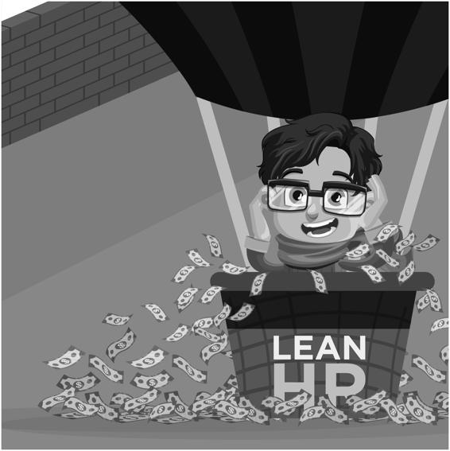
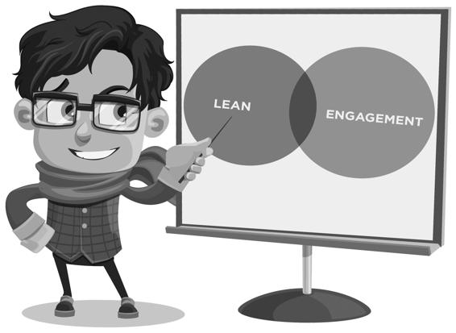
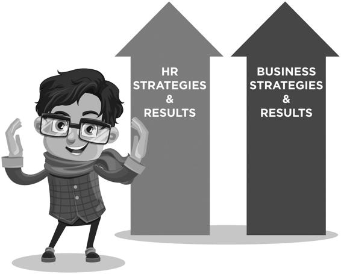
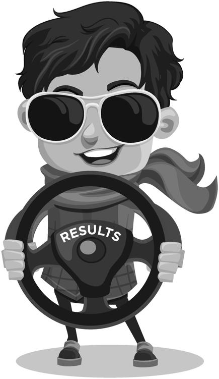
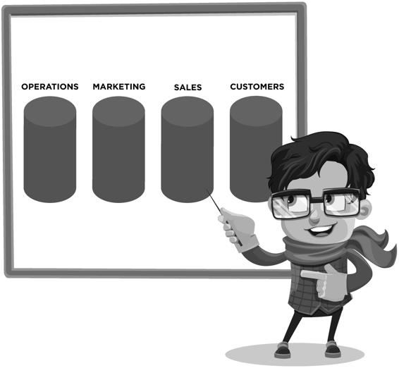
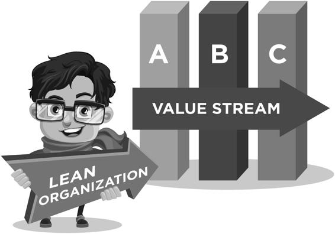
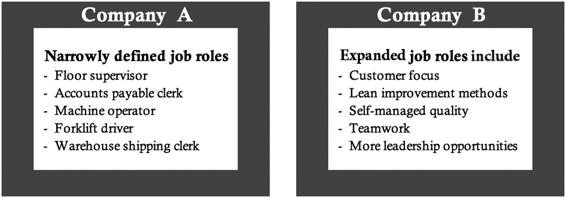
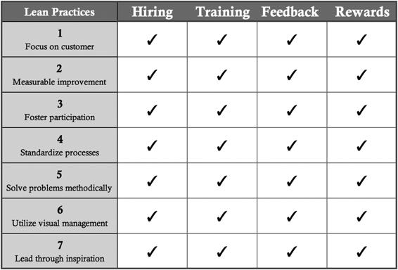
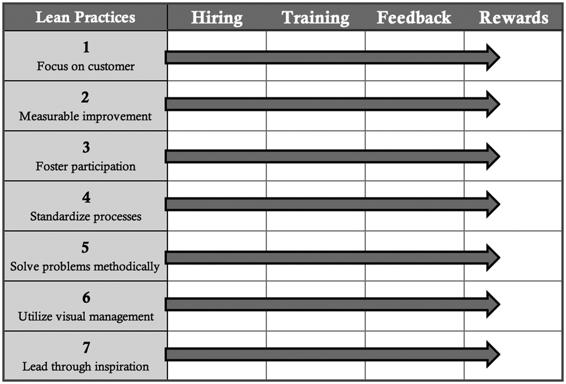
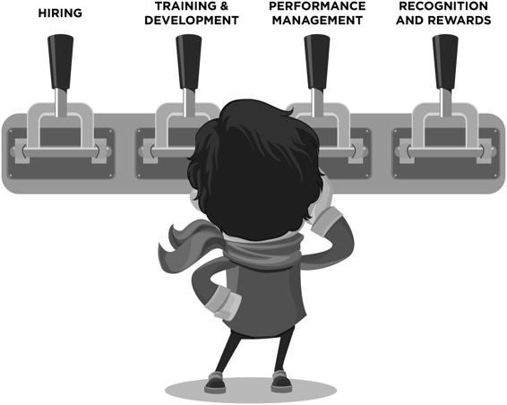

**44** ◾   _Lean Human Resources_ of these improvements for the year and compared this to the cost of the training. They based the calculation on changes in the amount of labor and materials used for producing the product. However, this comparison was inaccurate and somewhat shortsighted. Since the reduced cost savings would repeat in the future, the savings would exponentially increase with time. 

**Considering the long-term value of lean gives you the PIV of sustainable improvement results over the long term. The improved** **financial results will be reflected in any number of line items.** 

3\.   **Look beyond the financial results of specific projects to the** **monetary value of building skills and capabilities through lean** **activities.**  Consider the skills learned by practicing lean, such as problem-solving and teamwork. Improving these skills enables employees to add more value than they might have in their narrowly defined work duties and prior to enhancing their problem-solving and teamwork skills. Skills build in value over time through practice and application. 

The questions to answer are simple: How does team-based problem-solving create a capability to improve all processes? And what is the value of this improvement over time? 

Holding a long-term view of lean acknowledges that problem-solving skills become stronger and certainly more effective over time. When an entire team of employees has been solving problems for more than five years, they are far more likely to be able to resolve any future issues. 

Later in this chapter, I’ll provide a useful starting point for calculating long-term benefits. 

**Calculating the increased abilities of team members who are able** **to generate solutions and improve processes is the PIV of lean** **mindsets and skills. The improved financial results are reflected** **in line items related to productivity, safety, and quality.** 

 _Expand Lean Results with HR_ ◾ **45**

4\.   **Fully appreciate the value related to the fact that customers** **prefer to buy from superior work cultures.**  An ancillary benefit of advanced lean transformational success is the development of a superior work culture in which its commitment and ability to maintain high quality is evident. Often overlooked as a primary benefit of lean is the potential to increase sales because of the comprehensive employee improvement in the quality of products and services. 

For example, an organization I worked with had a highly developed workforce, especially in the area of lean skills and abilities. It was being considered for a substantial amount of new business by a major electronics marketplace supplier. When the potential customer visited the production facility, they were delighted with how the culture reflected a zest for improvement, quality, and engagement. This was clearly their deciding factor for rewarding the business to this organization. 

I’ve often asked the most successful lean organizations whether they see lean as a component of obtaining higher sales levels. Each enthusiastically confirmed that their work culture is a striking market differentiator that results in more sales. Customers want to do business with an organization that has employees with the right focus and mindset. 

**The potential of a business achieving optimal market share based** **on stronger customer loyalty is the PIV of optimal customer value.** 

**As such, the improved financial results would reflect as increased** **revenue.** 

5\.   **Optimize the engagement of your workforce and benefit from** **its inherently higher value.**  Lean practices encourage high levels of employee engagement. In turn, this has been linked to improved safety, decreased turnover (increased retention), and increased ability to attract talent. That lean activities create a more engaged workforce has largely gone unnoticed—and undervalued—chiefly because the two concepts are not commonly connected. In addition, while most business leaders have some sense that an engaged workforce is a “good thing,” they tend 

**46** ◾   _Lean Human Resources_ to leave it out of investment calculations because the benefits are difficult to quantify. 

For example, when employees work on teams actively learning new lean concepts, working to address issues, and becoming empowered to make changes, their engagement is visibly strengthened. Improvements in a range of financial metrics, such as safety, absenteeism, and turnover, are quantifiable benefits of this. It’s not hard to understand why employees with an elevated sense of purpose and morale are less likely to be absent or leave. 

As I watched the production workers at one facility provide daily updates on improvements they had made and steps taken to achieve them, the long-term value was obvious. The increased participation and improved teamwork skills of the entire workforce, gained by implementing the lean initiative, would pay dividends far into the future. However, the company did not include the value of these benefits in its ROI calculation. 

Furthermore, when changes are made to a particular job to make it easier and more enjoyable, that impacts safety, engagement, productivity, quality, etc. Here too, while the value may be difficult to quantify, the financial impact is real**.** 

**Having employees fully involved in the bigger mission of the** **organization and participating in various aspects of improvement is the PIV of employee engagement. The improved financial** **results may show up in line items related to revenue, decreased** **turnover, improved safety, and productivity.** 

6\.   **Enhance the value of lean to improve your overall business by** **working across departmental silos.**  Traditionally, lean benefits are linked to the results of direct efforts from a targeted area, such as operations. However, organizations gain the greatest value by applying lean to every part of the business—especially in the handoffs between departments, processes, and procedures. 

An organization I’ve worked with often complained of feeling stuck in its silos. While it was hugely successful, the majority of its most 

 _Expand Lean Results with HR_ ◾ **47**

challenging problems were the result of its silo mentality. As departments began interacting more closely and addressing their organization problems as a team, not only did the financial results improve, but so did customer and employee satisfaction. They began to see that the answer to most issues lies in stronger teamwork between departments and away from a focus on their own functions. 

**Working across silos as** _**one team**_ **versus focusing internally** **within functions is the PIV of business processes.** 

**The improved financial results can be seen in increased revenue, but also in decreased operating costs resulting from significantly better communication throughout the end-to-end process.** 

[**three Aspects of Calculating Potential** ](./1-Cover.md#p8)

[**improvement Value (PiV)**](./1-Cover.md#p8)

The improved financial results from the aforementioned examples covered three general types. However, the most common response to this overall topic is, “I agree, but how can I possibly provide a financial estimate?” A critical problem with this approach is that, in the absence of a method to attain specific figures, many of the most valuable benefits get set aside. Often, HR 

professionals—and many other functional managers—don’t understand how to estimate the business value of an improvement. Establishing the financial impact can be challenging, but it is certainly not impossible. Briefly, the answer to the challenge is to calculate a believable, conservative estimate. 

**Failing to establish a method to estimate the real benefits of lean** **has led to significantly understating its benefits.** 

**This omission has resulted in underinvesting in the time,** **resources, and focus clearly warranted given the potential.** 

To truly advance the understanding of lean’s potential, you need a method to establish the basics of how lean impacts financials. There are three basic types of potential improvement values that create a foundation for estimating the real benefits of lean transformations, which I’ll refer to as BIG results. 

**48** ◾   _Lean Human Resources_ 

**Figure 3.2 Lean HR powers BiG results**

1\.   **B**etter Operating Margins from Applying Increased Skills to Improve Quality Processes

2\.   **I**ncreased Revenue from Enhanced Customer Loyalty 3\.   **G**reater Overall Financial Performance from an Engaged Culture

[ _**PIV Type 1: Estimating the PIV of Better Operating Margins**_](./1-Cover.md#p8)

The first PIV refers to all lean activities devoted to improving work processes, while at the same time building highly valuable skills. These include, but aren’t limited to, problem-solving, making business decisions, improving product and service quality, working in a team, providing informal and formal leadership, and understanding value from the customers, viewpoint. As employees apply their new lean skills, the following becomes more the rule than the exception:

◾ Fact-based problem-solving becomes the go-to method in the organization; 

◾ Expanding the work roles of employees reduces the number of supervisory positions. 

But, how do you quantify the potential operating margin increases that derive from employees applying their growing lean skills? 

 _Expand Lean Results with HR_ ◾ **49**

First, realize that the value of skills developed during lean initiatives goes well beyond the cost reductions achieved during a specific project. Consider how the increase of skills through lean initiatives creates the following additional values:

◾ Improved cost of quality (reduced scrap levels, reduced product returns, etc.); 

◾ Improved labor efficiency (lower labor costs based on an equivalent level of product production); 

◾ Better raw material usage (reduced material costs based on an equivalent level of production); 

◾ Reduction in general overhead expenses (fewer supervisors required, a reduction in utilities expenses, etc.). 

Calculating the value of lean investments can be done with what I refer to as the _1% Method_. It sets a starting point for estimating the benefits of lean, as applied to specific operations: 

◾ 1% lower cost of quality; 

◾ 1% improvement in labor efficiency; 

◾ 1% improvement of raw material usage; 

◾ 1% lower utility cost; 

◾ 1% lower management salaries. 

This approach begins the process of determining how lean increases operating margins. Once you recognize improvements in these metrics, you can start gathering actual data and change calculations to reflect that information. The theory is that, when beginning computation, it’s best to make conservative estimates to gain credibility. Once the 1% figure is established, it’s easy to increase it to 2%, 3%, or higher, even as a conservative estimate. 

[ _**PIV Type 2: Estimating the PIV of Increased Revenue**_](./1-Cover.md#p8)

The focus of many lean initiatives is to offer better service, thus creating better experiences for customers. It makes sense, then, to calculate the potential revenue gain from increased customer loyalty generated by higher-value services and offerings. Over time, as a higher percentage of employees become involved in supporting a wider range of customer service, customer loyalty will increase—and so will revenue. Which, in turn, results in increased 

**50** ◾   _Lean Human Resources_ profits! The case study at the end of the chapter provides an example of how lean impacts revenue. 

Calculating the value of increased revenue from enhanced customer loyalty could also be done using the 1% Method. As a starting point, the benefits would be a 1% increase in revenue. Many organizations would expand this to include the calculation for the 1% flow-through to the bottom-line profitability. 

[ _**PIV Type 3: Estimating the PIV of Greater Financial Performance**_](./1-Cover.md#p8)

Over many years, a noteworthy amount of research has been conducted that confirms the financial benefits of an engaged culture. Some of the studies focused on profitability or other financial indicators. Other work explores how an engaged culture improves employee retention, safety, and attendance. As such, calculating the benefits of company engagement can have far-reaching, positive effects on business performance. 

Of all the ways lean’s financial benefits are typically overlooked, engagement is likely the most significant. Because of this oversight, this topic merits detailed discussion, which will occur i[n Chapter 5](id113). 

Calculating the added profitability derived from the performance of a highly engaged workforce could be accomplished using the 1% Method. Other options include determining improved shareholder value or return on assets. 

[**HR needs to Learn to Quantify the Financial Value of Lean**](./1-Cover.md#p8)

All the elements just reviewed allow HR to provide indispensable value through the broad expansion of the role of lean, which leads to greater business success. However, understanding this requires clarity about the financial benefits. This necessity becomes problematic due to two factors: (1) the benefits of an expanded view of lean are not easily quantified, and (2) HR 

often struggles to speak to the financial benefits of its work. 

When I’ve worked with groups of HR professionals within lean enterprises, they surprisingly confessed to their lack of knowledge of financials. 

One of them mentioned sitting in meetings and pretending to understand the concepts. I assigned them the task of asking their financial managers for assistance in comprehending their organization’s financial statements. 

Specifically, I asked them to find out the following: If HR were to improve their productivity by 1%, what would that equate to in dollars? I then asked them to apply the same question to quality and material usage. 

 _Expand Lean Results with HR_ ◾ **51**

The greatest takeaway from the exercise? The HR professionals discovered that the financial managers were excited to help them. As a bonus, HR became better acquainted with how their actions impact the company’s financials. For example, they learned how to calculate the potential profit from recruiting a sales manager. Now, when the HR managers are involved in multimillion dollar initiatives, as they often are, they can work more effectively with the team, making informed decisions to drive the project. 

The next section will provide some ways to measure the value of pursuing a lean culture, redesigning talent strategies to support lean, and transforming the role of leadership to support an empowered workforce. It will provide tools for HR professionals to estimate the potential worth of a business experiencing perfect quality, the highest level of engagement, and fully skilled team members who consistently apply lean principles and practices. 

While the actual quantifiable value of the PIV is impossible to tie to a precise dollar amount, like many aspects of business, it is a way to forecast an estimated worth. 

[**How Lean HR Helps Achieve optimal Lean Results**](./1-Cover.md#p8)

What most organizations fail to realize is that HR (including any individuals charged with leading the policies for managing talent) must be fully involved in executing lean strategies. The ability of companies to achieve the PIV in each of these areas hinges on HR’s vital role in leading the creation of lean cultures, talent management strategies, and leadership (as shown in the Lean HR model). It also involves HR’s full participation in the overall strategy for Lean. As the key strategic leader for all things having to do with people, HR 

must be central to advancing lean to the fullest extent possible. 

Together, the “BIG” PIVs represent opportunities to achieve results from lean that are far better than those traditionally expected. When organizations embrace the broader view of lean’s PIV, and with HR leading the way, they can achieve _incredible levels of performance from their lean efforts_. 

[**Lean Cultures that Deliver BiG Results**](./1-Cover.md#p8)

In closing section I, I have debunked the myths about Lean HR and provided a new model for understanding the potential value HR brings to lean initiatives. As part of this discussion, I defined a lean culture as one that 

**52** ◾   _Lean Human Resources_ uses the seven practices of continuous improvement in daily work. I also reviewed three specific areas where HR’s skills and experience can facilitate the removal of the key barriers to achieving expected success from lean transformations. These include (1) cultivating a lean culture, (2) implementing the talent strategies needed to support a lean culture, and (3) developing leaders who can inspire and empower others. I also demonstrated how these three HR strategies drive major financial benefits that far surpass those traditionally expected from lean initiatives. 

[Section II w](id113)ill define a lean culture, show how it creates an engaged workforce, and share best practices to changing work cultures. I begin this process by first reviewing the basics of achieving a lean culture and what makes this an integral part of long-term success. 

**CASE STUDY**

**INCREASED REVENUE FROM SUPERIOR TEAMWORK AND** 

**QUALITY PROCESSES**

After a year-long lean initiative focused on building employee-driven quality improvement teams, a durable goods supplier received a serious customer complaint. Poor quality product had been shipped across the country, accumulating a myriad of associated complaints. Typically, the company would have sent a high-level sales executive to explain the issue and sincerely apologize for the problem. 

But after spending a year training the entire workforce on the basics of quality improvement, an internal team was assembled to investigate the problem. The company’s chosen employees included the machine operators who handled the customer’s product, a purchasing agent who bought the raw materials, a supervisor involved in managing the production and order processing, the quality technician handling the product holds, and the associated salesperson. 

After reviewing the problem, the team concluded that a change in materials, made without the necessary modifications to the production process, had caused the problem. The team then developed a stronger procedure for making future changes in material specifications. They completed their analysis just before the customer’s internal team of stakeholders arrived at the facility to verify that a satisfactory solution was in place. The internal and customer teams worked together to confirm the issues and follow-up needed to prevent it from ever happening again. 

 _Expand Lean Results with HR_ ◾ **53**

Obviously, in the customer’s eyes, all of this was much, much better than a sincere apology. But that’s not where the story ends. 

Several months later, this same customer decided to award the company with a generous increase in business. Through the problem-solving process from that quality disaster, the customer had gained confidence and became more comfortable with how the company operated. They liked interacting with a team that focused on finding the root cause of problems. They chose to increase their business with the company because they felt it was a supplier they could trust. They were far less interested in the diplomacy skills of the sales executive in charge of the account. 

Instead of only considering how to fix the problems that occurred, the company developed a robust approach based on time, resources, and expectations. And the business raised its awareness of the potential revenue to be gained from having a workforce capable of high-quality, efficient production. They later sought every opportunity to bring customers and prospective customers to the facility to meet customer-dedicated teams—which was much better than waiting for quality problems to necessitate visits. 

**SUMMARY OF KEY POINTS**

1\. The potential benefits of lean are primarily underestimated due to the traditional, overly narrow view of lean as a way to cut costs of specific processes. 

2\. PIV is a way to calculate additional, often overlooked, financial benefits of lean. Underestimating potential financial benefits leads to underinvesting the time, resources, and focus needed to achieve the full value of lean. 

3\. A broad view of financial benefits, beyond simple operating cost savings, reveals many opportunites, such as the potential to achieve perfect quality, optimal market share, and the highest level of engagement. 

4\. The three categories of PIV Lean are:

◾ **B**etter operating margins, which include optimizing productivity levels, material use, and costs associated with managing talent (e.g., safety, health, attendance, and retention). 

**54** ◾   _Lean Human Resources_ 

◾ **I**ncreased revenue, based on maximized customer loyalty and creating new business opportunities through an optimal workplace that delivers superb customer service and experiences. 

◾ **G**reater overall financial performance from an engaged culture, measured through increased shareholder value, profitability, and other high-level business metrics (apart from those listed above). 

5\. The categories of PIV are the basis for utilizing the 1% Method of estimating specific financial benefits. Beginning with a 1% improvement of productivity, quality, safety, turnover, etc., allows the critical conversation about how much to invest in lean to advance. 

6\. HR is vital to leading the creation of a sustainable lean organization, especially through executed strategies related to lean culture, talent management, and lean leadership. This application of Lean HR represents not only opportunities to achieve traditionally expected results, but is critical to achieving optimal results. 

**STRATEGIC QUESTIONS FOR HR**

1\. How would you describe the more extensive benefits, beyond cost savings, that are achievable through more effective HR participation in lean initiatives? 

2\. Does your organization calculate the financial benefits of lean efforts? 

If so, how are those results calculated (e.g., through impact on key metrics, by project, etc.)

3\. What has been your experience with HR’s role in participating in or leading lean efforts? Do you have a sense that it should be different? 

**LEAN HR IMPLEMENTATION ACTION STEPS**

1\. Meet with your business partners and discuss how financial benefits are calculated for improvement efforts. Consider meeting with the financial reporting person for additional insights on how lean efforts are tracked. 

 _Expand Lean Results with HR_ ◾ **55**

2\. Working with your business partners or financial reporting manager, estimate the financial value of increasing the following items by 1%: a. Increased operating margin:

1) Improved labor productivity

2) Decreased scrap

3) Improved “cost of quality” 

b. Increased revenue (either top-line sales or bottom-line profits) c. Overall profit margin improvements

**Section ii**

[**iMPLeMentinG** ](./1-Cover.md#p8)

[**ii**](./1-Cover.md#p8)

[**LeAn CULtUReS**](./1-Cover.md#p8)

Unless you change direction, you will end up where you are headed. 

– **Shigeo Shingo**

[Section II c](id113)overs how to implement a lean culture. This includes having clarity about how to define a lean culture, how to leverage the overlap between lean practices and engagement strategies and concludes with the change management strategies it requires. 

[Chapter 4 p](id113)rovides a way to clearly describe a lean culture using the seven common practices as the basis. Only with clarity can organizations establish the strategies and actions needed to fully implement a lean culture. [ Chapter 5 r](id113)eviews the overlap between engagement strategies and lean. 

What makes this a topic for Lean HR is that engagement strategies are often owned by HR, while the ownership of lean has typically been outside HR. 

As organizations pursue these functions together, the success of both can be optimized. As a source of effective solutions to the challenges[, Chapter 6](id113) 

covers change management as a core HR capability. This chapter also discusses survey methods for measuring successful culture change. 

This section provides a foundation for understanding some of the critical roles that HR can play in advancing the success of improvement initiatives. 

Conversely, the lack of an HR presence can be just as detrimental. 

Lean Human Resources

Defining Lean Culture: Values and Behaviors

[ _**Chapter 4**_](./1-Cover.md#p8)

[**Defining Lean Culture:** ](./1-Cover.md#p8)

[**Values and Behaviors**](./1-Cover.md#p8)

When I’m teaching workshops on Lean HR, I often ask the group if their organization has a clear definition of lean culture. Most of the time, they stare at me as if they’ve never pondered that question. Lacking a detailed definition, they have little reference for what culture involves. Worse, when they don’t know what culture means within their job environments, they don’t understand how to change it. 

Understanding this explains why shifting employees’ mindsets toward lean often eludes organizations. Achieving any goal is difficult, if not impossible, when the definition and context for success are poorly understood. 

[**What is a Lean Culture?** ](./1-Cover.md#p8)

For our purposes, culture refers to the _totality_ of behavior patterns that reflect the actual versus stated company values of people in the workplace, many of which employees learn from observing managers and coworkers. 

The purpose of getting a clear handle on understanding lean as a culture is to make it more than a set of tools and methodologies and to ensure it gets built into behavior patterns and mindsets. 

**59**

**60** ◾   _Lean Human Resources_ 

[**organizations Create Culture by Design or Default**](./1-Cover.md#p8)

Every organization has a culture, even if it does not have a clear strategy to foster a desirable one. Even without intent, a culture forms when people work together, create patterns of behavior, and develop commonly held ideas or attitudes. However, many organizations don’t typically assess their culture, much less design one deliberately. 

Every organization operates with a set of values, whether or not those have been acknowledged or communicated to employees. If organizations are not purposeful about agreeing on shared values, and then on implementing practices that demonstrate them, the principles and beliefs behind them become vague and irrelevant. The existing value system may even be contrary to that which company leadership believes it created. 

[**A Strong Culture Drives Greater Success**](./1-Cover.md#p8)

In general, successful companies create strong cultures based on clearly stated values reinforced with an active campaign to align employee attitudes and behaviors with those beliefs. For example, an organization that holds the value “Customer First” is focused on serving its customers and delivering what those customers want. Employee development would include helping teams act in ways where customers’ needs are central to practices in daily work and where they deliver quality products to all customers. 

**Pursuing a lean culture requires an intentional approach that** **influences overall patterns of behaviors with values informed** **practices.** 

[**Lean Cultures Are More than a Group of Activities**](./1-Cover.md#p8)

Many organizations believe that a lean culture is simply the culmination of their continuous improvement events or projects. Based on that belief, they seek to grow a stronger culture by instituting more activities. Yet more “doing” is not sufficient for infusing lean thinking into the underlying belief systems that feed company culture. Companies need to develop an understanding of two sets of workplace values and behaviors: those that 

 _Defining Lean Culture: Values and Behaviors_ ◾ **61**

**Figure 4.1 iceberg**

employees follow during lean activities and those they follow when doing their work. 

The HR team is uniquely qualified to assist in fully implementing a lean transformation. They are, after all, stewards of ensuring the consistent messaging that increases desired attitudes leading to wanted behaviors. 

Developing and sustaining workforce actions aligned to an organization’s desired values requires dedicated HR attention to all the ways people do their work. As the department that manages everything people-related within an organization, HR is in the best position to foster a lean culture. 

[**Lean HR Has a Key Role in Driving a Lean Culture**](./1-Cover.md#p8)

HR drives the creation and sustainability of a lean culture by building it into the fabric of day-to-day work. In [chapter 1](./1-Cover.md#p28), I discussed the common myths about Lean HR that contribute to the underutilization of valuable HR functions. That chapter provided a framework for developing and implementing the desired culture for your organization. This structure goes far beyond the commonly held belief that improvement is simply a series of special events, blitzes, and isolated projects. 

Lean provides powerful methods to support an organization’s business objectives. But developing a robust improvement culture is not feasible 

**62** ◾   _Lean Human Resources_ without HR’s active engagement. If you have a lean _business_ strategy without a lean _cultural_ strategy, you’re missing a big opportunity. (I[n Chapter 7, I](id113)’ll discuss how Lean HR helps implement lean business strategies.)

[**Seven Common Lean Practices: Values and Behaviors**](./1-Cover.md#p8)

Each of the seven lean practices reflects a company value supported by a specific set of behaviors. HR helps communicate and instill these values in employees as it executes its traditional tasks, including recruiting, hiring, onboarding, training, and so on. When you increase employees’ connections to values for improvement practices, your organization will be better prepared to achieve its strategic objectives. 

Lean HR organizations that want to create or improve upon a strategy fostering an improvement culture must map lean practices to their corresponding values, behaviors, and attitudes. This action illuminates the underlying features that need nurturing in the work environment. The seven common practices provide a framework to better understand the usefulness of this approach. 

First, think of the practices as cultural elements. Second, identify the value that each describes. Third, designate the behaviors that demonstrate this and determine attitudes congruent with the value and practice. Only by promoting the behaviors and attitudes can you make the values and cultural elements manifest as “the way we work” within your company. 

The following are examples of how a framework outlining each practice can deliver structure and visibility. Remember, this is more than a set of steps or a process; it’s a new way of thinking about how to foster a lean culture. 

[ _**Lean Cultural Element #1: Maintain Customer Focus**_](./1-Cover.md#p8)

**Value**

Customer first

**Behavior**

We make customer-centric decisions

**Attitude**

Dedication, respect, and urgency toward filling customers’ needs Corporations enhance their improvement culture by instilling within their employees a strong orientation to customers’ needs, thus making themselves customer-centric in their approach to all their work. For most organizations, 

 _Defining Lean Culture: Values and Behaviors_ ◾ **63**

instilling this value is most difficult with employees who traditionally have no direct interaction with customers—operators on the assembly line, pro-curement professionals, material handlers, and the like. In some companies, even the sales representatives who directly and regularly work with customers may not think and behave as if customers are primary. When sales teams talk about “hitting their numbers,” they demonstrate an internal focus rather than on honoring the customer’s reality. 

In terms of behavior, customer-first organizations prioritize decisions from the customer’s perspective. This means placing increased value in helping customers achieve their goals than in attaining internal business metrics. When an organization fully practices “customer first,” its employees exude an attitude of dedication, respect, and urgency toward customers’ 

needs. Customers can tell when their interests receive this high degree of care, so this practice protects and potentially increases revenue. 

**HR Impact:** Lean HR supports a customer-first culture by supporting aligned behaviors and attitudes in job descriptions, job content, training, performance management, and rewards. HR also builds policies and practices that strengthen customer satisfaction by ensuring that employees understand customers’ needs. 

_**Example**_**:** Develop job content that asserts customer focus and a sense of urgency in daily work for the benefit of the customers. 

HR then drives this cultural element or value into recruitment, hiring, training, accountability, and performance recognition. 

[ _**Lean Cultural Element #2: Measure Improvements**_](./1-Cover.md#p8)

**Value**

Excellence

**Behavior**

We seek every opportunity to measurably improve our work

**Attitude**

High standards and quality; idealism, ambition, and purpose If customers are the focus or purpose of work, doing a better job serving customers is the foundation of the next hallmark of a lean culture. Beyond identified objectives or metrics, the measurable improvement practice ensures that a focus on ongoing evaluation and change designed to advance improved performance is integrated into most company processes. 

**64** ◾   _Lean Human Resources_ People who work at such organizations value the pursuit of excellence and actively seek opportunities to measurably improve their processes as part of their jobs. This attitude promotes a sense of high standards, which is supported by the emotional qualities of idealism, ambition, and purpose. 

**HR Impact:** Because the requirements for improvement are often widespread, HR plays a significant role in supporting behaviors and in teaching skills that drive continuous improvement. In addition, HR builds continuous improvement into all job descriptions. 

_**Example**_**:** Working with HR, incorporate demonstrated improvement into job requirements for work roles. These might include requiring an ability to achieve measurable improvement in safety, quality, and productivity metrics. 

[ _**Lean Cultural Element #3: Foster Participation**_](./1-Cover.md#p8)

**Value**

Initiative

**Behaviors**

We seek ways to involve people who do the work, where possible **Attitude**

Trust, a feeling of safety, and a willingness to change

The pursuit of excellence requires everyone in an organization to be significantly involved in continuous improvement. And that leads to the next cultural element: broad participation. Organizations that value participation as part of their culture can point to improvements that have come from people in a wide variety of roles. 

The quality of personal initiative fosters foundational to widespread participation, along with the belief that improvements will be most successful if implemented with:

◾ Significant input from most of the people involved in the work; 

◾ A deep understanding of the issues involved; 

◾ Substantial engagement in creating and sustaining changes; 

◾ A team-based approach. 

The attitudinal aspect of participation involves trust, a feeling of safety, and a willingness to change. A workplace where people trust their leaders and coworkers creates a safe environment in which to modify work processes. 

 _Defining Lean Culture: Values and Behaviors_ ◾ **65**

With those organizational qualities present, employees are more willing to participate in continuous improvement. It is such an environment that encourages broad participation. People are more likely to care about their work, more willing to invest themselves in their work, and more likely to take the initiative in leading improvement efforts. 

**HR Impact:** HR contributes by helping design and implement participation processes that create meaningful engagement and go well beyond traditional employee suggestion programs. 

_**Example**_**:** Develop a method for documenting employees’ ideas generated and successfully implemented by the workforce to demonstrate the importance of their contributions. 

[ _**Lean Cultural Element #4: Standardize Processes**_](./1-Cover.md#p8)

**Value**

Sustainability

**Behaviors**

We seek ways to make improvements and embed them into 

standard processes

**Attitude**

An absence of reactive emotions, such as anger and blame

If all roads (and hence processes) lead to customers and if continuous, measurable improvement is a company practice, it becomes clear that standardiz-ing processes through process management supports the pursuit of excellence. 

The outcome leads to the customer’s benefit. Process management views all businesses as a series of procedures that link together to provide a product or service to customers. The process orientation spurs people to break down the components of a business into segments. Each can be redesigned for improvement, ensuring the most value possible gets added at each step along the way. 

Organizations that leverage the practice of standardized processes value sustainability, which is grounded in the discipline needed to repeat a best practice relentlessly. The attitude characterized by this element is an absence of reactive emotions, such as anger and blame. Because people are trained and held accountable to a documented standard, any problems that arise are attributed to the process, not to the people. In supporting this environment, management must ensure that standards are well-developed and understood. 

**HR Impact:** HR needs to be involved in supporting a culture of process orientation. It accomplishes this by building aspects of process management 

**66** ◾   _Lean Human Resources_ into management roles and making problem-solving part of most job descriptions. HR also needs to provide related training to support these job requirements and help the workforce build required skills. 

_**Example**_**:** Establish a standard for onboarding new employees. Include a process for methodically verifying each assimilation step. After establishing the standard or baseline, cycles of improvement can address problems with process execution and identify ways to improve how well it meets the needs of the new hires. 

[ _**Lean Cultural Element #5: Solve Problems Methodically**_](./1-Cover.md#p8)

**Value**

Accountability

**Behaviors**

We use every problem as an opportunity to identify causes and work toward better solutions

**Attitude**

Surfacing problems is everyone’s job

Solving problems is a day-to-day activity in almost any organization. What makes this part of continuous improvement cultures is the focus on a distinct methodology applied to the majority of significant issues and the practice of problem-solving. Lean cultures are committed to addressing problems based on facts and use teamwork to ensure that performance improves over time. 

Organizations that leverage team-based, factual problem-solving value accountability. This element focuses on how job content, specifications, and standards create solutions. Employees know they will be solving problems using the standard methodology and available facts. When the result is unacceptable, the process, not the competence of the people working the process, is reviewed. 

Team-based, factual, problem-solving cultures are energized and motivated by finding and fixing problems as they work. Their attitude is that surfacing problems is one of the most—if not _the_ most—important job of every employee. 

**HR Impact:** HR is critical to building and supporting problem-solving cultures. The department is responsible for training and guiding managers to lead in an environment where those closest to the job solve any problems. 

Managers must also learn how to assess the problem-solving skills of their direct reports. And HR must develop training programs to help the workforce build their skills with problem-solving methods and team approaches. 

 _Defining Lean Culture: Values and Behaviors_ ◾ **67**

_**Example**_**:** With the involvement of HR, ensure leaders and workers understand collaborative decision-making and how to link problem-solving with other aspects of lean, such as creating standardized processes and tracking measurable improvement. 

[ _**Lean Cultural Element #6: Utilize Visual Management**_](./1-Cover.md#p8)

**Value**

Transparency

**Behaviors**

We seek to display our work processes and results to help our team members see what needs attention and to track their progress **Attitude**

Knowledge and empowerment

Visual displays of measured job results create reinforcement that drives achievement-focused behavior. Fueling continual improvement requires that the majority of the organization focus on key objectives, how they are measured, and on regularly monitoring improvement. 

The value linked to graphical results is transparency, demonstrated as a willingness (if not a propensity) to release information to everyone about all key measurements. The attitudes of a transparent organization create knowledge and empowerment. That means that if people have the facts, they deal effectively with the range of issues related to running a business. 

HR supports visual management by championing visible metrics to ensure everyone understands their goals and receives motivation through knowing how they are performing. 

_**Example**_**:** Consider various types of displays in high traffic locations to create easy visibility of opportunities for improvement. Scoreboards remi-niscent of games can be exciting and fun for the teams. 

[ _**Lean Cultural Element #7: Lead Through Inspiration**_](./1-Cover.md#p8)

**Value**

Equality

**Behaviors**

We ensure leaders are working to develop people’s abilities **Attitude**

Everyone can succeed in the workplace

**68** ◾   _Lean Human Resources_ Leaders in a continuous improvement culture take on a much more rewarding role because they are responsible for helping people develop their talent and skills. Inspirational leaders engage in coaching and mentoring the people they lead. 

The organizational value of equality—that all employees, no matter what rank, are at the same level of importance—supports inspirational leadership. 

In contrast, many workplaces reinforce the idea that people have varying degrees of value based on their place in the hierarchy. Talking about 

“reporting up” and people being “on top” reflects values that management is somehow higher (in other words, better) than the workers “below” them. 

The link between inspirational leadership and lean strategies is that leaders who inspire others help them understand the whole process of the work they do and to solve problems as team members. Inspirational leaders lead by coaching instead of telling, by growing people’s capabilities rather than governing them. Their goal is to help people succeed in their jobs while holding them accountable. 

**HR Impact:** HR’s role in supporting inspirational leadership is in designing this approach into job descriptions and helping leaders learn how to lead this way through leadership development programs. 

_**Example**_**:** Develop leaders to be less directive and more focused on developing their team’s ability to think through and solve problems for themselves. HR can provide numerous development opportunities that support the range of lean leadership skills and abilities. (This topic will be covered in considerably more detail i[n Chapter 8 a](./3-Begin_by_Developing_Lean_Leaders.md#p158)s a core knowledge area of Lean HR.)

[**the Many Ways Lean HR Drives a Lean Culture**](./1-Cover.md#p8)

Perhaps the essential role of Lean HR is ensuring a clear understanding of a lean culture at a behavioral level and using that knowledge to create an organizational trajectory. For example, section III of this book will detail how the HR team can drive a lean culture by:

◾ Redefining work and leadership roles; 

◾ Revising job descriptions and selection criteria; 

 _Defining Lean Culture: Values and Behaviors_ ◾ **69**

◾ Training and developing the leadership and overall workforce; 

◾ Aligning performance management and pay practices; 

◾ Managing communications in a manner that drives the right messages; 

◾ Holding celebrations to reinforce desired behaviors; 

◾ Implementing policies that reinforce lean behaviors and attitudes; 

◾ Undertaking any other workplace practice that could support a lean culture. 

Beyond revising the basics of talent management and related HR areas of responsibility, HR needs to weave specific lean practices into the items previously noted above, such as:

◾ Ensuring that feedback is part of the performance review process; 

◾ Building relationships between employees; 

◾ Ensuring consistent messaging; 

◾ Treating employees like customers; 

◾ Supporting cross-functional teams; 

◾ Organizing company meetings that align team members with vision, purpose, values, and business results. 

[**not involving HR Can Damage Company Culture**](./1-Cover.md#p8)

Anything that runs counter to a culture destroys or damages it. So the role of Lean HR is to help ensure that everything that impacts employees or team members aligns with continuous improvement values and culture. HR 

is in a command position to drive the company culture through how the department supports job functions, policies, and other practices. If HR is not actively involved in advancing a lean culture, it is likely unwittingly supporting the absence or opposite of it. When HR professionals are uneducated about which improvement practices, behaviors, and attitudes need to be encouraged, they cannot effectively navigate this critical aspect of lean. 

[**Lean Cultures Are the Foundation for engagement**](./1-Cover.md#p8)

An often overlooked, but vital benefit of lean, is an engaged workforce. The seven practices, as a model for improvement activities, values, behaviors, and attitudes, provide a scaffold on which you can build optimal conditions 

**70** ◾   _Lean Human Resources_ for higher levels of employee engagement. The next chapter will explore the overlap between the factors of engagement and lean workplaces. As the connection becomes more apparent, you can focus on how best to leverage these linkages for even greater success. 

**CASE STUDY**

**AMAZING LEVELS OF ENGAGEMENT**

One of the most engaged cultures I’ve ever seen runs in complete alignment with lean principles and practices. The most noteworthy indicator is that the organization has more teams operating than anyone has time to track. 

With their roles defined as support functions, it’s clear leaders restrict their interactions to coaching. Some report feeling uncomfortable much of the time in letting go of “how” their teams deliver results. They realize that people will always do things differently than they would have, and that team members will make mistakes along the way. Expecting and accepting this discomfort seems to help them support their teams in working independently. 

This style of leadership creates a workplace that has most people hyper-engaged. I coined this term when I saw the level of zealousness employees showed when addressing problems and opportunities to improve their work processes or contribute to projects as part of big picture changes. When left to their own devices with established work rules and practices in a team formation, workers have shown they can outproduce other work cultures. 

The organization also had employee teams working with specific customers to strengthen the key people’s understanding of the customer’s needs and concerns. This attention to customer support has also improved how customers view the company and its work. 

The HR group devotes an extensive amount of support to training resources to build skills. Interestingly, this is also an example of forg-ing much of what HR does at a department level directly into the value streams. Hiring people and addressing fundamental employee-relations issues are handled by the teams. Handing over tasks typically done by HR enables managers to build better people skills within their teams. 

This organization has fewer employee problems than usual because team members are all accountable to each other for fostering an enjoyable workplace community. 

 _Defining Lean Culture: Values and Behaviors_ ◾ **71**

**SUMMARY OF KEY POINTS**

1\. Organizations typically pursue a Lean culture as they struggle to move beyond perceiving lean as a set of tools or event-based projects. 

2\. Organizations create a culture either by design or default. Developing an improvement culture requires a number of focused strategies to modify typical patterns into lean values and behaviors. 

3\. Another benefit of developing a lean culture is that the associated capabilities of establishing a stronger culture will likely lead to greater overall success. 

4\. Identifying underlying values and behaviors is the basis for developing a variety of talent management systems and cultural initiatives and is a crucial factor in getting beyond thinking of continuous improvement as a series of activities. 

5\. Each of the seven lean practices correlates to a specific set of values, behaviors, and attitudes. 

6\. Each of the seven practices creates an expansive opportunity for Lean HR to support the organization in more fully expressing lean values and behaviors. 

7\. Lean HR contributions include redesigning work roles, every element of the talent management systems, and other workplace practices. 

8\. Just as importantly, a lack of HR involvement in a lean transformation can result in damage to both the culture and the lean initiative because people are not ready and available to protect and align with an improvement culture. 

9\. When talent management systems or cultural dynamics run counter to lean values, behaviors, and practices, they may cause more harm than good. 

**STRATEGIC QUESTIONS FOR HR**

1\. How does your current culture align with lean principles? 

2\. What is the current role of HR in supporting or driving your organizational culture? In what ways is the part it plays sufficient or insufficient? 

3\. Where do you see opportunities for HR to play a more significant role in supporting your lean culture with various areas of HR responsibilities? 

**72** ◾   _Lean Human Resources_ **LEAN HR IMPLEMENTATION ACTION STEPS**

1\. List the current elements of your culture in one column. In a second column list the lean practices you observe in your facility. Where do you see commonalities and disconnects? 

2\. Ask your internal business partners which elements of culture they observe that align with their lean initiatives. Help them be specific about values, behaviors, and mindsets they would like to see more regularly. Explore options for increasing the likelihood these cultural elements grow stronger. 

3\. What areas of conflict have you identified between your current culture and the desired in a lean culture? Explore them with your internal business partners and consider potential countermeasures. 

Lean Human Resources

Leverage Lean to Drive Employee Engagement

[ _**Chapter 5**_](./1-Cover.md#p8)

[**Leverage Lean to Drive** ](./1-Cover.md#p8)

[**employee engagement**](./1-Cover.md#p8)

“The biggest thing for us in our lean culture has been explaining the ‘why’. 

We do lots of work communicating to employees, getting them involved, and telling them what they need to know to be successful. Involving them creates engagement, and in that way, they feel like part of the team.” 

**Kerry C., HR Manager**

Picture an HR group that’s been in charge of the organization’s Employee Engagement Survey for several years. They struggle just to get the results tal-lied, much less communicated, given their normal overwhelming workload. 

The survey covers numerous topics, including leadership, understanding the company vision and mission, and ways to improve work for increased effectiveness and productivity. Indeed, there are so many items needing consideration that the HR team strains to make sufficient improvements in any one area, much less several of them. When they conduct the following year’s survey, the results are almost the same as the previous year’s or even slightly worse. For all the time and effort spent on the survey, the team is frustrated that nothing of significance changed. As a result of those minimal results, the HR team struggles to gain the interest of company leadership in joining the department’s effort to effect changes to improve employee engagement. 

Unfortunately, this scenario is more the rule than the exception. 

The purpose of this chapter is to heighten awareness around the dynamics of engagement, especially as they relate to lean activities. Specifically, it **73**

**74** ◾   _Lean Human Resources_ will reveal the link between increased engagement and successful improvement practices, as well as the difference between engagement and motivation. A variety of financial benefits stem from increased engagement, which explains why developing a highly engaged workforce is worth pursuing. Five proven strategies support HR in leveraging the overlap between engagement and lean strategies. At the end of the chapter, the focus shifts to reviewing how to measure engagement, as well as ways organizations can harness the power of engagement to make measurable improvements. 

[**What engagement Looks Like**](./1-Cover.md#p8)

Descriptions of “engagement” vary depending on the source. However, many companies rely on research offered by Gallup, one of the leading authorities on the subject. According to Gallup’s _The Relationship Between_ _Engagement at Work and Organizational Outcomes 2016 Q12_®   _Meta-Analysis: Ninth Edition_, engagement is demonstrated by “those who are involved in, enthusiastic about, and committed to their work and workplace.” It’s also worth noting the difference between commitment levels driven through intrinsic motivation and those inspired by extrinsic rewards. 

You can make employees take part in teams or committees, but you can’t make them enthusiastic or committed. To attain genuine involvement, employees must choose it, actively participate, and see that they have much to gain. 

Organizations must ensure that a number of their employee engagement initiatives invite employees to design ways to engage themselves. Employers must create spaces that encourage engagement and let employees make a choice. 

How can you tell when employees are engaged? Some organizations look for the degree of employee discretionary effort, while others see it as a mindset. One study concluded that specific behaviors demonstrate engagement, such as working proactively, thinking creatively to solve problems, actively expanding skills, persisting when faced with obstacles, and more readily adapting to change. Though the definitions and descriptions of engaged behaviors may vary, the essence of how organizations understand the concept is very similar. 

[ _**Engagement Versus Motivation**_](./1-Cover.md#p8)

HR professionals who don’t understand what employee engagement is may also not comprehend how it differs from motivation. With that in mind, they 

 _Leverage Lean to Drive Employee Engagement_ ◾ **75**

can benefit from learning more about the differences in similarly aligned initiatives. A professional perspective that provides clarity comes from Dr. 

Paul Marciano in his book, _Carrots and Sticks Don’t Work: Build a Culture of_ _Employee Engagement with the Principles of RESPECT._  In it, he states:

“Engagement refers to an intrinsic, deep-rooted, and sweeping sense of commitment, pride, and loyalty that is not easily altered. 

In contrast, motivation level is strongly influenced by external factors, especially expectations that certain efforts or accomplishments will yield valued rewards, such as a financial bonus for meeting a quarterly sales objective.” 

**(Marciano, _Carrots and Sticks Don’t Work_** **, 2010, p. 40)** HR tracks employee satisfaction and oversees various benefits and pay practices expected to motivate employees, including recognition and rewards. The thinking behind this is that the employee will respond, “I’m motivated to do well because I will receive financial rewards or a promotion. These are in my best interest.” Harnessing people’s motivations to gain financial rewards is a standard, ongoing part of organizational life. 

However, promoting employee engagement is more challenging than simply increasing external incentives that have limited staying power. Allegiance to an organization occurs when HR establishes a workplace where employees actively participate and experience an inner connection to the company’s mission and people. 

**FINANCIAL BENEFITS OF ENGAGEMENT**

Numerous studies demonstrate the power of engaged employees. 

Understanding the research provides a factual basis for how engagement drives significant financial gains. Below is a small sampling of available studies on the connection between engagement and financial gain. 

◾ The financial benefits of engagement is presented in _Employee_ _Engagement: Tools for Analysis, Practice and Competitive Advantage_ by William H. Macey, Benjamin Schneider, Karen M. Barbera, and Scott A. Young, 2009\. The book concludes that companies in the top 25% of engagement earned 7% profitability on average, compared to a negative 4% profitability for those in the bottom 25%. Their research also found that the top quartile had almost twice the level 

**76** ◾   _Lean Human Resources_ 

of shareholder value, which, as a metric, is both forward-looking and reflects a sustainable impact. 

◾ _The Relationship Between Engagement at Work and Organizational_ _Outcomes 2016 Q12_®   _Meta-Analysis: Ninth Edition_ provides an analysis of Gallup’s employee engagement research data to understand the financial benefits. For example, comparing companies in the top quartile of employee engagement to the bottom quartile, it found that the companies with the highest employee engagement were 21% more profitable. 

◾ The Aon Hewitt 2017 Trends in Global Employee Engagement Survey noted that every five point increase in engagement was associated with a 3% revenue bump. 

◾ _Firms of Endearment, Second Edition_ by Rajendra Sisodia, Jagdish Sheth, and David B. Wolfe, discusses companies that practice a high level of employee engagement called people-centric leadership. The authors report that “firms of endearment companies featured \[in the book\] have outperformed the S&P 500 by 14 times.” 

[ _**The Overlap Between Engagement and Lean**_](./1-Cover.md#p8)

Each lean practice is naturally engaging and, when well implemented, inspires people to dedicate more of themselves to their work and workplace. 

What’s more, when all seven practices are deployed, they work together to **Figure 5.1 engagement vs. Lean**

 _Leverage Lean to Drive Employee Engagement_ ◾ **77**

create energy, enthusiasm, and the motivational power that drives employees to accomplish tasks in far less time and with far better results. As the practices become integral to an organization’s work ethic, people feel greater loyalty. Examples of how lean practices increase engagement is reflected in 

[Table 5.1\. ](id113) 

In any effort to encourage employees to connect to an organization in this manner, it’s important to understand how continuous improvement drives engagement. Gallup’s research has established that engagement exists, is measurable, and increases with determined efforts. Still, many organizations that pursue lean strategies and practices do not realize that **table 5.1 Connecting Lean Practices to Creating engagement** _Lean HR Examples of_ 

_Lean Practice Increases_ 

_Leveraging Lean and_ 

_Lean Practices_

_Engagement By:_

_Engagement_ 

**1**

Connecting employees to the 

Communicate customer 

Focus on 

bigger picture and external 

information to your work 

customer

customer needs

teams

**2**

Creating a sense of 

Celebrate improvements on a 

Measurable 

accomplishment from making 

regular basis

improvement

improvements

Generating a sense of being 

Actively seek and track 

**3**

valued and respected by 

suggestions and be mindful 

Foster 

seeking out employees’ 

of how supervisors tend to 

participation

opinions and suggestions

them

Helping employees see the 

Have employees share stories 

**4**

value of their efforts when they 

of process improvement and 

Standardize 

identify and remove wastes in 

promote those, perhaps 

processes

their work processes

through social media

Giving employees an 

Provide support to team 

**5**

opportunity to learn and 

problem-solving to ensure 

Solve problems 

interact with other team 

success

methodically

members to solve problems

**6**

Making results and progress 

Have employees participate in 

Utilize visual 

easy for employees to 

creating visual 

management

understand and monitor

measurements

**7**

Leading by coaching, rather 

Recognize managers who 

Lead through 

than “bossing,” to enhance 

actively empower others

inspiration

employees’ sense of ability

**78** ◾   _Lean Human Resources_ improvement literally propels deeper engagement. Equally true is that failing to integrate sound principles for people management into lean causes results to suffer. 

[**Lean HR Activities to Drive engagement**](./1-Cover.md#p8)

The following list highlights specific types of action where HR can partner with any team to design lean initiatives to create stronger engagement. 

1\. **HR Activity #1: Connect all team members to a vision for** **success**

One engagement practice is to make sure employees understand the bigger picture and their role in achieving organizational success. Lean practices include a similar activity referred to as _Strategy Deployment_, a way to cascade the highest-level business goals to each team and individual. This approach ensures that everyone understands how their work links to—and contributes to achieving—the broader vision. Thus, employee engagement increases while also advancing organizational success through clearly communicated and aligned goals[. ](id113)

2\. **HR Activity #2: Optimize opportunities for learning and** **development**

Another critical aspect of engagement is ensuring that employees can actively learn in their roles. A critical element of Lean HR is to understand that continuous improvement is inherently an approach to learning. As such, it has a twofold benefit: First, it assists employees in feeling more connected to the business as they become more competent. Second, it gives employees a sense of personal growth. As a lean organization gains more active and productive people working together, there are many more ways to learn and develop skills. 

3\. **HR Activity #3: Ensure effective response to employee ideas** Many studies of both engagement and continuous improvement find that empowering employees to suggest ideas or work improvements promotes their involvement. However, this only works if supervisors and managers respond appropriately. Employees need to feel they are valued and that their contributions make an impact. It is close to impossible to achieve this if managers don’t respond to employees’ 

ideas. The challenge becomes how best to gather suggestions, monitor the responses to each one, and build leadership skills to effectively 

 _Leverage Lean to Drive Employee Engagement_ ◾ **79**

listen to employees. These are all areas where Lean HR needs to be well equipped to oversee. 

4\. **HR Activity #4: Ensure leadership provides recognition and consistent respect**

Just as a primary tenet of lean management is “respect for people,” 

engagement practices must ensure that leaders also treat employees with respect. It’s hard to maintain an engaged work team if managers treat employees poorly. Conversely, when managers inspire their teams to new levels of success, it’s hard for an employee to be disengaged. As part of its leadership-development responsibilities, HR must help develop a model that includes teaching leaders to manage people productively. 

[**Use the 1% Method for Roi of engagement**](./1-Cover.md#p8)

Early on, it can be challenging to determine how much to invest in lean training and activities to effect increased employee engagement. In addition to reviewing the research about the financial benefits of engagement, consider using the 1% Method. 

As a trained accountant, I use 1% as an initial estimate of the revenue an organization may capture from various types of improvement activities. For example, if a facility has $100 million in labor costs and involves 100% of its employees in continuous improvement activities, I calculate they would be at least 1% more efficient, which represents a savings of at least $1 

million. 

While others would argue that 100% engagement could easily achieve 5% 

or more in efficiency savings year over year, I advise keeping the estimate on the conservative side. The 1% Method provides the basis for discussion. 

That communication allows your company to decide how much to invest in engagement in terms of time and resources. 

The calculations to evaluate engagement might look like the following: 1% of productivity improvement 

$ 

1% in improved quality 

$ 

1% in reduced turnover/improved retention $ 

1% in improved safety (reduced claims) 

$ 

1% in reduced absenteeism 

$ 

1% higher revenue as increased profitability $ 

**80** ◾   _Lean Human Resources_ 

[**Lean Can Create Disengagement**](./1-Cover.md#p8)

Sometimes, the best of intentions to implement lean or other programs to promote employee engagement can lead to disengagement. Being aware of how this happens can help you avoid the problem. Following are just a few ways that improvement can backfire into real disengagement and damage company culture. 

[ _**Ignoring or Mishandling Ideas**_](./1-Cover.md#p8)

The most common cause of employee disengagement is encouraging people to contribute their thoughts and ideas—and then ignoring them. When employees fail to receive a valid response to their ideas, employee morale often diminishes. If there are insufficient resources or a lack of focus to respond to ideas, don’t actively solicit them. In this case, it would be better not to create this dynamic at all. It’s worth noting that ideas received don’t necessarily have to get implemented, but the organization must not ignore them. 

**RESOURCE**

**Obtain** resources for improving your suggestion processes a[t www. ](./http___www.leanhrresources.com)

[leanhrresources.com. ](./http___www.leanhrresources.com)

Many workplaces embarking on a lean transformation discover that a considerable number of their supervisors respond poorly to employee ideas, input, or feedback. HR can help improve employee engagement by implementing policies and procedures that ensure ideas are tracked and receive responses from managers. HR can also assist in monitoring managers’ challenges regarding effective communication with their team members, and work with the leadership team on ways to improve. 

[ _**Potential Disengagement with Low Participation**_](./1-Cover.md#p8)

Another possible disengagement factor is when not enough employees are involved. This situation creates a dynamic where only a few have an opportunity to become highly engaged, while those feeling excluded or overlooked may become resentful or indifferent to active participation in improvement requests. In addition, having only a small percentage of workers participating represents an unrealized opportunity to discover and 

 _Leverage Lean to Drive Employee Engagement_ ◾ **81**

develop hidden talents or insights. HR can monitor employee participation and create strategies to reach resistant employees and ensure broad participation. 

[ _**Replacing Lean Leaders with a Top-Down Leadership Style**_](./1-Cover.md#p8)

Employee disengagement can also occur when a company replaces an effective lean leader with an ineffective leader or one untrained in lean leadership. From my experience, once a work team has been exposed to an empowering lean leader—one who inspires employee growth and development—they become intolerant of other forms of leadership. 

For example, a company had two highly engaging CEOs in a row who strived to increase the learning and growth of every member on their teams. For a variety of reasons, they brought in a new leader with a traditional leadership background (top-down vs. bottom-up). The work team imploded. The majority of the members left once they saw that the workplace would no longer follow lean principles. Once having experienced the joy of expanding their work roles through continuous improvement practices, it became difficult for them to work under traditional leadership. 

**Lean activities, once begun, create an unspoken obligation to**   **continue building a workplace devoted to inspiring team members.** 

When organizations pursue lean strategies, they must be aware of practices that impact performance positively or negatively. Often, when a work team has a negative view of lean, that attitude hearkens back to a time when they worked in a continuous improvement environment, but then for some reason, lean practices were abandoned. The team wrongly blames those practices for that profound disappointment in their worklife. Once the hearts and minds of a work team open to the lean mindset, it requires considerable attention to continue nurturing their engagement. Failing to do so can have significant negative consequences. 

[ _**Three Best Practices for Measurably Improving Engagement**_](./1-Cover.md#p9)

1\. **Best Practice #1: Narrow the focus**

Ensure your leadership team takes time to make choices about which area they want to improve. Often, surveys include too many questions 

**82** ◾   _Lean Human Resources_ and produce so much feedback that it is difficult to identify where to start. Typically, organizations select five or more areas to focus on and get bogged down in details that don’t add enough value to bring about improvements. A year later, they are in the same place where they started because attempting too much at once has kept them stuck. HR 

must help leaders identify and select a few areas of improvement. 

2\. **Best Practice #2: Align all levels of leadership toward key** **engagement goals**

Most survey responses pick topics to focus on but do little to ensure leadership aligns with the focus, the action plans, and the desire to achieve a better goal. Without this alignment, most improvement efforts are destined to fail. HR must work to ensure leaders support engagement goals. 

3\. **Best Practice #3: Integrate engagement goals into leadership’s** **performance goals**

Make measured improvements in employee engagement a leadership goal. The organization may choose to link this goal to bonus payouts. 

Managers focus on what they are required to deliver—not what they perceive as extracurricular activities. Typically, HR has a role in developing the performance goal structures that company leaders follow. 

[ _**Measuring Engagement**_](./1-Cover.md#p9)

Perhaps no other organization has done more for engagement than Gallup. 

They helped establish the business case for engagement, defined the elements of engagement as a basis for strengthening efforts, and developed the most effective measurement tool of workplace engagement—an invaluable method for gathering information. 

The research is solid. Gallup collects so much data that it creates a more precise business case than many other examples of research results. The Gallup tool is widely used and has become relatively affordable for most organizations to use. 

Measuring engagement is just the beginning, not an end in itself. As mentioned earlier, HR tends to own the engagement surveys, but often gets preoccupied with the process of the task. Some of this is because the activities that would strengthen engagement are complex and require significant resources to implement. Surveys can do more harm than good if they fail to yield tangible improvements in the workplace and work experience of 

 _Leverage Lean to Drive Employee Engagement_ ◾ **83**

team members. [Chapters 6 an](id113)[d 12 p](./4-Effective_Change_Management.md#p230)rovide more information about Lean HR 

approaches to measuring engagement. 

[ _**Increasing Engagement Requires Change Management**_](./1-Cover.md#p9)

In this chapter, we’ve defined a lean culture and linked the activities of a lean workplace to an engaged workforce, distinguished engagement from motivation, and addressed activities that can result in a less engaged workforce. In the next chapter, you’ll see why change management strategies are critical to achieving a successful culture change. By definition, opportunities that come from implementing strong continuous improvement cultures while increasing engagement are usually realized through change and, in turn, the ability to manage that change. The failure to dedicate time and attention to manage effective change is one of the major reasons lean transformations struggle. 

Too often, leaders simply demand conformance and mandate participation. 

The next chapter will highlight additional innovative ways to win the hearts and minds of your team and gain their involvement in improvement activities. 

**CASE STUDY**

**A VISION OF ENGAGEMENT**

As an organization, this midsize manufacturer has dedicated itself to creating a world-class culture for many years. The aspects of its work culture that reflect people-centric practices are almost too many to count. Its approach to improvement seeks to involve 100% of its workforce, modifying its leadership styles, and redesigning the rest of its talent management strategies. 

At the beginning of each workday, the company shares its recent improvements. The way it records these changes document what the company has accomplished over time. (This is highly motivating.) Next, everyone participates in a variety of improvement activities. These practices have been in place over several years and have unquestionably led to greater levels of success, both in financial results and in creating an enjoyable place to work. 

The company based its leadership model on servant leadership, which means leaders support their teams and individual team members, allowing them to do their best work. The idea that inspiring people to do more 

**84** ◾   _Lean Human Resources_ than simple tasks and to actively participate in improvement activities is an integral part of the company’s leadership model and requirements. 

The dedication and care invested in developing these leaders are paramount to realizing the company’s vision and mission. 

Its ongoing cultural journey has included phases of redesigning its talent management programs to ensure that the way people get hired, trained, reviewed, and rewarded aligns with its developing model for improvement. 

Making changes to the talent management programs took years to complete, which is reasonable given that lean is a long-term approach. 

The benefits of the company’s lean culture are far-reaching because other organizations often visit, seeking to build their own vision for engagement. The contribution beyond itself, made by this type of organization, is critical to moving the understanding of engaged cultures forward. Nothing is better than seeing it for yourself. 

**SUMMARY OF KEY POINTS**

1\. Lean HR recognizes engagement as a critical area where HR can assist in leveraging lean initiatives to create a significantly greater benefit than cost savings. 

2\. Engagement refers to an internally driven relationship with a person’s work. 

3\. Engagement differs from motivation in that it is internally driven and expressed through commitment and involvement. Motivation is externally driven by rewards, such as benefits or bonus payments. 

4\. HR needs to separate the concept of engagement from motivation to make strategic recommendations for both of them. 

5\. Lean HR is rooted in an understanding of the financial benefits of engagement achieved through the numerous research sources that support this impact. 

6\. The 1% Method is a workable approach for converting general estimates of financial benefits for employee engagement into a specific figure. 

7\. The key elements of engagement heavily overlap many of the central aspects of continuous improvement practices. 

8\. The seven practices provide many examples of how lean increases both engagement and options for further leveraging the relationship. 

 _Leverage Lean to Drive Employee Engagement_ ◾ **85**

9\. Just as crucial to understanding how an excellent lean integration can increase engagement, is realizing how a poorly implemented lean effort can disengage employees. 

10\. Three practices for measurably improving engagement are to ensure a narrow focus, align all levels of leadership, and integrate workforce engagement with leadership goals. 

11\. Measuring engagement is central to being able to identify the factors necessary for increasing it. 

**STRATEGIC QUESTIONS FOR HR**

1\. What do you view as the overlap between engagement activities (traditionally owned by HR) and those related to your lean initiative? Do you see opportunities to leverage continuous improvement to increase engagement? 

2\. What benefits might your company obtain from more closely aligning your efforts to engage employees with lean initiatives that focus on improving your operational capabilities? 

3\. How does your approach to lean leadership develop a work environment that is more engaging to your workforce? What concerns do you have about your leadership team’s ability to achieve a more engaging leadership style? 

**LEAN HR IMPLEMENTATION ACTION STEPS**

1\. Consider how your organization currently defines and promotes employee engagement. Identify the lean practices outlined in this book that your company employs. How might you leverage these overlaps? 

2\. How could you align your need for the leadership team to increase employee engagement and the requirements of lean leadership? 

Examples would be including engagement in performance objectives or providing specific training on this topic. 

**86** ◾   _Lean Human Resources_ 3\. Renew efforts to communicate your company’s vision, mission, and goals, as well as each person’s role in achieving them. 

Lean Human Resources

Lean Is a Culture Change

[ _**Chapter 6**_](./1-Cover.md#p9)

[**Lean is a Culture Change**](./1-Cover.md#p9)

One of my first change efforts in a facility involved having supervisors overhaul their approach to managing shift reporting. Two people complained loudly that the new reporting process wasn’t fair and caused them to do more work than before. I spent much of my time focused on getting these people to change their minds, which distracted me from providing effective leadership for the 20 people who didn’t think the change meant more work. This lesson stuck with me as a prime example of how easy it is to get sidetracked with trying to get everyone to agree with change. Leadership requires providing a clear vision for the whole group, while expecting there will always be a few loud objectors to any change. 

During my years of working with lean transformations, fully understanding the nature of change grew in importance to me. Lean HR recognizes that lean, by its nature, represents a change management initiative, and as such, creates a major role for HR to address the change-related challenges. 

In this chapter, I’ll first discuss ways continuous improvement presents change management challenges. Then, I’ll present several challenges often associated with lean implementations. Finally, I’ll provide some best practices, which fall into three distinct areas: (1) the nature of how people change; (2) consistent communicated messaging; and (3) how to measure, monitor, and manage lean as a change initiative. Each of these will reinforce the need to involve HR in the effort. 

The first area relates to my years of observing traditional approaches to organizational change that don’t match up with how people actually alter their behaviors. For instance, forcing change through threats of consequences, whether they be specific outcomes or a vague sense of impending **87**

**88** ◾   _Lean Human Resources_ punishment doesn’t work in the long run. This chapter highlights not only the approaches that don’t work, but also some best practices that are more effective. 

Second, some of the topics presented in this chapter are those often excluded from plans for a Lean culture change. These include handbook policies, communications, celebrations, safety practices, physical environments, and strategic planning. But, these areas represent valuable opportunities to reinforce key messages—or they can become potential obstacles preventing meaningful change. 

The third issue involves being intentional about managing lean as a change initiative. A strategic approach must include defining, measuring, and addressing challenges related to the cultural changes, which can make a significant difference in the outcome. 

**If you fail to consistently and comprehensively manage the necessary changes for a lean transformation, you’ll never be entirely** **successful**. 

While the many challenges related to lean implementation can seem overwhelming, managing them is well worth the effort. However, until organizations thoroughly understand the real value of continuous improvement, they’re unlikely to invest sufficient time, attention, and discomfort that successful implementation requires. Lean HR can prepare organizations to see the benefits more clearly and to understand the full scope of changes necessary to achieve them. 

[**Lean as a Change Management initiative**](./1-Cover.md#p9)

So, what doesn’t lean change? Not much, it turns out. Fully implemented, it impacts how the company and its employees treat customers, how work gets done, how leaders lead, how products are brought to market, how services are provided, and many other facets of how organizations operate. 

Being aware of, and intentional about, what will change and how to support those changes is paramount to ensuring the implementation is successful. Beyond the ways that lean represents a set of methods and activities, it’s helpful to consider which messages within the activities need consistent promotion. 

 _Lean Is a Culture Change_ ◾ **89**

For example, consider the common practice of having a team of people solve problems by identifying shortfalls in their processes and making corresponding improvements. The underlying messages related to these activities would include:

◾ Don’t blame people; focus on the process; 

◾ Working together as a team is more effective; 

◾ Start by involving the people closest to the job; 

◾ Getting to the root cause allows you to fix the real problem; 

◾ Slow down to make the best use of your time. 

When workplace practices conflict with these ideas, they actually damage improvement efforts. And this problem often goes unnoticed because the conflicting practices are part of the everyday landscape of typical workplaces. For example, conflicting messages to problem-solving may exist in company policies that readily allow the blame for problems to be put on people versus processes. Other examples are leadership roles that focus on individual efforts or performance reviews that reward speed and short-term fixes. Not only do these conflicting messages detract from efforts to change the culture, but they also create the perception of a lack of integrity on the part of the organization’s leadership. 

One critical Lean HR job is ensuring that policies and practices align with intended messages and thus protect the integrity of leadership. Still, the HR team itself needs preparation for this work. This necessitates providing department members with an extensive background in continuous improvement and its required changes so they can offer exemplary answers for the challenges I will discuss next. 

[**Difficulties Related to a Lean Culture Change**](./1-Cover.md#p9)

So, what are the visible symptoms that reflect the need for change management? Management is so concerned about resistance to change that they narrow their focus to those struggling to buy-in versus leading the employees ready to grow. Or the workforce may say a lack of senior-level support is the reason lean can’t succeed, instead of working toward communications that would help in laying out the business case. Even a lack of sustainability can be a symptom that sufficient change management is not in place. Following are just a few of the challenges related to these obvious complaints:

**90** ◾   _Lean Human Resources_ **Focusing on those who disagree is a distraction.**  Many lean professionals express concern about anyone who is vocally resistant to improvement initiatives. But often, the more attention given, the worse the discord becomes. Is the level of resistance genuinely enough to interfere with the success of the work? Many times, focus on the detractors goes beyond the necessary and comes at the expense of more fruitful areas of attention. Also, it’s common to hear organizations involved in change insist that _everyone_ needs to agree and “get on board,” which may not be realistic. 

Being overly distracted by discord can also include getting stuck on the issue that various senior leaders are not on board with. While I’m not saying that’s irrelevant, most of the people I’ve met who firmly entrench themselves in lean practices and values remain relatively unaffected by others’ lack of change readiness. The more people con-vince themselves that the behavior of senior leadership is the issue, the more that tends to become a reality. 

**Telling people what’s in it for them may, in reality, do more harm** **than good.**  Imagine telling somebody they need to change their eating habits so they can live a happier life and live longer. Do you think that will impact how they eat? Research shows this advice will make them _less_ likely to change. People seldom welcome these comments and they back away from the messenger. In other words, you can’t _sell_ somebody on making a change. 

Similarly, continuing to sell people on how lean can make their lives better may backfire. At any point in time, some portion of your workforce hasn’t given a single thought to changing how they work. Be aware that the initial lean messaging may be a turnoff for those not ready to hear it. 

**Making change mandatory is easier said than done.**  Compliance doesn’t equate to real change. Many lean transformations end up using forced conformity as a form of improvement. The reasoning is that a workforce mandated to work in new ways will at least comply with newly stated requirements. However, most leaders find in the end that this approach is not advisable. Instead, it’s much better to create situations where people willingly, and eventually happily, become involved in improvement activities. 

**Policies and standard practices often conflict with lean values and** **principles.**  A frequent conflict between traditional policies and lean revolves around disciplining employees for making mistakes. Another example is delivering performance reviews that ignore the critical 

 _Lean Is a Culture Change_ ◾ **91**

need for leadership in developing team members capable of working independently. 

**Lack of preparation to manage lean as a change initiative affects** **workforce acceptance.**  When leaders are unprepared to oversee change, their responses are often reactive, as if the challenges were unexpected. It may also appear that the organization has no awareness of change management issues or of the corresponding strategies to address them. People blame lean for this conundrum instead of understanding that the problem points to the need for active change management. 

**Lean cultures are hard to define, much less measure.**  The lack of clear definition has led to a reluctance to measure culture change. What makes this a symptom of a need for change management is that it also prevents organizations from having a detailed process to implement a successful set of changes. This lack is a symptom of organizations that have failed to develop procedures for implementing successful workplace transformations. 

[**overcoming Difficulties with effective Strategies**](./1-Cover.md#p9)

Organizations with the proper focus have found ways to overcome most challenges. The good news is that there are multitudes of strategies for mastering a lean culture change. This chapter covers just a few as a foundation for growth. 

Lean HR professionals need to seek out a full gamut of disciplines with this ever-increasing field of study. Let’s explore seven of these strategies in detail. 

[ _**Effective Strategy #1: Focus on Opportunities**_ ](./1-Cover.md#p9)

[ _**with the Greatest Impact**_](./1-Cover.md#p9)

When you’re implementing a culture change, it’s critical to gain awareness of which individuals in a group or throughout the organization strongly agree with it, which disagree, and which are neutral or waiting to make up their minds. 

[ _Leverage the People Most Engaged with Lean_ ](./1-Cover.md#p9)

Individuals with a strong alignment to a culture of improvement will display ease with participation, leadership opportunities, collaboration, and fact-based problem-solving. When I meet these people, they are often excited about leading teams, helping people discover new talents, and solving nagging problems through teamwork. These individuals are slow to blame 

**92** ◾   _Lean Human Resources_ others and quick to look at the underlying processes. The value of these employees is that they can lead the way for those unsure of the organizational benefits of these principles. 

[ _Don’t Be Distracted By Those Who Disagree_ ](./1-Cover.md#p9)

Individuals who strongly disagree with lean principles will be easy to identify because they are often vocal about it. 

If they’re not in supervisory roles, they may think implementing new ideas won’t be effective, that it will require extra work, or even threaten individuals’ future employment. 

If they hold supervisory responsibilities, these dissenters often overly invest in the traditional hierarchical structure, where a few people with superior abilities are in charge and must be allowed to lead to get the desired results. These individuals will also typically have a view of accountability that includes a firm link to the use of discipline to achieve results. 

Rather than seeing success as a motivation in itself, these individuals instead see what negative consequence will fall to those who fail to perform. 

Whether objectors are in supervisory roles or not, a Lean HR should only assign an appropriate amount of focus on those who aren’t ready or open to change. In the long run, lean changes can be successful when leaders direct energies where they matter most. 

[ _Optimize Opportunities to Influence Positive Change_ ](./1-Cover.md#p9)

The best investment of time and focus is with the undecided who can sway to agreeing with lean. Typically, 70 to 80% of people are neither strongly for nor strongly against implementing a lean culture, but can be influenced in either direction. It’s imperative that leaders strategically focus efforts to influence those employees in a positive direction. 

For example, I had a situation where we wanted the supervisors of our facility to work more like coaches than as traditional supervisors. When we communicated this change to the entire group, many people had questions about how it would work, what would be different, and what could go wrong. As we met with people in groups and individually, we gained an understanding of the issues needing attention. Then we were able to fully implement the original plan to change our culture of top-down management to a team environment. 

We also had the leaders most in favor of the change assist with the communication materials and meetings, which influenced a more favorable outcome. 

 _Lean Is a Culture Change_ ◾ **93**

[ _**Effective Strategy #2: Understand the**_ ](./1-Cover.md#p9)

[ _**Realities of Change Readiness**_](./1-Cover.md#p9)

Another example of misunderstanding what compels people to change is the overstated benefit of telling people what’s in it for them (the WIIFM 

concept). I had some level of awareness that this approach didn’t match my experience of change. In 2017, I became engrossed in the work of One System/One Voice, which reflected a new approach to lean implementations that made a lot of sense. The founders of One System/One Voice have adapted mental health models, noted below, to assist organizations in addressing changes related to adopting improvement practices and mindsets. 

Their innovative approach includes integrating the five **stages of change** cited by Prochaska and DiClemente in identifying people who never considered adopting improvement practices, as well as those who are just beginning to evaluate the possibilities. This model reveals how people change at different times for deeply personal reasons, which explains why _demanding_ change or _selling_ change is only minimally effective. 

The second model from the field of mental health is Motivational Interviewing, which assists people moving through the stages of change ( _Motivational Interviewing: Helping People Change_, 3rd edition by William R. 

Miller and Stephen Rollnick). After managers become adept at identifying an individual’s readiness for change, the motivational interviewing skill set involves the use of open-ended questions and reflective listening to assist them in progressing through the change. Just as importantly, this approach advises managers on the behaviors that do more damage than good, so they at least don’t move people backward. 

**RESOURCE**

**Obtain** additional resources related to One System/One Voice and change management a[t www.leanhrresources.com. ](./http___www.leanhrresources.com)

[ _**Effective Strategy #3: Encourage an**_ ](./1-Cover.md#p9)

[ _**Individual Relationship with Lean**_](./1-Cover.md#p9)

While the need for senior leadership support is not lost on me, having the executive team actively model continuous improvement practices and invest in skill-building and other lean practices is vital. Whether or not 

**94** ◾   _Lean Human Resources_ senior leadership buys in, I’d encourage each person to make a personal decision to pursue a lean practice. I’ve known many individuals who decided to operate based on lean principles (no matter what other people chose to do), which advanced their personal growth and career. Just because a particular leader doesn’t champion lean, doesn’t make it impossible for individual employees to adopt these practices. Too many unrelated changes (e.g., changes in company ownership, leadership, etc.) can interrupt consistent executive sponsorship, making it imperative for individuals to anchor lean to their personal values. 

**It’s rare for organizations to stop employees from measuring** **improvements, fixing processes, solving problems, or more fully** **developing team members.** 

**Lean can be an individual choice.** 

[ _**Effective Strategy #4: Ensure Policies and**_ ](./1-Cover.md#p9)

[ _**Practices Align with Lean Principles**_](./1-Cover.md#p9)

Much of the need for solid alignment arises from the importance of protecting **psychological safety**. Aspects of lean require people to be vulnerable, take risks, and invest more of themselves. All these actions make people susceptible to harm in a number of ways. Therefore, in building an improvement culture, changes must be made to protect an individual’s sense of emotional safety to keep increasing their engagement level. And as I’ve mentioned before, when someone’s newly placed trust is broken, it can be difficult, if not impossible, to gain it back. 

The next sections examine three strategies to protect and reinforce the psychological safety needed to implement lean to the fullest extent: (1) aligning organizational policies with the fundamental values and practices of lean; (2) blurring the lines between all employees (management and non-management); and (3) encouraging accountability versus control to effect a more supportive style of leadership without becoming overly permissive. 

One of the greatest areas of responsibility that sits with Lean HR is the need to identify and resolve policies or practices that currently conflict with lean. Again, HR professionals need a strong background in the desired practices to handle the types of strategies I’ll review next. 

 _Lean Is a Culture Change_ ◾ **95**

[ _Evaluate Your Policies for Their Impact and_ ](./1-Cover.md#p9)

[ _Relationship with Lean Principles and Practices_](./1-Cover.md#p9)

Many people believe the policies in the employee handbook have little or no effect on results. However, handbooks, written communications, and other standards _do_ impact results because they send profound messages about what the organization deems important. Often, there are disconnects between the messages people receive when working on a continuous improvement team and the treatment they receive if they are tardy or make a mistake. Both the right messages and those that represent disconnects speak to the need to assess your organization’s policies. Your evaluation will determine whether each policy has a positive effect, a negative impact, or no effect relating to lean culture changes. 

[Table 6.1](id113) depicts a sample audit evaluating standard policies. It reveals how they either support or detract from the cultural elements reviewed in the[ Chapter 4 an](id113)d thus impact a lean culture. The table only reflects a few policies; it’s helpful to evaluate all practices and policies to strengthen the messages communicated. 

For example[, Table 6.1 s](id113)hows discipline as an opportunity in terms of its effect on lean cultural elements. I believe the greatest disconnect between what companies say and what they do is in this area. Many organizations seek to communicate that finding the root cause of and solving problems is good, and understanding how to fix the process is good. Still, in practice, those employees are punished or “written up” when they make mistakes. I have met with employees who were confused and angry that the training class they just attended taught that they should identify problems so they can solve them in the future. Then, they were written up or saw someone else written up that same week for a problem in the work process. 

**table 6.1 Sample Audit of Handbook Policies for Lean Culture impact** _Policy Description_

_Positive Impact_ 

_Neutral_

_Negative Impact_

Discipline

Opportunity

Can conflict

Tardiness

Opportunity

Can conflict

Attendance

Opportunity

Can conflict

Benefits

No Change

Code of Conduct

No Change

**96** ◾   _Lean Human Resources_ 

[ _Actively Blur the Lines Between Management and_ ](./1-Cover.md#p9)

[ _People Who Make Products or Provide Services_](./1-Cover.md#p9)

This shift is a significant change from traditional practices that divide people between management and workers, white-collar and blue-collar, or salaried and hourly employees. Obscuring the divisions between managers and non-managers is a value proposition linked to an environment in which everyone generates effective solutions to problems and engages fully with the work. Management’s role is to _support_ and   _inspire_, not to _direct_ and _dictate_. 

New leadership dynamics require changes from traditional practices in all aspects of how the organization functions to send a message that truly permeates the culture. 

I’ve often asked managers, “Would you expect to be treated that way for the same situation? Would you expect that if you made a mistake on your daily report, someone would discipline you in writing?” They often say “no,” 

that they would expect to be treated like someone who knows he or she made a mistake and would not require written notice. I then ask, “Do you think the people you write up for mistakes expect the benefit of the doubt as well, and that they are learning from their mistakes?” This issue of blurring the lines between management and non-management is embedded into how people see the world. It surely needs to be addressed if organizations are going to optimize people’s talents in the workplace. 

In some of the most highly engaged workforces I’ve ever encountered, there is little difference perceived between managers, leaders, and employees. One particularly successful organization considered every employee as a manager. Although this sounds extreme, when you thoroughly examine the idea, it unmistakeably becomes an option well worth seeking. 

When people tell me they consider production workers to be less capable than management, I ask them how these same people manage to raise families, own homes, put kids through college, etc. Why would you assume they are less competent than those in management roles? 

[ _Encourage Accountability Versus Control_](./1-Cover.md#p9)

Traditional policies reflect the belief that management needs to create and enforce rules that prevent people from hurting the organization. In contrast, continuous improvement cultures promote the concept that people provide more value when allowed to influence how they do their job. This dynamic 

 _Lean Is a Culture Change_ ◾ **97**

**table 6.2 Comparison of Adult-Adult to Adult-Child Viewpoints** _Policy_

_Adult-Adult_

_Adult-Child_

People are accountable to their 

People take advantage of taking 

teammates

days off if you let them

Attendance

Behaviors against team goals will 

Policy must stop or monitor 

be managed by the team

people

People are accountable to each 

People will be late if you let 

other for getting to work on time

them

Tardiness

The team needs to decide what 

Policy is needed to prevent 

level of timeliness is required to 

people from being late or to 

accomplish goals

punish them for being late 

People are accountable to their 

People will take advantage

teammates

Discipline

Behaviors against team goals will 

Policy must stop or monitor 

be managed by the team

people

compares to moving from policies based on an “adult-child” relationship to created with assumptions of “adult-adult” relationships. [Table 6.2](id113) gives some examples of how behavior differs between adult-child relationships and adult-adult relationships. Organizations seeking to empower their workforce, ask, “What is the desired relationship between managers and our employees?” I discussed the need to blur the lines between managers and non-managers. Implementing this change might also signal a transition to a more adult-adult workplace. 

For example, I was working in HR when the company made a major cultural change regarding handling discipline in the facility. Managers saw the pullback on control as “soft” or “weak.” Their understanding of the management role was that they ensured accountability   _through_ discipline _._ 

Yet, I had already learned enough about process management, problem-solving, and participation to see the problem with that. Lean organizations understand that anything that causes employees to withdraw their support is not beneficial for the work required to create superior processes and take meeting customers’ needs to new levels. So, for that company, establishing psychological safety became an essential aspect of creating a culture suitable for attaining meaningful improved results. Discipline, poorly handled, is an enemy of psychological safety and must be actively eliminated for an organization to truly have an improvement culture. However, getting managers to understand _why_ can be quite a task. 

**98** ◾   _Lean Human Resources_ 

[ _**Effective Strategy #5: Seek Opportunities to Align Messages**_](./1-Cover.md#p9)

Over the years, it has interested me to see how many organizations fail to revise handbook policies—much less in areas such as talent management programs, celebrations, physical surroundings, communications, and safety programs—to match their lean cultural principles. The problem is not so much the potential conflicts, but in missing out on the significant opportunity making changes represents. 

[ _Verify That Hiring and Selection Practices are Supportive_](./1-Cover.md#p9)

When organizations gain clarity about their vision of the leadership needed to support continuous improvement, they can build momentum through optimizing hiring practices. They need to ensure leadership candidates are well equipped to empower their teams to guarantee that newly appointed leaders don’t add to existing problems. Tackling these issues involves establishing meticulous role requirements, standard processes, selection methods, and onboarding systems, all in alignment with lean. 

[ _Align Performance Management Systems to Lean Values_](./1-Cover.md#p9)

Often, when I ask a group of people in a workshop if they have amended their performance reviews to reflect their lean activities, most say, “no.” Once we discuss this issue, the same number realize they need to make a change. 

Hence, the work of Lean HR is to surface or eliminate the need to rethink the approach to performance management. Getting a handle on this will ensure alignment with lean messaging, such as:

◾ Performance reviews should recognize individual contributions, but not at the expense of effective teamwork and team member development; 

◾ Rating systems should not demotivate people from contributing more of themselves. (An “average” rating does not inspire anyone.); 

◾ Performance measurement should focus more on building increased improvement capabilities than on short-term results. 

[ _Align Bonus Plan Criteria by Revising Misalignments_](./1-Cover.md#p9)

Similar to the need to ensure that performance reviews align with lean messaging, it’s critical to ensure the reward systems do as well. The work 

 _Lean Is a Culture Change_ ◾ **99**

of Lean HR is to identify and resolve disconnects. The solution could mean moving the focus from short-term cost savings to longer-term value creation or moving from awarding individual contributions to recognizing team-based contributions. 

[ _Communicate Clear and Consistent Messaging_](./1-Cover.md#p9)

A range of communication vehicles provides options to deliver key messages throughout your organization. Best practices can include making good use of bulletin boards, company websites, policies, postings, and other company communication tools to reinforce critical improvement messages. For instance, the company newsletter could be a place to communicate team efforts on problem-solving. Specifically, the articles could show the results of the work and highlight recognition for teamwork and problem-solving. 

[ _Treat Celebrations as an Opportunity_](./1-Cover.md#p9)

Consider the message your current celebrations send to employees. For example, if your organization celebrates only employees’ birthdays or the length of their service, you may be sending the message that you primarily value loyalty and the passage of time. That is not to say these values are not worthwhile, but lean provides other options. 

If an organization wants to educate its workforce on how to run the business, it’s more effective to celebrate business accomplishments—not just yearly milestones. Each of the improvement culture elements reviewed provides an enormous opportunity in the area of festive observances. HR 

professionals can make significant contributions by organizing strategic celebrations. 

[ _Utilize Physical Surroundings to Reflect Teamwork and Participation_](./1-Cover.md#p9)

Best practices for physical surroundings can support and enhance productivity. These could include encouraging employees to have pictures of their families in their workspaces, displaying artwork from employees or their children in common areas, and adding sound protection to make workspaces more comfortable. 

For example, I visited a car parts facility that featured big, beautiful plants growing under soft lighting throughout the middle of the facility, creating a calm environment. Not surprisingly, this same facility deployed a multitude 

**100** ◾   _Lean Human Resources_ of employees as tour guides to explain how their facility’s design helped them enjoy their day more. But that wasn’t all. These same employees could also recount a range of problems they had solved together in teams and the progress they had made on each of their key metrics for every month over several years. This was not a facility run by a few talented managers, but by a group of highly engaged employees achieving superior results by having everyone play a part. 

[ _Ensure Safety Programs Precisely Communicate What’s Important_](./1-Cover.md#p9)

Where does safety rank in your organization’s daily priorities? How do your leaders get involved in safety? What happens when there are accidents? As a best practice, safety programs can be an area in which to build continuous improvement skills while also creating better relationships and increasing engagement. Activities and methods may involve observation, tracking data, conducting root cause analysis, and implementing action plans. Employees put into practice all the appropriate means of avoiding accidents, which develops needed skills while creating a safer environment for themselves. Safety also provides an area for HR managers to build their improvement related skills and more competence and leadership in these areas. 

Focusing improvement efforts on safety can be a highly effective strategy since it begins with a benefit that puts team members’ interests first. This plan can also help overcome employees’ concerns that lean could cause them to lose their jobs. I’ve seen companies that prioritize safety do excep-tionally well. Their efforts create an opportunity to work _with_ employees to make their lives more comfortable, healthy, and enjoyable. Employees can see these changes are about their well-being, which happens to have financial benefits for the company as well. As employees gain skills for improvement, they will apply them to other areas of the business that will benefit themselves. 

[ _**Effective Strategy #6: Strengthen Alignment**_ ](./1-Cover.md#p9)

[ _**with Strategy Deployment**_](./1-Cover.md#p9)

Similar to the topics just discussed, strategic planning is both an area of risk for disconnects and a significant opportunity to strengthen performance. 

Improvement efforts often involve changes in how an organization serves its customers, engages its employees, manages processes, solves problems, and 

 _Lean Is a Culture Change_ ◾ **101**

leads people. The planning process needs to align each strategic objective, which then connects to the role each individual plays in the success of the company. Many resources are available to better handle strategy deployment, a part of _Hoshin Kanri_, as a hallmark of successful lean cultures. 

If your organization is not prepared to optimize strategy deployment, look for ways key initiatives reflect a lack of alignment with improvement goals or work against effective teamwork. Although this might seem obvious, it’s not uncommon for different groups or individuals to be working on initiatives with little awareness of how they could be better aligned or how they might be working against each other. 

[ _**Effective Strategy #7: Measure, Monitor,**_ ](./1-Cover.md#p9)

[ _**and Manage Culture Change**_](./1-Cover.md#p9)

One of the biggest challenges in dealing with a culture change of any kind is measuring progress in a way that identifies areas of success and those that need attention. While it may be difficult to establish the exact definition of desired lean behaviors, once established, lean becomes a path for methodical progress going forward. 

Fortunately, well-managed surveys can help; they are a crucial tool for monitoring changes in employees’ attitudes and progress toward cultural objectives. A lean culture survey can measure employees’ attitudes about:

◾ How they relate to internal and external customers; 

◾ Their role in improvement efforts; 

◾ Their participation in the workplace; 

◾ Processes that support the flow of work; 

◾ Solving problems with facts and as a team; 

◾ Their understanding of visual goals; 

◾ The inspiration (or lack thereof) provided by their leadership. 

For example, suppose your organization implemented a new supervisory training program to build stronger lean leadership skills. How could you measure the success of that program? Surveys can gauge how managers treat employees (from the employees’ point of view), which provides at least some method to assess whether employees are experiencing a change in their supervisors’ abilities or in how supervisors treat employees. The survey would also register the supervisors’ assessment of their own skills and gaps. 

**102** ◾   _Lean Human Resources_ 

[ _Surveys Measure Culture Change but Also Need to Build_ ](./1-Cover.md#p9)

[ _Relationships and Identify Improvement Opportunities_](./1-Cover.md#p9)

The ratings themselves are only a numerical sense of employees’ responses, or the first level of listening. The next level is through follow-up conversations, which, together with the survey results, can provide much insight. 

Comments lack real context unless explored for meaning through dialogue, which in turn offers examples and reveals what respondents would like to see changed. Often, managers need to build more effective listening skills in those feedback sessions. Far beyond assessing the culture change, the survey follow-up can provide ample opportunities for building relationships during future actions. 

**Just as easily, poorly handled survey activities can damage** **relationships if management fails to respond effectively to the** **feedback.** 

**RESOURCE**

**Obtain** resources on lean culture surveys at [www.leanhrresources.com. ](./http___www.leanhrresources.com)

[**the Benefits of Mastering Lean Culture Changes**](./1-Cover.md#p9)

This chapter highlighted the challenges related to a successful lean culture change and outlined multiple strategies for overcoming them. Fortunately, without question, the benefits make the effort worthwhile. So why doesn’t everyone go full bore? Most companies expect far too little organizational and financial growth from their investment in a lean initiative, causing them to underinvest in time and resources to implement it. However, with full focus and attention, lean delivers results far beyond their expectations. 

[Section IV w](./3-Begin_by_Developing_Lean_Leaders.md#p200)ill deal with how HR can build sufficient background to best help organizations realize what’s possible from improvement initiatives. 

Lean HR has a significant role in first understanding the benefits of continuous improvement and then championing the efforts required to meet these opportunities. 

 _Lean Is a Culture Change_ ◾ **103**

**CASE STUDY**

**REMOVING THE USE OF DISCIPLINE**

Some organizations see the link between the way they treat mistakes and the effectiveness of their training process. It was a shock the first time I observed an organization that had overhauled, that is, nearly eliminated, its discipline system. On a benchmarking visit to an electronics company, my group was seeking information on how to implement cross-training and a skill-based pay plan. This company had the foresight to cross-train all employees to strengthen their skills, which resulted in the creation of a new pay plan. What we didn’t know before arriving was that this strategy involved enlarging the role of production jobs to include problem-solving and process improvement efforts. 

John, the plant manager, explained that they had abolished most types of discipline that might interfere with supporting highly engaged employees. They maintained clear consequences for infractions, such as fighting or stealing. What they deleted were policies or practices deemed to interfere with preparing employees to identify problems and work together to solve them. They saw it as counterproductive to write people up for being tardy or making mistakes while trying to maintain a highly motivated team to make their products. John said the result was higher quality items produced at better efficiency rates with higher team morale. 

After my team got over our reaction to the removal of rules, we could see that the employees had become accountable to each other. They weren’t coming in late because they owed it to each other to be on time. 

The company explained that the level of absenteeism and tardiness had gone down once management no longer treated employees as children who needed specific rules to follow. 

This experience made a lasting impression on me of how forward-looking work environments can create new visions for what’s possible. 

It has always remained an example of how adult-adult interactions work better than adult-child relationships. 

**104** ◾   _Lean Human Resources_ **SUMMARY OF KEY POINTS**

1\. Lean can alter nearly every aspect of how an organization operates internally and externally, which makes it fundamentally a change management initiative. 

2\. The future of lean cultures will require mastery of the associated change management challenges. 

3\. Lean HR has a vital role in understanding both the range of challenges and the corresponding strategies that will help overcome them. 

4\. The challenges related to implementing lean cultures are many and include the following: (1) misunderstandings about how people change; (2) conflicting messages that damage continuous improvement efforts; and (3) lack of a change management strategy and executable plan. 

5\. At some point in the lean journey, the opportunity will present itself to align organizational policies to unleash the abilities of the workforce. 

6\. Many people confuse the changes lean initiatives bring with a lack of accountability. In actuality, lean increases accountability, but in a way that has a positive impact on individuals and the overall team. 

7\. Each component of the talent management system offers opportunities for disconnects with lean objectives and for avenues to fully weave lean practices into the fabric of the organization. 

8\. Strategy deployment is a common method to strengthen overall planning processes that engage everyone in the vision. 

9\. Measuring culture is a hallmark of successful transformations. The results provide evidence that a mechanism exists to identify issues that merit attention. 

10\. Only by fully understanding the related benefits will organizations fully invest in the long-term and fully implemented lean journey. 

**STRATEGIC QUESTIONS FOR HR**

1\. How does your organization view lean as a change initiative? 

2\. Where do you see potentially conflicting messages to your lean culture? Which of them is most critical to address? 

3\. What types of change management strategies can you utilize to address any conflicts and issues? If you need more background or help with these strategies, what are options for moving forward? 

 _Lean Is a Culture Change_ ◾ **105**

**LEAN HR IMPLEMENTATION ACTION STEPS**

1\. Consider how your organization currently manages changes related to continuous improvement. Evaluate any symptoms of disconnect based on the list shown at the beginning of this chapter. 

2\. After identifying your organization’s lean practices, write down the key messages that need to be consistently affirmed. 

3\. Consider what steps to take to evaluate and align policies to best support your desired lean culture. Use the audit as a place to begin. 

**Section iii**

[**iMPLeMentinG** ](./1-Cover.md#p10)

[**iii**](./1-Cover.md#p10)

[**A LeAn tALent** ](./1-Cover.md#p10)

[**MAnAGeMent SYSteM**](./1-Cover.md#p10)

One half of knowing what you want is knowing what you must give up before you get it. 

– **Sidney Howard**

In considering the importance of the need to apply continuous improvement practices on a daily basis[, Section III c](id113)overs the redesign of all talent management systems to best support this type of workplace. 

[Chapter 7 o](id113)pens with defining a lean talent management system and then provides a specific LASER approach to redesigning these systems. [Chapter 8 ](./3-Begin_by_Developing_Lean_Leaders.md#p158)

reviews the development of lean leaders as the initial thrust to creating new workplace practices. Once lean leadership begins to develop, it is time to consider the changes that are needed to create a fully engaged workforce, as outlined in [Chapter 9\. L](./3-Begin_by_Developing_Lean_Leaders.md#p180)ean HR promotes the complete redesign of all talent management systems as a way to fully integrate improvements into how work is defined. As such, this chapter provides the details and methods for this considerable undertaking. 

By the conclusion of this section, there is a definite process for creating a lean talent management system that can be used to develop lean leaders, which culminates in an engaged workforce. 

Lean Human Resources

Lean Talent Management Optimizes Success

[ _**Chapter 7**_](./1-Cover.md#p10)

[**Lean talent Management** ](./1-Cover.md#p10)

[**optimizes Success**](./1-Cover.md#p10)

A few years back, I met a major manufacturer’s HR team during the second year of their lean transformation. Janet, the head of the HR team, proudly announced that they had developed their strategy for the year by interviewing the operations team. Her group had been surprised to learn that the priorities of the business had changed recently. What’s more, the operations team noted several critical initiatives would benefit from significant HR 

involvement. 

Janet and her colleagues realized that if the HR team hadn’t been customer-focused, they would have likely missed these important cues and set annual goals that represented an _internal_ assessment of what HR needed to accomplish. In their opinion, they were just beginners at learning lean, but I could see they had already grown by leaps and bounds. As this story shows, Lean HR is dedicated first and foremost to meeting the needs of all internal customers and, in doing so, eventually impacting external customers. 

In this chapter, I begin by defining what makes up a talent management system and how those components are different in a lean enterprise. Next, I’ll present some challenges organizations face with managing talent management systems in general, and especially with those that effectively propel continuous improvement initiatives. As you’ll see, redesigning talent management programs to work well for a lean enterprise means much more than just changing the HR infrastructure. 

**109**

**110** ◾   _Lean Human Resources_ **In actuality, a lean talent management strategy signals a very different approach to how HR functions.** 

This chapter will provide a five-phase method for altering your entire approach to talent management. Summarized here is a framework for the varying aspects of developing a lean talent management system. 

[**Defining a talent Management System**](./1-Cover.md#p10)

What is a talent management system? Anything having to do with attracting, developing, and retaining the people needed for an organization falls under the umbrella of talent management. Many, if not most, organizations require effective talent management to achieve their goals. This critical set of processes ensures having the **right** people in place to do the **right** work at the **right** time. 

A talent management system (or program) includes a range of components designed to meet the people-related needs of a business. The most common of those are:

◾ Recruiting, including selecting the right people and onboarding them effectively; 

◾ Training and development, including career pathing and succession planning as core processes for managing talent; 

◾ Accountability systems or processes (often referred to as performance management); 

◾ Compensation structures for all forms of rewards (e.g., merit increases, pay ranges, bonus criteria, aspects of benefits programs, and other forms of recognition). 

[**Lean talent Management Systems**](./1-Cover.md#p10)

The difference with lean talent management is that it offers the opportunity to fully integrate lean into the way work is defined. Unless continuous improvement gets built into every aspect of talent management, organizations will regard it as optional. In addition, to the degree that talent management remains unchanged, conflicting messages that damage or detract from 

 _Lean Talent Management Optimizes Success_ ◾ **111**

efforts to drive lean transformations will disseminate throughout the culture. 

Later in this chapter, I’ll examine what constitutes a Lean Talent Management System. 

An organization I became acquainted with had some of the highest levels of engagement I ever encountered in my career. For the most part, team members worked independently of leadership and achieved better results than other facilities in the same industry. However, superior results can be vulnerable to changes in leadership or organizational focus. In other words, it’s worth asking, “How easily can lean be stopped once it has started?” The goal is to make it difficult, if not impossible, to remove the new practices and mindsets. The importance of a l ean talent management system is that it embeds the competencies and capabilities into daily work in a manner that’s irreversible. 

**Once lean practices, behaviors, skill sets, and work requirements** **are built into every aspect of how employees do the work, they** **simply can’t be removed.** 

In essence, by assimilating lean into the talent management system, it becomes permanent. Once people see their job descriptions as including problem-solving, teamwork, standardized work, etc., it becomes virtu-ally impossible to go back to the status quo that existed before those skills became a daily practice. Even changes in leadership or ownership that create massive organizational changes are unlikely to stop individuals from solving problems, working well in teams, etc. Once in place, these skills have such intrinsic value it wouldn’t make sense to remove them. 

[**obstacles to Lean talent Management Systems**](./1-Cover.md#p10)

Before jumping into how to implement Lean Talent Management Systems, I’ll discuss the challenges in doing so. I’ve found remarkably similar challenges among organizations embarking on a Lean HR journey. Most groups first discover that they need to become significantly more adept at partnering with other internal groups and contributing to the business. They also have difficulty understanding lean at a level that allows them to make strategic recommendations. Even when HR is clear on the strategies, organizations often classify HR as a support only function and don’t ask for anything 

**112** ◾   _Lean Human Resources_ more. Lastly, the HR team needs to consider the various components of the talent management system as a unit (which for most is a new situation). 

Analyzing all the talent management components at the same time allows HR to compare competencies and behaviors within each of them to ensure alignment between them. 

[ _**HR Focus Is Internal Rather Than External**_](./1-Cover.md#p10)

Lean transformations often lead HR teams to ask themselves, “What’s most important to our internal customers and how do we relate to that need?” 

However, before integration, many HR departments are ill-equipped to answer because they haven’t yet created steps to investigate how they might add more value. As they seek this information, HR teams realize they have an insufficient understanding of the business priorities and concepts to understand their optimal role. 

For example, I met an HR team that always set their priorities either by asking operations what they wanted HR to do for them or deciding on their own what the other department needed. As HR became educated in continuous improvement and customer focus, it began asking its internal customers what those departments needed to accomplish in the coming year. These conversations surfaced answers that didn’t enlighten the HR group. The business issues pertained to areas the HR team had little background in addressing, such as complex market challenges and new technologies. By posing the _right_ questions, HR came to a new awareness that soliciting requests for HR’s help can be much less effective than working to understand the business issues better and seeking to optimize their impact. 

[**Underestimating the Power of HR**](./1-Cover.md#p10)

As discussed in the first few chapters, companies often underestimate HR’s ability to impact an organization’s success. The reasons are many, including outsiders’ perception that HR plays an administrative function that adds value only by providing various services to employees. As a result, the strategic application of talent management strategies gets overlooked. Also, HR personnel is often so swamped in paperwork and in meeting specific employees’ 

needs that they can’t find the time to become more strategic. These shortfalls don’t mean the opportunity isn’t there, just that it often goes unseen. 

 _Lean Talent Management Optimizes Success_ ◾ **113**

[**traditional Systems Work in Silos**](./1-Cover.md#p10)

Lean calls for an organization to function as a system made up of processes. 

These processes thread across different siloed functions. For example, the process of bringing products to market for a specific customer type covers a number of departments (e.g., new product development, marketing, sales, customer service, supply chain/logistics, and operations). The challenge is that talent management systems have historically supported competencies by function, not by process. Later in this chapter, I’ll discuss this concept in more detail to highlight why silos work against a lean approach to business. 

[**HR is Unfamiliar with How to Drive Lean**](./1-Cover.md#p10)

Many HR teams struggle to become fully competent in continuous improvement practices and methods. They’re unprepared to assess and implement changes to the talent management components. An understanding of lean implementation covers a wide range. In some organizations, HR believes its department doesn’t need to be involved in lean. Others acknowledge these concepts apply across the company, especially to HR. Even when HR teams have a sense of their role in driving a lean implementation, they are often uncertain about how in-depth they need to understand it to make a difference in the implementation outcome. While usually not identified as a pain point, this confusion certainly prevents lean from fully aligning with the components driving worklife. 

[**talent Management Components Are not Well Aligned**](./1-Cover.md#p10)

Analyzing all the talent management components separately and in connection with each other provides a comprehensive look at the messaging team members are receiving from the entire system. Leadership team members have some level of awareness of how these components interact, which makes identifying misalignments essential for consistency and long-term success. 

For example, I once asked an HR manager to pull together its organization’s job descriptions, interview questions, any selection tests in use, a list of any training conducted, performance review forms, merit increase guidelines, and bonus plan criteria. Department members realized they had never 

**114** ◾   _Lean Human Resources_ pulled all this information together at one time. Not surprisingly, they found job descriptions for some positions they had recruited for in the last few years, but couldn’t locate any for others. Many of the materials were incomplete and not widely communicated. It became obvious that, as a system, the talent management processes were moving in different directions and that no one really understood the consistent themes that needed to run through them. 

For whatever reason, most organizations have developed talent management components at different times. Job descriptions sit in the background, pulled out only when hiring for a position. HR may or may not have a standard recruitment process (more often not). The training programs are implemented individually and often don’t have a direct alignment with individual or organizational needs. The performance management systems are typically standard fare and don’t necessarily support the organization’s culture, values, and strategies. The criteria for assigning merit increases are often a mystery. Bonus plans change with various management strategies and are disclosed on a need-to-know basis. All this adds up to a series of programs that are only slightly aligned and very rarely assessed as a total system. 

[**LASeR Approach Solves Lean talent** ](./1-Cover.md#p10)

[**Management Challenges**](./1-Cover.md#p10)

The challenges of orchestrating well-designed talent management systems lead to a need for a more systematic and organized approach. It can take many years to implement significant improvement, as I’ve seen over several decades of witnessing and implementing changes to talent management systems to align with Lean. Along the way, it’s easy to be confused or overwhelmed at how much there is to do. This section provides a simple outline of what can easily take at least five years of work to accomplish. The LASER approach to fully aligning people-related processes with continuous improvement involves the following phases of implementation:

◾ **L**everage HR capabilities to achieve business priorities; 

◾ **A**lign your culture with lean business strategies; 

◾ **S**tructure the organization to support a lean approach; 

◾ **E**xpand job roles to include increased responsibilities; 

◾ **R**edesign each component of the talent management program. 

 _Lean Talent Management Optimizes Success_ ◾ **115**

[ _**Phase 1: Leverage HR Capabilities to Achieve Business Priorities**_](./1-Cover.md#p10)

The first phase has to do with gathering information before even considering how to change the HR approach. Basically, it involves steps to (1) _ask_ for information; (2)   _link_ potential HR capabilities to the identified business needs; and (3) _drive_ real business results. These tasks fall well beyond the traditional view of HR responsibilities. 

Asking for information on strategic business needs represents a departure from the days when HR set its own strategy. Historically, HR teams asked themselves, “What does HR need to do better? What do we see that needs attention?” Instead, with Lean HR, the questions become:

◾ What is going on in the business? 

◾ What is keeping our business leaders up at night? 

◾ What are the contributions HR could implement that would make a difference? 

In one instance, I worked on an HR strategy that focused on supporting a business strategy to become the sole supplier to our largest customers, which would dramatically increase our sustainable revenue. The plan involved interdepartmental teams driving customer-specific projects. As experts in team dynamics, effective communication, and facilitation, HR 

participated in and facilitated several of the customer-related teams. Within months of implementing this team approach, the customer made our company its sole supplier, a decision that represented tens of millions of dollars of new business. Any strategy to increase long-term revenue could be fertile ground for HR to impact the effort. 

Many companies’ vision of HR is that its alignment to the business strategies is solely from a people point of view. The concept of HR reflects what many consider to be an effective partnership. In other words, HR 

works side-by-side with those running the business in support of their efforts. Compared to the personnel function of years ago, this vision is stronger and delivers greater impact. 

[ _Lean HR Can Drive Results_](./1-Cover.md#p10)

Well beyond effective partnering, the real opportunity of Lean HR is to be one of the most significant contributors to lean results. Yes, potentially, HR 

can actually _drive_ the strategy and have an even deeper impact on your 

**116** ◾   _Lean Human Resources_ 

**Figure 7.1 Aligning HR to business needs**

organization as a whole. Business strategies may contain an element related to people, but they often miss opportunities to capitalize on the advantages of strengthening their talent management. HR can help ensure business plans fully consider the potential of the employees as a competitive advantage. 

For each business priority, HR professionals need to reflect on how they can leverage their skills and abilities to make a material impact on business results. For example, HR could make a critical difference by running teams focused on particular customer needs and services. However, this is only feasible with a properly trained and positioned HR, ready to apply their skills where it matters most. The people strategies created by a more powerful HR department will not only impact results directly, but can potentially change the future direction of an organization. Leveraging the employees as a strategic advantage is key to being the best in any industry. 

Having learned that HR can drive a business strategy rather than just support it, it’s been my mission to optimize the value HR brings to the business. 

If HR created higher expectations of its potential and moved beyond a support role, it would achieve higher returns on its efforts. Although people-related strategies can impact an organization, it’s been much less obvious that the department devoted to people can make a substantial contribution to an organization’s success. 

[ _**Phase 2: Align Your Culture with Lean Business Strategies**_](./1-Cover.md#p10)

Before thinking about changing your culture, it’s critical to understand what makes lean business strategies different from traditional versions. 

 _Lean Talent Management Optimizes Success_ ◾ **117**

**Figure 7.2 Moving beyond alignment to HR driving business results** A traditional business strategy frequently has a multifaceted approach to improving results with customers, sales, and operations:

◾ _Sales and marketing objectives_ involve customers based on specific revenue and profitability goals and associated income. These often include stated goals of increasing and maintaining customers, while ensuring the customer base is a good fit for the organization’s products or services; 

◾ _Operational strategies_ may focus on improving productivity or service levels to enhance the profitability of the organization. These strategies also include intentions for advancing people and other support functions, such as finance, information technologies, quality, and HR to achieve the overarching strategy. 

The overall objective of traditional business strategies concentrates on key metrics, as well as the organization’s long-term viability. 

[ _The Difference Between Traditional and Lean Business Strategies_](./1-Cover.md#p10)

Lean and traditional business strategies have similar elements, including addressing sales and operations costs. The two diverge in their perspectives 

**118** ◾   _Lean Human Resources_ 

**Figure 7.3 Silos of traditional organizational structure** on customers, workflows, and the role of people within their organization. 

Here are highlights of these differences:

◾ _**Difference in Customer Perspective:**_  Although the customer is _relevant_ to a traditional strategy, customers are not _the focal point_, as they are in lean strategies. Optimizing lean results in a strong orientation to performing all activities with the customer in mind. This approach challenges traditional logic, which maintains that the primary purpose of an organization is to _be profitable or seek to sustain its business interest_. In contrast, with lean principles, focusing on customer interests will, in the end, provide the best results for _both_ the customer _and_  the organization. 

**Profitability is a result of meeting customer needs, not an overarching objective.** 

◾ _**Difference in Workflows:**_ The second difference is in viewing streamlining workflows. Lean strategies apply a repeating sense of _process_, which flows across the business. Customer satisfaction is the goal of internal activities. Lean strategies place heavy emphasis 

 _Lean Talent Management Optimizes Success_ ◾ **119**

**Figure 7.4 Value stream Lean organizational structures**

on cost reduction and quality improvement through sustainable processes, so production is accurate, with minimal errors and thus reduced costs. Lean business strategies also create processes that work effectively across departmental lines by eliminating the accidents and mistakes caused by the separations found in traditional departmental silos. 

◾ _**Difference in People Strategies**_: Last, but not least, improving the utilization of employees becomes a driving force behind sales and operations strategies, a hallmark of lean. In essence, increased involvement and participation by the entire workforce, always with the customer in mind, is the path to optimal lean results[. Section III ](id113)details how lean business strategies evaluate the roles of the employees in their workplace. 

[ _Lean Business Strategies and the Seven Common Practices_](./1-Cover.md#p10)

The following is a list of features often seen in the development and execution of lean business strategies. 

◾ A primary focus on customer needs; 

◾ Significant and continual improvements in key results; 

◾ Expanded employee involvement; 

◾ A plan to strengthen work standards with a corresponding improvement in production; 

**120** ◾   _Lean Human Resources_ 

◾ A disciplined approach for solving critical problems through teamwork; 

◾ Visual communication of goals and ongoing results; 

◾ A range of leadership opportunities. 

Understanding the difference between traditional and lean business strategies sets the stage to consider how organizations can be best structured to meet these needs. 

So far, I’ve examined, in general terms, how alignment needs to happen, meaning strategy determines the priorities. Now, let’s look at how organizational structure often needs to change to match a lean strategy. 

[ _**Phase 3: Structure the Organization to Support**_ ](./1-Cover.md#p10)

[ _**a Lean Approach**_](./1-Cover.md#p10)

This phase often comes several years into the lean journey. As internal teams become process-oriented, the shortfalls related to working in silos become more visible and painful to witness. The need to align work processes to customer groups and product types versus maintaining traditional silos becomes increasingly evident. Some describe a shift to value streams as turning the approach to work from a top-down to a horizontal view, also known as end-to-end functioning. 

A corresponding feature of these structures is that leadership roles either completely or partially support a value stream. Support functions may be aligned by value stream function, even if this represents only one aspect of their responsibilities. For example, an organization might have an HR manager dedicated to a particular value stream in addition to this person’s traditional duties across the organization. 

Communication gaps linked to many of the most significant problems in an organization are due to disconnects between departments. To eliminate these gaps, organizations implementing lean strategies often change the management role from supervising departments to one of overseeing processes. 

A wise mentor once shared this overlooked reality:

“The greatest opportunity for improvement lies between the silos, but this is often hidden from view, since people are mostly focused on their own silo.” 

 _Lean Talent Management Optimizes Success_ ◾ **121**

[ _**Phase 4: Expand Job Roles to Include Increased Responsibilities**_](./1-Cover.md#p10)

HR needs to build the business case for how moving improvement beyond special events optimizes the value of lean. One way to examine this topic is to step back and look at the workforce from a distance, as shown in [Table ](id113)

[7.1\. F](id113)or example, Company A has employees who hold traditional positions: machine operators, forklift drivers, warehouse shipping clerk, etc. A narrow set of tasks defines the job each person is responsible for completing. At Company B, enriched job descriptions include team-based problem-solving, team facilitation, quality control, and other increased responsibilities. 

In Company B, all team members identify problems and their causes and implement changes to resolve issues over time. 

As a business person, which company would you rather own? As a customer, which company would you rather give your patronage? 

In comparing Company A to Company B, the latter is the logical choice. 

Why don’t more organizations ask this question? Why doesn’t every organization move toward the Company B model? Here are some reasons. 

**Making the business case for lean can be elusive.**  In making a case for expanding employee job roles, consider the following areas as potential contributors to financial growth: improved efficiency, reduced scrap, improved quality, better service, and increased engagement. To review the tools for making these calculations go t[o Chapter 3](./1-Cover.md#p66). 

**It takes a focused strategic effort to create a workforce of** **problem-solvers.**  The LASER phases described in this chapter provide a foundation to create the plan. However, before going down this road, the organization needs time to develop leadership and HR knowledge bases. 

**Changing job roles creates cascading issues to resolve.**  One obstacle causing organizations to get stuck arises from the need to make changes **table 7.1 Comparison of traditional vs. expanded Job Roles**

**122** ◾   _Lean Human Resources_ to the workday to allow room for a change in how people work. If you are going to train people to identify waste and solve that problem, when will they be doing this activity? What other functions need modification to support this change? While changing any type of workflow requires considerable focus, I’ve found that most organizations are capable of making these adjustments. 

**Having everyone identify and solve problems requires a different and unfamiliar mindset.**  History and precedent tend to rule operations. Since most people have never personally been part of a fully transformed workplace, they don’t have a sense of what it looks like and the support it requires. One of the very best avenues for addressing this issue is visiting or benchmarking organizations that have already done it. 

The point is not to benchmark as a source of comparison, but to capture a clear vision for the future. If you visit more than one organization, themes or similarities will emerge that provide a sense of the transitions that need to happen and how the benefits make it well worth the time, energy, and resources. 

**Expanding job role responsibilities requires identifying lean competencies.**  All jobs involve competencies, which are the skills or abilities required within each particular task. A lean competency model ensures the needs of that culture thread through all jobs. In making this type of plan, you’ll need to consider four types of competencies: (1) organization-wide, (2) leadership specific, (3) functional, and (4) specific to a job, if appropriate. 

Building continuous improvement into required competencies will generate the desired work environment. 

In general terms, lean principles, practices, and values are similar, but the competencies convert them into specific job requirements. As such, the corresponding behaviors translate into identifiable accountabilities. 

For example, the practice of problem-solving equates to root cause analysis and process improvement behaviors that HR can build into job requirements. Putting the desired culture and underlying behaviors into job descriptions is an underutilized tool that can dramatically improve results and is well worth exploring. 

**RESOURCE**

**Obtain** detailed guidelines and templates for developing job roles with lean competencies a[t www.leanhumanresources.com](./http___www.leanhumanresources.com). 

 _Lean Talent Management Optimizes Success_ ◾ **123**

[ _**Phase 5: Redesign Each Component of the Talent**_ ](./1-Cover.md#p10)

[ _**Management System**_](./1-Cover.md#p10)

Job content and analysis are the underpinnings for how an HR strategy is executed through core HR processes and in alignment with overall business objectives and goals of the organization. Similarly, Lean HR strategies follow this same path, except they include the types of lean job content that make sense for the organization, primarily in these four core HR processes: 1\. Recruitment and onboarding; 

2\. Training and development; 

3\. Performance management or accountability systems; 

4\. Recognition and rewards. 

In considering how continuous improvement becomes included in the management system, [ Table 7.2 ](id113)reflects how each of the four talent management components will need to be adapted to meet the needs of a changing workplace. 

Beyond redesigning these systems, there are many opportunities to apply these practices on a day-to-day basis. In other words, it’s not just the one-time redesign of these components, but their regular application in these **table 7.2 Redesign talent Management Systems to Reflect Lean Practices**

**124** ◾   _Lean Human Resources_ 

**table 7.3 Pull elements of Lean through the talent Management System** areas that matter[. Table 7.3](id113) reflects the ability to apply any one of the principles across the board at any time. I often find it helpful to review various ideas and options for this to assist HR teams in realizing that the opportunities to use lean practices to improve their work are endless. 

[ _Utilize Seven Practices to Strengthen HR Systems_](./1-Cover.md#p10)

In reviewing how to redesign the four core talent management components to reflect lean practices, it’s worth mentioning that these practices can also strengthen core components, on a day-to-day basis[. Table 7.3](id113) provides examples from the seven common practices, but this information could reflect any number of continuous improvement practices. Increasing the organization’s adept-ness at threading lean through systems _and_ utilizing continuous improvement to improve the systems is, in essence, the very definition of a thriving lean culture. 

Examples of the daily application of these practices might look like:

◾ Increasing the number of people involved in providing feedback on the training programs; 

◾ Expanding those people involved in recruiting new team members well outside of the HR team; 

◾ Completing an A3 problem solving template on current retention issues to identify root causes and improve solutions; 

 _Lean Talent Management Optimizes Success_ ◾ **125**

◾ Using a management chart to give a visual report on how open positions get filled; 

◾ Training a team member to do something new so they can take on new responsibilities; 

◾ Establishing a way to measure performance review approaches to see how they meet the needs of internal customers (e.g., team members, supervisors, and business leaders). 

[ _Redesigning Components Provides a Strategic Opportunity_](./1-Cover.md#p10)

A strategic lever reflects a possible source of leverage to create the desired effect or impact. Each of the previously mentioned core HR processes can significantly impact the results of your organization, so each is a potential fulcrum for further improvement. 

Traditional HRs typically think about each process _separately_. Reading this may be the first time you have _compared_ them to each other in terms of which is best suited to achieve your strategic business results. By evaluating each process for its strategic value, you highlight how to design or redesign them for maximum impact. They become more than a reaction to immediate needs or a reflection of past practices. This, in turn, teaches HR to take the initiative as a strategist in making decisions and moving a process area **Figure 7.5 each talent management component represents a strategic lever**

**126** ◾   _Lean Human Resources_ forward. An HR strategic lever allows an organization to influence people or their behavior in a way that dramatically impacts results. 

Organizations only need to focus on a single core HR process. Because they link together, one strong lever can influence the others. Although, by design, many of the core processes can support the business strategy. But it’s recommended that HR choose only one as the key strategic lever for two reasons: 1\. Focusing on a single procedure allows the HR department to concentrate its resources, which ensures achieving excellence in at least one of the core processes. 

2\. Long-term success does not need to include excelling at all four processes because they feed into each other. For example, if an organization focuses on selecting only the best candidates for any job, then the need to train and develop those employees will be significantly reduced. By the same token, if a company hires average individuals, it might choose to excel at training and development _,_  which will optimize the work product of those employees. 

[ _A Five-Year Strategic Plan is Helpful to a Lean HR Journey_](./1-Cover.md#p10)

After exploring all the activities that go into revising the entire talent management system, it’s helpful to complete a five-year strategic plan (versus a one-year view). Five years is an appropriate time frame for implementing all the features of Lean HR, [ as noted in Figure 7.6](id113). The various facets take place over several years and often in small increments as the organization works toward improving how it embraces and utilizes the skills and abilities of the entire team. At the same time, the expertise of HR staff members grows stronger. 

As discussed earlier, developing long-term talent management strategies requires partnering with other functions to be grounded in the needs and priorities of the organization as a whole. _Your_ organization’s needs, with its current pressures and challenges, will drive the decision on where to start and what actions to take. Look for openings where interest levels or ongoing ideas match the possibilities discussed in this section or chapter depending on whether sections are included. And be prepared to present ideas and concepts as suggestions to meet strategic needs. 

**RESOURCE**

**Obtain** guidelines and a template for developing a five-year plan a[t www. ](./http___www.leanhrresources.com)

[leanhrresources.com. ](./http___www.leanhrresources.com)

 _Lean Talent Management Optimizes Success_ ◾ **127**

**Figure 7.6 Redesign talent management systems to reflect lean practices** For example, some organizations find that beginning the lean integration with senior managers makes the most sense because those people can then provide the leadership needed for success. Other organizations choose to start at the middle management level to create enough momentum to sustain a change and bring others along later. And yet other organizations begin in small pockets of specific teams to establish models of realized benefits, driven by changes in various work practices. 

[**Benefits of a Lean talent Management System**](./1-Cover.md#p10)

The benefits of integrating continuous improvement into your talent management systems are significant. Here are just a few covered throughout this book:

◾ Overcome the barriers to lean success, so you can obtain long-term sustainability and move beyond event-based versions of lean; 

◾ Strengthen the ability of HR to make critical contributions to the business in general and to impact the success of lean; 

◾ Capitalize on the potential financial value of lean, which is almost always underestimated based on difficulties in calculating long-term gains; 
