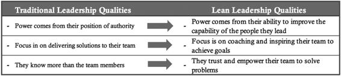
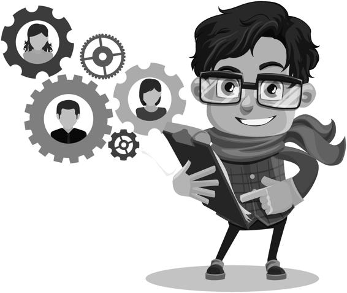

◾ Build continuous improvement into the fabric of your business, making the capabilities integral to the workforce. 

**128** ◾   _Lean Human Resources_ At the same time, when considering the benefits of redesigning the talent management system, it’s just as helpful to reflect upon the price of failing to do so. The foundation of Lean HR is the idea that unaltered HR systems truly damage lean initiatives, and when left out of the equation, can even cause any transformation to stall out. 

[**Begin by Developing Lean Leaders**](./1-Cover.md#p10)

As mentioned in the discussion on five-year planning, a number of choices must happen around where to start and how to proceed. However, as I’ve also said, getting the entire workforce to shift before the leadership teams do is a recipe for damaged relationships. So, the next chapter will review the leadership transformation necessary to bring about a lean culture and its related benefits. 

Often, when people note the failure rate of lean initiatives, the root causes are related to inadequate preparation for leadership transformation. 

This eventuality is less about who is to blame for failing to plan and more about adequately understanding the need for it. As you begin the next chapter, see it as one of the most fundamental requirements of a successful lean transformation. 

**CASE STUDY**

**IMPLEMENTING A LEAN TALENT STRATEGY**

An organization with almost twenty years of continuous improvement practices still found creating an engaged workforce eluded their efforts. 

While they held countless Kaizen events over the years, effecting hundreds of improvements, achieving a lean culture remained a vague concept. The HR team, as is often the case, had little involvement in the improvement activities since they focused primarily on operational improvements. They had done a few improvement events of their own and were pleased that they had some working knowledge of the activities. 

At some point, it became clear that if HR did not take a more active role in driving a lean culture, the company would remain stuck at its current level of improvement. As HR got more involved, it could see the leadership approach had never changed. Operators received training in 

 _Lean Talent Management Optimizes Success_ ◾ **129**

lean problem-solving, but this competency did not become a repeatable aspect of their typical workday. 

Eventually, HR worked with operations to establish the desired level of daily improvement practices. The HR team suggested building problem-solving and teamwork into the job specifications. The team also saw a need to build the lean leadership competencies that drive an empowered workforce. They realized that their job requirements, hiring standards, training plans, performance accountabilities, and recognition systems all needed alignment to shift the leadership in a new direction. 

Once HR evaluated its entire management system against the company’s needs, they began making changes. They started by redesigning every role definition to reflect an expanded view of the requirements. 

Instead of practicing lean as an event-based concept, they considered how it needed to impact everyday work. 

Next, the HR team assessed employees to find out how their skill sets compared to the newly developed standards. This effort identified training and development needs. HR was already working on revising the performance management forms, but found a renewed sense of purpose and direction. This phase included extensive skill development on feedback and coaching skills as the performance management process conflicted with efforts to develop the workplace they were seeking. 

**SUMMARY OF KEY POINTS**

1\. Talent management systems include all major components of effectively attracting, retaining, and developing a team. 

2\. Lean talent management systems have an additional feature designed to provide full access to lean capabilities and practices. 

3\. Organizations face several challenges related to their talent management systems. Common issues include: 

◾ Traditional HR focus is internal rather than external. 

◾ The organization completely underestimates the power of HR. 

◾ Traditional systems work in silos. 

◾ HR is unfamiliar with how to drive continuous improvement. 

◾ Talent management components do not align with the company vision and specific job requirements. 

**130** ◾   _Lean Human Resources_ 4\. A five-phased approach can transform an organization’s talent management systems to best support continuous improvement. These include educating HR about the business needs, aligning with the lean business strategies, structuring the organization to best support lean initiatives, expanding job roles, and redesigning talent management components. 

5\. Benefits of implementing a lean talent management system are many and include the following:

◾ Overcoming the barriers to success, so you can obtain long-term sustainability and move beyond event-based versions of lean

◾ Strengthening HR’s ability to make critical contributions to the business in general and to impact the success of lean

◾ Capitalizing on the potential value of lean, which is almost always underestimated based on difficulties in calculating long-term gains

◾ Building continuous improvement into the fabric of your business, making the capabilities integral to the workforce

**STRATEGIC QUESTIONS FOR HR**

1\. How can HR drive the success of current and long-term business strategies? 

2\. Will the jobs in your organization, as they are currently designed, achieve your business strategy? 

3\. What steps does your organization need to take to more fully implement lean business strategies that HR can support? 

**LEAN HR IMPLEMENTATION ACTION STEPS**

1\. Have meetings with your internal business partners to better understand current business strategies. If needed, obtain additional information to increase your understanding. What are the potential contributions HR 

can make to these strategies? 

 _Lean Talent Management Optimizes Success_ ◾ **131**

2\. Gather the documents and processes that support your hiring process, training and development, performance management, and pay system or guidelines. What do you notice about how they align to each other? 

To your lean initiatives? 

3\. Examine your job descriptions. Consider opportunities to add lean practices to enhance the value each role contributes. What would be the benefits and challenges? 

Lean Human Resources

Developing Lean Leaders

[ _**Chapter 8**_](./1-Cover.md#p10)

[**Developing Lean Leaders**](./1-Cover.md#p10)

Sitting over breakfast, Jim chatted with a mentor supporting him as he learned about lean implementations. The off-site owner of the business sponsored the training process. Jim explained the many advancements they’d made in finding effective external support to teach various teams how to do improvement events. Employees attended meetings to share their input on improvements and to get them involved in making changes. 

At one point, Jim stopped and said, “Here’s the problem. The plant manager isn’t in favor of this new lean approach and is minimally involved in the employee training or feedback sessions. We’ve tried a number of ways to involve him, but he just doesn’t see it as worth his time.” 

His mentor’s response was still clear to Jim even years later. “Well, that’s a definite deal-breaker.” He explained that the right leaders have to be in place, ready to support employee suggestions and involvement. Having employees share ideas in an environment where leadership is not on board creates a high likelihood that they will be hurt and their trust damaged. The lesson for Jim was that if you want to generate greater involvement in the workplace, leadership must be ready to support it. Until then, you won’t be successful. 

[**A new Vision for the Workplace** ](./1-Cover.md#p10)

[**Requires a new Way to Lead**](./1-Cover.md#p10)

Organizational change begins with the people holding leadership roles. To achieve a successful outcome, you must consider the competency of the **133**

**134** ◾   _Lean Human Resources_ individuals holding these roles and make changes, if necessary, to create your desired culture. Therefore, HR plays an intrinsic role in defining those leadership characteristics that best support the creation of a lean culture. As the opening story in this chapter points out, the wrong leaders are generally a deal-breaker. Without the right people, it’s unlikely your lean transformation will be successful. 

It’s not uncommon for senior leaders or the ownership of an organization to announce that continuous improvement will be the future of the company and that employees’ ideas are essential for getting better results. However, if frontline supervisors or middle managers are ill-equipped to handle employee participation, it will become clear that the change is not real. The reverse is also true. The right leadership practices generally bring the desired results to your customers and your business. Since leadership is so pivotal, it’s critical to have a process in place to set the criteria, meticulously evaluate people against those criteria, and ensure mechanisms are in place for dealing with people who do not meet them. 

In preparation for supporting the quality of leadership needed in a lean workplace, this chapter will cover (1) understanding lean leadership, (2) how to develop lean leaders, (3) strategies for overcoming challenges, and (4) the benefits of successfully developing lean leaders. As we begin, it’s useful to address not only what lean leadership is, but more importantly, to empha-size the enormity of the undertaking. 

[**the Magnitude of implementing Lean Leadership**](./1-Cover.md#p10)

Most people I’ve encountered who are involved in lean implementations agree on the importance of the leadership role. What’s missing is a complete understanding of the magnitude of the changes needed to achieve the ideal. 

To fully comprehend the essence of lean leadership, let’s explore a few characteristics that reflect the enormousness of this quest. 

First, this leadership approach reflects an upside-down model that puts leadership in the role of service versus power. Second, lean leadership is participative, not directive. Lastly, it works by inspiring ownership instead of relying on fear of consequences. While some people associate lean leadership with one feature or another, most visions for it are quite similar. 

Lean leadership turns the traditional model upside down. It’s sometimes referred to as servant leadership, a term coined by Robert K. Greenleaf. 

 _Developing Lean Leaders_ ◾ **135**

**Figure 8.1 turning leadership approach upside down**

This model states that the role of leaders is to support their teams and remove obstacles. What makes this model fundamentally different is that it’s by nature more bottom-up than top-down. Rank is reflected by proximity to the external customers and higher levels of leadership are in place to assist those closest to the customer. 

Next, lean leadership creates a participative work environment. In traditional workplaces, the leader is often the person who solves everyone’s problems and directs people on what to do. In contrast, continuous improvement environments seek to spread decision-making and problem-solving across the workforce to better utilize available skills and abilities. 

Finally, lean leaders work from a spirit of inspiration instead of mandates and threats of consequences. Many describe this change as relinquishing control. Traditionalists see the threat of demotion or unemployment as the only way to maintain control. This approach isn’t associated with a harsh culture; it’s simply the way things have been for many years. When the workforce makes independent decisions and decides how they will work, leaders absolutely must let go of how things get done, which is inherently uncomfortable. 

**136** ◾   _Lean Human Resources_ 

Any move to lean leadership comes with significant challenges. Even after years of exposure to some of the most advanced continuous improvement cultures, this area still presents a daunting challenge to test any workplace’s ability to make changes. Start-up operations (i.e., greenfield opportunities) find it easier to begin lean leadership practices since there is no preexisting mode of operation. Once any model of operation or leadership has been in place for decades, change becomes an uphill climb. Only broad-based, extensive changes will even begin to alter these types of workplaces. 

[ _**The Reciprocal Relationship Between Leaders and**_ ](./1-Cover.md#p10)

[ _**the Workplace**_](./1-Cover.md#p10)

With lean leadership, a cooperative relationship exists between how leaders behave and how their teams respond. When leaders shift their behaviors, team members eventually react in kind. However, most would say that the process is never completely smooth. Changes in leadership behaviors create ripples of change, some initially unwelcome or not understood. One way to **Figure 8.2 the reciprocal relationship between leadership behaviors and overall** **culture**

 _Developing Lean Leaders_ ◾ **137**

**Figure 8.3 traditional leadership vs. lean leadership results** verify how the changes are going is to confirm that the desired behaviors are evident in the balance of the organization. 

The difference between the results achieved by lean leaders compared to traditional leaders also transforms in a lean transformation, as shown in [Figure 8.3](id112). Picture an ocean liner turning. As the rudder (leadership) changes position, momentum moves the vessel (the workforce) in the desired direction. Keep in mind that it takes a lot of time and space to turn something the size of a ship or organization. When leadership isn’t ready to support a more empowered workforce, it makes sense to focus on building coaching and leadership skills. That way, when lean kicks up a range of suggestions and engagement, the leadership team is ready to handle them. 

Leaders need to be ready to work with engaged and motivated team members. That preparedness prevents disengagement of empowered team members unhappy with control and command management. 

[**transforming Leadership is Challenging**](./1-Cover.md#p10)

As you delve into the topic of implementing a lean leadership practice, the challenges presented in [Chapter 7 c](./2-Three_Aspects_of_Calculating_Potential_Improvement_Value_(PIV).md#p134)ertainly apply here as well. Chief among them is that the full value of lean is not understood and that talent management systems are not well-designed. Other challenges specifically related to implementing a new version of leadership include the lack of an adequate plan of attack, underestimating what it will take to build skills, and the level of resistance that will be encounter. 

[ _**Lack of Knowledge and Absence of a Robust Plan**_](./1-Cover.md#p10)

One of the first requirements to meet these significant challenges is to grasp the size of the task. A number of complexities are in play in any leadership 

**138** ◾   _Lean Human Resources_ shift. And it’s necessary to anticipate and plan for the eventualities that surface with ongoing changes in the leadership function. It’s not that organizations can’t overcome the various challenges that will arise; it’s that they often don’t prepare for them and then get stuck or stall out during the transition. 

In addition to the need to create a detailed plan of attack, it’s necessary to build a substantial knowledge base. Organizations often have no working knowledge of lean leader competencies. This predicament leaves them unable to build robust plans for accomplishing their goals. While many organizations learn more about continuous improvement cultures from reading and benchmark visits, the work of implementation requires in-depth knowledge to address the transformational needs. Once again, given their background in training, development, accountability, and feedback systems, HR professionals are the likely candidates to facilitate transitioning the leadership team to a more inspirational approach. 

[ _**Underestimated the Need for Building Adequate Skills**_](./1-Cover.md#p10)

Misunderstanding what training does and doesn’t accomplish leads to shortfalls in development for leaders shifting from traditional to lean approaches. 

Typically, you’ll find too little training with no follow-up and minimal coaching to help managers build the skills and habits to support a lean team. 

It’s not that their intentions aren’t good; it’s that the level of intervention is simply not robust enough to meet the challenge. 

[ _**Misaligned Talent Management Systems**_](./1-Cover.md#p10)

As I discussed in [Chapter 7, t](./2-Three_Aspects_of_Calculating_Potential_Improvement_Value_(PIV).md#p134)he components of a talent strategy are typically out of alignment with one another because they were developed at different times with differing purposes. However, once the goal is set to shift a work role, it becomes imperative to completely align the components for a successful outcome. It’s the conflicting messages between talent management components that can sink this ship. 

For example, an organization shifting to a lean leader model will have new training plans that support coaching skills. But it may lack follow-up processes to ensure those skills become entrenched in daily work patterns. 

Its hiring standards may remain unchanged even after altering the performance reviews to reflect the need for coaching skills in leadership positions. 

And you might also find that merit increase policies ignore the need to coach and develop team members. 

 _Developing Lean Leaders_ ◾ **139**

[ _**Resistance to Necessary Changes**_](./1-Cover.md#p10)

As discussed i[n Chapter 5, c](./2-Three_Aspects_of_Calculating_Potential_Improvement_Value_(PIV).md#p98)hange is hard and calls on organizations to use explicit strategies to manage it. A shift in the way leadership functions certainly qualifies as a change management initiative. Usually, an organization will decide to create a new leadership model, do some training, wait for it to take, train a little more, then wait for that to take root. If some of the leaders really push back on the changes, they can create enough resistance to stall the efforts. A telltale sign that the battle is lost is when dictatorial leaders remain in key roles. On the other hand, if the organization replaces those leaders, it signals change may be really on the way. 

[**Applying the LASeR Approach to Developing Leaders**](./1-Cover.md#p10)

The phases of the LASER approach introduced i[n Chapter 7 p](./2-Three_Aspects_of_Calculating_Potential_Improvement_Value_(PIV).md#p134)rovide a basis for implementing lean leadership. It includes the following key phases:

◾ **L**everage HR capabilities to achieve business priorities; 

◾ **A**lign your culture with lean business strategies; 

◾ **S**tructure the organization to support a lean approach; 

◾ **E**xpand job roles to include increased responsibilities; 

◾ **R**edesign each component of the talent management program. 

The previous chapter provided an overview of leveraging HR capabilities, aligning talent management with lean business strategies, and structuring the organization. However, for this chapter’s description of how to expand roles and redesign talent management system components, I will separate the discussion of lean leadership from the rest of the organization. The first question is, “What competencies do you want to include in your model of leadership?” Once you find an answer, you can restructure the talent management components to match. 

[**establish the** **expanded Role of Leadership**](./1-Cover.md#p10)

Organizations have a variety of options for expanding or rightsizing the leadership model to reflect the competencies needed for operational excellence. One example is the list of competencies based on the Seven Common Practices model shown in [Table 8.1](id112). In addition[, Figure 7.6, i](./2-Three_Aspects_of_Calculating_Potential_Improvement_Value_(PIV).md#p152)n [Chapter 7](./2-Three_Aspects_of_Calculating_Potential_Improvement_Value_(PIV).md#p134), 

**140** ◾   _Lean Human Resources_ **table 8.1 Competencies and Behaviors from 7 Common Practices – Completing** **a Cohesive Job Design with a Job Skill Matrix**

_Lean leadership_ 

_competency_

_Examples of Lean leadership behaviors_

Puts the customer first

Lead with the customer 

Explains changes in light of customer needs

in mind

Provides customer details to make them real

References internal customer relationships

Creates an environment where people learn

Teach and coach (versus 

Coaches by asking questions

directing)

Establishes protocols for methods that provide measurable 

improvement

Treats people with dignity and respect at all times

Coordinate extensive 

Protects relationships by listening and maintaining trust

participation

Effectively responds to ideas, concerns, or questions

Applies sustainable processes to any given work set

Knows value of scientific method and data to achieve 

Sustain standardized 

consistency

work processes

Demonstrates process improvement and process 

management skills, including role of other departments

Works toward targets for optimal financial results

Demonstrates fact-based understanding of processes

Sponsor team members 

Works with team to identify problems and create solutions 

to permanently solve 

so problems do not repeat

problems

Creates interdisciplinary problem-solving teams

Sees problems as opportunities to improve processes

Is well-versed in visual measurement skills

Understands the ways in which visual measurements are 

Utilize effective visual 

critical to achieving results

management

Shares visual measurements to help people understand key 

areas of focus and to know how they are doing against daily, weekly, and monthly goals

Seeks to enhance the development of others

Provides direction, parameters, support for overcoming 

Develop team members 

obstacles, and achievable goals

within a positive work 

Surfaces the ideas of others and does not rely only on their environment

own ideas to produce the best results

Empowers others to grow and become less dependent on 

receiving direction from others

 _Developing Lean Leaders_ ◾ **141**

refers to how roles developed based on value streams or end-to-end functioning also result in new leadership competencies. 

Another source for understanding and revising competencies and behaviors for lean leaders is the Shingo Model™. It speaks to a series of principles that drive operational excellence. However, the principles also relate to specific behaviors easily translated into competencies or job accountabilities. For example, the Shingo Model has the principle of “respect for every individual.” As a coworker once said, “Respecting people means that every person should be provided whatever skills they need to perform their jobs.” 

[ _Revising Leadership Job Descriptions with a New Design_](./1-Cover.md#p11)

Many workers say the only time they’ve ever looked at their job description was when they were considering their role. Why? A job description is primarily for recruitment purposes. HR professionals often help develop the supporting job analysis documenting the existing roles and responsibilities. 

These are not only recruiting tools, but also useful for developing training plans and market analysis for compensation levels. 

Job design is different, in that it generally involves reallocating or changing roles and responsibilities. That represents a strategic approach to evolving a vision for the future. Developing an easy to understand approach to analyzing job content helps establish a new standard for a given job role. In addition, working toward redefined standards provides an opportunity for many people (e.g., various leadership team members, incumbents, HR team members, and continuous improvement support staff) to collaborate on aligning newly defined job content with strategic objectives. 

[ _Completing a Cohesive Job Design with a Job Skill Matrix_](./1-Cover.md#p11)

This chapter covers redesigning jobs with the use of a job skill matrix. The sample matrix i[n Table 8.2](id112) lists details of a specific job role, These specifics frame various HR-related programs and are a guide to assessing current performance levels. Leaders and working teams often find these matrices quite illuminating in how people are more effectively held accountable. And they support problem-solving for a wide range of performance issues. The matrix separates the elements of a job description to provide a distinction between the individual components. These reveal the overall dynamics of the work better than any two-dimensional description. 

The sample matrix reflects three columns related to job detail: knowledge requirements, observable activities, and critical results. The middle column, 

**142** ◾   _Lean Human Resources_ **table 8.2 Job Design Matrix for Redefining Lean Leaders** _Job Design Matrix_

_Covers requirements for each talent management component_ _Knowledge/Characteristics_

_Observable Activities_

_Key Results_

_Contains criteria used for_ 

_Contains specific behaviors Contains specific, measurable,_ _hiring and training_

_that reflect the core_ 

_results that represent key_ 

_responsibilities of the role_

_metrics and core deliverables_

**includes:**

**includes:**

**includes:**

Selection testing

Selection testing

Points for daily coaching

Interview questions

Interview questions

Inputs for performance 

Training plans

Training plans

review

Inputs for performance 

Inputs for merit increases

reviews

Inputs for bonus plans

Inputs for career plans

**examples:**

**examples:**

**examples:**

Leadership style testing 

Safety

Zero lost time accidents

Lean knowledge testing

Quality

Required quality metrics

Standard behavioral 

Productivity

Productivity targets

interview guides

Experience with handling 

Team management

Engagement survey results, 

safety, quality policies, and 

turnover targets

labor legal compliance

Continuous improvement 

Experience with various 

(Lean)

continuous improvement 

methods

Functional responsibilities

considering the assigned goal during a given day, is often the beginning step in the design process. For each item that is an observable behavior, the process defines the observable knowledge required that might involve prior training or experience. Lastly, these items need to specify the results that indicate successful completion. 

The job skill matrix is especially helpful as the basis to tie all the talent management components into one document (e.g., hiring criteria, selection testing, interview guides, training and development plans, career and succession planning, performance review, and compensation plans). Because developing a new approach to lean leaders is exhaustive, it’s even more important that all the materials tie together to concisely communicate the new role. As mentioned previously, documents, such as leader standard work, can be developed and referenced in the job matrix. 

 _Developing Lean Leaders_ ◾ **143**

[ _Relationship Between Job Design and Leader Standard Work_](./1-Cover.md#p11)

Leaders often ask, “How does the work of Lean HR connect with concepts such as lean management systems or leader standard work?” The answer is easier to express by considering the work of David Mann, the author of _Creating a Lean Culture_. His work explores the nature of the lean management systems that must be in place to support a lean culture, including (1) leader standard work, (2) visual controls, (3) daily accountability processes, and (4) leadership discipline. These elements are all completely complementary and necessary to support the actions accomplished within Lean HR. 

Basically, the job design is at a level of less detail, but it needs to encompass the elements of the lean management system, including leader standard work. For example, if an organization replaces traditional job descriptions with a new design, the documentation or job matrix would reference other documents. The reason for this is that the detailed leader standard work guides leader actions on an hour-by-hour or day-by-day basis, whereas the job design matrix supports the talent management components as a system. 

**RESOURCE**

**Obtain** examples of lean leadership work roles, including a sample job-skill matrix design a[t www.leanhrresouces.com. ](./http___www.leanhrresouces.com)

[ _**Redesign Talent Management Systems**_](./1-Cover.md#p11)

As mentioned in the last chapter, the final aspect of the LASER approach is to redesign the talent management systems. Following is a brief overview of some of the topics related to hiring, training, coaching, and rewarding lean leaders. My purpose in this chapter is to illuminate the new complexities that shifting leadership models entail. I would encourage using a wide range of resources to become thoroughly acquainted with these models, highlighted throughout this section. 

[ _**Hiring the Right Leaders: An Often Missed Opportunity**_](./1-Cover.md#p11)

Recruitment involves three processes:

1\.   **Recruiting potential employees**: The recruitment process begins with the identification of candidates and ends when the selection process begins. 

**144** ◾   _Lean Human Resources_ 2\.   **Selecting the right employees**: Selection begins with a pool of candidates. The process defines steps that support picking the right candidates for a continuous improvement culture. 

3\.   **Orienting new employees into the organization**: Onboarding begins with the hiring of candidates and follows the first 90 to 180 days of familiarizing them with company values and objectives, job responsibilities, and training. 

These recruitment-related processes all link together, yielding success as you hire the right people into your organization and make sure they understand your culture from the beginning. I have found that HR often overlooks recruitment as an opportunity to impact overall results. That’s unfortunate, because the first way you can begin to affect your talent pool is by creating meaningful filters that allow only the right types of skills and abilities into your workplace. Once you hire people, it’s also critical to convey important organizational messages from the outset, when people are most focused on learning of the expectations placed on them and their role in the bigger picture. 

[ _Start by Looking for Improvement-Oriented Leaders_ ](./1-Cover.md#p11)

There are specialized approaches used to locate talented people familiar with lean principles, continuous improvement cultures, and the importance of demonstrating superior results over time. Specific database searches for lean backgrounds, lean recruiters, and associations related to lean or continuous improvement can help locate suitable candidates. 

[ _Use Lean Tools to Select the Right People_ ](./1-Cover.md#p11)

Organizations find it well worth their effort to recruit the best quality leadership candidates possible to improve performance. “Best quality” may not mean the people are the smartest or the fastest, but that they are a good fit for the culture of continuous improvement you want to create. Selection testing plus standardized and team-based approaches to interviews are upgrades that can help you identify the right leaders for the long term. 

[ _Allow Teams to Be Highly Involved in Selecting Their Leaders_ ](./1-Cover.md#p11)

Since the concept of leadership is so important, teams are often involved in making hiring decisions. Continuous improvement cultures may use 

 _Developing Lean Leaders_ ◾ **145**

team-based interviewing because of their focus on teamwork. Teams that drive results generally prefer to have some choice in vetting additions to their group, including prospective new leaders. Lean-trained teams can add considerable insight into the hiring process because they provide viewpoints from several job perspectives. 

[ _World-Class Cultures Demand World-Class Onboarding_ ](./1-Cover.md#p11)

Thriving cultures demand that, from the very beginning of their employment, new hires receive the right messages about working and living in a particular culture. Lack of attention to highlighting the desired organizational culture leads to average (or worse) results. For an organization to obtain above-average results from its new hires, it needs to weigh carefully the messages it sends to employees. 

The Seven Common Practices are all applicable for improving onboarding. Examples of this include survey results from new hires, greater involvement in the design and feedback mechanisms for onboarding processes, commitment to following consistent processes, the use of problem-solving methods to improve, and visual management to track results. 

[ _Ensure That Training Lean Leaders Adds Value_](./1-Cover.md#p11)

Training often lacks any real direction or required outcomes. It must add value, otherwise it is simply a waste of time and money. Waste also comes from a lack of follow-up needed to support the desired results. 

The most common problems arise when organizations provide training with no link to strategic need or that fails to deliver the desired behaviors and related business results. For training to add value, it must support the organization’s overall strategy. 

I’ve seen many HR departments provide training for supervisors or leaders that they designed with no thought to how it connects to the strategic objectives of the organization. During this training, the departments involved often fail to attend or they resent the time away from their work. When employees see no value in putting their time into skill-building, that’s an undeniable sign that they don’t understand the motivation for additional training. 

It doesn’t matter how many hours of training employees complete, that alone does not change behavior. In fact, changing behaviors or developing new ones is extremely complex and difficult. I’ve participated in attempts to train 

**146** ◾   _Lean Human Resources_ beginning supervisors in coaching and supervisory skills. Many times, people leave the sessions confused and their areas of weakness are still present. This scenario can be true even if the training takes place over several weeks. 

_**Unless training adds value, it’s a waste of resources**_**.** 

Certainly, HR has a vital role in understanding what makes training effective. HR can assist in identifying objectives, create follow-up plans, and ensure coaching and accountability are in place for successful training results. [ Table 8.3](id112) reflects some common training programs to implement as part of developing lean leaders. 

**table 8.3 Common training to Build the Skills of Lean Leaders** _Training_

_Description_

_Purpose_

• Creating a vision for success

Provides method for 

• Measuring success

examining current 

• Supporting teamwork

practices in a team 

Team leadership

• Establishing ground rules

format and identifying 

• Facilitating meetings

changes for future 

improvement

• Establishing clear expectations

Develops skills for 

• Asking effective questions

upgraded interpersonal 

Coaching and 

• Listening skills

abilities that support 

communication 

• Providing feedback for growth

the competencies of 

Skills

• Managing emotions

lean leadership

• Handling difficult situations

• Value stream mapping

Essential for stronger 

• Identify root causes of core issues

process orientation to 

Systems thinking

• Understand interconnectedness of better understand the 

various functions and issues. 

connections between 

systems’ components

• Root cause analysis

Supports team-based 

• Mapping

problem-solving and 

Problem-solving

• Scientific method

general process 

• Cycles of learning for key metrics

orientation across 

departments

• Basics of waste identification

Provides fundamentals 

Basic elements 

• Pull systems

for leadership to utilize 

of Lean

• Visual management

lean tools to support 

• Continuous flow

daily work

 _Developing Lean Leaders_ ◾ **147**

[ _**The Controversy Surrounding Performance Management**_](./1-Cover.md#p11)

W. Edwards Deming is well known for his role in continuous improvement and widely acknowledged as a leader in performance management. Here are a few of his thoughts:

“The annual performance review sneaked in and became popular because it does not require anyone to face the problems of the people. It is easier to rate them than focus on the outcome. 

“Ultimately, leaders work with their people daily and rating their performance annually doesn’t align with the principles of lean leadership.” 

**W. Edwards Deming, _Out of the Crisis_**

[ _Performance Management Systems Need to Protect Psychological_ ](./1-Cover.md#p11)

[ _Safety_](./1-Cover.md#p11)

Performance management encompasses the tools and protections people need to feel comfortable enough to share ideas, take risks, contribute more, and be fully engaged in their work. There are at least three critical concerns with performance feedback systems in general:

1\. They tend to follow a bell curve rating, which leaves many people feeling they are average or even less than average employees. 

2\. Many individuals who participate in these systems lack the skills to handle performance feedback in a manner that maintains their relationships with leaders and coworkers. 

3\. The development of many performance feedback systems limits, rather than expands, people’s sense of potential and contribution. 

If the goal of a lean culture is to expand the use of people’s capabilities, performance management systems need redesigns that require each person and their manager to seek answers to the following questions. 

What am I capable of doing in my work that I’m not doing now? 

In which areas would I like to perform better? 

Where have I held myself back? 

What would I like to do more of to contribute to our organization? 

**148** ◾   _Lean Human Resources_ What problems could I work to solve? 

How could I be closer to my customer(s)? 

How effective are the performance indicators of how I’m doing? Should my key results be visual to be more useful? 

What types of support do I need so I can make changes that contribute more to my organization? 

[ _Consider Performance Review Approaches Carefully_](./1-Cover.md#p11)

Much can be said for the positive outcomes possible from giving people feedback on their performance. The absence of individual feedback might lead people to feel unimportant or unworthy of their supervisor’s attention. 

The upside of the review is that people feel a sense of recognition from the process. 

Therefore, performance management systems should address how to handle feedback in a manner that increases morale and increases growth or individual learning. That is not to say that managers should give only positive feedback and ignore areas that need attention. It is a matter of ensuring each person feels uniquely seen and able to contribute his or her unique skills to the work environment. Lastly, the process must actually help people contribute more, not less. [Table 8.4 s](id112)hows how feedback differs between a traditional work environment, which focuses on blame, and a continuous improvement environment, which focuses on accountability. 

[ _Optimize the Benefits of Recognition and Rewards_](./1-Cover.md#p11)

Rewards, both financial and nonfinancial, can reinforce desired behaviors. 

One way Lean HR utilizes recognition is to reinforce continuous improvement behaviors that support corresponding culture elements. You can easily customize the overall approach to encourage the behaviors you want to see more of through recognition and rewards. I’ll also review how financial compensation is a more potent form of recognition, and dangerous if not handled correctly. Some would say from experience that rewards can, at times, be a more powerful _demotivator_ than a motivator. 

[ _The Power of Recognition_](./1-Cover.md#p11)

Personal acknowledgment plays an enormous role in motivating people to work toward goals and exhibit desired behaviors. It’s a common belief that 

 _Developing Lean Leaders_ ◾ **149**

**table 8.4 Feedback emphasizing Blame versus Accountability** _Culture of Blame_

_Culture of Continuous Improvement_

Who did it? 

Which process is involved? 

Who is responsible for the process? 

Who are all the people who affect the 

Who is to blame? 

process and are involved in an issue? 

Is the person responsible clear about this 

issue? 

Who needs to be disciplined to ensure What can the people responsible do this never happens again? (Focus on past)

differently in the future? (Focus on future)

Assumes people do not care Assumes people care

Assumes people make mistakes due to a 

Assumes people make mistakes due to 

range of people-related processes that 

carelessness or negligence 

can be improved 

Assumes mistakes often repeat and are Assumes mistakes are avoidable in unavoidable 

well-designed processes 

Surfacing problems can lean to penalties Surfacing problems are critical to crating or consequences; Disclosing errors is 

error-proof processes; Disclosing errors 

discouraged 

is encouraged

rewards must be financial, yet the opposite is often true. Ideally, any recognition includes an acknowledgment of a specific behavior or contribution and the benefit it had on the work environment. I have often heard employees lament in training sessions that they wish their managers would mention the things they do right instead of the things they do wrong. 

[ _Financial Reward Systems_](./1-Cover.md#p11)

In addition to nonfinancial recognition, companies often choose to modify their financial reward systems to reinforce the attainment of improvement goals. Financial recognition can be monetary in nature or a system of prizes the recipient can select. For example, organizations can provide awards from a catalog of goods, which prevents people from comparing one reward to another. If employees earn points for certain behaviors and buy something with the points, there is less chance of morale issues arising from one person getting more or less than another person for a similar act or behavior. 

**150** ◾   _Lean Human Resources_ 

[**Additional Strategies for overcoming Lean Leadership** ](./1-Cover.md#p11)

[**obstacles**](./1-Cover.md#p11)

**Build a stronger plan using the LASER approach**. Earlier in this chapter, I discussed challenges, such as how implementing lean leadership can be taxing in terms of gaining the skill and knowledge required. The LASER 

approach provides the fundamentals needed to link the work to the lean business strategies, creating a basis for expanding the roles and redesign of the talent management components. Involving HR personnel throughout this process keeps them intimately involved in the work and builds their knowledge along the way. Thus, this ensures a stronger alignment between the lean management and talent management systems. 

**Lean leadership requires developing new habits**. Many factors go into building the habits of lean leaders. I’ve found that looking at skill-building as new habit-building is a better description. As such, new strategies are needed to build daily habits, including regular exposure to leadership-related curriculum, increased support within the internal leadership community, and the use of visual reminders of key desired behaviors. 

**Effective change management is crucial, and without it, success** **will likely be elusive**. I’ve encountered many HR teams actively working on changing the approach to leadership. Each is well aware that this work qualifies as a change initiative of the highest caliber. Therefore, they utilize diverse strategies to increase buy-in through collaboration and by addressing concerns that arise. Progress often happens one individual at a time. Several of the strategies noted in [Chapter 6](./2-Three_Aspects_of_Calculating_Potential_Improvement_Value_(PIV).md#p112) are helpful in this regard. 

[**Benefits of Lean Leadership translate to expanded** ](./1-Cover.md#p11)

[**Workforce**](./1-Cover.md#p11)

Unleashing the abilities of every single employee leads to greater organizational capabilities that requires lean leaders. Earlier in this chapter, I discussed how lean leaders create a workforce that:

◾ Learns; 

◾ Shares ideas; 

◾ Trusts others; 

◾ Tries new things; 

 _Developing Lean Leaders_ ◾ **151**

◾ Embraces change; 

◾ Utilizes lean tools. 

So, what makes this so enormously valuable? Imagine:

◾ Your team addressing every glitch; 

◾ Your team resolving every customer concern; 

◾ A team that actively experiments with new ways to do things and uses innovation to make changes never tried before; 

◾ Every employee tuned into visual cues throughout the day, keeping them on track to achieve goals. 

Based on this reality, revenues would rise, costs would decline, and the highly engaged environment would be a patently happy place to work. The sky truly is the limit. 

**CASE STUDY**

**SUCCESSFUL LEAN LEADERSHIP DEVELOPMENT**

A manufacturing firm that had long desired to create an avenue to build the capabilities of its workforce finally developed an approach to achieving its vision. Early in its journey, it found that simplistic attempts to shift from traditional to lean leadership were largely unsuccessful. 

After deliberative research and planning, the company devised a four-phased approach to building lean leadership roles into the general workforce. The first phase revolved around increased reporting requirements to build a stronger awareness of key metrics and goals. The second tasked teams to take on scheduling responsibilities for production and work hours to best accomplish their production goals. The third involved more troubleshooting and problem-solving activities. The final phase increased team involvement in every area of team functionality. 

By approaching the transition one department at a time, each team could work toward completing one phase of development before moving to the next. Since this process was designed and overseen by the leadership team, they were plenty busy with building the skills and abilities of their departmental teams. 

**152** ◾   _Lean Human Resources_ Hardly surprising, right from the beginning, the organization revised the roles of leadership with a strong emphasis on new accountabilities. This change allowed them to transfer their historical duties to their teams and embrace newly created duties that were equally important. Also predictable, not all of their leaders were able to make this transition. 

In response to the difficulty some leaders had in attempting to fit into a lean leader role, the company introduced dual career ladders. Where originally the organization only had traditional supervisory and management roles, it added technical roles. That allowed the company to retain those leaders who held valuable experience, but were unsuited to coaching and positions requiring keen interpersonal skills. Lean leadership and technical leadership positions were of equal pay and significance, but different in function. 

What became apparent upon meeting this firm’s teams was how highly engaged and knowledgeable they were about their business. The team members easily interacted with visitors and spoke to a range of challenges their team had overcome. They described coming to truly enjoy their work and of finding all the new responsibilities stimulating. The number of supervisors or managers had decreased through attrition and role changes, so over time, the leadership shift was reasonably smooth. 

Leaders who remained in key roles were devoted to supporting the efforts of the teams and relinquished control as much as they deemed feasible. 

The organization’s results skyrocketed, which allowed it to pursue new ventures that wouldn’t have been possible otherwise. It enjoyed a safety record that was the envy of other local manufacturers. Turnover rates were nominal, with very little absenteeism. These outcomes certainly made all the changes well worth the effort. 

**SUMMARY OF KEY POINTS**

1\. Lean leadership may be described in different ways, but definitions are largely similar. The upside-down model of servant leadership and a shift to a participative or inspirational mode reflect the magnitude of the task as a sea of change in the organization. 

 _Developing Lean Leaders_ ◾ **153**

2\. Organizations often underestimate the significance of developing lean leaders, and that shortsightedness contributes to unsuccessful attempts at implementation. 

3\. The reciprocal relationship between employees and their leadership team is evident in the changes made in how they function. 

As the leaders’ behavior changes, so will that of the overall workforce. Conversely, examining the behaviors of the workforce will indicate the leadership behaviors in existence in any area of the organization. 

4\. A range of challenges related to implementing lean leadership include lack of focus and knowledge, underestimating the task, poorly designed talent management systems, and resistance to change. 

5\. Several sources of lean leadership competencies can be found, including the Seven Common Practices and the Shingo Model. 

6\. Revising job descriptions with a fresh job design is the basis for rees-tablishing roles and responsibilities. 

7\. Redesigning each component of the talent management system is required for a cohesive and successful change. 

8\. In overcoming the variety of challenges related to establishing a fully entrenched lean leadership style in the workplace, it is necessary to apply multiple strategies. 

9\. The benefits of implementing lean leadership are extensive and go well beyond financial metrics. Considering how changes in leadership behavior will reflect in the behaviors of the balance of the workforce can demonstrate the scale of the benefits. 

**STRATEGIC QUESTIONS FOR HR**

1\. What is your organization’s understanding of the lean leadership competencies desired to achieve your vision for lean results? 

2\. What steps have you taken to achieve a lean leadership approach to your culture and what have been the results? 

3\. What steps does your organization need to take to more fully implement lean leadership strategies that HR can support? 

**154** ◾   _Lean Human Resources_ **LEAN HR IMPLEMENTATION ACTION STEPS**

1\. Determine the leadership approach needed in your organization by meeting with your internal business partners to understand their goals and priorities. 

2\. In examining the components that relate to your leadership roles, which are aligned, and which are not, with your lean initiatives? 

3\. Examine your leadership job descriptions. How might you need to redesign them to better reflect the desired competencies, specifically as they relate to continuous improvement and leading teams? 

Lean Human Resources

Developing a Fully Engaged Workforce

[ _**Chapter 9**_](./1-Cover.md#p11)

[**Developing a Fully** ](./1-Cover.md#p11)

[**engaged Workforce**](./1-Cover.md#p11)

When you visit a factory on a lean tour, it’s easy to notice how the people interact with each other and their work. For example, I recall Jim, a plant manager, showing me the lean practices they had implemented over the last several years. As we walked through department after department, I noticed people had their heads down. Their behavior seemed no different from that of typical machine operators. In further conversation, the leadership team divulged that only 5% of the production workforce was involved in continuous improvement activities. While they had hoped for more, that 5% became acceptable over the years, reflecting their “event-driven” orientation toward lean. 

Once they took steps to increase the level of involvement, it became clear this approach would lead to greater success. Their main goal became to get a significant portion of their workforce (if not everyone) involved with continuous improvement. They also changed their leadership roles to focus on spending more time championing their teams to solve problems, improve processes, and do more within the parameters of their jobs. 

This chapter will define full engagement and the extent to which it’s generally present in typical lean enterprises. Considering the potential benefits, this is an area where Lean HR may want to focus. But if full engagement is so beneficial, why is it the exception rather than the rule? 

To answer this question, I’ll address the problems involved in a comprehensive lean implementation. In addition, I’ll examine how to implement changes in the way work is structured and performed to optimize **155**

**156** ◾   _Lean Human Resources_ engagement and results. I’ll also discuss which strategies would help overcome the challenges organizations face in making significant changes in the general workplace. 

**The benefits of a fully engaged workforce are easy to appreciate.** 

**The problem lies in successfully achieving this vision for your** **team.** 

[**the Pursuit of a Fully engaged Workforce**](./1-Cover.md#p11)

Workplaces often struggle with team members who fail to be fully present in their work. They go through the motions without thinking through options or improvements. If this is true for your organization, ask yourself a few questions:

◾ Does everyone understand their role in achieving your organization’s mission and goals? 

◾ Do employees find themselves working hard but not getting ahead of the never-ending problems? 

◾ Do employees find themselves struggling to enjoy their jobs due to poor relationships with supervisors? 

As the antithesis of the above situation, a fully engaged workforce represents an ideal, where every person in the workplace is entirely committed and highly motivated to contribute to the organization’s success. The goal is to tap into each team member’s passion for work. The results benefit both the organization and the individual. 

The advantages of having a highly motivated workforce include greater profits from higher revenue and decreased operating costs, as well as improved relations with customers and employees. The increased earnings can be significant, which is why, in recent years, so much focus falls on engagement. 

Fully engaged workforces are known to have a positive impact on the quality of life of team members. By that, I’m referring to enhanced self-esteem, greater realization of each individual’s unique talents and gifts, and even better health due to lower levels of stress from work. 

Many people I’ve met who have devoted their work lives to advancing the success of lean find motivation in how lean improves the quality of 

 _Developing a Fully Engaged Workforce_ ◾ **157**

life for the workforce more than by how it provides enhanced business results. 

Again, if there is so much to gain, why doesn’t everyone pursue it? 

[**Lean Represents a Spectrum of involvement Levels**](./1-Cover.md#p11)

First of all, it’s important to remember that the issue of lean and full engagement represents a spectrum of conditions; it’s not a matter of success or failure. At one end of the spectrum is an approach to lean that engages only a small percentage of the workforce. At the other end is implementing lean in a manner that seeks 100% involvement of the workforce. Theoretical differences behind these approaches are a topic for another time. But be aware of some of the repercussions of these differences. Ask yourself what percentage of your workforce you are seeking to involve in your continuous improvement activities. Is the goal to have 100% involvement? If so, how well is this being accomplished? If the goal isn’t 100% of the workforce, what stands in the way of stretching to full engagement? 

So how can you tell if your workforce is engaged? The simplest way is to assess the extent to which your workforce has involvement in the business beyond their defined job role. For example, is a person just a forklift driver, or does he or she also participate in understanding business issues and identifying solutions? What percentage of your workforce has any concerns beyond just doing their assigned job? 

_Note_: For additional information, [Chapter 5](./2-Three_Aspects_of_Calculating_Potential_Improvement_Value_(PIV).md#p98) covered the topic of driving engagement, while [Chapter 12](./4-Effective_Change_Management.md#p230) will cover methods for evaluating engagement. 

[ _**Impediments to Full Involvement**_](./1-Cover.md#p11)

The struggles with developing a fully engaged workforce are many and often correlate directly to the level of benefit gained. There are valid reasons why every organization is not at the higher end of the spectrum of involvement. Let’s look at some common reasons here. 

[ _Getting over the Leadership Hurdle_](./1-Cover.md#p11)

The biggest stumbling block for most lean enterprises is how to transition the leaders into a new way to work with their teams. Certainly, there is a percentage of them who readily take on a more empowering form 

**158** ◾   _Lean Human Resources_ of leadership and were perhaps inspirational leaders in the first place. 

However, a significant portion of the leadership team will struggle to work in anything but a top-down, directorial style. 

The second set of hurdles relates to the day-to-day leadership behaviors that damage engagement, but often go unnoticed. Earlier, the topic of psychological safety was introduced as relating to behaviors or practices that result in people disengaging or pulling back from their involvement in the workplace. If employees don’t feel safe to share their ideas and suggestions, they generally won’t do so. If there are negative repercussions (perceived or real) to taking risks, trying new things, or considering improvements, people will refuse to get involved. 

_Note_: For a review of the nature of the challenges with lean leadership and strategies for overcoming them, refer t[o Chapter 8](id112). 

[ _Failure to Amend the Flow of Work_](./1-Cover.md#p11)

Beyond the fact that change is inherently difficult, the range of modifications to expand the way people work often gets away from a leadership team. For example, consider what it means to have people participate in one Kaizen event, learning how to identify waste and implement improvements. If there are no additional opportunities to get involved with an event anytime soon, translating the learning into daily work is just a vague notion. 

These situations highlight the need to create new workflows to allow team members to apply improvement practices on a day-to-day basis. If the workplace has people assigned specific work duties for 100% of their workday, that doesn’t leave time to do anything else. And new workflows may require even more training, mentoring, new processes, etc., all of which need to be designed and implemented for greater involvement. 

[ _Team Member Resistance to Higher Levels of Involvement_](./1-Cover.md#p11)

Many individuals used to working with a relatively narrow view of a role can’t easily shift their mindset or skills. For a variety of reasons, organizations can expect some portion of any team to refuse directly or indirectly to go along with new work expectations. Resistance typically appears as:

◾ Complaints about changes, requirements, communications, leadership, etc.; 

◾ Lack of cooperation with improvements; 

 _Developing a Fully Engaged Workforce_ ◾ **159**

◾ Refusal to participate in development events; 

◾ Threats to quit their jobs. 

Many lean implementers describe being quite discouraged when people don’t want to change. They lament that they don’t understand people who want to leave everything the way it has always been. Some leaders even wonder why they try. But as I previously mentioned, it’s helpful not to focus on the resistance, but to treat it as one issue to address—and not even the main issue. 

_Note_[: Chapter 7 c](./2-Three_Aspects_of_Calculating_Potential_Improvement_Value_(PIV).md#p134)overed change management strategies that are helpful in these situations. 

[ _Lack of a Clear Vision_](./1-Cover.md#p11)

Many organizations I’ve worked with aren’t opposed to embedding lean into the workplace more broadly. They just haven’t figured how to do it, much less how to calculate the benefits that would justify the time and effort. Understandably, fully appreciating these options is a sizable task and requires the development of what most would consider a complex plan. 

For example, I’ve encountered organizations that most sincerely want to develop a thriving lean culture, but deploy overly simplistic plans for doing so. When the plans don’t include approaches for changing mindsets, workflows, leadership styles, and everything that goes with these changes, they typically don’t achieve their objectives. 

Lean HR can play an essential role in laying out the implication of changes and assisting with developing strong, comprehensive plans that represent an unambiguous vision. However, if the HR team is unprepared for this role, they are of little assistance to this vital concern. 

**The active involvement of team members with lean initiatives drives** **full engagement.** 

**Just as clearly, the absence of involvement leaves open the opportunity for disengagement.** 

[ _**The Price of Failure**_](./1-Cover.md#p11)

Awareness of the consequences of getting it wrong is as important as understanding why it is imperative to work toward a fully engaged workforce. 

**160** ◾   _Lean Human Resources_ Many leadership decisions related to starting, stopping, or changing lean activities fail to take into account the impact on people. When those same activities stop or are later changed, there is a risk of doing more damage than if you had never started. 

Getting it wrong often relates to attempts to involve people without taking a sufficient amount of care to support their involvement. For example, I’ve often seen improvement teams that solicit suggestions on how to make improvements, but never respond to the recommendations submitted. If someone walked up to you and asked for your opinion or ideas and then walked away without responding to what you said, wouldn’t that leave you confused at the least and potentially even angry? Yet, this has become so commonplace, it doesn’t even raise a red flag in many organizations. 

Other examples involve leaders who decide they’d like to change strategies, but don’t communicate with the employees about how their involvement matters. Based on these and similar examples, the following are just a few of the risks related to getting it wrong. 

[ _Failure of Lean Initiatives_](./1-Cover.md#p11)

When lean becomes a mandated “business” initiative or it involves only a small percentage of the workforce, the understanding of the changes never takes hold for the majority of the workforce. You can change a process relatively easily. What’s difficult is to communicate the change, help employees understand its purpose, and sustain the change. Getting that step wrong often leads to the failure of lean efforts to sustain improvements, which can leads to a cessation of efforts altogether. 

[ _Damage to the Culture_](./1-Cover.md#p11)

Lean can create heartbreak when it damages the culture. People get hurt when they’re encouraged to task risk and learn, and then have their newly developed trust broken. Mistakes related to culture damage often link to a lack of appreciation for the fragility of the trust people build when they participate in improvements. If they open their hearts and are deeply disappointed with their treatment, they’ll be much slower to try it again. 

[ _Demoralization of Specific Individuals_](./1-Cover.md#p11)

Sometimes, it’s not the entire workplace that’s damaged, but specific individuals. I remember my first month of learning about continuous improvement. 

I was so excited to bring my first big idea for an improvement to Terry, the 

 _Developing a Fully Engaged Workforce_ ◾ **161**

head of the program. He said it was a good idea and that he’d get back to me. When he never followed through, I realized that the organization was unprepared for the volume of suggestions received. Especially not for those submitted by people outside the traditional chain of decision makers. When you solicit input from your employees, make sure you genuinely listen. 

Of course, organizations make changes to strategies, transition between senior leaders, and encounter various situations that can impact lean activities. Lean HR promotes taking accountability for how people are involved and ensuring that those changes do not create irreparable harm to your company. 

[**the LASeR Approach to implementing Lean** ](./1-Cover.md#p11)

[**organization-Wide**](./1-Cover.md#p11)

[Chapter 7](./2-Three_Aspects_of_Calculating_Potential_Improvement_Value_(PIV).md#p134) introduced the LASER approach for leveraging HR’s alignment to lean business strategies and structuring the organization. Here’s a brief review:

◾ **L**everage HR capabilities to achieve business priorities; 

◾ **A**lign your culture with lean business strategies; 

◾ **S**tructure the organization to support a lean approach; 

◾ **E**xpand job roles to include increased responsibilities; 

◾ **R**edesign each component of the talent management program. 

However, [ Chapter 7 f](./2-Three_Aspects_of_Calculating_Potential_Improvement_Value_(PIV).md#p134)ocused on the first three parts of the LASER 

approach, where as this chapter examines the last two parts of the LASER 

model. The first question to ask is, “What are the behaviors and skills you want to see in every person in your organization?” Once you know that, you can restructure the talent management components to match. 

[ _**Establish a Vision for Expanded Roles**_](./1-Cover.md#p11)

Many organizations aren’t fully aware of the option of building lean competencies into daily work as an implementation strategy for developing a lean culture instead of using only continuous improvement tools. Yet, one of the most powerful methods for achieving a fully engaged lean workforce is to expand the duties of typical jobs to include work that is fully reflective of the employees’ capabilities. 

Building lean competencies involves making numerous decisions, with a focus on identifying the specific additional work requirements. Directly 

**162** ◾   _Lean Human Resources_ **table 9.1 team Member Roles Reflect Seven Lean Practices** _Lean Practices_

_Organization-Wide or General Competencies_

1

• Ongoing attention to and implementation of 

Focus on customer

customer service principles 

2

• Ongoing effort to learn and participate in 

Measurable improvement

improvement activities

3

• Communicating effectively

Foster participation

• Regularly providing suggestions

4

• Developing and executing actionable plans that 

Standardize processes

improve processes

5

• Actively participating in problem-solving teams

Solve problems methodically

6

• Being attentive to appropriate metrics

Utilize visual management

• Actively contributing to goal attainment

7

• Actively taking part in the development of a lean 

Lead through inspiration

culture and supporting others in doing the same

related to lean competencies, they may include problem-solving, team-building, team leadership, or adherence to standard work. Other options involve increasing the overall scope of roles to utilize the skills and abilities of the people to the fullest extent. 

For instance, manufacturing operations might include items, such as documenting and maintaining product quality or handling more comprehensive duties related to preventive maintenance. These types of responsibilities might previously have been responsibilities of the support staff. But lean implementation means these are built directly into the work for better results (i.e., by expanding the role of the person closest to the work). In finding a place for your organization to begin[, Table 9.1](id112) details some of the competencies and skills related to the Seven Common Practices discussed in earlier chapters. 

[ _**Redesign the Talent Management Programs**_](./1-Cover.md#p11)

As reviewed i[n Chapter 7](./2-Three_Aspects_of_Calculating_Potential_Improvement_Value_(PIV).md#p134), the talent management program includes hiring, training and development, performance management or feedback systems, and recognition and rewards. Redesigning the components involves pulling lean practices through each aspect of this program, as shown i[n Table 9.2](id112), which offers examples of the range of options available to organizations. 

 _Developing a Fully Engaged Workforce_ ◾ **163**

**table 9.2 Specific elements to Revise to Align talent Management Systems** _Talent_ 

_Management_ 

_Recognition_ 

_Program_

_Hiring_ 

_Training_

_Feedback_

_and Rewards_

Selection 

Considerably 

Large variety 

testing

more frequent

of recognition 

Standardized 

practices

training

Standard 

Careful to protect 

interview 

psychological 

Spot awards

Typical 

guides 

safety

features 

Well-developed 

More positive as 

within Lean 

standard 

a necessary 

cultures

Gainsharing 

approach to 

component to 

plans

hiring, 

Cross 

build skills and 

selection, and 

training 

capability

onboarding

Requires 

Team-based 

significant 

approaches

leadership skills

[ _Better Hiring_](./1-Cover.md#p11)

Organizations adopt new best practices when supporting a broadly developed lean workforce. Here are just a few examples:

◾ Stronger emphasis on hiring people who are a good fit with the culture; 

◾ Less emphasis on technical abilities as the central concern; 

◾ Realization that standardized and careful onboarding is crucial; 

◾ Use of selection testing to optimize improved hiring outcomes; 

◾ Outside the box or innovative approaches to interviewing; 

◾ Commitment to standardized interviewing and hiring practices. 

[ _Involved Employees Demand More Training_](./1-Cover.md#p11)

Once an organization develops job designs, the next step is to establish the training needs of your team. HR must plan (before the hiring process) how to handle these needs. Here are some suggested steps to standardize the process:

◾ Establish a methodology for evaluating individuals that is collaborative between the worker and manager to assist them in reaching consensus; 

◾ Create specific procedures outlining the steps to follow based upon the outcomes of individual evaluations; 

**164** ◾   _Lean Human Resources_ 

◾ Keep training and development conversations separate from performance feedback to minimize the stress associated with the process; 

◾ Pay attention to how people respond to changing expectations. Watch especially for any fear about what those changes mean to their futures; 

◾ Develop clear messaging about what is happening and why, and ensure it is delivered consistently; 

◾ Be aware that expanding the required skill levels often results in changes in title, pay levels, and opportunities for advancement. As such, a dramatic increase in demand for training and development is likely to occur. 

[ _Performance Management as Accountability Systems_](./1-Cover.md#p11)

As discussed i[n Chapter 8](id112), performance management presents significant new issues to consider in a culture of continuous improvement. The reasons relate to the connection between improvement and feedback practices. Here are some of the specific concerns to consider:

◾ Feedback skills and systems are often woefully inadequate and can easily do more damage than good; 

◾ Lean cultures demand that leadership consistently deliver feedback that builds relationships and enhances individual learning; 

◾ The benefit of engaging each individual is too precious to damage; 

◾ A commitment to developing cultures of accountability that are also people-friendly is not only possible, but optimal; 

◾ The critical need to achieve higher levels of performance is not necessarily dependent on negative feedback. 

[ _The Tremendous Power of Recognition and Rewards_](./1-Cover.md#p11)

In lean cultures, it becomes crystal clear that developing a highly positive workplace is more useful and productive than using the threat of negative consequences to drive results. Supporting positive reinforcement of desired behaviors and results can include both nonfinancial and financial options, as shown below. 

**Recognition refers to any number of ways to create positive reinforcement** **of behaviors and results.** 

Founded on the belief that people respond more powerfully to positive reinforcement than negative consequences, this topic offers an endless well 

 _Developing a Fully Engaged Workforce_ ◾ **165**

of opportunity. Many managers I’ve worked with over the years find this difficult to get straight until they actually practice it or consider their own response to situations. There are hundreds of behaviors to reinforce and hundreds of ways to recognize them. When you start by effectively communicating desired behaviors and access a broad range of other recognition options, you create a positive association for encouraging repeated desired behavior. 

**Rewards may not be the first place to start when developing an engaged** **workforce, but they’re surely part of the long-term view.** 

Gainsharing, goal sharing, and profit sharing are all commonplace and work on the idea that if the business is more successful or profitable, it’s appropriate to share that success. 

One point of distinction is the difference between programs that incent behavior (i.e., drive behavior changes) and approaches that simply reward based on results (i.e., share in the results). It can be challenging to design plans that successfully incent long term. If a set of established criteria pays out associated bonus amounts, it won’t be long before the focus dwindles, even if it’s a year or two. Incentive plans just don’t work well to drive behaviors over extended periods. Employees come to expect incentives, and problems happen when the program fails to pay or terminates. 

**RESOURCE**

**Obtain** support materials on implementing lean talent management strategies at [www.leanhrresources.com. ](./http___www.leanhrresources.com)

[ _**Additional Strategies for Connecting with Your Workforce**_](./1-Cover.md#p12)

The Seven Common Practices can be hugely helpful as a source of endless strategies to overcome the various obstacles organizations face in engaging their teams. The following list of ideas offer some examples. Leadership teams, including HR, can use the principles behind the practices to develop many more ideas for strategically building engagement. 

1\.   **Bring a sense of meaning to people’s work.**  Strengthening the way employees connect with their customers motivates them by bringing meaning to their work. A range of opportunities exists for creating 

**166** ◾   _Lean Human Resources_ mechanisms and communications that help employees make a real connection to customers. Employees like to be more aware of how their work tangibly links to customers’ needs. Here are a few ways you can heighten the motivation from this principle:

– Post customer logos in visible locations. 

– Provide customer information to employees showing how their work links to the importance of customer needs. 

– Provide information on customers’ likes, dislikes, and requirements. 

– Invite customers into the workplace to speak to employees about what is important to them and their organization’s mission. 

2\.   **Provide a sense of accomplishment.**  Continuous improvement creates motivation through the sense of accomplishment that comes from making measurable gains. Here are a few ways you can increase accomplishment:

– Teach people what preventable defects are and why it pays to measure them. 

– Teach people what to measure and how to measure. 

– Regularly recognize or celebrate gains, even small ones. 

– Look for new ways to strengthen how improvement can create feel-ings of success. 

– Publicize positive accomplishments made through measurable improvements. 

3\.   **Greatly increase the level of involvement.**  Change management is improvement through involvement. People usually find it rewarding to share their ideas, especially when they see their ideas assessed, even if they don’t get implemented. Engagement via participation offers a significant opportunity for companies to provide people with a sense of contribution, value, and respect by seeking their opinions and suggestions. Here are some suggestions on how to engage employees:

– Actively seek employees’ opinions on a wide variety of topics. 

– Whenever possible, seek input on decisions that affect employees. 

– Publicly recognize contributions by employees that result in improvements. 

– Train supervisors in how to engage employees. 

– Protect against any type of poor behaviors or punitive measures that hurt engagement. 

4\.   **Remove waste in the work they do.**  Process management brings to light workplace waste. People often experience such waste as 

 _Developing a Fully Engaged Workforce_ ◾ **167**

demotivating: doing things twice, getting the wrong goods in their area, or passing along defective items. Conversely, people are pleased to identify these wastes and see their elimination as a way to create more value from their time and effort. Here are a few ways to increase motivation in the area of process management:

– Teach people about process management and how to identify waste in work processes and sustain improvements. 

– Recognize or celebrate eliminating waste from processes. 

– Be careful not to link moves to reduce the number of people in the workplace with process improvement activities. 

– Have people share stories of waste reduction in your organization’s newsletter or videos on facility screens. 

– Take people to other organizations that have eliminated waste from their processes to energize them about possibilities in their own workplaces. 

5\.   **Provide a sense of connection and satisfaction from teamwork and problem-solving.**  Team-based problem-solving allows people to work together to address issues. Because the process is done in teams, people learn more about each other and discover the challenges colleagues face in their work. This team education allows people to appreciate others and to feel understood. Here are a few ways to increase morale through team-based problem-solving activities:

– Recognize team efforts for problem-solving, especially with higher levels of leadership. 

– Specifically highlight how people came to understand each other better from team-based problem-solving and how they benefited from that understanding. 

– Teach problem-solving skills, such as A3, Kata, scientific methods, or others. 

– Facilitate occasions to strengthen the communications and processes used by the teams when meeting together. 

6\.   **Engage team members with visible displays of improvement.** 

The use of visible reports creates an environment of achievement by making results easy for employees to understand and monitor on a daily, if not hourly, basis. Achievement and “making your numbers” 

become something of a game to people, but it’s no fun to play a game if you can’t even tell who is winning. Therefore, use visible metrics as reference points that workers can check to measure their progress. As 

**168** ◾   _Lean Human Resources_ they see achievement of new goals or measures, they will feel encouraged and motivated. The opportunity is for companies to ensure all key metrics are strategically located and visible to employees. Here are a few ways:

– Post results for both longer-term work efforts and hour-by-hour measurements. 

– Encourage and reinforce the need for teams to highlight problematic areas and unachieved goals as a critical source of learning. 

Displaying results that are easily attained is not helpful to the learning process. 

– Have employees participate in creating visual measurements. 

– Conduct training on visual measurements and how to use them for further improvement. 

– Have people benchmark other organizations that utilize visual measurements to create success. 

7\.   **Foster a sense of ownership.**  Leadership, and teaching others to lead, creates an immense amount of motivation. People are hungry to contribute more of themselves and show personal leadership. Improvement efforts create an opportunity to motivate people to take the lead in following through on problems, suggestions, issues, customer concerns, etc. The visionary leadership of a lean organization is devoted to empowering others, which in turn provides renewed motivation for the leaders. In lean organizations, many people get a chance to show leadership, instead of only the few who are “in charge.” Here are a few ways to foster a sense of ownership:

– Look for opportunities to strengthen the ways leaders empower or inspire others. 

– Recognize managers who actively empower others. 

– Teach managers the skills linked to empowerment. 

– Ensure leadership accountabilities related to developing team members with increasing levels of responsibility are in place. 

[**the Many Benefits of an engaged Workforce**](./1-Cover.md#p12)

Specific benefits vary based upon the level of involvement and engagement related to lean practices and mindsets. They include creating a team of problem solvers, making lean sustainable, improving financial performance, and 

 _Developing a Fully Engaged Workforce_ ◾ **169**

increasing value over time. Each of these is tremendously vital, but achievement requires enormous commitment and focus. 

[ _**Create a Team of Problem Solvers**_](./1-Cover.md#p12)

Consider what your business would look like if 100% of your employees were involved in identifying and solving problems. As a result, engaged employees would address every issue identified. When you left work at night, you would know everyone on your team was invested in your success. Imagine your employees finding it difficult _not_ to solve problems your organization faced. 

Many senior leaders have told me this is their vision for continuous improvement. However, most are unfamiliar with the steps required to implement such an improvement. Therefore, they often have difficulty appreciating the time and effort entailed in creating a problem-solving workforce. 

[ _**Make Lean Sustainable**_](./1-Cover.md#p12)

A key barrier to lean success is the struggle to make it sustainable, partially because it’s viewed as event-based and as a way to achieve cost savings. 

I’ve repeatedly seen teams develop newly defined approaches to work and hand them to employees who had no involvement in creating them. The impending failure to sustain improvements immediately becomes apparent. 

Employees who are focused on just doing their job are often not invested enough in the success of the organization to be disciplined and diligent in trying new ways of working. Interestingly, many organizations see this phenomenon as a problem with their people instead of a failure to create the conditions necessary for stronger involvement. From my experience, only with an engaged workforce can disciplines and practices take hold that will yield sustainable results. 

[ _**Improve Financial Performance**_](./1-Cover.md#p12)

Every key metric of an organization will likely improve when the workforce is deeply involved in the efforts. The improved performance derives partially from workers’ efforts to increase productivity, reduce waste, etc. The workforce is also more interested in their work, and thus, more committed to the 

**170** ◾   _Lean Human Resources_ success of the organization. Lastly, as previously mentioned, one of the most significant avenues to improved profitability through lean practices is the awareness that a fully engaged workforce can entice customers as a source of new business development. 

**RESOURCE**

**Obtain** a tool to outline your ROI related to the financial performance of lean at [www.leanhrresources.com. ](./http___www.leanhrresources.com)

[ _**Increase in Value over Time**_](./1-Cover.md#p12)

Organizations seeking lean transformations are often shortsighted when considering the value of building skills and engagement over time. Full engagement takes time and attention to develop. The results in the first several years are minuscule compared to the possibilities. Companies should pursue lean as a long-term venture. Once an organization is fortunate enough to have a fully engaged workforce, not only does it become easier to maintain the necessary conditions, but the organization will deliver exponentially better results for decades to come. 

These benefits are extensive and worth whatever price it takes to achieve them. Unfortunately, issues get in the way. Difficulties include everything from not understanding what type of plan to execute to achieve results, to not tackling the extensive nature of changes required in areas such as leadership transformation. 

[**the Role of HR in Driving expanded Work Roles**](./1-Cover.md#p12)

When the HR department has little involvement with lean implementation, improvement is unlikely to be integrated into work roles. On the other hand, when HR is highly involved, it is well-positioned to champion and partner with other business operations to restructure work roles to be more expansive—if, that is, HR trains and prepares for these extensive changes. 

[Section IV o](id112)f this book focuses on developing Lean HR skill sets and positioning HR to make strategic decisions about implementing these concepts. Without this type of development, most HR professionals simply do not have sufficient background to champion this effort. 

 _Developing a Fully Engaged Workforce_ ◾ **171**

**CASE STUDY #1**

**WHAT TO DO WHEN YOU GET IT WRONG**

A particular experience comes to mind when I consider how to get lean wrong. I was a participant in the problem and learned a valuable lesson. 

The organization had begun to implement lean and was doing many of the common activities, such as training and conducting simple continuous improvement events. 

As part of this initiative, I worked with a large employee group to evaluate their main process and identify a wide range of opportunities. After six weekly sessions, we had generated a laundry list of options, which we diligently narrowed down to a workable list of improvements. We even went so far as to create initial drafts of action plans to implement these changes. 

At the very end of the process, there was a report out meeting to share this information with the senior leaders in the department. That came as a surprise to them. The department leaders didn’t get invited to participate in our meetings. They had zero involvement in the training, the team setup, and the progress we had made over the six weeks. When the team declared the three areas it wanted to tackle, senior leadership expressed specific concerns with how these plans lined up against other priorities and information that the team did not have during the process. 

In the end, the company implemented none of the employees’ ideas. 

It was easy to blame the senior leaders as poor examples of lean leadership. Yet, for those of us with considerable experience, it was much more our responsibility to involve the right people along the way. I later sincerely apologized for the misstep and continued to work in lockstep with senior leadership on lean changes. 

The thing about working with lean transformations is that it’s impossible to do them without learning hard lessons along the way. The goal is to make sure that leadership studies the experiences and implements what they learn. 

**CASE STUDY #2**

**VICTORIES FROM GETTING IT RIGHT**

An organization with over fifteen years of lean practices hit a roadblock in its progress. It was at a loss as to how to energize its practice. The 

**172** ◾   _Lean Human Resources_ organization happened upon some thought leadership that encouraged leadership to focus on a positive approach to improvement to create momentum. They shifted the company mindset, focusing on what they were doing right and tapping into each individual’s strengths instead of the endless number of problems they needed to solve. 

The Lean HR leadership held a crucial role in diagnosing opportunities for improvement, presenting solutions for the future. 

As innovation was a key component of their business strategy, all of these culture-strengthening practices were only more helpful in understanding how to make sure everyone was rowing in the same direction. 

Its HR culture was clearly defined. That was evident from looking at how the physical space was designed and decorated. They had long since reviewed any key messaging that might conflict with the core of their lean beliefs. As a critical component of their desired culture, the HR team revised the role of leadership to one of empowerment and built all the talent management systems to support this view. 

Over the years, the HR team redesigned each of their talent management systems to reflect their lean ideologies and methodologies. Hiring practices were standardized and reflected a penchant for finding people who would fit well into their culture. Training and development became an area of increased focus, optimizing the talents and abilities of their teams. With customer input as the impetus, a more fluid approach to providing feedback replaced the historical use of performance reviews. They even aligned the pay programs with their cultural mindset. 

Not only was their financial performance well-positioned after several years, but their growth rate exceeded expectations. Just as importantly, employees reported that they were honestly enjoying their work, and retention levels stayed remarkably high. The culture they created became the hallmark for attracting new candidates to their workplace, a critical component of their ongoing growth and success. 

**SUMMARY OF KEY POINTS**

1\. Organizations don’t always include strategies to build lean competencies into daily work or involve the entire workforce in their transformation process. But those that do have much to gain, despite the significant challenges. 

 _Developing a Fully Engaged Workforce_ ◾ **173**

2\. Lean enterprises represent a wide range of employee involvement levels, corresponding to varying degrees of individual engagement. 

3\. While lean is typically associated with beneficial results, it can do considerable damage when handled poorly. This can manifest in failed implementations, damaged cultures, and demoralized individuals. 

4\. The LASER approach for implementing lean capabilities and practices into the broader workforce ensures success by methodically planning for a fully engaged workforce. 

5\. It’s essential to expand work roles to include additional responsibilities that may directly or indirectly tie to lean competencies. 

6\. Redesigning talent management components includes upgrading the approaches to hiring, training, performance or accountability systems, and recognition and rewards. Best practices include:

a. Using customer feedback as a guiding factor

b. Standardizing processes and measuring them for effectiveness c. Benchmarking other lean enterprises to discover innovative options

d. Creating higher levels of involvement in providing these services 7\. Many benefits result from developing a lean workforce, including sustainable improvements, improved financial metrics, and increased value over time. 

8\. Lean HR actively promotes expanding lean into the way work is defined and utilizing it as a way to create a fully engaged culture. 

**STRATEGIC QUESTIONS FOR HR**

1\. What would be the benefit to your organization if your improvement efforts were enhanced by expanding work roles to include continuous improvement behaviors and activities? 

2\. How will the jobs in your organization, as currently designed, achieve your business strategy? If there are aspects of the design that won’t meet your business strategy, what might be options for addressing the problem? 

3\. How could your HR team help implement lean more fully into your talent management programs? What would be the benefit of doing so? 

**174** ◾   _Lean Human Resources_ **LEAN HR IMPLEMENTATION ACTION STEPS**

1\. Examine your job descriptions for relevance to your lean transformation efforts. List how you might amend them to better support your cultural and other business objectives. 

a. What specific behaviors or activities would you see on a daily basis? 

b. What would employees need to learn or know to do these activities? 

c. How would the required results of the job change? 

2\. Find an opportunity to benchmark another organization that has already implemented lean competencies into its broader workforce. 

Specifically seek out information on the following:

a. Which lean competencies have been built into its workforce? What impact has that had on its results? 

b. What do the training plans and processes look like? 

c. What is its leadership model? 

3\. Pull together all aspects of your talent management processes and related program documents. Compare the key components of each talent management process for one sample position, such as a frontline supervisor, including:

A. Job descriptions

B. Interview questions and processes

C. Selection testing

D. Training plans and available training options and materials E. Performance management templates and key messaging

F. Criteria used for merit increases

G. Bonus program features (if applicable)

H. Other forms of recognition

Do the programs align with each other? 

Do they fit together to create a cohesive set of messages? 

Where do you see connections and where do you find disconnects? 

**Section iV**

[**HR AS A MoDeL oF** ](./1-Cover.md#p12)

[**iV**](./1-Cover.md#p12)

[**LeAn PRACtiCeS** ](./1-Cover.md#p12)

[**AnD BeHAVioRS**](./1-Cover.md#p12)

Start somewhere and learn from experience. 

– **John Shook**

After reviewing the various applications of Lean HR in improving the overall organization[, Section IV f](id112)ocuses on the development of Lean HR skill sets within the HR team. 

[Chapter 10 r](id112)eviews how lean is applied to HR processes, which is step one of the Lean HR journey for HR professionals. It also reviews a Lean HR 

management system that defines how HR, similar to operations, needs to be operating as a high performing management system. [Chapter 11 l](id112)ays out the various skills sets needed for HR to truly achieve a lean journey and some ways in which these skills can be created. [Chapter 12](./4-Effective_Change_Management.md#p230) focuses on the challenge in measuring improvement in the area of Lean HR and introduces surveys as a process to address the challenge. 

This section lays out a step-by-step path for how HR professionals can incorporate lean into their processes, as well as provides a measurement tool to gauge success. 

Lean Human Resources

Applying Lean to HR

[ _**Chapter 10**_](./1-Cover.md#p12)

[**Applying Lean to HR**](./1-Cover.md#p12)

As her large production facility began to pursue operational excellence, Mary, the head of HR, became keenly aware that her team’s involvement would eventually become critical. So she found ways for her team to learn how to identify waste in their work processes, methodically solve problems, develop standard work for key processes, and become more focused on their internal business partners as an element of customer focus. 

In the first few years, the facility didn’t show much lean improvement. 

However, as the operations group became entrenched in lean, they sought the assistance of HR. They were pleasantly surprised that the HR team was well versed in continuous improvement and ready to lead the HR strategies needed for the next phase of implementation. 

I began this book by reviewing the powerful role Lean HR plays in assisting organizations in achieving successful lean transformations and improving how they work with their people. However, these efforts require HR to build new skills and abilities to improve its functions before it is ready to support the broader improvement efforts. This chapter looks at ways to improve each HR process as a foundation for success in creating a new vision for HR. 

In most organizations, HR personnel often experience impediments to getting started on their lean journey. In spite of these issues, lean is, in many ways, the solution to creating a successful and satisfying HR 

experience. 

Redesigning and improving HR practices is (1) a way to build valuable continuous improvement skills through practice; (2) a line of attack to increase the value of HR contributions; (3) a pathway to happier people **177**

**178** ◾   _Lean Human Resources_ and better performance; and (4) the remedy for being overwhelmed and reactionary. While this chapter only provides a descriptive summary of the mechanics of applying lean to HR, it does review systemic Lean HR management continuous improvement. Lastly, it offers a few tips HR groups should keep in mind as they embark on this journey. 

[**the typical Beginning of the Lean HR Journey**](./1-Cover.md#p12)

On a significant number of occasions, I’ve encountered HR groups that want to improve their processes and increase their strategic contribution to their business. However, they feel completely overwhelmed. They have too much to do, too few resources, and they struggle to respond to a myriad of requests. I worked in a corporate role for many years after becoming reasonably competent in various aspects of continuous improvement systems. 

Yet, my typical day proved challenging as I juggled a range of priorities that constantly seem to get in the way of learning anything new. Here are a few of the more common concerns raised when beginning the Lean HR journey: 1\.   **Overwhelmed**: “My whole team is already overwhelmed with a heavy workload. We don’t have the resources to handle the number of people we need to hire and onboard. How can I possibly add on one more thing for us to learn—much less do?” 

2\.   **Busy reacting to problems**: “People are continually bringing me problems to solve, such as employee relations issues that pop up or complex investigations that take up a lot of time.” 

3\.   **Feeling underappreciated**: “People don’t understand how long it takes to do HR work or appreciate the years it took to build my skills to do this job well. Too many people think it’s easy and anyone can do it.” 

4\.   **Desire to be more strategic**: “I’d like to contribute more strategically, but it’s hard to find the time with everything else on my plate. I’m not always following the business conversations, and it’s hard to figure out how to put it all into context.” 

[**Purpose of Applying Lean to HR**](./1-Cover.md#p12)

The concerns indicated above, as well as others, reflect how the purpose of applying lean to HR can be more valuable than most people appreciate. 

 _Applying Lean to HR_ ◾ **179**

[ _**Purpose #1: Build Valuable Lean Skills Through Practice**_](./1-Cover.md#p12)

Most organizations find that practicing lean principles and methods in the HR department is both necessary and helpful before other departments can begin improvement efforts. Once the HR team learns to identify types of waste within their work, they begin to see it elsewhere. As the HR process improvements result in greater internal customers’ satisfaction, it becomes clear the value of this work goes well beyond the basics of cutting costs and saving time. Working on improvement within the HR function must include time spent listening, observing, and gathering various forms of data. This is practice for championing company-wide continuous improvement. Learning to facilitate their own problem-solving efforts, the HR team members develop a transferable skill. 

While lean education within the HR department is essential to understanding and practicing improvement capabilities, it’s optimized when accompanied by involvement with operational or other departmental efforts. 

For example, I worked with an HR manager who participated in several operations’ Kaizen events. He was then able to take on several improvement projects within HR. This person developed a deeper understanding of the application of the principles and methods than the HR managers who only learned HR applications. 

**Figure 10.1 Build valuable lean skills through practice**

**180** ◾   _Lean Human Resources_ 

[ _**Purpose #2: Improve the Value of HR Contributions**_](./1-Cover.md#p12)

HR refines its processes against customer needs to ensure each part of an HR process adds value. That includes eliminating unnecessary work, which frees up resources for other value-added contributions. Within HR, much of the waste is associated with the need to streamline HR administrative resources and refocus on more strategic efforts. To ensure each process step adds value, ask yourself these questions (which will continue to arise during process improvement work):   _“_ If our organization’s employees were paying customers, would they fund each part of every HR process? If not, why is each step necessary?” 

These questions help identify critical work and highlight steps that evolved without a practical application. These steps require redesign or elimination. 

I once discovered that a clerical person’s entire job was redundant. 

Each item the person filed was also stored somewhere else and retrievable through an alternate method. This lesson taught me to question each task and look for alternatives before assuming the work is necessary. 

I’ve also seen examples where the work is necessary, but, as performed, doesn’t add the value it could. Consider, for example, HR people who fill jobs using the fundamental steps of running an ad, interviewing candidates, and selecting someone to hire. Improving HR practices involves seizing opportunities to define those tasks in measurable terms and to enhance the mindset of the overall organization, hiring managers, and candidates. 

[ _**Purpose #3: Improved HR Leads to Happier People and**_ ](./1-Cover.md#p12)

[ _**Better Performance**_](./1-Cover.md#p12)

Providing the best possible HR service to employees makes them more satisfied. An underlying premise is that happier employees are more productive. 

Managers in the field may not agree with this. Even if they do, in the eyes of the organization, the development of happier employees may pale in comparison to activities with more visible and direct results. In fact, directly tracing employee satisfaction to measurable improvements requires a leap of faith. 

However, there is much evidence that better overall financial results ensue in companies considered above-average employers and concern themselves to a high degree with the happiness of their employees. Lean principles function on the dynamic of first meeting people’s needs within each internal process, which results in more satisfied customers. 

 _Applying Lean to HR_ ◾ **181**

[ _**Purpose #4: The Remedy for Being Overwhelmed and Reactive**_](./1-Cover.md#p12)

I often tell groups to consider that the only way out of their daily reactive workloads is to improve their situation one step at a time. Eventually, they will create enough momentum to make a difference. People can assess their pre-lean situation by answering the question, “How much time do I spend in reactive versus proactive mode?” Many admit their activity is 10% 

proactive and 90% reactive. Once they begin continuous improvement, over time, they shift to a 50/50 split. Later, they reach even higher levels of proactivity. The goal is to eliminate reactive work when it fails to add value. 

However, if reactivity dominates the hours of each workday, there’s little time to work on improvement and more satisfying endeavors become close to impossible. 

**Knowing better doesn’t equate to doing better.** 

**Only doing better, even in small increments, creates a path to** **daily worklife becoming more proactive than reactive.** 

[**Lean HR Management Systems**](./1-Cover.md#p12)

Lean work environments generally have management systems that support lean principles and practices on an hourly, daily, weekly, or monthly basis. 

They are designed to achieve small, incremental changes over time, improving the customer value, efficiency, and quality of the work. The Seven Common Practices are all involved in Lean HR management systems. Three key aspects for management systems are (1) basing value on the viewpoint of the customer, (2) continually improving processes, and (3) ensuring that leadership is prepared to support teams. 

[ _**Be Guided by the Needs of the Customer**_](./1-Cover.md#p12)

HR needs customer input for superior program design work. Whether an activity provides sufficient value is not just a general business question, but one applied to each aspect of HR. Recognizing the workforce as _internal customers_ is one of the defining qualities of Lean HR or continuous improvement cultures. 

Although employees are not “paying customers” in the traditional sense, they receive benefits and services from your organization. Your employees 

**182** ◾   _Lean Human Resources_ have choices, just as do external customers. In other words, they can vote with their feet and find a job at another organization that does provide the benefits and services they’re seeking. Even if they don’t seek work elsewhere, they’re likely to become less engaged in their job when their needs go unmet. 

As mentioned at the start of this chapter, HR has a key role in supporting a work environment where employees are highly engaged to create more successful results. Therefore, when identifying areas for improvement in HR, you should seek internal customer feedback. That information provides the same benefits as assessing external customer feedback or satisfaction to improve services and satisfaction. 

Customer focus as a management system involves gathering employee feedback with interviews, focus groups, survey formats, data analytics, or any combination of these. You might ask employees to assess or rate current HR services or ask for suggestions for new programs or enhancements to existing ones. Finally, you should gather feedback when you begin your HR 

process design work and again later to evaluate whether or not the changes were well-received by the employees. 

Customer focus is often associated with higher levels of participation. As a management system, the approach to almost any initiative must include a range of options that allow involving many people in a manner that heightens buy-in, acceptance, applicability, and overall customer satisfaction. 

A good example is performance reviews. I often ask teams how they can tell if the performance review process is improving. The context for this question is that the value of any procedure lies in the customer’s view. 

The HR customer is understood to be the employees and the managers. 

Yet how can we measure how well performance reviews meet their needs? 

This entire spectrum of challenges and solutions is precisely the basis for establishing measurement systems for the core HR management functions (recruitment, development, feedback, recognition and rewards, and so forth). 

[ _Cadences for Learning and Measurable Improvement_](./1-Cover.md#p12)

Steps to improve any set of processes begin with a broad overview designed to identify opportunities. This analysis often includes activities, such as reviewing financial information, preparing analyses of key HR process areas, determining productivity measures for HR, conducting interviews, or meeting as an HR team to discuss various pain points. The resulting data 

 _Applying Lean to HR_ ◾ **183**

establishes the highest priorities for change. Once identified, the next step is to prioritize opportunities and create plans to work on them one or two at a time. 

Eventually, all key HR processes need to move beyond maintenance mode and toward demonstrable measurable improvement on some periodic basis. That is, in essence, a Lean HR management system. Discernible progress bases itself on quantifiable metrics, feedback systems, survey processes, and other options. Then, various problem-solving methods create cycles of learning to fuel improvements. 

In support of ongoing progress, visual cues keep data-related results and activities top of mind and available for all to see. Graphic displays can highlight areas of opportunity, such as safety metrics, open positions, skills training matrices, reduction in payroll or benefits errors, and team member engagement. 

The progression of analysis, development, and measurement creates a cycle that begins with the analysis of measured results and returns back to start the sequence again. This cycle, known as a cadence, is ongoing, even in successful lean organizations. 

[ _**Base Lean HR on Standardized Processes**_](./1-Cover.md#p12)

As the foundation of a Lean HR management stabilizes, the inherent focal point is a dedication to standardized processes. Process refers to a discrete number of steps or activities that, when linked together, create a significant result for an organization. A series of processes, including a wide variety of tasks within the support groups, work together simultaneously to deliver products and services. 

In terms of the HR function, therefore, consider how well your HR 

department has developed sustainable, standardized processes related to the following:

◾ Selection, recruitment, and onboarding; 

◾ Training and development (including career and succession planning); 

◾ Accountability or feedback systems (such as performance reviews); 

◾ Rewards (e.g., base pay, merit increases, bonus structures, and others); 

◾ Transactional aspects of benefits and payroll; 

◾ Employee satisfaction or engagement surveys; 

◾ Safety incident reporting and follow-up; 

◾ Annual talent management strategic planning and prioritization. 

**184** ◾   _Lean Human Resources_ 

[ _**Lean HR Leadership**_](./1-Cover.md#p12)

Leader standard work is a term used in lean environments to reference the periodic cadences that drive improvement. Beyond developing the standard work that has much to do with the HR management systems, HR leaders need to move away from the traditional and toward a more inspirational approach to leadership. 

Why? Management systems that support operational excellence do little good if most leaders still employ a top-down, directive style of leadership. Once team members orient to satisfying their internal customers and become adept at improving their work, they don’t require as much direction or support from their leaders. Leadership focus needs to be on developing team members versus directing them and solving all of their problems. 

Lean HR managers and executives need to model these behaviors for the benefit of their own teams and other teams within the organization on similar paths. 

[**Your team’s Lean HR Journey**](./1-Cover.md#p12)

The only real purpose for describing the journey, other than providing general direction and guidance, is to let people know what challenges they’ll face so they won’t be daunted by them. Here are a few quick pointers:

◾ **There are no fast, easy fixes**. While the current states of many HR 

departments are challenging, the journey is well worth the effort, but requires vision, discipline, and fortitude; 

◾ **Seek multiple sources of education**. Most people use books, conferences, benchmarking, social media, or Internet resources, among others, for further education. Use whatever form of learning works for you and advances your knowledge and skills; 

◾ **Keep it simple—but keep moving**. Groups that step off the band-wagon and let the years get away from them reap only regrets. Do something each week or each month for a few years and you’ll make progress. Just don’t give up. At first, it may feel like nothing is happening, but you create the momentum for change as long as you keep learning and practicing. 

◾ **Learning Kata as it applies to HR is mission critical**. The underlying thinking within the Toyota Kata practice routine will help your 

 _Applying Lean to HR_ ◾ **185**

teams learn scientific thinking through repetitive and deliberate practice. I’ve watched HR teams for years make major program changes when they aren’t even sure of whether they are achieving their objectives. Using the work of Mike Rother and practitioners in the Lean HR community, I’ve found that Kata practice to be hugely impactful because it is a methodical way to learn in small increments, which ensures changes are likely more successful. I can’t stress enough to incorporate the principles of Toyota Kata into your Lean HR work. 

[**Move Forward by Developing Lean HR Leaders**](./1-Cover.md#p12)

I began this book by reviewing the powerful role of Lean HR in assisting organizations in achieving successful lean transformations and improving how they work with their people. However, these efforts require HR professionals to build new skills and abilities to improve their own functions in preparation for supporting the broader improvement efforts. This chapter looked at how to improve each HR process as a foundation for creating a new vision for HR. 

**RESOURCE**

**Obtain** a list of resources, detailed instructions and examples of process mapping, problem-solving and Toyota Kata practice for HR a[t www. ](./http___www.leanhrresources.com)

[leanhrresources.com. ](./http___www.leanhrresources.com)

**CASE STUDY**

**SURPRISES FROM BETTER PROBLEM-SOLVING**

Jerry headed up a problem-solving workshop for a group that wanted to improve retention. The topic of turnover was not new, and much of the discussion was similar to what other organizations would explore related to the issue. 

As they prepared to embark on their problem-solving mission, the team read about various aspects of retaining talent. Their research included trends in what candidates or current employees are seeking from their employer or employment experience, also referred to as the employment value proposition. The team began with the conviction that the services 

**186** ◾   _Lean Human Resources_ they offered were insufficient. Therefore, they reasoned, they needed to change their value proposition for potential employees. They based the supposition about the need to retain people on the assumption that people who had voluntarily left had relatively short service histories. 

Fortunately, at the same time, they were gathering statistics about employee terminations spanning the last several years. In reviewing the data, it became clear that the separations were, in fact, connected to relatively long service histories. 

The team came to realize that, historically, they had not sought to understand each termination as they would other critical issues. Severances often created an emotional reaction that interfered with a methodical approach to understanding any problems. 

By the end of their project, they came to understand that as a company, they had no evidence that there was a problem with their employment proposition. Instead, they decided to develop a long-term approach to thoroughly understand the individual terminations to optimize the opportunity to learn from them. In addition, they developed a cadence to analyze overall termination trends, generate action plans, and monitor the results. 

The team was pleased that taking this systematic approach saved them from pursuing the wrong types of solutions. It also laid the groundwork for long-term, trackable improvements. Diligent teamwork, root cause analysis, data-gathering, and careful review of presumptions led to a far superior result. 

**SUMMARY OF KEY POINTS**

1\. HR departments often struggle to find the time to begin applying lean to their collective work, despite a strong desire to add more strategic value. 

2\. The purpose of integrating lean into HR goes well beyond improving that department. The objectives include building skills, enhancing the value of HR, increasing internal customer satisfaction, and finding time to focus on improvement. 

 _Applying Lean to HR_ ◾ **187**

3\. Lean HR management systems involve processes related to continually working with input from the customer, developing cadences for learning and improvement cycles, and establishing standard work as the basis of daily activity. 

4\. Lean HR needs its own leader standard work and inspirational approach, both to benefit the HR team and to create a model for the rest of the organization’s leadership. 

5\. A team’s lean journey is a relatively long one, but they remain motivated if they keep it simple, get sufficient support, and keep moving. 

**STRATEGIC QUESTIONS FOR HR**

1\. How would your HR team specifically benefit from applying lean to HR? 

2\. How well do your current HR management systems serve your ability to provide strategic value? 

3\. How might your current year’s initiatives benefit from continuing work on your HR management systems? 

**LEAN HR IMPLEMENTATION ACTION STEPS**

1\. Conduct an HR team meeting to discuss the initial concerns about the time and preparation required to move forward with building lean practices within the HR function. 

2\. Thoroughly assess the current HR management systems and identify the gaps between the current and desired states. 

3\. Develop a longer-term plan (three to five years) for implementing comprehensive HR management systems. 

Lean Human Resources

Development of Lean HR Professionals

[ _**Chapter 11**_](./1-Cover.md#p12)

[**Development of Lean HR** ](./1-Cover.md#p12)

[**Professionals**](./1-Cover.md#p12)

As members of the overall leadership team, the company’s HR group focused this year’s strategic planning on numerous conversations that provided a range of internal customer feedback. After extensive discussion, they decided the most critical issue facing them was the need to become stronger strategic partners with their colleagues in operations. They could see how often they spent time reacting to various needs, which they often described as acting as “order takers.” Becoming better strategic partners eluded them. 

As a first step, they put together some teams evenly comprised of HR 

and operations people to examine this issue. Not surprisingly, as they explored the way their departments worked together, the teams identified several improvements HR could make. The HR team was surprised at how easy it became to move beyond their earlier obstacles. Once they showed their commitment to adding more value and came to the table prepared to explore options and make adjustments, everything changed. 

The growing interest in lean is creating a new vision of HR as a business partner that can contribute to results—financial or otherwise. Beyond a desire to boost their skills, reasons to focus on developing HR Lean professionals include the realities that lean enterprises place a higher value on contributions from employees and that continuous improvement initiatives won’t achieve their optimal value without HR’s involvement. 

However, the complexity of the necessary skills, and the time and effort it takes to build them, has left many teams searching for answers. This chapter will provide a sense of what the Lean HR competency skill set includes and **189**

**190** ◾   _Lean Human Resources_ offer some suggestions for building these skills. The good news is that as HR professionals acquire more skills, they gain increased strategic presence and better preparation to advance productivity and improvement efforts. 

[**Highly Developed HR Professionals Are essential**](./1-Cover.md#p12)

Many HR professionals have shared with me how deeply they want to work strategically, but it’s clear they need more skills to do so. While it can appear they are overwhelmed with nonstrategic work, the real problem is more often a matter of underdeveloped skills. Here are just a few reasons why it’s essential to place a greater focus on cultivating HR professionals’ talents:

[ _**Skilled Lean HR Professionals Assist in Optimizing the Value**_ ](./1-Cover.md#p12)

[ _**of Lean**_](./1-Cover.md#p12)

The obstacles facing most continuous improvement initiatives leave HR well positioned to assist the organization in overcoming them. Whether HR professionals are working to prevent the failure of these initiatives or are involved in optimizing them, the value the department can provide is almost unlimited. 

[ _**Because Lean Focuses on People, It Impacts the Value of HR**_](./1-Cover.md#p12)

In essence, lean, as a people strategy, calls for HR to contribute in new ways. The underlying philosophies of this and other improvement practices place a higher value than in decades past on how people participate in a business. However, the idea that people “make all the difference” and are the organization’s “greatest asset” needs to evolve into more than words. Optimizing the talents of people as a competitive advantage requires HR to partner with the organization to create the people-management systems that can deliver on this strategy. 

[ _**The Evolution of HR Is Toward Being More Strategic**_](./1-Cover.md#p12)

Many forces merge to shape HR into a crucial element in the achievement of improved workplaces. Attention to improving operating costs, strengthening customer loyalty, and protecting revenues requires _all_ support departments, including HR, to make a direct impact on results. Whether it be due to mindset changes or the evolving field of HR in general, HR professionals need vastly different business skills than in years past if they are to work more effectively with business partners. 

 _Development of Lean HR Professionals_ ◾ **191**

[ _**Lean Advances the Careers of HR Professionals**_](./1-Cover.md#p12)

Any discussion of the need to strengthen the development of Lean HR 

professionals would not be complete without pointing out how it benefits them professionally. Career advancement requires individuals to determine their direction and the level of leadership they would like to achieve. 

Many professionals have found the skills noted in this chapter helpful in discovering new opportunities and fostering the ability to achieve higher levels of leadership. 

[**the Complexities of Developing Lean HR Skills**](./1-Cover.md#p12)

Despite the advantages HR professionals and the organization can gain, developing Lean HR skills also presents some challenges. Here are a few. 

[ _**As a Newer Field of Study, Lean HR as a Body of Knowledge**_ ](./1-Cover.md#p12)

[ _**Is Widely Unknown**_](./1-Cover.md#p12)

The relative recency of the push for continuous improvement leaves most HR teams within lean enterprises unaware of the specific skills they need so they can fully contribute. In the future, this situation is likely to change, but that won’t make the other challenges less daunting. 

[ _**The Quantity and Difficulty of the Skills Demand Extensive**_ ](./1-Cover.md#p12)

[ _**Training, Mentoring, Practice, and Support**_ ](./1-Cover.md#p12)

Most HR professionals are more than busy with their current workloads. The task of identifying new skills, much less building them, is simply beyond what many HR teams have the time or resources to handle. Until their internal business partners recognize the need and benefits of doing so, it’s unlikely that resources will be allocated to these needs. 

[ _**Lean HR Aligns Tightly with Organizational Development (OD)**_ ](./1-Cover.md#p12)

[ _**Capabilities, in Addition to Traditional HR Competencies**_ ](./1-Cover.md#p12)

Some HR professionals have spent their entire career involved in the transactional aspects of HR, handling employee relations, and covering a variety of assigned tasks generally restricted to the HR arena. Motivated HR 

**192** ◾   _Lean Human Resources_ professionals need to build skills related not only to continuous improvement, but also to OD. Those with developed OD skills will find their contribution to lean makes more impact. 

[**Lean HR Competencies**](./1-Cover.md#p12)

Developing new attitudes to shape HR professionals also requires acquiring new skills to evolve into influential business partners with other line managers in the organization. [Table 11.1](id112) shows specific competency areas I’ve found particularly helpful for Lean HR professionals. 

Interestingly, these competencies overlap some of the HR competencies presented by the Society for Human Resource Management (SHRM). In addition to the traditional HR competencies, SHRM notes that many organizations have developed roles that are a blend of HR and OD, as show[n Table 11.1\. ](id112)

**table 11.1 overview of Competencies for Lean HR Professionals** _Lean HR Competencies_

Business acumen

• Business strategies, including external factors

• Sales and marketing strategies

• Other operational and support strategies

• Financials, including the impact of HR activities on results Lean cultural elements and implementation

• Ability to increase customer value

• Organizational development consulting skills

• Strategies for optimizing engagement

• Effective change management

Inspirational or empowering leadership

• Lean leadership competencies

• Leadership development strategies

• Personal growth and development

Lean methods

• Identification and elimination of waste

• Ability to stabilize and sustain standard work

• Team-based problem-solving

• Visual management

• Strategy deployment (Hoshin Kanri)

 _Development of Lean HR Professionals_ ◾ **193**

[ _**SHRM HR Competencies**_](./1-Cover.md#p13)

◾ **Leadership** (leadership, navigation, ethical practice)

◾ **Interpersonal** (relationship management, communication, global and cultural effectiveness)

◾ **Business** (business acumen, consultation, and critical evaluation)

[ _**SHRM OD Competencies**_](./1-Cover.md#p13)

◾ **Business strategy**

◾ **Effecting cultural change**

◾ **General change management**

◾ **Communication and leadership development**

Generic lean leadership competencies differ from those of Lean HR 

because the former provides only a basic understanding of lean’s technical aspects and tools. Lean HR requires an advanced level of expertise in lean cultures, lean leadership development, and supporting talent management systems. 

[ _**Business Acumen Skills**_](./1-Cover.md#p13)

In their support of the business strategy of lean, HR professionals need to develop relatively strong business acumen. There are three main reasons:

1\. An understanding of the internal and external factors facing the organization allows for the development of more effective HR strategies. 

2\. Internal customers of HR often state that HR needs a deeper understanding of the business to be of greater assistance. 

3\. HR needs to lead the way for the rest of the organization to strengthen its knowledge of the business so everyone can increase their contribution. 

Business acumen skills involve a comprehensive understanding of each element of the overall business strategy (e.g., sales, marketing, operations, and support functions). Most important is a working knowledge of financial reporting and key metrics. While this is one of the most basic needs for HR 

teams, it is also one they struggle to accomplish. 

**194** ◾   _Lean Human Resources_ 
