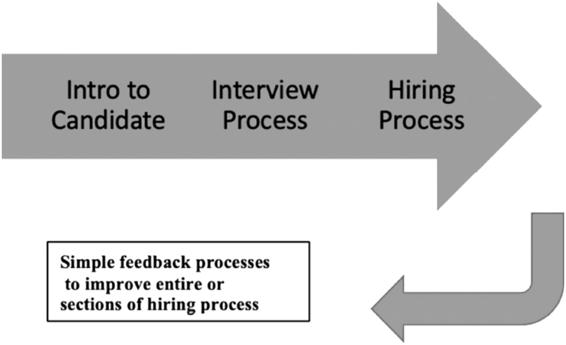
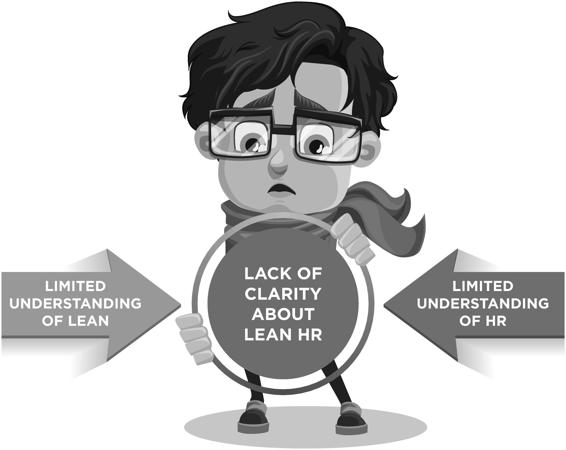
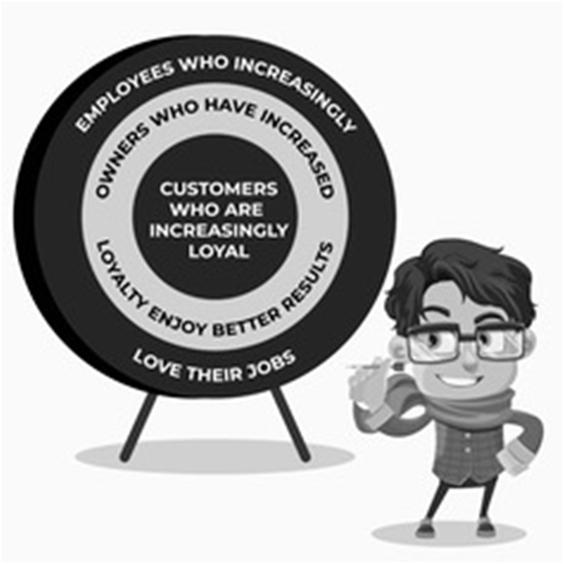

[ _**Lean Culture Elements and Implementations**_](./1-Cover.md#p13)

[ _Ability to Increase Customer Perceived Value_](./1-Cover.md#p13)

To increase HR’s value to the customer, you must work from the viewpoint of the department’s internal and external customers, which includes every one of HR’s constituencies. One way to assess customer value with internal service providers is to weigh whether they would choose the service you provide if they had to pay for it. In other words, organizations usually think of support functions as services provided gratis to internal customers, whether they add value or not. Simply asking, “Would someone pay for this service?” can help improve how or if HR renders that service. 

One way to illustrate this skill is to look at the entire organization as a long chain that leads to your external customers. Recognize that anyone working within the organization has a direct impact on the customer in some way. As such, the work of HR will significantly improve in terms of value when you keep in sight the needs of external customers. 

[ _Organizational Development Consulting Skills_](./1-Cover.md#p13)

Some of the Lean HR competencies involve some type of OD advisory work. These consultative relationships need to grow with each core function of the business, including sales, marketing, quality, finance, and operations. Internal guidance requires a constant awareness of the need to move beyond any transactional or compliance-focused roles that may interfere with internal client relationships. The primary consulting efforts should focus on the core functions, and that requires HR goals to match the main goals of both sales and operations. 

Consulting skills are a basis for partnering with other departments. To partner successfully, you need to develop integrated relationships with all other departments and fully understand each group’s current objectives, biggest struggles or problems, and its plans to accomplish goals and overcome obstacles. Building consultative relationships with each department involves a prowess for creating and maintaining productive collaborations. 

[ _Strategies for Optimizing Engagement_](./1-Cover.md#p13)

For Lean HR professionals, this competency involves knowledge of both the things that strengthen engagement and how to optimize those strengths 

 _Development of Lean HR Professionals_ ◾ **195**

through lean initiatives. As Lean HR develops expertise in profitable engagement, it becomes an advocate for understanding the value of lean well beyond cost savings. A significant number of HR professionals have utilized engagement surveys and related activities. But they need to develop an advanced understanding of the real factors that increase engagement and how that relates to improvement. [Chapter 12 p](id111)rovides information on improving engagement surveys. 

[ _Effective Change Management_](./1-Cover.md#p13)

Numerous areas of study cultivate in becoming proficient at driving successful change management strategies. HR professionals must understand when change management is needed and how to work with various stakeholders to agree upon an approach. Knowledge of different change management models and the tools for applying them is crucial to providing expert counsel. 

[ _**Inspirational or Empowering Leadership**_](./1-Cover.md#p13)

[ _Lean Leadership Competencies_](./1-Cover.md#p13)

Lean HR professionals need to be knowledgeable and proficient in lean leadership competencies. A range of resources can identify and define these competencies, including published materials, benchmarking other continuous improvement organizations, and tools, such as the Shingo Model. Even lean certifications shed some light on the necessary competencies. 

As a place to begin, here’s a list of lean leadership competencies:

◾ Understanding value in terms of internal and external customers; 

◾ Working through value streams or flow of work in a manner that is designed to create **pull** through the system; 

◾ Demonstrating an ability to standardize, stabilize, and sustain processes; 

◾ Problem-solving (e.g., root cause analysis, getting close to the task, databased analysis, and effective presentation of information); 

◾ Obtaining improvement through innovation and experimentation; 

◾ Providing a coaching style of leadership that focuses on the development of team members; 

◾ Practicing a long-term view and a systemic understanding of the organization. 

**196** ◾   _Lean Human Resources_ 

[ _Leadership Development Strategies_](./1-Cover.md#p13)

The previous set of competencies represents what you’d expect to find in traditional leadership, plus several new behaviors. Many of these skills require extensive training and development options, likely requiring greater investment than that provided outside of a lean workplace. 

Training topics that support these skills include various lean methodologies, emotional intelligence, dealing with conflict, extensive communication, and coaching. 

[ _Personal Growth and Development_](./1-Cover.md#p13)

Personal experience with growth and development is helpful, if not essential, to assisting others with their own evolution. Through intrapersonal work in several areas of my life and career, I’ve come to understand how people can change habitual behavior successfully. In general, people who are good at coaching others’ behavior have had some level of experience with personal reflection and development. 

For example, one obvious imperative is that Lean HR leaders exhibit above-average interpersonal communication skills. The professionals responsible for expertise in people matters must be exceptional in this area. These attributes include listening, confronting conflict effectively, and dealing with performance issues in a positive and supportive manner. Most of these skills can only secure an expert level with extensive training. 

[ _**Lean Methods**_](./1-Cover.md#p13)

A range of newly needed skills is related to lean implementations and often referred to as the “tools” portion of continuous improvement skills. 

A few key topics are the identification of waste and other opportunities for improvement, including value-stream mapping with takt-time observations, the use of kanban systems, and other core lean principles. Mastering these skills will significantly advance any professional’s ability to support business objectives for any function. HR professionals often are not included in this type of organizational training because it’s not evident how they could help reduce waste or improve processes. Yet, HR needs to become the voice of job design. HR professionals are well suited to observe how process changes impact jobs and other aspects of work. Also, HR professionals with strong training abilities can teach lean principles at all levels of an organization. 

 _Development of Lean HR Professionals_ ◾ **197**

In my first implementation of lean in a production facility, HR managers conducted Kaizen events to evaluate the facility layout and make vital process changes. HR located outside support people to teach everyone how to do Kaizen activities and organized the timing of the events. After observing how the outside consultants facilitated these activities a few times, HR was able to take over that function. The operations manager was the customer of the work and the champion of the effort. HR assisted his efforts by locating the external resources used to create changes. The facility manager was pleased to receive their help in achieving his goals of productivity improvement. 

[ _Identification and Elimination of Waste_](./1-Cover.md#p13)

Understanding waste is considered a fundamental concept that creates the right mindset for a high-performance workplace. Competency includes knowing methods for identifying non-value-added activities and taking steps to remove those deficiencies. And don’t forget the eighth waste, which refers to underutilized skills and talents and is the hallmark of HR contributions. 

[ _Ability to Stabilize and Sustain Standard Work_](./1-Cover.md#p13)

A basic premise of improvement is establishing a baseline from which to work. Standardized work isn’t unchanging, instead, it creates clarity around the steps taken to complete a process. Competency involves knowing how to measure the current state of any work process and establish the results as the opening standard. It’s also important to establish a standard for the desired target state. Sustaining standards means monitoring adherence to verify if changes need to be made, whether that be to the standard or to how people are following it. 

[ _Team-Based Problem-Solving_](./1-Cover.md#p13)

HR can be a primary contributor in delivering both problem-solving and team skills training. The new vision for HR calls for you to seek out new ways to learn and to practice team-based improvement skills regularly. HR 

professionals need to make sure they get involved in any improvement activities occurring within the organization. Aside from participating with problem-solving teams as a member, pay attention to the skill areas that HR 

needs to support in terms of team leadership, facilitation, and membership. 

**198** ◾   _Lean Human Resources_ 

_**Methodical team-based improvement**_ can start with lean models, such as A3, Six Sigma (DMAIC), Agile (SCRUM), or others. Visual management is typically involved with these approaches. 

_**Team leadership skills**_ include knowing how to create both temporary and long-term teams, along with how to form, maintain, and complete team activities. 

_**Team membership skills**_ grow from active participation in team environments. 

_**Facilitation skills**_ involve the ability to support team processes as a neutral facilitator of team dialogues, problem-solving, and other team processes. 

[ _Strategy Deployment_](./1-Cover.md#p13)

Most lean organizations use an approach to strategic planning that then cascades through the organization. Some organizations refer to this as Hoshin Kanri and make it a hallmark of how they involve everyone in achieving the goals of the organization. Communication of these goals is a critical challenge. HR has a distinct role to play to ensure everyone receives and understands the information and recognizes their role in achieving the goals. As you’ll notice, effectively communicating overarching strategies and how they cascade through the organization is also a key engagement strategy. Anything HR does to assist strategy deployment has a substantial impact on the overall success of the organization. 

[**HR is Stepping into new Roles**](./1-Cover.md#p13)

In addition to building the new skills HR professionals need so they can contribute more to the organization as a whole, HR should be filling new roles. These roles may be strategic within a given HR role or provide a working foundation in other functions. 

[ _**Stronger Strategic Roles**_](./1-Cover.md#p13)

HR professionals achieve more fruitful results when they have a strategic presence. Focus on ways you can help your organization increase revenues and decrease costs. First and foremost, ensure that you clearly understand your business’s current strategy, the key objectives, and the execution plans to achieve the strategy. 

 _Development of Lean HR Professionals_ ◾ **199**

HR professionals may do well to build their strategic planning facilitation skills to support this work. Facilitating such processes helps HR professionals become more involved in the business. 

Next, for each strategic objective, consider what value you could bring to the process in terms of recruitment, training, accountabilities, recognition, and rewards. Consider whether more support from HR would further advance any strategies under execution. Businesses with strategies, such as building market share, competing through innovation, and lowering costs, all have components that would benefit from the input of professionals with the expertise to affect people. How can your HR department contribute to selling more products or services, driving down costs, or directly impacting the talent pool that supports these areas? 

[ _**A Champion for Improvement**_](./1-Cover.md#p13)

Much of the support needed to change an organization’s culture resides in HR programs. Although these efforts are in partnership with other teams, implementation requires active and significant HR involvement. As a business partner, HR has an opportunity to step into leadership roles and champion continuous improvement. This role calls for more than mere participation. Obviously, to play a lead role, HR professionals need to be inspired to lead in building a culture that will create better results. 

[**Development Plans for Lean HR Professionals**](./1-Cover.md#p13)

As with most approaches to creating development plans, progress begins with evaluating the skills and experience of the individual against the desired competencies. The rating can be done as a self-rating, by a manager, or by key internal customers. The results are most helpful when accompanied by feedback discussions that include specific examples of accomplishments and follow-up steps for personal growth. It’s also useful to know before reviews which skill areas merit higher priority at a given time or which skills of any individual are in demand for other key functions. 

**RESOURCE**

**Obtain** a tool for assessing Lean HR skills and supplemental training materials a[t www.leanhrresources.com. ](./http___www.leanhrresources.com)

**200** ◾   _Lean Human Resources_ 

[ _**Options for Developing Lean HR Skills**_](./1-Cover.md#p13)

[ _Seek Out Educational Institutions_](./1-Cover.md#p13)

Education for HR professionals can include general business classes to build the ability to support strategic initiatives and fully participate in cross-functional teams. Coursework and certifications are also available in the fields of OD, organizational behavior, lean, leadership, training and development, systems thinking, and more. Anyone who wants to excel at Lean HR should seek advanced levels of education to build expertise and create meaningful transformations in the workplace. 

[ _Benchmark Yourself: Learn from Other Organizations_](./1-Cover.md#p13)

Benchmarking is a cornerstone of continuous improvement cultures. This practice involves locating organizations that use best practices worth learning. It also provides a way to build momentum when you add the methods of other companies to bring program designs forward faster. Some associations related to the field of continuous improvement may be of assistance in locating these organizations. 

[ _Work with Mentors_](./1-Cover.md#p13)

This area of management is not easily obtained from educational institutions unless you enroll in an MBA program or otherwise invest a significant amount of time. Another route for HR professionals is to seek information internally in your organization through interviews, which help you gain an understanding of the strategies pursued, as well as possible alternatives or prior failures. Arranging conversations that focus on key strategies in the business garner underlying and related information that creates a foundation for accompanying HR strategies. 

Once you’ve conducted interviews with your organization’s internal subject matter experts, you can use other methods to learn from their experiences. 

For example, you could research industry and related professional associations, seek additional internal mentoring, and look for other educational or training opportunities to develop a working knowledge of business strategies. 

[ _Join Professional Associations_](./1-Cover.md#p13)

A range of professional associations provide avenues for development and skill-building in areas such as strategy, general HR, training, organizational 

 _Development of Lean HR Professionals_ ◾ **201**

development, and others. To build business skills and keep abreast of industry standards, you might find it advisable to join industry-related associations. Membership in these associations provides opportunities not only to attend educational functions, but also to mingle with other professionals, which provides additional opportunities for benchmarking and mentoring. 

**RESOURCE**

For additional resources on assessing Lean HR skills and skill-building and training materials, go t[o www.leanhrresources.com. ](./http___www.leanhrresources.com)

[**Building Lean HR Skills through Survey Processes**](./1-Cover.md#p13)

As the skills of Lean HR develop, a critical question arises. “How do I measure improvements within areas of Lean HR?” 

Given the nature of some people processes (e.g., career satisfaction, engagement, and access to learning), surveys provide one means to gauge progress. 

Beyond the challenge of measuring people processes, this chapter highlighted the need to build competencies in the area of business acumen, cultural elements, including engagement and change management, lean leadership, and other lean methodologies. To further understand measuring progress and building Lean HR skills, the next chapter will highlight survey processes as an advantageous yet complex measurement option. When survey processes are optimized, they are uniquely suitable for improving results. However, many organizations are reluctant to perform them, as they find they lack the skill sets for effective utilization. Our goal will be to focus on what a productive survey entails to prevent organizations from walking away from these valuable tools. 

**CASE STUDY: BECOMING A LEAN LEADER**

The organization had been working to implement a lean strategy for the last several years. However, HR had little involvement in and saw no relationship to the work. As the HR person for the facility, Cathy came to realize her career in HR would be limited if she didn’t strengthen her overall business capabilities and strategic value. 

**202** ◾   _Lean Human Resources_ Over several years, she increased her business acumen by taking on some projects outside the HR area, even as she maintained her HR position. As she became more knowledgeable about the business, strengthening lean capabilities became her focus. 

Cathy’s initial obstacle was that the operations team wasn’t looking for her input and often failed to involve her. She felt frustrated and left out, as she really wanted to be more involved and valued. Yet the operations team seemed determined to keep her in a support or administrative role. 

Wisely, Cathy set aside her frustrations and began making suggestions on how she could help the lean initiative with things such as:

◾ Developing communications to help the team members better understand continuous improvement; 

◾ Revising the awards programs to reflect accomplishments related to improvement; and

◾ Identifying additional training resources to support their strategies. 

Within a year, the overall leadership team saw Cathy as one of the key leaders of their lean strategy. She wasn’t in charge of it, but they unquestionably viewed her as someone making a big difference. 

During the same time frame, Cathy began adopting continuous improvement practices within the HR area, which continued to build her skills. As she experienced what it was like to teach lean to her team and do team-based problem-solving, she could clearly see the obstacles the operations team and the broader organization were facing. 

Over time, Cathy’s team became an integral part of the operations team in addressing critical operational challenges, even as they continued to focus on HR improvements. 

**SUMMARY OF KEY POINTS**

1\. Since lean increases the value of people, it heightens the need for HR 

to be a major champion of the effort. 

2\. Overcoming the most common obstacles requires the assistance of HR, which requires HR professionals to have an advanced skill set. 

 _Development of Lean HR Professionals_ ◾ **203**

3\. The competencies for Lean HR include elements of business acumen, lean cultures, lean leadership, and lean methodologies, as detailed in 

[Table 11.1](./3-Begin_by_Developing_Lean_Leaders.md#p217). 

4\. With growing competencies, HR professionals can take on new roles that are generally more strategic and become visible champions for improvement. 

5\. Creating a development plan based on the Lean HR competencies needed for a particular organization is a helpful step in establishing the current situation and identifying any gap that needs closing. 

6\. Options for developing lean skills include seeking out educational opportunities, benchmarking other organizations, finding a mentor, and joining professional associations. 

**STRATEGIC QUESTIONS FOR HR**

1\. Which skill sets that you’ve noticed would help support your professional development or assist your organization’s improvement efforts? 

2\. What is the skill level of your current HR team and how prepared are they to support a lean strategy for your organization? 

3\. Which skills would improve how you or your team contribute to results? 

**LEAN HR IMPLEMENTATION ACTION STEPS**

1\. Meet with your internal customers and ask which competencies they would like to see augmented within the HR department. 

2\. Take steps to identify the competencies you want to see in your team and identify the gaps that must be closed to build those competencies. 

3\. Look into educational programs, potential mentors, and professional associations that would be helpful to you and your team in building necessary skills. 

Lean Human Resources

Lean HR Survey Processes

[ _**Chapter 12**_](./1-Cover.md#p13)

[**Lean HR Survey Processes**](./1-Cover.md#p13)

After years of pursuing a lean culture, David was determined to get a handle on the progress his company had made toward achieving its vision. Conversations about the culture changes had grown stale, and it was difficult to see where progress stood. David worked with an external vendor to conduct a survey measuring how leadership behaviors aligned with the company’s vision. Not surprisingly, some people were experiencing fairly traditional, top-down leadership behaviors, while others enjoyed profoundly empowering, less controlling behaviors corresponding with their high levels of engagement. As David had intended, the survey showed specific areas of progress. The survey results also detailed which behaviors to promote and which to eliminate. After David ran a second survey a year later, it became evident where the company was making progress and where it was stuck. The resulting data helped the company make even more progress in establishing its desired culture. The process also stimulated dialogue between leaders and workers and surfaced difficult discussions about the areas where leadership wasn’t exhibiting model behaviors. 

[**Difficulties in Measuring the Work of Lean HR**](./1-Cover.md#p13)

Many areas of work associated with HR can be difficult to measure. How do you measure culture? How do you gauge how your internal customers feel about HR services? How can you tell whether leadership training is effective? How can you determine whether your team members are engaged and, if not, what to do about it? 

Surveys can measure the success of HR programs and initiatives, especially where it may be difficult to demonstrate success with any other **205**

**206** ◾   _Lean Human Resources_ means. Successful administration of surveys is particularly important to Lean HR professionals who want to get a handle on the implementation of a lean culture (or any other culture change). In fact, surveys can help measure any topic. Their results reflect individuals’ perspectives and, most importantly, how understanding those perceptions offer the organization opportunities to advance strategic objectives. 

Poorly executed surveys limit their purpose as a measuring tool and garner criticism about their usefulness. Used well, however, they can be invaluable. 

This chapter provides an overview of the use of cultural, employee satisfaction/engagement, and customer surveys. It explores a range of survey purposes and the basics of effective survey processes. 

[ _**Culture Surveys**_](./1-Cover.md#p13)

A culture survey assesses the current attitudes and behaviors of employees. 

As a tool for improvement, culture surveys begin by evaluating the current condition and can provide information about desired goals as well. 

Measuring the progress of lean culture change efforts is essential, especially when organizations invest significant resources in a transformation. 

Some organizations prefer to work with outside vendors that provide tools to conduct culture surveys. Others feel an external survey tool may not fit well with their specific areas of interest, so instead, create a custom survey. Either way, you should develop an approach to a culture survey that best supports your organization’s cultural initiatives so you can gauge the current state of each element and points of discomfort or issues that generate employee disconnects. Here are a few topics that a culture survey can measure concerning your employees’ attitudes or views:

◾ How they relate to internal and external customers; 

◾ Their role in improvement efforts; 

◾ Aspects of their participation in the workplace; 

◾ How they see processes that support the flow of work; 

◾ Their ability to solve problems as a team; 

◾ Their understanding of visual goals; 

◾ How inspired, or not, they feel their leadership is. 

For example, I worked with an organization that focused on cultural elements, including enhancing innovation, developing an attitude of customer 

 _Lean HR Survey Processes_ ◾ **207**

service, providing premium products and service, and implementing the golden rule in the workplace. They created a custom survey of fifteen questions exploring each of these topics. From the responses, they developed a baseline of employee attitudes and highlighted areas needing attention. They then conducted follow-up activities, which provided significant opportunities to further gauge how well workers understood the culture. For culture change to be meaningful, it’s essential to understand what employees are experiencing regarding specific culture changes. Good intentions are not enough to create the desired culture. 

[ _**Employee Engagement or Satisfaction Surveys**_](./1-Cover.md#p13)

With their focus on employee concerns, engagement or satisfaction surveys can be accomplished separately or in unison with culture surveys. 

Satisfaction surveys measure employee morale levels overall and canvass for particular issues related to satisfaction to identify opportunities for change. Engagement surveys are similar, but focus on the elements that drive engagement versus how employees feel about something. Either of these survey types can provide an initial baseline. Changes noted in the results of successive surveys give some indication of whether efforts to boost employee morale are effective. 

Surveys also help HR, as a business partner, validate HR interven-tions and programs in terms of increased satisfaction levels. An underlying assumption of employee surveys is that happier or more satisfied employees are more productive, yield a lower turnover rate, and are more engaged in their work. 

[ _Internal Customer Feedback_](./1-Cover.md#p13)

These surveys are often short and customized to a particular set of needs. 

To the degree that HR is a service center, internal customer surveys are a hugely helpful tool to gather feedback about the services it provides. 

Whether it be a one-time process or daily feedback, these evaluations support the idea that the voice of the customer is the guiding force to how they want HR to service their needs. 

For example, suppose your organization implemented a new supervisory training program. How could you measure the success of that program? 

Surveys allow HR to measure how managers treat employees (from the employees’ point of view), one method to assess whether employees are 

**208** ◾   _Lean Human Resources_ experiencing a change in their supervisors’ abilities. This is an opportunity for supervisors to gauge the effectiveness of their skill changes. 

[ _**External Customer Surveys**_](./1-Cover.md#p13)

In alignment with the value placed on customers, external customer satisfaction surveys are another tool for improvement. They measure the level of customer satisfaction and provide a mechanism to gather information about your customers’ concerns, interests, problems, and needs. Potentially, customer surveys support strategic planning, marketing efforts, or customer service improvements. They can also address specific concerns or proactively help your organization understand your customers better. 

As with employee surveys, a genuine understanding of the feedback requires more than analyzing ratings. As with employee surveys, HR professionals can use their survey and communication skills to partner with the sales force to conduct customer surveys and extrapolate ways to enhance services and improve customer satisfaction. The elements of increasing external customer satisfaction are the same as those for increasing internal customer satisfaction. 

[**Surveys Do More than Measure**](./1-Cover.md#p13)

While surveys measure attitudes, they can also help an organization build relationships, foster leadership skills, and improve the workplace. The ratings reveal current attitudes in comparison with past results, thus recording any changes in attitudes. Although surveys are not an exact science, the process is well worth the effort. In general, surveys present an opportunity to collect both quantifiable and qualitative information. In other words, you can convert attitudes and feedback into numerical data and use comments, interviews, or focus groups to gather qualitative information. When done correctly, the survey process includes several levels of listening that I’ll cover here as well. 

[ _**Build Stronger Relationships**_](./1-Cover.md#p13)

All three types of surveys can build relationships, whether they be with internal team members or external customers. Building relationships requires trust, respect, effective communication, empathy, positive 

 _Lean HR Survey Processes_ ◾ **209**

interactions, and collaboration. By definition, survey processes can significantly support every aspect of building relationships, an important component of lean enterprises and team-based work environments. The entire survey process, from design to conclusion, presents a spectrum of opportunities to collaborate and communicate. Done effectively, trust and respect between surveyor and surveyee will result. Maintaining an awareness of the relationship-building aspects versus focusing solely on gathering data ampli-fies the benefits of the survey process. 

[ _**A Tool for Fostering Leadership Skills**_](./1-Cover.md#p13)

Leadership skills, especially in lean cultures, are also well served by survey activities. Leadership includes the need to develop team members, gather and utilize employee suggestions and ideas, and devise regular cadences for improving all key processes. Moreover, the fact that supervisory relationships are fundamental to employee engagement makes practicing these skills especially valuable. The survey process provides a unique opportunity for HR to support its leadership teams in practicing a full spectrum of skills in a focused manner. 

[ _**Feedback for Improvement**_](./1-Cover.md#p13)

Surveys easily lend themselves to the continuous improvement process. The results may reflect serious problems needing attention or simply provide insight into previously unidentified needs. Often when I come into a situation involving issues between people, the listening phase that follows surveys can identify the issues driving discord. 

One function of Lean HR is to establish management systems for all key HR processes. As such, it’s imperative to instill measurement processes to perpetuate learning and improvement. [ Figure 12.1](id111) provides an example of how survey feedback provides critical chances to learn and to improve the hiring process as a whole or in part. [ Table 12.1 pro](id111)vides an example of a quick survey to support such a process. 

I often suggest that people keep a close eye on all the service surveys or rating systems they receive from airlines, hotels, restaurants, etc., for examples of how service industries use feedback to improve over time. HR is certainly a service provider and can use these models to enhance its understanding of internal customers’ experience of its services. 

**210** ◾   _Lean Human Resources_ 

**Figure 12.1 example survey cycle for recruiting**

**table 12.1 Sample Hiring Survey**

_Hiring Feedback Survey_ 

_Rating_ 

_Rate your experience below:_

_1–10_

1\. First contact

2\. Phone screen

3\. Interview arrangements

4\. Interview process

5\. Hiring process

Comments

Unfortunately, organizations (or departments) often fail to recognize the identified cues and simply never address the issues. Failing to appreciate the purpose and value of surveys leads to several dangers, as you’ll explore next. 

[**Dangers of Poorly Handled Surveys**](./1-Cover.md#p13)

For many organizations, the survey process is one of the only two-way communication vehicles in the workplace. I often find that managers don’t see the survey tool as necessary because getting the current workload done hasn’t required them to understand employees’ viewpoints. I can’t empha-size enough that surveys are a good foundation for measuring your progress through communication. The survey process also provides a method to 

 _Lean HR Survey Processes_ ◾ **211**

measure how well changes to HR programs are working from the employees’ viewpoint, which, after all, is the voice of your internal customer. The most common problem is that surveys are treated more as a check-the-box event than as the opportunity they are. This mindset leads to mishandling the process and results in new damage or issues. 

[ _**Damage to Relationships and Credibility**_](./1-Cover.md#p13)

On too many occasions, relationships are damaged by poor follow-up after surveys. I’ll ask someone in leadership or management, “How would you feel if I asked you a question and then just walked away? Or if you told me something was seriously wrong and I ignored your comment?” What goes on after compiling survey results is often invisible to those surveyed. 

As a result, they don’t know if anything they suggested was discussed or changed, which quickly leads to employees feeling ignored or disrespected. 

Some organizations might say, “At least we asked.” However, asking and not responding is likely worse than not asking at all. 

For example, I’ve talked with employees who completed surveys about what needed improvement in their workplace. The results went unpublished for over six months and nothing happened with the information—at least nothing management formally communicated. Understandably, the employees who identified problems, but then saw nothing done about them, became even less trusting of their leadership team. The team may have actually discussed the issues and taken some steps. Since they didn’t communicate that to the employees, the damage was done. 

[ _**Surveys Become Unmanageable**_](./1-Cover.md#p14)

It’s no wonder some HR managers become completely overwhelmed with how to manage survey results and fully engage their leadership teams. 

Survey responses contain a myriad of details for review. There are pages of comments to consider, lists of ideas for how to address problems (all of which require additional follow-up), and countless questions that link to a wide variety of work areas. If you don’t narrow your priorities, survey follow-up can become a part-time job that no one has the time to handle. And if the accountabilities for the survey processes end up unduly allocated to HR, you’ll miss out on the partnering that’s necessary to ensure the organization takes value-added steps. 

For example, Jill is the HR manager for a company that wants to measure employee engagement. She hires a vendor to conduct a fifteen question 

**212** ◾   _Lean Human Resources_ survey of all employees. Forty-five days later, the vendor delivers a bundle of detailed reports that include statistics on each question grouped by location, salary grade level, and years of service-related levels. The comments alone cover twenty-two pages and run the gamut of issues and topics. The HR 

managers spend hours poring over the information and facilitating team conversations about the results. However, many of the teams are overwhelmed by the volume of data. They have no idea how to determine what to take action on and what to set aside. Despite their good intentions, they never systematically address the results. Jill is disappointed because she’s trying to help, but the teams don’t seem to take seriously the issues raised or accept their responsibility to address them. 

[ _**Fail to Achieve Business Results**_](./1-Cover.md#p14)

Finally, surveys may measure the wrong things or measure too many things to add value. It’s not uncommon to see surveys that include forty to fifty questions, but no clear purpose for the application of the information collected. From the beginning, you should clarify the strategic objective of the survey and know how to employ the results. Also, assess how well the questions measure the intended parameters. 

For example, a company runs a survey of thirty-five questions covering a long list of topics, including communication, lunches, building cleanliness, safety, technology, shift meetings, supervisory relationships, holiday celebrations, benefits, compensation, overtime, productivity measures, parking, weather policies, attendance and tardiness issues, and more. Managing the results becomes impossible, in part because it’s difficult to separate those that matter from those that are just interesting information. 

[**Basics of effective Survey Practices**](./1-Cover.md#p14)

Aspects of effective surveys fall into categories that improve how they measure results, build relationships, and address critical issues. 

◾ The survey design should reflect strategic alignment; 

◾ The process should include active listening, which builds relationships, trust, and respect; 

◾ The follow-up phase should allow for multiple cycles of two-way communication; 

 _Lean HR Survey Processes_ ◾ **213**

◾ The organization should ensure sufficient and comprehensive manager involvement; 

◾ The managers and employees should take the essential step to convert issues into actions. 

[ _**Reflecting Strategic Alignment**_](./1-Cover.md#p14)

It’s critical to get the survey design right. What is the intended purpose of the information? There’s no reason to collect information you don’t need and won’t take action on. For example, don’t ask employees about issues they have little interest in understanding. In the case of culture surveys, it’s imperative to align questions about the desired culture with some sense of how progress in creating that environment will impact the advancement of the overall organization. 

[ _**Effective Listening**_](./1-Cover.md#p14)

Many managers need to build more effective listening skills for the follow-up feedback sessions to learn more about how people in their facilities feel about their workplace. I often find that managers aren’t comfortable with employees making suggestions or they want to immediately respond with explanations about why those suggestions won’t work. However, if you ask people for feedback and then, at the first suggestion, tell them why their opinions are wrong, they will stop participating. Many managers need coaching to learn how to ask questions and remain open-minded about evaluating ideas before responding. 

Some managers become defensive about decisions, rather than listening to employees who may question the reason for a decision. Follow-up meetings allow managers to build relationships by using the written feedback as the start of a communication loop where employees share thoughts, ideas, and concerns and where management actively listens to them. 

[ _**Multiple Cycles of Communication**_](./1-Cover.md#p14)

Ratings and comments on survey forms provide a basis for additional conversations with employees. These may occur in small group meetings to learn more about why the ratings are at indicated levels and to co-create actionable next steps. Because the scores themselves are only a numerical indicator of employees’ responses—the first level of listening—you need 

**214** ◾   _Lean Human Resources_ actual conversations—the next level of listening—to gain insight. Comments lack real context unless explored for meaning through discussion, which, in turn, provides practical examples and reveals what respondents would like to see changed. 

**Optimizing people’s abilities in the workplace requires a range** **of two-way communication options.** 

[ _**Comprehensive Leadership Involvement**_](./1-Cover.md#p14)

Almost any significant change in a work environment requires alignment at all levels of leadership. Frequently, the results of a survey are discussed in subgroups within a specific work area or leadership level. This thwarts efforts to make improvements, as there is an inadequate pool of alignment to effect comprehensive and consistent changes. 

And taking on too many issues makes this worse. Once the number of problem areas narrows, it becomes clearer how the team must work together to make consistent and meaningful changes. And I’ve never met a work team that formed with the expectation of creating inconsistent and insignificant changes. Without a diligent approach from all concerned parties, survey processes can do more damage than good. 

Many HR managers note that the responsibility to interpret survey results and decide on appropriate actions is overly focused within HR and needs to be shared with the appropriate leaders and work teams. This situation will only change when HR works differently with leadership teams in exploring the usefulness and potential pitfalls of survey processes. Shifting to a shared sense of responsibility requires sharing the survey planning process and being open to all viewpoints of the leadership team. 

[ _**From Issues to Actions**_](./1-Cover.md#p14)

A series of logistical steps are required for surveys to yield desired results. 

These are (1) taking feedback and turning it into action, (2) ensuring the focus of activities is sufficiently narrow to make them achievable, and (3) adequately communicating information so team members feel respected. 

While leaders have the best intentions, day-to-day responsibilities often distract them. They lose track of the survey follow-ups and relevant actions. 

Other times, they fail to make critical choices on where to focus, which 

 _Lean HR Survey Processes_ ◾ **215**

leads to failure in handling survey results responsibly. These factors often lead teams to think survey processes don’t add value, which is only true if there is no commitment to execute the survey effectively. 

**RESOURCE**

**Obtain** resources on conducting better surveys a[t www.leanhrresources.com. ](./http___www.leanhrresources.com)

[**Survey Processes Can Be Key to Lean Cultures**](./1-Cover.md#p14)

This chapter has covered the purpose of surveys and how they are used for building relationships, creating improvement, and even practicing critical leadership skills. As a reference[, Table 12.2 h](id111)ighlights how surveys help promote a lean culture. 

**table 12.2 Surveys Reflect Seven Lean Practices**

_Lean Practices_

_How Surveys Contribute_

Surveys are a main way to gather information on how 

**1**

customers experience services, which you can use to increase Focus on customer

value-added activities. 

**2**

Measurable 

Surveys provide endless options for measuring improvement. 

improvement

**3**

Lean HR would be strongly encouraged to use survey 

Foster 

processes to gather input into process improvements. 

participation

**4**

Utilizing standard processes for handling surveys can greatly Standardize 

improve the benefits of using them, especially with being able processes

to sustain good practices over time and in varying conditions. 

**5**

In terms of HR management systems, survey processes 

Solve problems 

provide feedback loops that generate information for 

methodically

improvements over time. 

Posting survey results and action plans visible displays can do **6**

much to increase team members’ understanding of how 

Utilize visual 

information is being used. The same can be said for external management

customers. 

**7**

Surveys can strengthen leaders’ ability to listen, work with Lead through 

team members on suggestions (coaching), and reflect a 

inspiration

commitment to team member development. 

**216** ◾   _Lean Human Resources_ **CASE STUDY**

**LEFT HOLDING THE BAG**

As Julie faced another annual engagement survey, she realized that the efforts of the past year were not likely to change the upcoming year’s results. She was deeply disappointed in herself for her inability to make lasting changes. Yet, when I considered how her leadership team viewed the survey, it was obvious Julie found herself holding the bag for what should have been an overall leadership responsibility. 

Like many HR professionals, Julie considered herself responsible for running the survey and for the results and any improvements. There were a number of reasons why she wasn’t successful, most having to do with how she worked with her leadership team. She became aware that they needed to reduce the area of focus, involve everyone in the areas of priority, and ensure all levels of leadership reached alignment for any changes. (Each one of these tasks can be daunting, but getting a handle on all three improvements makes all the difference.)

Julie refocused her efforts on how she worked with the leadership team. 

She made it clear to leaders that survey results were mirrors of their relationships with employees. With her operations leadership team, she organized discussions on their views of the survey process and what they believed it might do for them. It was helpful to learn more about their needs. She collaborated with leadership on their next steps. The team established that the feedback would serve them well in achieving results, but that handling it poorly would be too damaging. That decision called for their full commitment. 

Julie’s role became one of guiding the team rather than taking ownership of the work. The following year, she helped the team focus their efforts, communicate their progress regularly, and ensure that the items they agreed upon came to the team’s attention on at least a monthly basis. The results that year were much better. More importantly, Julie had learned a valuable lesson about not assuming sole responsibility for a team accountability. 

**SUMMARY OF KEY POINTS**

1\. Measuring some aspects of people’s attitudes can prove to be problematic. 

 _Lean HR Survey Processes_ ◾ **217**

2\. Surveys can measure culture, employee engagement/satisfaction, customer satisfaction, and a range of other scenarios where you want to understand internal and external customers. 

3\. Survey processes present opportunities to build relationships, identify issues that need attention, and practice leadership skills. 

4\. When survey results are not communicated or visibly acted upon, they can easily do more damage than good. 

**STRATEGIC QUESTIONS FOR HR**

1\. What opportunities do you have to utilize surveys more effectively? 

2\. Where do you see pitfalls that can damage relationships if survey processes include poor follow-up? What are the opportunities for improvement? 

3\. How can you use small, short surveys to understand your internal customers’ feedback on key processes better? 

**LEAN HR IMPLEMENTATION ACTION STEPS**

1\. Examine the usefulness of all the current types of surveys your organization uses, including culture, engagement/satisfaction, internal customer feedback, and external customer satisfaction. Identify what seems to be effective and where pitfalls lie. Consider possible ways to improve the survey processes. 

2\. Evaluate opportunities to use surveys for gathering internal feedback to increase value within key HR processes, such as hiring processes, training and development topics, performance reviews, or compensation programs. 

3\. Meet with operational or other business partners to explore how they view survey processes, especially any they complete with HR’s help. Use the discussion to find out how they see potential value being created from survey results. Ask if they have concerns about the use of surveys. 

**Section V**

[**SUMMARY**](./1-Cover.md#p14)

[**V**](./1-Cover.md#p14)

If everyone is moving forward together, then success takes care of itself. 

– **Henry Ford**

[Section V c](id111)ompletes the review of Lean HR with a focus on the future. 

[Chapter 13](id111) steps back to consider the challenge ahead for Lean HR to achieve the potential for lean initiatives. The concept of a Triple Win as a result of increased customer, employee and organization benefits is introduced. [ Chapter 14 f](id111)ocuses on the various groups or functions that need to come together to assist with building the capabilities of Lean HR. 

This section shifts the focus from inward on the HR team to an outward one that includes internal and external customers, employees, and the organization as a whole to realize the true benefit of Lean HR. 

Lean Human Resources

The Big Picture

[ _**Chapter 13**_](./1-Cover.md#p14)

[**the Big Picture**](./1-Cover.md#p14)

At a conference several years ago, a highly respected lean expert asked me a revealing question: “So what exactly is the role of HR in a lean transformation?” The nature of the question indicated that this individual, despite his considerable exposure to lean workplaces around the world, had not seen enough involved HR teams to know the answer. 

Over time it’s become abundantly clear to me that many people in the lean community are still oblivious to the link between HR and continuous improvement. And I’ve often found myself wondering why HR teams are still so often uninvolved in the heart of improvement strategies. 

The lack of clarity about the role of HR in lean transformations is two-pronged. First, lean, as a concept, is significantly underestimated, which points out the need to fully grasp its people side. Second, HR, as a function, struggles to overcome traditional perceptual barriers to increasing its strategic value. To make matters worse, individuals with expertise in HR often have little background in promoting HR’s potential contributions to continuous improvement cultures. 

Fortunately, Lean HR represents a series of solutions that rise above these concerns and presents a way to motivate a workforce to reach a level that will positively impact the workforce, the customer base, and the ownership’s interests. In this chapter, I’ll provide a look at the big picture, covering the problems that lead to a lack of clarity and the other promises of Lean HR that will come true when the disciplines of Lean HR are in extensive use. 

**221**

**222** ◾   _Lean Human Resources_ 

**Figure 13.1 Why organizations don’t understand Lean HR**

[**Limited Understanding of the Potential of Lean**](./1-Cover.md#p14)

While interest in lean and other improvement practices remains consistently strong, many businesspeople feel the benefits of these endeavors are often elusive and the results less than desired or expected. The following are a few reasons why the value of lean implementation is often so much less than what’s hoped for and, more importantly, much less than what’s possible. 

[ _**Lean Is Limited to Cost Savings**_](./1-Cover.md#p14)

If you ask if the typical organization understands lean, the answer, all too often, is that it’s a way to reduce costs or remain cost-competitive. As discussed i[n Chapter 3](./1-Cover.md#p66), this view is also associated with organizations limiting their continuous improvement initiative to activities or events specifically focused on reducing costs. 

Less often stated is that lean has to do with developing and involving the entire workforce so workers can improve the operation of the organization in a manner that positively impacts financial results in several areas. 

One reason continuous improvement efforts remain largely underestimated is businesses’ limited exposure to those companies that achieve successful 

 _The Big Picture_ ◾ **223**

overall outcomes. Another is that understanding how developing skills over time to drive increased benefits is not part of the discussion. This lack of knowledge is not likely to be rectified unless HR gets involved in the conversation. 

For example, I witnessed a lean transformation involving a CEO con-vinced that the purpose of such efforts was strictly to reduce costs. People were assigned to audit the savings to ensure the focus on improved work processes was delivering dollars and cents to the bottom line. Yes, the company was interested in developing workers who could identify waste, solve problems, and understand the needs of the customer, but those efforts weren’t a business imperative. Later, when other priorities put improvement efforts on the back burner, that decision was seen as simply moving the company focus from cost savings for awhile. 

Though saving money is one aspect of lean, it’s unwise to make it the sole purpose for implementation. The elimination of waste in a few areas is significantly suboptimized unless the entire workforce becomes involved with improving the work of the organization. 

[ _**Leaders Have a Simplistic Concept of a Lean Mindset**_](./1-Cover.md#p14)

One of the broader descriptions of a lean culture is that it’s a way to _think_. 

While I agree that moving beyond the tools and events equates in some ways to how people think, this still falls short of fully appreciating the potential value. Lean, as a mindset, is difficult to put into concrete, actionable terms, so it doesn’t provide an easy way to engage the larger workforce. Most descriptions of lean cultures, including those about developing a continuous improvement mindset, fail to describe the richness of the experience. There must be a far more dynamic way to attest that lean can exponentially change results through how people are motivated. This impetus to engage in lean cultures comes from the enhanced skills people build on the journey and through their desire to contribute to the organization’s success. 

It’s essential to correlate the positive experiences of lean with how people live and work, not just how they think. In other words, having a fully participative work environment changes the very experience of work and the quality of life. 

Lean HR practices provide a clear picture of what it means to develop a lean culture. If internal customer happiness and well-being are the primary desired results, achieving that state will result in markedly higher profits and demonstrate the reason to expand investment in continuous improvement. 

**224** ◾   _Lean Human Resources_ 

[ _**Companies Are Oblivious to the Benefits of Engaging in**_ ](./1-Cover.md#p14)

[ _**Lean Initiatives**_](./1-Cover.md#p14)

Lean can absolutely increase the engagement of any workforce. Yet, I regularly encounter organizations pursuing operational excellence, but with their main focus on getting orders out the door more efficiently or on designing better work processes. Many of these organizations have little interest in addressing the significant levels of disengagement within their workforces. 

If tolerated for any length of time, the malady becomes so ingrained that most people don’t question, much less try to change, this mentality. Until organizations really understand that lean fundamentally represents a way to involve 100% of the team in improving the work or the organization, the process and goals set for results will be largely undervalued. 

[ _**Leaders Underestimate the Risk of Getting Implementation**_ ](./1-Cover.md#p14)

[ _**Wrong**_](./1-Cover.md#p14)

One form of evidence that reflects how badly organizations underestimate lean’s potential business impact is that the damage from doing it wrong gets misjudged as well. People often fail to comprehend how their actions related to poor handling of continuous improvement negatively impact people. 

Without realizing it, they do harm when they do things like:

◾ Ignore suggestions from team members or tell them their ideas won’t work without even hearing the reasoning; 

◾ Allow supervisors who treat people poorly to stay in leadership roles; 

◾ Start continuous improvement programs and then fail to sufficiently support training and ongoing support to develop the competencies and change the work processes to utilize their workers’ capabilities; 

◾ Change expectations for roles without providing adequate training and development to meet the revised expectations; 

◾ Start and stop continuous improvement efforts without addressing how to keep people involved in the workplace and their work. 

All of these behaviors unequivocally damage individual and overall morale and engagement, often permanently. When I encounter people who scoff at the very mention of lean, their skepticism often links to experiences with poorly handled continuous improvement efforts. What’s more surprising about lean done wrong is that it often happens with very little awareness of the damage caused to the fabric of the culture. 

 _The Big Picture_ ◾ **225**

**Through improvement efforts, people come to care about their** **work deeply and are demoralized when told:**

“**We don’t need your ideas to solve our problems. The leadership team will handle it**. **”** 

[**Limited Understanding of HR Capabilities**](./1-Cover.md#p14)

While it’s distressing that people don’t completely understand what HR can contribute to lean implementations, HR itself needs to do more to publicize its abilities. Lean HR will fall short of delivering all it’s capable of contributing if the following problems are left unresolved. 

[ _**HR Capabilities Hide Behind Non-Value-Added Work**_](./1-Cover.md#p14)

Whether or not an HR team is involved in a lean enterprise, many team members consistently express dissatisfaction that their workloads are full of tasks that aren’t a good use of their time. They spend their days handling administrative matters, coordinating parties and celebrations, playing catch-up on recruitment needs that other departments communicated much too late, and making up for the poor listening and relationship skills of some of the organization’s leaders. As these HR folks are introduced to the value of continuous improvement, they struggle to find the time to figure out how to utilize it, much less strategically assist with how to best advance lean efforts. 

While the benefits of lean are many, implementation requires extensive focus and broad support to even begin understanding how to optimize it. 

[ _**Some People Get Stuck in a Negative View of HR**_](./1-Cover.md#p14)

Many times in conversation, someone expresses a negative view of HR. 

They seem surprised when I tell them that their HR-related issues are well known and are equally of concern to HR leaders. Individuals describe disappointments in the HR function based on issues like department personnel’s lack of strong business skills, the organization’s need for HR to spend less time reacting to poorly constructed demands, and their lack of involvement in the broader organizational mission. All these concerns are solvable, but only when the stakeholders or those who employ the HR function make up their minds to develop an HR team that fully meets the needs of the 

**226** ◾   _Lean Human Resources_ organization. The negative views I’ve heard have only fueled my interest in advocating for Lean HR to help advance HR in the critical role it is intended to fulfill. 

[ _**HR Professionals Require Advanced Skill Sets**_](./1-Cover.md#p14)

I’ve discussed a variety of ways to develop the skills of Lean HR professionals. However, without significant skill-building, HR is just not prepared to be the strategic partner needed to support the business, much less the evolution of lean capabilities. Many HR professionals focus their skills on traditional HR duties, like supporting safety committees, employee relations, the basics of hiring, benefits and payroll transactions, and even miscellaneous items, such as planning annual picnics and making sure the parking lot spaces are assigned. The skills needed for Lean HR, including business acumen, experience with lean methods, organizational development, and team facilitation, are simply not part of the traditional HR skill set. That leaves many HR professionals ill-equipped to increase the value they bring to the organization. 

[**Lean HR Reveals What’s Possible**](./1-Cover.md#p14)

Lean HR can certainly advance the level of achievement of various improvement efforts. After all, HR is at the forefront of training in lean methods, in forming teams to implement intradepartmental changes, and in measuring and reviewing results. But some might still ask, “What makes HR one of the most powerful allies of continuous improvement?” Here are a few answers:

◾ HR skill levels and lean implementation experience are a benchmark for optimizing the higher skill sets of everyone in the workplace; 

◾ HR focuses on resourcing and guiding the development of leaders who work in a manner that lean requires; 

◾ HR is in the best poition to prevent organizaions from getting lean wrong. 

Ten key topics this book highlights regarding how Lean HR delivers or is the key to reaching potential results are shown i[n Table 13.1\. ](id111)

 _The Big Picture_ ◾ **227**

**table 13.1 Ways to involve Lean HR**

_Ten Ways to Involve Lean HR in Providing Solutions_

1) Increase the involvement of HR in evaluating your barriers to improvement practices and seek their counsel in ov[ercoming them. (See Chapters 1 and 2.)](./1-Cover.md#p28)

2) Evaluate the potential benefits of increasing the skill sets and engagement of each team member and the value that would have on results, financial or other[wise. (See Chapter 3](./1-Cover.md#p66).)

3) Do all that is required to develop a consistent and comprehensive lean culture versus viewing lean as a cost-saving measure with specific events and corresponding tools. (See [Chapter 4.)](./2-Three_Aspects_of_Calculating_Potential_Improvement_Value_(PIV).md#p84)

4) Optimize the overlap of lean with engagement initiatives, while taking measure to prevent lean form damaging engagement. (See [Chapter 5.)](./2-Three_Aspects_of_Calculating_Potential_Improvement_Value_(PIV).md#p98)

5) Manage change effectively for successful transformation, since almost every aspect of work is likely to transform. (See [Chapter 6.)](./2-Three_Aspects_of_Calculating_Potential_Improvement_Value_(PIV).md#p112)

6) Ensure the entire approach to talent management systems for leaders and the rest of the organization is aligned f[or best results. (See Chapter 7](./2-Three_Aspects_of_Calculating_Potential_Improvement_Value_(PIV).md#p134).) 7) Implement effective approaches to lean leadership development, including leader standard work, before focusing on developing the rest of the 

[organization. (See Chapter 8](./3-Begin_by_Developing_Lean_Leaders.md#p158).)

8) Remember that the greatest benefits of lean are achieved by fully developing and involving the entire workf[orce. (See Chapter 9](./3-Begin_by_Developing_Lean_Leaders.md#p180).) 9) Insist HR skills are fully developed and applied to HR Management systems to optimize the value they can bring. (See [Chapters 10 and 11.)](./3-Begin_by_Developing_Lean_Leaders.md#p202)

10) Become adept at how to effectively utilize mechanisms to measure those things. 

[**Lean HR Promises**](./1-Cover.md#p14)

While the benefits of Lean HR are many, it essentially promotes the realization of the true potential of lean through optimizing human potential. In pursuing this primary goal, Lean HR seeks to overcome many of the barriers to achieving a truly high-performing culture by delivering on the following promises. 

[ _**Lean Goes Beyond Cost Savings**_](./1-Cover.md#p14)

Lean HR drives continuous improvement by building it into the culture, leadership styles, and the way people interact with their work every day. Lean HR goes well beyond a cost-savings initiative associated with specific events or activities. 

**228** ◾   _Lean Human Resources_ 

[ _**Lean Fully Integrates into the Organization**_](./1-Cover.md#p14)

Lean HR owns many aspects of the team members’ experience and performance in the workplace. Increased engagement builds those continuous improvement functions and skills into the fabric of the organization. I often refer to this as _baking it into the organization_. This analogy reflects the fact that once you mix flour, sugar, salt, and butter to bake a cake, they can’t be separated. 

[ _**Leadership Is Prepared to Address Risks**_](./1-Cover.md#p14)

A critical function of Lean HR is to protect against the risk of disengagement from lean initiatives. It’s one thing for lean to underdeliver on results; it’s another for it to damage the workplace. When HR effectively communicates these risks and outlines strategies to prevent regression, the organization can avoid damaging its culture. 

[ _**HR Is a Highly Valued Strategic Partner**_](./1-Cover.md#p14)

With all I’ve described about the likely development of Lean HR professionals, they can’t help but provide considerably more value than before implementing continuous improvement. As HR professionals become better equipped to perform as a customer-focused team and deliver high levels of value with lean initiatives, there will be no question that they are strategic partners. Then, HR teams may attain their goals of spending their time on value-added activities. 

[**even Better: Lean HR Delivers a triple Win**](./1-Cover.md#p14)

Even better than what Lean HR brings to light concerning the potential financial value of lean, it creates a reinforcing cycle of success. First, consider the motivational aspects of the Seven Common Practices and how each of them generates a feeling of excitement, enthusiasm, and increased morale. 

Next, bear in mind that the practices work together to build momentum in the workplace and impact the success of all the key stakeholders. The result? 

1\. More satisfied customers lead to increased revenues and improved pric-ing levels

 _The Big Picture_ ◾ **229**

**Figure 13.2 The triple win of Lean**

2\. More satisfied employees lead to improved operations and revenue-generating results

3\. More satisfied owners and stakeholders as a result of the higher revenues and profitability levels from the first two groups

Basically, the more engaged people become, the more driven they become to increase their involvement[. Figure 13.2 r](id111)eflects how the daily practices of lean build in momentum to deliver that triple win. 

[ _**Increased Customer Benefits**_](./1-Cover.md#p14)

Customers notice organizations totally engaged in meeting their needs. They observe high motivation in the culture or organization as they interact with departments within the organization. Does the customer service department seem sincerely interested in their problem or is their contact merely following the steps in a manual? Is each request or need met with enthusiasm and interest? Is the customer offered suggestions for how to get what they need or reasons why they can’t have their needs met? In an organization with broader leadership, the customer finds people at all levels stepping up to solve issues instead of escalating problems to a manager for resolution. 

**230** ◾   _Lean Human Resources_ 

[ _**Increased Employee Benefits**_](./1-Cover.md#p14)

Developing a highly motivated workforce means the organization can recruit and retain better talent, experience minimal turnover, and create greater employee satisfaction. Highly qualified talent tends to seek employment in organizations with strong cultures. Turnover is often the result of demotivated employees who need some type of attention to their needs. Much of what motivates employees also drives organizational benefits. 

[ _**Increased Organizational Benefits**_](./1-Cover.md#p14)

A company boasting a highly motivated workforce sees larger profits from increased revenue and decreased costs from removing wastes, and improved relations with customers and employees. The higher profits can be significant, which is why so much focus ends up on lean methodologies. 

Improved relationships with employees and customers drive both measurable and general benefits to an organization. 

[**Poor Cultures Can Deliver increasingly negative Performance**](./1-Cover.md#p14)

Largely overlooked is that the momentum of workplaces without improvement efforts or those fostering behaviors opposite to lean can be powerfully negative. Undesirable behaviors include:

◾ Making it clear that the interests of leaders or owners supersede customer needs; 

◾ Minimizing people’s value by not involving them beyond simple work roles, allowing haphazard work; 

◾ Leaving errors and issues that create rework unresolved; 

◾ Retaining leadership members unskilled or even abusive when working with team members. 

[**Lean HR Requires Stakeholder Support**](./1-Cover.md#p14)

This chapter reviewed customer-perceived problems with lean and HR, but also discussed how Lean HR offers a series of processes that provide a range of benefits. However, successful implementation requires every stakeholder in HR to contribute to potential solutions. The final chapter offers a glimpse of the various stakeholder viewpoints on the value of Lean HR and the mindset and collaboration it takes to advance the lean cause. 

Lean Human Resources

It Takes a Village

[ _**Chapter 14**_](./1-Cover.md#p14)

[**it takes a Village**](./1-Cover.md#p14)

Near the beginning of my Lean HR journey, a senior operations manager with extensive lean experience told me how disappointing it was to have little to no involvement of the HR function in their lean transformation. A few years later, when we talked again, he mentioned how the operations group had pulled in their HR team after taking the initiative to begin a lean transformation on its own. Yet, while the HR team had become conversant in lean, they were not driving any significant activity. 

A year later, we met again at an annual conference. This time, he reported that their CEO had hired a new chief human resources officer who had extensive lean experience. They expected the new HR executive to drive an effective lean strategy from a people development perspective. 

In addition, a team of lean professionals had begun working with HR to streamline its processes, and more importantly, to teach HR leaders specific improvement skills. After each of our conversations, it was clear that the organization’s understanding of lean strategies was growing. This is not because any single group changed, but because several key stakeholders had all changed their approach, which eventually made a significant difference. 

[**A Village of Lean HR Stakeholders**](./1-Cover.md#p14)

Getting all the necessary stakeholders involved in a vision of Lean HR 

reminds me of the African proverb, “It takes a village to raise a child.” 

Applied to the development and application of Lean HR and rephrased, one would say, “It takes a village to optimize lean and HR.” A cross-section of **231**

**232** ◾   _Lean Human Resources_ leadership functions must work together for Lean HR to reach its full potential. For example, CEOs and others in senior leadership set the tone for how people are valued and strategically engaged in the organization. The design and staffing of the HR function often mirror this tone. HR’s key business partners in other areas, such as a production facility, often set the strategy and define the HR roles within their spheres of responsibility. Often other lean professionals within organizations seek to support the HR team’s development. While this chapter summarizes how various stakeholders can help advance the role of HR within lean transformations, no one outside of HR 

can do it for them. 

_**You’ll make more progress when you realize that it takes a vil-**_

_**lage to optimize Lean HR.**_ 

[ _**HR Professionals’ Perspectives on Lean HR**_](./1-Cover.md#p14)

For HR professionals to make a strategic shift and contribute more, they must not only keep up with their current roles, but also spend time on advancing their skill sets. Typically, only a handful feel called to take a significant role in lean or continuous improvement initiatives. Fortunately, many of the HR professionals who have gone down this path greatly enjoyed the process and the benefits of building a lean background. 

Here’s what a few Lean HR professionals have to say about the role of HR 

and how it’s impacted their work or careers. 

“The role of HR in driving a lean transformation is first to act as a role model for continuous improvement, and second, to develop a system for building and nurturing the problem-solving capabilities of all employees. Any successful transformation begins with the self. HR leaders and teams should be the first to learn, practice, and embrace lean principles. 

“My experiences with lean opened my eyes to a profoundly 

unique way to approach work. Learning alongside our HR team, I uncovered the areas where I am part of the problem. I discovered the value of reflection as an individual and as a team (collective learning/awareness). It continually amazes me to see HR team members come alive at work! I see joy and true engagement when 

 _It Takes a Village_ ◾ **233**

employees are empowered to work on problems that impact them and to improve processes that make their jobs easier or our services better for our customers.” 

**(Melissa, HR Leader)**

“The transformation will only be successful if people are recognized and involved. We (HR) also ensure that the transformation includes the people aspect, rather than focusing primarily on processes and reducing wastes. The deeper the understanding of lean the HR practitioner has, the greater our ability to support the business in initiatives. You do need to understand people and their reactions to help them through the change. 

“Lean has opened my eyes to a whole new world. ‘Traditional HR’ would have me involved in the processes relating to the employee lifecycle from hiring to leaving, a scenario where HR is a processing function, often remote from the day-to-day workings, and a place people fear to visit.” 

**(Gil, HR Leader)**

“The role of HR is critical to driving a lean transformation. HR is the people lens in an organization and offers insight to leaders on the best avenues to make improvements or changes. HR can contribute effectively to strategy, driving initiatives forward and being the voice that leads the transformation. 

“My knowledge and experience in lean opened more doors 

from a leadership perspective. Whether it is within my own team or supporting operations teams, having the practice in lean allows me to help employees develop and focus on continuous improvement.” 

**(Becky, HR Leader)**

These comments remind me why so many HR professionals I’ve known express such satisfaction with developing their Lean HR skills, despite the challenges it presents. Many have found it leads to additional career opportunities. At the very least, the opportunity to learn and become involved in a broader business initiative has been rewarding for most of them. 

At the same time, the HR profession seeks to become a strategic function. As such, it continues to call for stronger business skills and a shift in 

**234** ◾   _Lean Human Resources_ the value HR adds to a company’s vision. All of this only boosts the valid-ity of implementing a Lean HR to increase the strategic contribution of HR 

professionals. 

Previously, I reviewed the skills involved with Lean HR, such as providing stronger consultative support to internal customers, methods for measurable improvement, process management, problem-solving, visual management, and transformational leadership. All of these skills need a curriculum, support, and ongoing practice to be of any value. Therefore, those in a role to design and sponsor these HR development activities, such as senior executives (C-suite) and operational or lean leaders, need to support these developmental challenges. 

[ _**Calling on CEOs to Insist That HR Meets Needs**_](./1-Cover.md#p14)

One of the dynamics that leads to the underperformance of HR is dissatisfaction with this critical function. I have met countless CEOs who are either partly or wholly unhappy with their HR function and feel it is a norm they must accept. In general, they believe HR needs a stronger connection to the business and more awareness of how they can advance the business priorities. 

For the field of HR to truly reach its full potential, C-suite executives need to address the following:

1\. Establish the long-term HR needs of their organization; 

2\. Assess HR’s current ability to meet those needs and identify any gaps; 3\. Accurately establish whether the current HR staff can evolve to meet these needs or whether they need additional or alternative resources. 

While I appreciate that assessing and addressing gaps in the HR skill sets can be daunting, the price tag for failing is much too high to tolerate the gap between what HR delivers and what’s needed. Not dissimilar to the position HR professionals are in, this calls CEOs to a better understanding of the business needs and demands a full commitment to doing what it takes to make it happen. Here’s what a few CEOs have to say about the role of HR. 

“A successful lean transformation requires a pretty significant mindset and cultural change within the organization. The HR team has an important role in co-creating, along with all the appropriate people in the organization, standards and expectations for the 

 _It Takes a Village_ ◾ **235**

necessary beliefs, behaviors, and skills. It is particularly important for the HR team to be a mechanism of coaching and advising leadership mindset and behaviors under lean. 

“The HR team needs to understand the cultural and behavioral elements of lean thinking and practice, and the necessary skills to practice lean.” 

**(Ron H., CEO)**

“Strategic enabler is HR’s role, and it needs to be central before, during, and after the lean transformation. HR needs to be ahead of the lean transformation in thought, word, and deed, and then lead the other leaders to and through it. All the while, they must maintain the closest pulse on the culture, both individually and collectively. 

“Frankly, in my experience, it is rare for HR teams to function as I described. So you need first to find an HR leader who is capable and wants to play this role. Then, find an organizational leader who seeks HR leadership and can handle all that it means. 

Next, tie HR to the business results so the team connects to the outcomes. Lastly, align the system, structures, and plans to ensure a clearly articulated HR role, making the value and importance of HR 

understood by the organization.” 

**(Steve H., CEO)**

The lack of HR departments ready to lead an organization into lean is not a people problem as much as it’s a failure in how HR was developed and functions, i.e., a process problem. In the end, optimizing the value of HR is both good for the business and good for the team members involved. 

I have known many HR professionals who are well aware they are less effective than they’d like to be, with little idea of how to make it better. In moving forward, your goal needs to be getting past criticizing individuals or complaining about situations and moving forward to identifying a plan to address the concerns. 

[ _**Operations and Other Business Partners of HR**_](./1-Cover.md#p15)

In many instances, the oversight of HR additionally involves levels of leadership below the C-suite. Similarly, there are internal customers concerned 

**236** ◾   _Lean Human Resources_ with how well HR functions. Worse yet, those customers have relatively low expectations of HR and see less than helpful interactions with HR as inevitable. Neither attitude represents an optimal approach for their business. 

HR’s internal customers include operations, sales, supply chain, or any other functional leadership. Manufacturing environments, along with other industries, often face the most significant needs from their operational and supply chain areas in terms of the low number of HR team members working with them. 

Many operations leaders have little awareness of the role HR could play in achieving greater success with lean or continuous improvement. Some professionals have never seen HR play a significant strategic role. They usually perceive operations leaders, or others outside HR, as more strategically responsible for driving the people-related agendas. In their experience, HR is strictly a people-support role, responding to requests and supporting employee needs (e.g., sickness, complaints, etc.). If an organization’s leaders have never seen HR play a strategic role, it’s no wonder it doesn’t occur to them to utilize HR that way. 

Building a Lean HR presence invites these leadership teams to measure the role HR could play in advancing their strategic initiatives. If there are gaps between current HR functioning and leadership needs, both must work diligently to address them. This effort requires a blend of being committed to doing what is necessary while being sensitive to the individuals involved (i.e., aware of what people need to develop and build their skill set). Here’s what a few of them have to say about the role of HR. 

“People, not processes or tools, are at the heart of a lean transformation. HR must partner with leadership to grow and develop the people in the organization. Leaders also need to be developed. 

They need to be effective coaches, and they need to be prepared to lead people through the significant changes that are inevitable with a lean transformation. HR also plays a critical role in the design and transformation of the culture to one that will support and sustain a lean business model.” 

**(Greg, Operations Leader)**

“HR needs to be fully present in the training and development related to lean initiatives. However, for the HR group to be helpful, they need enough exposure to lean methods and practices to know how to develop the leaders to support it. While it can be difficult to find HR people willing or interested in playing a big role 

 _It Takes a Village_ ◾ **237**

with continuous improvement, it’s imperative that when we find them, they are well utilized.” 

**(Stephen, General Manager)**

Operations’ perspectives mimic those of other internal stakeholders of the HR group, whether they be sales, supply chain, or finance groups. In general, they believe HR plays a critical role in the advancement of the organization through the overall operational health of its people. The only difference when discussing the improvement function is these leaders are even more vested in having HR live up to its potential for successful lean transformations. 

[ _**Leveraging Improvement Function Partners**_](./1-Cover.md#p15)

For some organizations, it’s actually the lean or improvement professionals who spot the need to advance the Lean HR functionality for the betterment of the organizations. When leaders are aware of the value of Lean HR, they often step forward and champion both the individual improvement and the work itself. Advancing the Lean HR movement calls those professionals to involve as many of these visionary leaders as possible. 

Here’s what some professionals from the field of improvement have to say about the role of HR. 

“Leveraging HR as a lean champion early in the journey can accel-erate the cultural and mindset shift to lean thinking. HR is in a prime position to align people with meaningful work and promote appropriate development systems to build capabilities to achieve enterprise excellence. I continue to see the positive influence that Lean HR has on building a winning team. 

“HR can help unlock the eighth waste of untapped human 

potential through championing leadership behaviors aligned with lean thinking.” 

**(Marc, CI Leader)**

“The role of HR in driving a lean transformation is active participation with the rest of the organization. To make this happen, the role of HR in the transformation must be clear. 

“Companies would benefit more by including HR in all aspects of the transformation from the beginning. The success of the initiative is 

**238** ◾   _Lean Human Resources_ enhanced when HR structures the program, meets the needs of the teams, and customizes the information for each group. In addition, HR members provide feedback or coaching developed from their own observations and comments from the groups during the transition. 

“HR must be embraced as part of the solution, must understand why the change is needed, and what success looks like for the organization. This shared vision across the organization will accel-erate the transformation.” 

**(Ken, CI Leader)**

These commentaries reflect a range of viewpoints, all with a similar theme. 

When delivering workshops that all four (e.g., HR, CEO’s, business and improvement partners), of these stakeholder groups attend, it becomes evident that while they don’t see things the same, each viewpoint is essential to the process of implementing Lean HR. Fortunately, many people outside HR are interested in providing support and guidance in the face of desired improvements. 

[**Creating the Lean HR Movement**](./1-Cover.md#p15)

Why a Lean HR movement? Over time, I am seeing many more HR professionals of lean enterprises embark on learning about this area of work. 

While most of them have developed their Lean HR skills, none have done so without considerable effort. Lean is often referred to as a “movement” to make the point that it’s about developing a tribe of people who change the world by enriching how people experience work and the value they bring to it. It’s not about developing a handful of thought leaders for others to follow. The goal is to have as many people practicing Lean HR as possible, and that takes building a community. The more HR professionals that embark on this journey, the more others will follow. Eventually, it won’t be unusual for HR to take on a significant leadership role with lean. So, here are just a few types of activities that will assist in making Lean HR a movement. 

[ _**Get on the Journey and Stay on It**_](./1-Cover.md#p15)

Based upon working with numerous HR teams, it becomes abundantly clear that one good place to begin is in building their fundamental lean skills. Once HR professionals have any real experience with lean principles 

 _It Takes a Village_ ◾ **239**

and practices, they move beyond the abstract concept. HR professionals simply cannot deliver the strategic contributions that Lean HR requires without sufficient practical experience. 

[ _**Participate in Improvement Outside HR**_](./1-Cover.md#p15)

Beyond HR professionals developing and practicing their skills within the HR 

function, it’s just as important for them to become involved with improvement activities outside of HR. Interestingly, many HR teams are skeptical at first that they can learn lean within HR. As they quickly become aware that it easily applies to their function, they can become distracted or separated from the lean activities going on outside HR. Building a significant background in lean will take as much involvement and practice as is feasible for any organization. 

I often remind HR teams that for every minute they are involved in a continuous improvement activity, it has a double, if not triple, advantage. Others in the improvement team are there to address immediate business problems and improvements for the future. HR team members are there for that purpose, as well as to build a sufficient background to fully enable these mindsets, values, and daily practices for long-term implementation. This makes it doubly important that HR professionals actively participates in teams outside their department. 

[ _**Connect with Others**_](./1-Cover.md#p15)

Making connections within and outside the industry or organization provides communal support, allows you to see examples of other transformations, and to learn through experience. Fundamentally, the process of improvement needs to be based upon “pulling” or the desire to learn, not on a mandate. I’ve found connecting with others an easy way to naturally motivate people to do more without needing to tell them ways they should change. 

[ _Lean HR Teams_ ](./1-Cover.md#p15)

Reaching out to other Lean HR teams can be hugely helpful in navigat-ing the various learning curves. Many HR professionals note that they feel at their best when realizing they are not alone in the challenges they face. 

Many are surprised at how willing most teams are to share their progress to date and embrace the opportunity to learn from you. Those farther down the lean path are just as interested in your success. 

**240** ◾   _Lean Human Resources_ 

[ _Other People-Centric Cultures_ ](./1-Cover.md#p15)

Even organizations that may not have a Lean HR team have something to teach about the type of culture that is fruitful for lean activities. Look for examples of people-centric cultures that reflect out-of-the-box thinking and improvement practices that heighten the engagement and effectiveness of their team members. 

[ _Other Lean or Improvement-Based Enterprises_ ](./1-Cover.md#p15)

Much of my career involves visiting organizations with mature lean or continuous improvement practices. These experiences introduced me to new concepts, but more importantly, to practices that were consistent across most organizations, giving me confidence in defining the standard. In general, people find vising other organizations to be one of the fastest ways to build a familiarity with improvement related concepts. 

[ _**Share Your Experience**_](./1-Cover.md#p15)

Whether you speak, blog, present webinars, or something else, it’s important that you share. You might begin by presenting a small session at a conference. Post your experience on a social media site. Write a magazine article on some set of lessons you’ve learned. Don’t make the mistake of waiting to learn it all before sharing what you know with others. Almost everyone is somewhere on the journey, and only by sharing your experiences can you provide context for each other. 

The following is a list of potential milestones within the learning journey for Lean HR. They represent a standard for understanding the Lean HR body of knowledge, which provides a frame of reference for where you are currently and what lies ahead to complete the spectrum of practices within Lean HR. 

**KEY MILESTONES OF LEAN HR JOURNEY**

1\. Working knowledge of the basics of continuous improvement 2\. Understanding the potential role for HR within the lean transformation 3\. Practicing problem-solving methods as a participant

4\. Implementing lean management systems for core HR processes 5\. Leading a problem-solving team

6\. Identifying and actively developing a lean culture

7\. Championing problem-solving teams

 _It Takes a Village_ ◾ **241**

8\. Successfully developing lean leaders and the process for continuing this approach to leadership development

9\. Demonstrating the ability to apply change management strategies to lean transformational efforts

10\. Employing comprehensive alignment of recruiting, training, accountability, and reward systems with lean cultures and desired behaviors 11\. Optimizing engagement strategies with lean or improvement efforts 12\. Noticeably improving strategic partnering capabilities as verified by internal customers

[**embrace the Learning Process**](./1-Cover.md#p15)

A hallmark of lean environments is that they are devoted to continuous learning. Lean brings into play at least three types of learning, which include depth, breadth, and speed. Problem-solving is a good example of the depth of learning, especially when combined with root cause analysis. Even when done on a less formal basis, the guiding principle of solving problems in lean environments is that they don’t repeat. 

**Figure 14.1 embrace the learning process**

**242** ◾   _Lean Human Resources_ The speed of learning is the increase in learning cycles. Prior to implementing lean, mistakes or missed opportunities for improvement might only be reviewed on an annual, basis if at all. HR may increase the plan-do-check-act (PDCA) cycles to follow every termination, every hire, and every training class to assess areas of success and opportunity. After all, why wait to make improvements? 

Last, but not least in importance, is the ability to apply acquired knowledge across geographical regions, functions, and even industries. A lean learning characteristic is to take lessons learned in one area and apply them to other circumstances that may, at first glance, look different. If one facility reduced turnover by analysis and making changes, how could those lessons benefit another facility? 

**RESOURCE**

**Obtain** a detailed road map that outlines the Lean HR journey, including a detailed assessment a[t www.leanhrresouces.com. ](./http___www.leanhrresouces.com)

Ending this book on the topic of learning is only fitting. After decades of pursuing Lean HR as an area of study, I know the only constant is the pursuit of continuous learning. 

Index

Index

[**index**](./1-Cover.md#p15)

1% Method, [49, ](./2-Three_Aspects_of_Calculating_Potential_Improvement_Value_(PIV).md#p74)[50](./2-Three_Aspects_of_Calculating_Potential_Improvement_Value_(PIV).md#p75)

effective strategies to overcome 

for ROI of engagement[, 79](./2-Three_Aspects_of_Calculating_Potential_Improvement_Value_(PIV).md#p104)

difficulties

_2017_ _Global Engagement Survey_[, 76](./2-Three_Aspects_of_Calculating_Potential_Improvement_Value_(PIV).md#p101)

encouraging individual relationship 

with Lean, [93](./2-Three_Aspects_of_Calculating_Potential_Improvement_Value_(PIV).md#p118)–[94](./2-Three_Aspects_of_Calculating_Potential_Improvement_Value_(PIV).md#p119)

A-3 methodology, [ 24](./1-Cover.md#p49)

ensuring policies and practices as 

Adult-adult and adult-child viewpoints, 

aligning with Lean practices, 

comparison of[, 97](./2-Three_Aspects_of_Calculating_Potential_Improvement_Value_(PIV).md#p122)

[94–](./2-Three_Aspects_of_Calculating_Potential_Improvement_Value_(PIV).md#p119)[97](./2-Three_Aspects_of_Calculating_Potential_Improvement_Value_(PIV).md#p122)

focus on opportunities with greatest 

Baking it into the organization analogy[, 228](id111)

impact[, 91](./2-Three_Aspects_of_Calculating_Potential_Improvement_Value_(PIV).md#p116)–[92](./2-Three_Aspects_of_Calculating_Potential_Improvement_Value_(PIV).md#p117)

Benchmarking, [200](id111)

measuring, monitoring, and managing 

BIG PIVs, [47–](./2-Three_Aspects_of_Calculating_Potential_Improvement_Value_(PIV).md#p72)[51](./2-Three_Aspects_of_Calculating_Potential_Improvement_Value_(PIV).md#p76)

culture change, [ 101](./2-Three_Aspects_of_Calculating_Potential_Improvement_Value_(PIV).md#p126)[–102](./2-Three_Aspects_of_Calculating_Potential_Improvement_Value_(PIV).md#p127)

Lean cultures delivering, [51–](./2-Three_Aspects_of_Calculating_Potential_Improvement_Value_(PIV).md#p76)[52](./2-Three_Aspects_of_Calculating_Potential_Improvement_Value_(PIV).md#p77)

seeking opportunities to align 

Blame _vs_. accountability, [ 149](./3-Begin_by_Developing_Lean_Leaders.md#p174)

messages, [98–](./2-Three_Aspects_of_Calculating_Potential_Improvement_Value_(PIV).md#p123)[100](./2-Three_Aspects_of_Calculating_Potential_Improvement_Value_(PIV).md#p125)

Bonus-plan criteria, aligning by revising 

strengthen alignment with Strategy 

misalignments, [98–](./2-Three_Aspects_of_Calculating_Potential_Improvement_Value_(PIV).md#p123)[99](./2-Three_Aspects_of_Calculating_Potential_Improvement_Value_(PIV).md#p124)

Deployment, [100–](./2-Three_Aspects_of_Calculating_Potential_Improvement_Value_(PIV).md#p125)[101](./2-Three_Aspects_of_Calculating_Potential_Improvement_Value_(PIV).md#p126)

understanding realities of change 

_Carrots and Sticks Don’t Work_ (Marciano), [ 75](./2-Three_Aspects_of_Calculating_Potential_Improvement_Value_(PIV).md#p100)

readiness, [93](./2-Three_Aspects_of_Calculating_Potential_Improvement_Value_(PIV).md#p118)

Celebrations, as opportunity, [ 99](./2-Three_Aspects_of_Calculating_Potential_Improvement_Value_(PIV).md#p124)

Lean as change-management initiative 

Clear and consistent messaging, 

and, [88–](./2-Three_Aspects_of_Calculating_Potential_Improvement_Value_(PIV).md#p113)[89](./2-Three_Aspects_of_Calculating_Potential_Improvement_Value_(PIV).md#p114)

communication of, [99](./2-Three_Aspects_of_Calculating_Potential_Improvement_Value_(PIV).md#p124)

Culture creation, by design and default[, 60](./2-Three_Aspects_of_Calculating_Potential_Improvement_Value_(PIV).md#p85)

Communication, multiple cycles of, [ 213](id111)[–214](id111)

Customer benefits, increased, [ 229](id111)

Communication gaps, [ 120](./2-Three_Aspects_of_Calculating_Potential_Improvement_Value_(PIV).md#p145)

Customer focus, maintaining, [ 21](./1-Cover.md#p46)[, 62](./2-Three_Aspects_of_Calculating_Potential_Improvement_Value_(PIV).md#p87)–[63](./2-Three_Aspects_of_Calculating_Potential_Improvement_Value_(PIV).md#p88)

Companies, as oblivious to benefits of 

Customer-perceived value, ability to 

engaging in Lean initiatives[, 224](id111)

increase, [ 194](./3-Begin_by_Developing_Lean_Leaders.md#p219)

Comprehensive leadership involvement, [214](id111)

Customer perspective, difference in, [118](./2-Three_Aspects_of_Calculating_Potential_Improvement_Value_(PIV).md#p143)

Conflicting messages, to 

problem-solving, [ 89](./2-Three_Aspects_of_Calculating_Potential_Improvement_Value_(PIV).md#p114)

Deming, W. Edwards[, 147](./3-Begin_by_Developing_Lean_Leaders.md#p172)

Cost-saving, Lean as limited to, [222–](id111)[223](id111)

Discipline, removing use of[, 103](./2-Three_Aspects_of_Calculating_Potential_Improvement_Value_(PIV).md#p128)

_Creating a Lean Culture_ (Mann), [ 143](./3-Begin_by_Developing_Lean_Leaders.md#p168)

Cultural initiative, Lean as, [10](./1-Cover.md#p11)[–11](./1-Cover.md#p12)

Educational institutions, seeking out, [ 200](id111)

Culture and success, [60](./2-Three_Aspects_of_Calculating_Potential_Improvement_Value_(PIV).md#p85)

Effective listening, [213](id111)

Culture change, Lean as, [87–](./2-Three_Aspects_of_Calculating_Potential_Improvement_Value_(PIV).md#p112)[88](./2-Three_Aspects_of_Calculating_Potential_Improvement_Value_(PIV).md#p113)

Employee benefits, increased[, 230](id111)

benefits of mastering, [102–](./2-Three_Aspects_of_Calculating_Potential_Improvement_Value_(PIV).md#p127)[103](./2-Three_Aspects_of_Calculating_Potential_Improvement_Value_(PIV).md#p128)

Employee disengagement

difficulties related to, [89–](./2-Three_Aspects_of_Calculating_Potential_Improvement_Value_(PIV).md#p114)[91](./2-Three_Aspects_of_Calculating_Potential_Improvement_Value_(PIV).md#p116)

ideas, ignoring and mishandling, [80](./2-Three_Aspects_of_Calculating_Potential_Improvement_Value_(PIV).md#p105)–[81](./2-Three_Aspects_of_Calculating_Potential_Improvement_Value_(PIV).md#p106)

**243**

**244** ◾   _Index_ 

Lean leaders’ replacement with top-down 

Lean methods, [196](id111)[–198](id111)

leadership style, [ 81](./2-Three_Aspects_of_Calculating_Potential_Improvement_Value_(PIV).md#p106)

connecting team members to vision for 

potential, with low participation, [80–](./2-Three_Aspects_of_Calculating_Potential_Improvement_Value_(PIV).md#p105)[81](./2-Three_Aspects_of_Calculating_Potential_Improvement_Value_(PIV).md#p106)

success, [ 78](./2-Three_Aspects_of_Calculating_Potential_Improvement_Value_(PIV).md#p103)

Employee engagement, [73](./2-Three_Aspects_of_Calculating_Potential_Improvement_Value_(PIV).md#p98)[–74](./2-Three_Aspects_of_Calculating_Potential_Improvement_Value_(PIV).md#p99); _see also_ development plans for, [199](id111)

_individual entries_

options, [200–](id111)[201](id111)

1% method for ROI of[, 79](./2-Three_Aspects_of_Calculating_Potential_Improvement_Value_(PIV).md#p104)

ensuring effective response to employee 

best practices to improve, [81](./2-Three_Aspects_of_Calculating_Potential_Improvement_Value_(PIV).md#p106)–[82](./2-Three_Aspects_of_Calculating_Potential_Improvement_Value_(PIV).md#p107)

ideas, [78](./2-Three_Aspects_of_Calculating_Potential_Improvement_Value_(PIV).md#p103)[–79](./2-Three_Aspects_of_Calculating_Potential_Improvement_Value_(PIV).md#p104)

financial benefits of[, 75](./2-Three_Aspects_of_Calculating_Potential_Improvement_Value_(PIV).md#p100)[–76](./2-Three_Aspects_of_Calculating_Potential_Improvement_Value_(PIV).md#p101)

ensuring leadership as providing 

increasing, as requiring change 

recognition and consistent 

management, [83](./2-Three_Aspects_of_Calculating_Potential_Improvement_Value_(PIV).md#p108)

respect, [79](./2-Three_Aspects_of_Calculating_Potential_Improvement_Value_(PIV).md#p104)

Lean HR activities to drive[, 78–](./2-Three_Aspects_of_Calculating_Potential_Improvement_Value_(PIV).md#p103)[79](./2-Three_Aspects_of_Calculating_Potential_Improvement_Value_(PIV).md#p104)

focus, as internal than external, [112](./2-Three_Aspects_of_Calculating_Potential_Improvement_Value_(PIV).md#p137)

measurement of, [ 82–](./2-Three_Aspects_of_Calculating_Potential_Improvement_Value_(PIV).md#p107)[83](./2-Three_Aspects_of_Calculating_Potential_Improvement_Value_(PIV).md#p108)

as highly valued strategic partner[, 228](id111)

and motivation compared, [74–](./2-Three_Aspects_of_Calculating_Potential_Improvement_Value_(PIV).md#p99)[75](./2-Three_Aspects_of_Calculating_Potential_Improvement_Value_(PIV).md#p100)

HR professionals’ perspective on, 

overlap with Lean, [76](./2-Three_Aspects_of_Calculating_Potential_Improvement_Value_(PIV).md#p101)[–78](./2-Three_Aspects_of_Calculating_Potential_Improvement_Value_(PIV).md#p103)

[232–](id111)[234](id111)

strategies to optimize, [194](./3-Begin_by_Developing_Lean_Leaders.md#p219)[–195](id111)

inability to implement Lean, [5](./1-Cover.md#p6)–[6](./1-Cover.md#p7)

vision of, [83](./2-Three_Aspects_of_Calculating_Potential_Improvement_Value_(PIV).md#p108)–[84](./2-Three_Aspects_of_Calculating_Potential_Improvement_Value_(PIV).md#p109)

journey, [ 184](./3-Begin_by_Developing_Lean_Leaders.md#p209)[–185](./3-Begin_by_Developing_Lean_Leaders.md#p210)

_Employee Engagement_ (Macey, Schneider, 

leaders, developing, [ 185](./3-Begin_by_Developing_Lean_Leaders.md#p210)

Barbara, and Young), [75](./2-Three_Aspects_of_Calculating_Potential_Improvement_Value_(PIV).md#p100)

Lean[, 6–](./1-Cover.md#p7)[7](./1-Cover.md#p8)

Employee suggestions, encouraging, [31](./1-Cover.md#p56)

Lean culture and[, 61, ](./2-Three_Aspects_of_Calculating_Potential_Improvement_Value_(PIV).md#p86)[68–](./2-Three_Aspects_of_Calculating_Potential_Improvement_Value_(PIV).md#p93)[69](./2-Three_Aspects_of_Calculating_Potential_Improvement_Value_(PIV).md#p94)

Employment value proposition[, 185](./3-Begin_by_Developing_Lean_Leaders.md#p210)[–186](./3-Begin_by_Developing_Lean_Leaders.md#p211)

limited understanding of capabilities of, 

[225–](id111)[226](id111)

Facilitation skills, [198](id111)

management systems, [ 181](./3-Begin_by_Developing_Lean_Leaders.md#p206)

Financial reward systems[, 149](./3-Begin_by_Developing_Lean_Leaders.md#p174)

base Lean HR on standardized 

_Firms of Endearment_ (Sisodia, Sheth, and 

processes, [183](./3-Begin_by_Developing_Lean_Leaders.md#p208)

Wolfe), [ 76](./2-Three_Aspects_of_Calculating_Potential_Improvement_Value_(PIV).md#p101)

customer focus, [181](./3-Begin_by_Developing_Lean_Leaders.md#p206)[–183](./3-Begin_by_Developing_Lean_Leaders.md#p208)

Five-year strategic plan[, 126–](./2-Three_Aspects_of_Calculating_Potential_Improvement_Value_(PIV).md#p151)[127](./2-Three_Aspects_of_Calculating_Potential_Improvement_Value_(PIV).md#p152)

Lean HR leadership, [184](./3-Begin_by_Developing_Lean_Leaders.md#p209)

movement, creation of, [238–](id111)[241](id111)

Greenleaf, Robert K., [135](./3-Begin_by_Developing_Lean_Leaders.md#p160)

myths

HR professionals as fundamentally 

Hiring and selection practices verification, 

incapable to contribute to non-HR 

as supportive, [98](./2-Three_Aspects_of_Calculating_Potential_Improvement_Value_(PIV).md#p123)

related business strategies, [12](./1-Cover.md#p13)

Hiring best practices, [163](./3-Begin_by_Developing_Lean_Leaders.md#p188)

Lean HR as improving non-strategic, 

Hoshin Kanri, [25, ](./1-Cover.md#p50)[101, ](./2-Three_Aspects_of_Calculating_Potential_Improvement_Value_(PIV).md#p126)[198](id111); _see also_[ Strategy ](id111)

transactional HR wor[k, 8–](./1-Cover.md#p9)[9](./1-Cover.md#p10)

[deployment](id111)

Lean initiatives as not requiring HR 

HR[, 33](./1-Cover.md#p58)–[35](./1-Cover.md#p60); _see also individual entries_ involvement, [ 10](./1-Cover.md#p11)

in barriers removal and boosting results[, 33](./1-Cover.md#p58)

non-involvement, as damaging company 

capabilities, leveraging to achieve 

culture, [ 69](./2-Three_Aspects_of_Calculating_Potential_Improvement_Value_(PIV).md#p94)

business priorities, [ 115](./2-Three_Aspects_of_Calculating_Potential_Improvement_Value_(PIV).md#p140)[–116](./2-Three_Aspects_of_Calculating_Potential_Improvement_Value_(PIV).md#p141)

operations and business partners of, 

CEOs and[, 234](id111)

[235–](id111)[238](id111)

as champion for improvement[, 199](id111)

opportunities, [ 9](./1-Cover.md#p10)[–11](./1-Cover.md#p12), [13](./1-Cover.md#p14)

competencies, [ 192](./3-Begin_by_Developing_Lean_Leaders.md#p217)

optimizing opportunities form learning 

business acumen skills[, 193](./3-Begin_by_Developing_Lean_Leaders.md#p218)

and development, [78](./2-Three_Aspects_of_Calculating_Potential_Improvement_Value_(PIV).md#p103)

HR and OD competencies, [193](./3-Begin_by_Developing_Lean_Leaders.md#p218)

people getting stuck in negative view of, 

inspirational and empowering 

[225–](id111)[226](id111)

leadership, [195–](id111)[196](id111)

preparation to expand strategic role of, 

Lean culture elements and 

[15](./1-Cover.md#p40)[–16](./1-Cover.md#p41)

implementations, [ 194–](./3-Begin_by_Developing_Lean_Leaders.md#p219)[195](id111)

as prepared to address risks[, 228](id111)

 _Index_ ◾ **245**

professionals, as essential, [190–](./3-Begin_by_Developing_Lean_Leaders.md#p215)[191](./3-Begin_by_Developing_Lean_Leaders.md#p216)

looking for improvement-oriented 

promises, [227](id111)[–228](id111)

leaders, [ 144](./3-Begin_by_Developing_Lean_Leaders.md#p169)

purpose of applying Lean to[, 178](./3-Begin_by_Developing_Lean_Leaders.md#p203)

optimization of recognition and rewards 

building valuable Lean skills through 

benefits, [ 148](./3-Begin_by_Developing_Lean_Leaders.md#p173)

practice, [ 179](./3-Begin_by_Developing_Lean_Leaders.md#p204)

performance management, [147](./3-Begin_by_Developing_Lean_Leaders.md#p172)[–148](./3-Begin_by_Developing_Lean_Leaders.md#p173)

HR contributions value 

personal acknowledgement, [148](./3-Begin_by_Developing_Lean_Leaders.md#p173)[–149](./3-Begin_by_Developing_Lean_Leaders.md#p174)

improvement, [180](./3-Begin_by_Developing_Lean_Leaders.md#p205)

recruitment process, [ 143–](./3-Begin_by_Developing_Lean_Leaders.md#p168)[144](./3-Begin_by_Developing_Lean_Leaders.md#p169)

improved HR leading to happier 

redesigning talent management 

people and better performance, [180](./3-Begin_by_Developing_Lean_Leaders.md#p205)

systems, [143](./3-Begin_by_Developing_Lean_Leaders.md#p168)

remedy for overwhelm and reaction[, 181](./3-Begin_by_Developing_Lean_Leaders.md#p206)

world-class cultures and world-class 

in quantifying Lean financial value, 

onboarding, [ 145](./3-Begin_by_Developing_Lean_Leaders.md#p170)

[50–](./2-Three_Aspects_of_Calculating_Potential_Improvement_Value_(PIV).md#p75)[51](./2-Three_Aspects_of_Calculating_Potential_Improvement_Value_(PIV).md#p76)

Job roles and daily work, as not redesigned 

reality about myths, [8–](./1-Cover.md#p9)[13](./1-Cover.md#p14)

fore improvement practices, [30–](./1-Cover.md#p55)[31](./1-Cover.md#p56)

redefining work roles for Lean culture, 

Job roles and work, redesigning[, 31](./1-Cover.md#p56)

[35](./1-Cover.md#p60)–[36](./1-Cover.md#p61)

Job skill matrix

requiring advanced skill sets, [226](id111)

cohesive job design completion with[, 140](./3-Begin_by_Developing_Lean_Leaders.md#p165)

requiring stakeholder support, [ 230](id111)

to redefine Lean leaders, [142](./3-Begin_by_Developing_Lean_Leaders.md#p167)

in results creation, [37](./1-Cover.md#p62)–[38](./1-Cover.md#p63)

role, in Lean, [4](./1-Cover.md#p5)–[5](./1-Cover.md#p6)

LASER approaches, [114](./2-Three_Aspects_of_Calculating_Potential_Improvement_Value_(PIV).md#p139)

role, with driving expanded work 

application to developing leaders, [139](./3-Begin_by_Developing_Lean_Leaders.md#p164)

roles, [ 170](./3-Begin_by_Developing_Lean_Leaders.md#p195)

building stronger plan using[, 150](./3-Begin_by_Developing_Lean_Leaders.md#p175)

skills, complexities of developing, 

culture alignment with Lean business 

[191–](./3-Begin_by_Developing_Lean_Leaders.md#p216)[192](./3-Begin_by_Developing_Lean_Leaders.md#p217)

strategies, [ 116](./2-Three_Aspects_of_Calculating_Potential_Improvement_Value_(PIV).md#p141)[–120](./2-Three_Aspects_of_Calculating_Potential_Improvement_Value_(PIV).md#p145)

stronger strategic roles of, [ 198–](id111)[199](id111)

increase in the level of involvement[, 166](./3-Begin_by_Developing_Lean_Leaders.md#p191)

supporting leadership transformation[, 36](./1-Cover.md#p61)

job role expansion to include increased 

triple win[, 228–](id111)[230](id111)

responsibilities, [121](./2-Three_Aspects_of_Calculating_Potential_Improvement_Value_(PIV).md#p146)[–122, ](./2-Three_Aspects_of_Calculating_Potential_Improvement_Value_(PIV).md#p147)[161–](./3-Begin_by_Developing_Lean_Leaders.md#p186)[162](./3-Begin_by_Developing_Lean_Leaders.md#p187)

two sides of, [13](./1-Cover.md#p14)[–15](./1-Cover.md#p40)

leverage HR capabilities to achieve 

typical beginning of journey of[, 178](./3-Begin_by_Developing_Lean_Leaders.md#p203)

business priorities, [ 115](./2-Three_Aspects_of_Calculating_Potential_Improvement_Value_(PIV).md#p140)[–116](./2-Three_Aspects_of_Calculating_Potential_Improvement_Value_(PIV).md#p141)

underestimation of power of, [112](./2-Three_Aspects_of_Calculating_Potential_Improvement_Value_(PIV).md#p137)

redesigning talent management system, 

as unfamiliar with driving Lean[, 113](./2-Three_Aspects_of_Calculating_Potential_Improvement_Value_(PIV).md#p138)

[123–](./2-Three_Aspects_of_Calculating_Potential_Improvement_Value_(PIV).md#p148)[127, ](./2-Three_Aspects_of_Calculating_Potential_Improvement_Value_(PIV).md#p152)[162](./3-Begin_by_Developing_Lean_Leaders.md#p187)[–165](./3-Begin_by_Developing_Lean_Leaders.md#p190)

utilizing, to improve Lean results[, 16](./1-Cover.md#p41)[–17](./1-Cover.md#p42)

sense of accomplishment[, 166](./3-Begin_by_Developing_Lean_Leaders.md#p191)

ways to involve, [227](id111)

sense of connection and satisfaction from 

teamwork and problem-solving, [167](./3-Begin_by_Developing_Lean_Leaders.md#p192)

Improvements measurement, [ 21–](./1-Cover.md#p46)[22](./1-Cover.md#p47), [63](./2-Three_Aspects_of_Calculating_Potential_Improvement_Value_(PIV).md#p88)–[64](./2-Three_Aspects_of_Calculating_Potential_Improvement_Value_(PIV).md#p89)

sense of meaning to people’s work, 

Inspirational leadership, [ 26](./1-Cover.md#p51)[–27](./1-Cover.md#p52), [67](./2-Three_Aspects_of_Calculating_Potential_Improvement_Value_(PIV).md#p92)–[68](./2-Three_Aspects_of_Calculating_Potential_Improvement_Value_(PIV).md#p93)

[165](./3-Begin_by_Developing_Lean_Leaders.md#p190)[–166](./3-Begin_by_Developing_Lean_Leaders.md#p191)

leadership development strategies, [ 196](id111)

sense of ownership[, 168](./3-Begin_by_Developing_Lean_Leaders.md#p193)

Lean leadership competencies, [ 195](id111)

structuring of organization to support 

personal growth and development[, 196](id111)

Lean[, 120](./2-Three_Aspects_of_Calculating_Potential_Improvement_Value_(PIV).md#p145)

team members engagement with visible 

Job design and leader standard work, 

improvement, [167](./3-Begin_by_Developing_Lean_Leaders.md#p192)[–168](./3-Begin_by_Developing_Lean_Leaders.md#p193)

relationship between[, 143](./3-Begin_by_Developing_Lean_Leaders.md#p168)

waste removal in work, [166–](./3-Begin_by_Developing_Lean_Leaders.md#p191)[167](./3-Begin_by_Developing_Lean_Leaders.md#p192)

allowing teams to be highly involved in 

Leaders, developing, [ 133](./3-Begin_by_Developing_Lean_Leaders.md#p158)

leader selection, [ 144–](./3-Begin_by_Developing_Lean_Leaders.md#p169)[145](./3-Begin_by_Developing_Lean_Leaders.md#p170)

benefits translating to expanded 

financial reward systems[, 149](./3-Begin_by_Developing_Lean_Leaders.md#p174)

workforce, [150–](./3-Begin_by_Developing_Lean_Leaders.md#p175)[152](./3-Begin_by_Developing_Lean_Leaders.md#p177)

Lean leaders training adding value, 

LASER approach application to, [139](./3-Begin_by_Developing_Lean_Leaders.md#p164)

[145–](./3-Begin_by_Developing_Lean_Leaders.md#p170)[146](./3-Begin_by_Developing_Lean_Leaders.md#p171)

leadership expanded role, establishing, 

Lean tools to select right people[, 144](./3-Begin_by_Developing_Lean_Leaders.md#p169)

[139–](./3-Begin_by_Developing_Lean_Leaders.md#p164)[142](./3-Begin_by_Developing_Lean_Leaders.md#p167)

**246** ◾   _Index_ 

leadership transformation as 

meaning and significance of[, 59](./2-Three_Aspects_of_Calculating_Potential_Improvement_Value_(PIV).md#p84)

challenging, [ 137](./3-Begin_by_Developing_Lean_Leaders.md#p162)

as more than group of activities[, 60](./2-Three_Aspects_of_Calculating_Potential_Improvement_Value_(PIV).md#p85)–[61](./2-Three_Aspects_of_Calculating_Potential_Improvement_Value_(PIV).md#p86)

lack of knowledge and robust plan 

redefining work roles for[, 35](./1-Cover.md#p60)–[36](./1-Cover.md#p61)

absence, [ 137–](./3-Begin_by_Developing_Lean_Leaders.md#p162)[138](./3-Begin_by_Developing_Lean_Leaders.md#p163)

Lean practices, [20](./1-Cover.md#p45)

misaligned talent management 

customer focus, [21, ](./1-Cover.md#p46)[62–](./2-Three_Aspects_of_Calculating_Potential_Improvement_Value_(PIV).md#p87)[63, ](./2-Three_Aspects_of_Calculating_Potential_Improvement_Value_(PIV).md#p88)[162](./3-Begin_by_Developing_Lean_Leaders.md#p187), [215](id111)

systems, [138](./3-Begin_by_Developing_Lean_Leaders.md#p163)

ensuring policies and practices aligning 

resistance to necessary changes[, 139](./3-Begin_by_Developing_Lean_Leaders.md#p164)

with, [ 94–](./2-Three_Aspects_of_Calculating_Potential_Improvement_Value_(PIV).md#p119)[97](./2-Three_Aspects_of_Calculating_Potential_Improvement_Value_(PIV).md#p122)

underestimated need for building 

improvements measurement, [ 21–](./1-Cover.md#p46)[22](./1-Cover.md#p47), adequate skills, [ 138](./3-Begin_by_Developing_Lean_Leaders.md#p163)

[63–](./2-Three_Aspects_of_Calculating_Potential_Improvement_Value_(PIV).md#p88)[64](./2-Three_Aspects_of_Calculating_Potential_Improvement_Value_(PIV).md#p89), [162, ](./3-Begin_by_Developing_Lean_Leaders.md#p187)[215](id111)

magnitude of implementing[, 134–](./3-Begin_by_Developing_Lean_Leaders.md#p159)[136](./3-Begin_by_Developing_Lean_Leaders.md#p161)

inspirational leadership, [ 26](./1-Cover.md#p51)–[27](./1-Cover.md#p52), [67](./2-Three_Aspects_of_Calculating_Potential_Improvement_Value_(PIV).md#p92)–[68](./2-Three_Aspects_of_Calculating_Potential_Improvement_Value_(PIV).md#p93), reciprocal relationship between 

[162, ](./3-Begin_by_Developing_Lean_Leaders.md#p187)[215](id111)

leaders and workplace[, 136](./3-Begin_by_Developing_Lean_Leaders.md#p161)[–137](./3-Begin_by_Developing_Lean_Leaders.md#p162)

participation fostering[, 22–](./1-Cover.md#p47)[23, ](./1-Cover.md#p48)[64](./2-Three_Aspects_of_Calculating_Potential_Improvement_Value_(PIV).md#p89)–[65](./2-Three_Aspects_of_Calculating_Potential_Improvement_Value_(PIV).md#p90), new way of[, 133–](./3-Begin_by_Developing_Lean_Leaders.md#p158)[134](./3-Begin_by_Developing_Lean_Leaders.md#p159)

[162, ](./3-Begin_by_Developing_Lean_Leaders.md#p187)[215](id111)

relationship between job design and 

problem solving, [ 24](./1-Cover.md#p49)–[25](./1-Cover.md#p50), [66–](./2-Three_Aspects_of_Calculating_Potential_Improvement_Value_(PIV).md#p91)[67, ](./2-Three_Aspects_of_Calculating_Potential_Improvement_Value_(PIV).md#p92)[162](./3-Begin_by_Developing_Lean_Leaders.md#p187), [215](id111)

leader standard work, [143](./3-Begin_by_Developing_Lean_Leaders.md#p168)

standardized processes, [ 23–](./1-Cover.md#p48)[24, ](./1-Cover.md#p49)[65–](./2-Three_Aspects_of_Calculating_Potential_Improvement_Value_(PIV).md#p90)[66, ](./2-Three_Aspects_of_Calculating_Potential_Improvement_Value_(PIV).md#p91)

allowing teams to be highly involved 

[162, ](./3-Begin_by_Developing_Lean_Leaders.md#p187)[215](id111)

in leader selection, [144](./3-Begin_by_Developing_Lean_Leaders.md#p169)[–145](./3-Begin_by_Developing_Lean_Leaders.md#p170)

visual management, [25](./1-Cover.md#p50)[–26, ](./1-Cover.md#p51)[67, ](./2-Three_Aspects_of_Calculating_Potential_Improvement_Value_(PIV).md#p92)[162](./3-Begin_by_Developing_Lean_Leaders.md#p187)[, 215](id111)

financial reward systems[, 149](./3-Begin_by_Developing_Lean_Leaders.md#p174)

Lean transformation

Lean leaders training adding value, 

barriers blocking, [ 28](./1-Cover.md#p53)–[29](./1-Cover.md#p54)

[145–](./3-Begin_by_Developing_Lean_Leaders.md#p170)[146](./3-Begin_by_Developing_Lean_Leaders.md#p171)

job roles and daily work as not 

Lean tools to select right people[, 144](./3-Begin_by_Developing_Lean_Leaders.md#p169)

redesigned fore improvement 

looking for improvement-oriented 

practices, [ 30](./1-Cover.md#p55)–[31](./1-Cover.md#p56)

leaders, [ 144](./3-Begin_by_Developing_Lean_Leaders.md#p169)

leadership changes as extremely 

optimization of recognition and 

difficult, [ 32](./1-Cover.md#p57)

rewards benefits, [ 148](./3-Begin_by_Developing_Lean_Leaders.md#p173)

Lean culture development as elusive, 

performance management, [147](./3-Begin_by_Developing_Lean_Leaders.md#p172)[–148](./3-Begin_by_Developing_Lean_Leaders.md#p173)

[31](./1-Cover.md#p56)–[32](./1-Cover.md#p57)

personal acknowledgement, [148](./3-Begin_by_Developing_Lean_Leaders.md#p173)[–149](./3-Begin_by_Developing_Lean_Leaders.md#p174)

shortsightedness of cost-saving focus, 

recruitment process, [ 143–](./3-Begin_by_Developing_Lean_Leaders.md#p168)[144](./3-Begin_by_Developing_Lean_Leaders.md#p169)

[29–](./1-Cover.md#p54)[30](./1-Cover.md#p55)

redesigning talent management 

struggle beyond improvement 

systems, [143](./3-Begin_by_Developing_Lean_Leaders.md#p168)

events, [30](./1-Cover.md#p55)

world-class cultures and world-class 

organizations failing to achieve[, 27–](./1-Cover.md#p52)[28](./1-Cover.md#p53)

onboarding, [ 145](./3-Begin_by_Developing_Lean_Leaders.md#p170)

Learning process, embracing, [241](id111)–[242](id111)

strategies to overcome obstacles of, [150](./3-Begin_by_Developing_Lean_Leaders.md#p175)

Leaders, having simplistic concept of Lean 

Mentors, working with[, 200](id111)

mindset, [ 223](id111)

Methodical team-based improvement, [198](id111)

Leaders, underestimating risk, [224](id111)

Motivational Interviewing model[, 93](./2-Three_Aspects_of_Calculating_Potential_Improvement_Value_(PIV).md#p118)

Leadership expanded role, establishing[, 139–](./3-Begin_by_Developing_Lean_Leaders.md#p164)[142](./3-Begin_by_Developing_Lean_Leaders.md#p167)

cohesive job design completion with job 

Non-value-added work, [225](id111)

skill matrix, [141](./3-Begin_by_Developing_Lean_Leaders.md#p166)[–142](./3-Begin_by_Developing_Lean_Leaders.md#p167)

revising leadership job descriptions with 

One System/One Voice, [93](./2-Three_Aspects_of_Calculating_Potential_Improvement_Value_(PIV).md#p118)

new design, [141](./3-Begin_by_Developing_Lean_Leaders.md#p166)

Operational strategies, [117](./2-Three_Aspects_of_Calculating_Potential_Improvement_Value_(PIV).md#p142)

Lean culture

Organizational benefits, increased, [ 230](id111)

delivering BIG PIVs[, 51](./2-Three_Aspects_of_Calculating_Potential_Improvement_Value_(PIV).md#p76)–[52](./2-Three_Aspects_of_Calculating_Potential_Improvement_Value_(PIV).md#p77)

Organizational development consulting 

development as elusive, [ 31](./1-Cover.md#p56)–[32](./1-Cover.md#p57)

skills, [194](./3-Begin_by_Developing_Lean_Leaders.md#p219)

as foundation for engagement, [69](./2-Three_Aspects_of_Calculating_Potential_Improvement_Value_(PIV).md#p94)[–70](./2-Three_Aspects_of_Calculating_Potential_Improvement_Value_(PIV).md#p95)

Lean HR in driving, [61–](./2-Three_Aspects_of_Calculating_Potential_Improvement_Value_(PIV).md#p86)[62](./2-Three_Aspects_of_Calculating_Potential_Improvement_Value_(PIV).md#p87)

Participation fostering, [22](./1-Cover.md#p47)[–23](./1-Cover.md#p48), [64–](./2-Three_Aspects_of_Calculating_Potential_Improvement_Value_(PIV).md#p89)[65](./2-Three_Aspects_of_Calculating_Potential_Improvement_Value_(PIV).md#p90)

ways, [68–](./2-Three_Aspects_of_Calculating_Potential_Improvement_Value_(PIV).md#p93)[69](./2-Three_Aspects_of_Calculating_Potential_Improvement_Value_(PIV).md#p94)

PDCA, _see_[ Plan-Do-Check-Act](id111)

 _Index_ ◾ **247**

People strategies, difference in[, 119](./2-Three_Aspects_of_Calculating_Potential_Improvement_Value_(PIV).md#p144)

Recognition and rewards

Performance management

benefits, optimization of[, 148](./3-Begin_by_Developing_Lean_Leaders.md#p173)

as accountability systems, [ 164](./3-Begin_by_Developing_Lean_Leaders.md#p189)

power of, [164–](./3-Begin_by_Developing_Lean_Leaders.md#p189)[165](./3-Begin_by_Developing_Lean_Leaders.md#p190)

careful review approaches, [148](./3-Begin_by_Developing_Lean_Leaders.md#p173)

_Relationship Between Engagement at Work_ 

controversy, [ 147](./3-Begin_by_Developing_Lean_Leaders.md#p172)

_and Organizational Outcomes_ _2016_ 

to protect psychological safety, [147–](./3-Begin_by_Developing_Lean_Leaders.md#p172)[148](./3-Begin_by_Developing_Lean_Leaders.md#p173)

_Q14_®   _Meta-Analysis_ (Gallup), [ 74](./2-Three_Aspects_of_Calculating_Potential_Improvement_Value_(PIV).md#p99), [76](./2-Three_Aspects_of_Calculating_Potential_Improvement_Value_(PIV).md#p101)

systems, aligning to Lean values, [98](./2-Three_Aspects_of_Calculating_Potential_Improvement_Value_(PIV).md#p123)

Personal acknowledgement, [148–](./3-Begin_by_Developing_Lean_Leaders.md#p173)[149](./3-Begin_by_Developing_Lean_Leaders.md#p174)

Safety programs, as communicating 

Physical surroundings, to reflect teamwork 

priorities, [100](./2-Three_Aspects_of_Calculating_Potential_Improvement_Value_(PIV).md#p125)

and participation[, 99](./2-Three_Aspects_of_Calculating_Potential_Improvement_Value_(PIV).md#p124)[–100](./2-Three_Aspects_of_Calculating_Potential_Improvement_Value_(PIV).md#p125)

Sales and marketing objectives, [117](./2-Three_Aspects_of_Calculating_Potential_Improvement_Value_(PIV).md#p142)

PIV, _see_ [Potential Improvement Value](id111)

Satisfaction surveys, [207](id111)

Plan-Do-Check-Act (PDCA), [ 242](id111)

external customer feedback, [208](id111)

Policy Deployment, _see_[ Hoshin Kanri](id111)

internal customer feedback, [207–](id111)[208](id111)

Poor cultures, delivering negative 

Servant leadership, [ 134](./3-Begin_by_Developing_Lean_Leaders.md#p159)[–135](./3-Begin_by_Developing_Lean_Leaders.md#p160)

performance, [230](id111)

Shingo model, [141, ](./3-Begin_by_Developing_Lean_Leaders.md#p166)[195](id111)

Potential Improvement Value (PIV)[, 42](./1-Cover.md#p67)

Short-sightedness, of cost-saving focus, 

calculation aspects[, 47](./2-Three_Aspects_of_Calculating_Potential_Improvement_Value_(PIV).md#p72)–[48](./2-Three_Aspects_of_Calculating_Potential_Improvement_Value_(PIV).md#p73)

[29–](./1-Cover.md#p54)[30](./1-Cover.md#p55)

better operating margins, [48–](./2-Three_Aspects_of_Calculating_Potential_Improvement_Value_(PIV).md#p73)[49](./2-Three_Aspects_of_Calculating_Potential_Improvement_Value_(PIV).md#p74)

SHRM, _see_[ Society for Human Resource ](id111)

greater financial performance, [50](./2-Three_Aspects_of_Calculating_Potential_Improvement_Value_(PIV).md#p75)

[Management](id111)

increased revenue, [49](./2-Three_Aspects_of_Calculating_Potential_Improvement_Value_(PIV).md#p74)–[50](./2-Three_Aspects_of_Calculating_Potential_Improvement_Value_(PIV).md#p75)

Silos

Lean benefits long-term vision 

of traditional organizational 

maintenance, [43–](./1-Cover.md#p68)[44](./2-Three_Aspects_of_Calculating_Potential_Improvement_Value_(PIV).md#p69)

structure, [118](./2-Three_Aspects_of_Calculating_Potential_Improvement_Value_(PIV).md#p143)

Lean value enhancement by working 

traditional systems working in[, 113](./2-Three_Aspects_of_Calculating_Potential_Improvement_Value_(PIV).md#p138)

across departmental silos, [46–](./2-Three_Aspects_of_Calculating_Potential_Improvement_Value_(PIV).md#p71)[47](./2-Three_Aspects_of_Calculating_Potential_Improvement_Value_(PIV).md#p72)

Society for Human Resource Management 

possible performance improvement level, 

(SHRM), [ 192](./3-Begin_by_Developing_Lean_Leaders.md#p217)

[42](./1-Cover.md#p67)–[43](./1-Cover.md#p68)

HR and OD competencies, [193](./3-Begin_by_Developing_Lean_Leaders.md#p218)

skills and capabilities building[, 44](./2-Three_Aspects_of_Calculating_Potential_Improvement_Value_(PIV).md#p69)

SOPs, _see_[ Standard operating procedures](id111)

superior work cultures[, 45](./2-Three_Aspects_of_Calculating_Potential_Improvement_Value_(PIV).md#p70)

Stages of change model[, 93](./2-Three_Aspects_of_Calculating_Potential_Improvement_Value_(PIV).md#p118)

workforce engagement optimization, 

Standardized processes, [ 23–](./1-Cover.md#p48)[24](./1-Cover.md#p49), [65](./2-Three_Aspects_of_Calculating_Potential_Improvement_Value_(PIV).md#p90)–[66](./2-Three_Aspects_of_Calculating_Potential_Improvement_Value_(PIV).md#p91)

[45](./2-Three_Aspects_of_Calculating_Potential_Improvement_Value_(PIV).md#p70)–[46](./2-Three_Aspects_of_Calculating_Potential_Improvement_Value_(PIV).md#p71)

Standard operating procedures (SOPs)[, 23](./1-Cover.md#p48)

Problem solving approach[, 24–](./1-Cover.md#p49)[25, ](./1-Cover.md#p50)[66](./2-Three_Aspects_of_Calculating_Potential_Improvement_Value_(PIV).md#p91)–[67, ](./2-Three_Aspects_of_Calculating_Potential_Improvement_Value_(PIV).md#p92)[162](./3-Begin_by_Developing_Lean_Leaders.md#p187)

Standard work, ability to stabilize and 

better, surprises from, [185](./3-Begin_by_Developing_Lean_Leaders.md#p210)[–186](./3-Begin_by_Developing_Lean_Leaders.md#p211)

sustain, [197](id111)

conflicting messages to, [89](./2-Three_Aspects_of_Calculating_Potential_Improvement_Value_(PIV).md#p114)

Strategic alignment, reflecting, [ 213](id111)

creators, [ 169](./3-Begin_by_Developing_Lean_Leaders.md#p194)

Strategy Deployment, [78; ](./2-Three_Aspects_of_Calculating_Potential_Improvement_Value_(PIV).md#p103) _see also_[ Hoshin ](id111)

sense of connection and satisfaction from 

[Kanri](id111)

teamwork and, [167](./3-Begin_by_Developing_Lean_Leaders.md#p192)

strengthening alignment with, [ 100](./2-Three_Aspects_of_Calculating_Potential_Improvement_Value_(PIV).md#p125)[–101](./2-Three_Aspects_of_Calculating_Potential_Improvement_Value_(PIV).md#p126)

team-based, [197](id111)[–198](id111)

Superior work cultures[, 45](./2-Three_Aspects_of_Calculating_Potential_Improvement_Value_(PIV).md#p70)

Professional associations, joining, [200–](id111)[201](id111)

increased revenue from[, 52](./2-Three_Aspects_of_Calculating_Potential_Improvement_Value_(PIV).md#p77)–[53](./2-Three_Aspects_of_Calculating_Potential_Improvement_Value_(PIV).md#p78)

Psychological safety, [ 94](./2-Three_Aspects_of_Calculating_Potential_Improvement_Value_(PIV).md#p119)[, 158](./3-Begin_by_Developing_Lean_Leaders.md#p183)

Survey processes, [ 101](./2-Three_Aspects_of_Calculating_Potential_Improvement_Value_(PIV).md#p126), [201, ](id111)[205](id111)

strategies to protect and reinforce[, 94](./2-Three_Aspects_of_Calculating_Potential_Improvement_Value_(PIV).md#p119)

building stronger relationship, [208–](id111)[209](id111)

blurring the lines between management 

difficulties in measuring HR work, 

and non-management, [ 96](./2-Three_Aspects_of_Calculating_Potential_Improvement_Value_(PIV).md#p121)

[205](id111)–[206](id111)

encouraging accountability versus 

culture surveys, [206–](id111)[207](id111)

control, [96](./2-Three_Aspects_of_Calculating_Potential_Improvement_Value_(PIV).md#p121)

employee engagement and satisfaction 

policy evaluation for impact and 

surveys, [ 207](id111)[–208](id111)

relationship with Lean principles 

effective practices, [212](id111)[–215](id111)

and practices, [95](./2-Three_Aspects_of_Calculating_Potential_Improvement_Value_(PIV).md#p120)

feedback for improvement, [209–](id111)[210](id111)

**248** ◾   _Index_ 

from issues to actions[, 214–](id111)[215](id111)

TQM, _see_[ Total quality management](id111)

as key to Lean cultures[, 215](id111)

Traditional and expanded job roles, 

as measuring cultural change[, 102](./2-Three_Aspects_of_Calculating_Potential_Improvement_Value_(PIV).md#p127)

comparison of[, 121](./2-Three_Aspects_of_Calculating_Potential_Improvement_Value_(PIV).md#p146)

poorly handled, dangers of[, 210–](id111)[211](id111)

Traditional and Lean business strategies, 

damage to relationship and 

difference between[, 117–](./2-Three_Aspects_of_Calculating_Potential_Improvement_Value_(PIV).md#p142)[119](./2-Three_Aspects_of_Calculating_Potential_Improvement_Value_(PIV).md#p144)

credibility, [ 211](id111)

Traditional leadership _vs_. Lean leadership 

failing to achieve business results, [212](id111)

results, [ 137](./3-Begin_by_Developing_Lean_Leaders.md#p162)

surveys becoming unmanageable, 

Training, for involved employees, [163](./3-Begin_by_Developing_Lean_Leaders.md#p188)[–164](./3-Begin_by_Developing_Lean_Leaders.md#p189)

[211](id111)[–212](id111)

tool to foster leadership skills[, 209](id111)

Value stream Lean organizational 

structures, [119](./2-Three_Aspects_of_Calculating_Potential_Improvement_Value_(PIV).md#p144)

Talent management, [ 109](./2-Three_Aspects_of_Calculating_Potential_Improvement_Value_(PIV).md#p134)[–110](./2-Three_Aspects_of_Calculating_Potential_Improvement_Value_(PIV).md#p135)

Visual management, [25](./1-Cover.md#p50)–[26, ](./1-Cover.md#p51)[67](./2-Three_Aspects_of_Calculating_Potential_Improvement_Value_(PIV).md#p92)

benefits of[, 127](./2-Three_Aspects_of_Calculating_Potential_Improvement_Value_(PIV).md#p152)[–128](./3-Begin_by_Developing_Lean_Leaders.md#p153)

components, as not well aligned[, 113](./2-Three_Aspects_of_Calculating_Potential_Improvement_Value_(PIV).md#p138)[–114](./2-Three_Aspects_of_Calculating_Potential_Improvement_Value_(PIV).md#p139)

Waste

definition of, [110](./2-Three_Aspects_of_Calculating_Potential_Improvement_Value_(PIV).md#p135)

identification and elimination of[, 197](id111)

HR as unfamiliar with driving Lean[, 113](./2-Three_Aspects_of_Calculating_Potential_Improvement_Value_(PIV).md#p138)

removal, in wor[k, 166](./3-Begin_by_Developing_Lean_Leaders.md#p191)[–167](./3-Begin_by_Developing_Lean_Leaders.md#p192)

LASER approaches to solve challenges 

What’s in it for them (WIIFM)[, 93](./2-Three_Aspects_of_Calculating_Potential_Improvement_Value_(PIV).md#p118)

of, [ 114](./2-Three_Aspects_of_Calculating_Potential_Improvement_Value_(PIV).md#p139)

Workflows, difference in[, 118](./2-Three_Aspects_of_Calculating_Potential_Improvement_Value_(PIV).md#p143)[–119](./2-Three_Aspects_of_Calculating_Potential_Improvement_Value_(PIV).md#p144)

culture alignment with Lean business 

Workforce, fully engaged, [155](./3-Begin_by_Developing_Lean_Leaders.md#p180)[–156](./3-Begin_by_Developing_Lean_Leaders.md#p181)

strategies, [ 116](./2-Three_Aspects_of_Calculating_Potential_Improvement_Value_(PIV).md#p141)[–120](./2-Three_Aspects_of_Calculating_Potential_Improvement_Value_(PIV).md#p145)

benefits of[, 168](./3-Begin_by_Developing_Lean_Leaders.md#p193)[–169](./3-Begin_by_Developing_Lean_Leaders.md#p194)

job role expansion to include 

creation of problem solvers 

increased responsibilities, [121](./2-Three_Aspects_of_Calculating_Potential_Improvement_Value_(PIV).md#p146)[–122](./2-Three_Aspects_of_Calculating_Potential_Improvement_Value_(PIV).md#p147)

team, [ 169](./3-Begin_by_Developing_Lean_Leaders.md#p194)

leverage HR capabilities to achieve 

financial performance improvement, 

business priorities, [ 115](./2-Three_Aspects_of_Calculating_Potential_Improvement_Value_(PIV).md#p140)[–116](./2-Three_Aspects_of_Calculating_Potential_Improvement_Value_(PIV).md#p141)

[169](./3-Begin_by_Developing_Lean_Leaders.md#p194)[–170](./3-Begin_by_Developing_Lean_Leaders.md#p195)

redesigning each component of talent 

increase in value over time, [170](./3-Begin_by_Developing_Lean_Leaders.md#p195)

management system, [ 123–](./2-Three_Aspects_of_Calculating_Potential_Improvement_Value_(PIV).md#p148)[127](./2-Three_Aspects_of_Calculating_Potential_Improvement_Value_(PIV).md#p152)

making Lean sustainable, [169](./3-Begin_by_Developing_Lean_Leaders.md#p194)

structuring of organization to support 

HR role, [ 170](./3-Begin_by_Developing_Lean_Leaders.md#p195)

Lean[, 120](./2-Three_Aspects_of_Calculating_Potential_Improvement_Value_(PIV).md#p145)

involvement levels, [157](./3-Begin_by_Developing_Lean_Leaders.md#p182)

Lean[, 110](./2-Three_Aspects_of_Calculating_Potential_Improvement_Value_(PIV).md#p135)[–111](./2-Three_Aspects_of_Calculating_Potential_Improvement_Value_(PIV).md#p136)

damage to culture[, 160](./3-Begin_by_Developing_Lean_Leaders.md#p185)

and Lean leaders, developing, [128](./3-Begin_by_Developing_Lean_Leaders.md#p153)

demoralization of specific individuals, 

misaligned, [138](./3-Begin_by_Developing_Lean_Leaders.md#p163)

[160–](./3-Begin_by_Developing_Lean_Leaders.md#p185)[161](./3-Begin_by_Developing_Lean_Leaders.md#p186)

obstacles of, [ 111](./2-Three_Aspects_of_Calculating_Potential_Improvement_Value_(PIV).md#p136)[–112](./2-Three_Aspects_of_Calculating_Potential_Improvement_Value_(PIV).md#p137)

failure to amend work flow[, 158](./3-Begin_by_Developing_Lean_Leaders.md#p183)

HR focus as internal than external[, 112](./2-Three_Aspects_of_Calculating_Potential_Improvement_Value_(PIV).md#p137)

lack of clear vision[, 159](./3-Begin_by_Developing_Lean_Leaders.md#p184)

underestimation of HR power, [112](./2-Three_Aspects_of_Calculating_Potential_Improvement_Value_(PIV).md#p137)

leadership hurdles, [ 157](./3-Begin_by_Developing_Lean_Leaders.md#p182)[–158](./3-Begin_by_Developing_Lean_Leaders.md#p183)

Team leadership skills, [198](id111)

Lean initiative failure[, 160](./3-Begin_by_Developing_Lean_Leaders.md#p185)

Team membership skills, [198](id111)

team member resistance, [158–](./3-Begin_by_Developing_Lean_Leaders.md#p183)[159](./3-Begin_by_Developing_Lean_Leaders.md#p184)

Total quality management (TQM), [3](./1-Cover.md#p4)

LASER approach, [ 161](./3-Begin_by_Developing_Lean_Leaders.md#p186)[–168](./3-Begin_by_Developing_Lean_Leaders.md#p193)

Toyota Kata practice, [24](./1-Cover.md#p49)[, 184](./3-Begin_by_Developing_Lean_Leaders.md#p209)[–185](./3-Begin_by_Developing_Lean_Leaders.md#p210)

pursuit of, [156–](./3-Begin_by_Developing_Lean_Leaders.md#p181)[157](./3-Begin_by_Developing_Lean_Leaders.md#p182)
