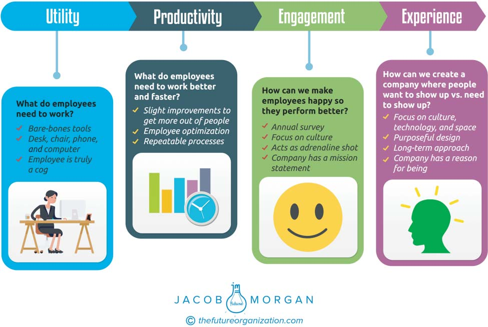

# **PART I**

**The Evolution of Employee**

**Experience**

As with anything in the business world, things evolve and change. The

evolution that we are seeing today continues to shift organizational pri-

orities more and more toward focusing on people and bringing humanity

and experiences into our organizations. This is an immensely exciting

thing to see! Years ago with the advent of what many would consider

modern business, focusing on utility,that is, the basic components of

work,made sense. At the time, it was just common practice, and pretty

much every organization took the same approach. Then, this shifted

toward productivity, getting the most out of people. Next, we saw the

emergence of engagement, which is all about making employees happy

and engaged at work. Now, we are shifting to what I believe is the next

and most important area of organizational design, employee experience.

Let’s look at this evolution and how we got to where we are.

**1**

**C H A P T E R** **1**

**Defining Employee**

**Experience**

**UTILITY**

Decades ago the relationship we had with our employers was pretty

straightforward. Employers had jobs they needed to fill; we had bills to

pay, things we wanted to buy, and certain skills we could offer, so we tried

to get that open job. This basic relationship also meant that work was

always about utility, that is, the bare-bones, essential tools and resources

that an employer can provide employees to get their jobs done (see

Figure 1.1). Today that is typically a computer, desk, cubicle, and phone.

In the past this may have been a desk, pen, notepad, and phone, or per-

haps just a hammer and nails. That was it. Can you imagine if someone

were to bring up health and wellness programs, catered meals, bringing

dogs to the office, or flexible work efforts in the past? Give me a break!

They would be laughed at and the employee most likely fired on the

spot! These things are all relatively new phenomena that are now only

starting to gain global attention and investment. Granted, there are still

plenty of organizations out there that are still stuck in the utility world.

**PRODUCTIVITY**

After the utility era came the productivity era. This is where folks like

Frederick Winslow Taylor and Henri Fayol pioneered methods and

**3**

**FIGURE 1.1** **Evolution of Employee Experience**
