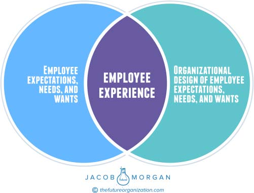

**D** **EFINING** **E** **MPLOYEE** **E** **XPERIENCE** **5**

approaches to optimize how employees worked. Managers literally used

stopwatches to time how long it would take employees to complete a

task to shave off a few seconds here and there. It was analogous to try-

ing to get a sprinter or swimmer to improve his or her lap time. All of

this was designed to improve productivity and output while emphasizing

repeatable processes, such as the famous factory assembly line. Unfortu-

nately at the time, we didn’t have robots and automation to do these jobs

(which they would have been perfect for), so instead we used humans.

Today, we finally have the technology capable to do the jobs they were

designed for, and the humans who were simply acting as placeholders

are now in trouble. Robots aren’t taking jobs away from humans; it’s the

humans who took the jobs away from robots. As with the utility era, there

also wasn’t much focus on creating an organization where the employee

truly wanted to be. Productivity was simply utility on steroids!

**ENGAGEMENT**

Next came engagement, a radically new concept where we saw the col-

lective business world say, “Hey, maybe we should pay more attention to

employees and what they care about and value instead of just trying

to extract more from them.” And thus, the era of engagement (or enlight-

enment) was born. This was actually quite a revolutionary approach that

shifted some of the focus away from how the organization can benefit and

extract more value from employees to focusing on what the organization

can do to benefit the employees and understand how and why they work.

The more engaged an employee is, the better! This is where we stopped

and where we have been for the past two or three decades. There have

been all sorts of studies that have shown engaged employees are more

productive, stay at the company longer, and are generally healthier and

happier.

I’ll admit that when I first started writing this book, I was convinced

that employee experience and engagement were at odds with each other.

I mistakenly believed that experience must replace engagement. In fact **6** **T** **HE** **E** **MPLOYEE** **E** **XPERIENCE** **A** **DVANTAGE**

there were thousands of words originally devoted to that very rationale

that I had to scrap from this book. I’ve since changed my tune. Employee

experience doesn’t need to replace engagement. The two can actually

work together, and in fact, they have to. Instead I view employee expe-

rience as something that creates engaged employees but focuses on the

cultural, technological, and physical design of the organization to do that.

Still, our current definitions and understanding of employee engagement

need to evolve before that can happen. Many of the questions and frame-

works used to explore engagement haven’t changed since they were first

introduced into the business world, which creates some challenges.

**EMPLOYEE EXPERIENCE**

Let’s say you buy an old car at a junkyard and then spend thousands

of dollars on new paint, upholstery, rims, and interior upgrades. Even

though the car will look beautiful, it will still drive like the same car you

brought home from the junkyard. If you want to improve how the car

performs, then you need to replace the engine. Organizations around the

world are investing considerable resources into things such as corporate

culture programs, office redesigns, employee engagement initiatives, and

well-being strategies. Unfortunately these things make the organization

look better but have little impact on how it actually performs.

Many organizations today use _employee engagement_ and _employee_

_experience_ interchangeably without any distinguishable difference,

which is incorrect. Employee engagement has been all about short-term

cosmetic changes that organizations have been trying to make to

improve how they work. If this approach doesn’t work for a car, then it

certainly won’t work for an organization.

If employee engagement is the short-term adrenaline shot, then

employee experience is the long-term redesign of the organization. It’s

the focus on the engine instead of on the paint and upholstery. Chances

are you’ve heard of the term _customer experience_, which is typically

defined as “the relationship that a customer has with a brand.” Most

people reading that would say, “Well, of course that’s what it is. Isn’t that

**D** **EFINING** **E** **MPLOYEE** **E** **XPERIENCE** **7**

obvious?” Yes it is, which is why I think it’s really a meaningless definition

that provides no context or direction for what that actually looks like.

This is why I wanted to avoid simply defining _employee experience_ as

“the relationship between an employee and the organization.” That

doesn’t help anyone or provide any value, and as with the customer

experience, it’s rather obvious. So then what is employee experience?

There are a few ways we must look at this. The first is through the

eyes of the employee, the second is through the eyes of the organiza-

tion, and the third is the overlap between the two. When reading through

these you may decide to lean toward the side of the employee or the orga-

nization, but since two parties are involved, it is in both the employee’s

and the organization’s best interest if we view employee experience as

something that is created and affected by both.

For the people who are a part of your organization, their experience

is simply the reality of what it’s like to work there. From the perspective

of the organization, employee experience is what is designed and created

for employees, or put another way, it’s what the organization believes the

employee reality should be like. This, of course, is a challenge and one

we see in our everyday lives. Have you ever said or done something to a

loved one or friend that was well intentioned yet was perceived as being

rude or disrespectful? This is the same scenario we see play out between

organizations and employees all the time. Just because the organization

does something doesn’t mean the employees perceive it in the intended

way. Naturally this causes problems not just in our personal lives but also

at work.

You may have seen _The Truman Show_, a film about a man who is

living in a world that was designed for him by an organization. His entire

perceived world was constructed from a massive stage, and although he

didn’t realize it, every action and event that took place was planned.

Regardless of how hard the organization tried to keep Truman from leav-

ing the world that was created for him, he eventually did break free. In

some ways this is how our organizations operate. They tell us when we

can work, what tools we should use, what to wear, when we can get pro-

moted or learn something new, whom we can talk to, and when we can

eat or take breaks. Not only that but they also control the environments **8** **T** **HE** **E** **MPLOYEE** **E** **XPERIENCE** **A** **DVANTAGE**

we work in and pretty much anything and everything else that happens

within the walls of the organization. As an employee you have virtually

no say in what happens for around 8 to 10 hours of your day. Although

our organizations aren’t exactly Truman-izing our lives, there are parallels

that can be drawn here. So where does that leave us?

The ideal scenario is the overlap between the employee’s reality and

the organization’s design of that employee reality. In other words, the

organization designs or does something, and the employees perceive it

in the intended way. This is possible because as you will see in the fol-

lowing chapters, employees actually help shape their experiences instead

of simply having them designed by the organization (aka the Truman

approach).

Taking that viewpoint, one can define employee experience as “the

intersection of employee expectations, needs, and wants and the organi-

zational design of those expectations, needs, and wants.” You can see this

in Figure 1.2 below.

**FIGURE 1.2 Employee Experience Design**

**D** **EFINING** **E** **MPLOYEE** **E** **XPERIENCE** **9**

However, what resonates more with people is saying “designing an

organization where people want to show up by focusing on the cultural,

technological, and physical environments.” Phrasing it this way essen-

tially encapsulates the entire relationship and journey that an employee

experiences while interacting with an organization, but it also breaks it

down a bit into three distinct environments, which makes it easier to

understand than saying, “Employee experience is everything.”

One crucial thing to keep in mind is that employee experiences can’t

be created unless the organization knows its employees. The word _orga-_

_nization_ is broadly used as a way to represent executives, managers, and

the collective workforce. If you’ve ever booked a trip through a travel

agent, you know that he or she spends an extensive amount of time get-

ting to know who you are. That way he or she can plan a trip for you that

is sure to give you a memorable experience. In the same way that travel

agents truly know who their customers are, the organization must truly

know who its workforce is. As you will see later in this book, that means

not only leveraging people analytics but also having a team of leaders

who have the capacity and the desire to connect with people on a truly

individual and human level.

Experience is also subjective because human beings have emotions,

different perceptions, attitudes, and behaviors. If we all behaved the

same way and thought the same way, then it would be quite easy

for organizations to design perfect employee experiences all the time for

everyone. Of course, this is not the case. Does this mean that organiza-

tions should simply give up? Clearly not. As you will see in this book,

employee experiences are made up of a specific set of environments

and variables, and the leading organizations have invested considerable

time and resources into making sure they are implemented properly.

Every organization in the world has employees who have their own

experiences. Whether you help create them or not, they still exist.

Employee experience is simply too important and too key of a business

differentiator simply to be left up to chance.

As I mentioned earlier, though, this employee experience design pro-

cess isn’t just done for employees; it’s done with them. That’s a very **10** **T** **HE** **E** **MPLOYEE** **E** **XPERIENCE** **A** **DVANTAGE**

important point to keep in mind because many organizations get stuck

in the _design for_ mentality, which kills their efforts.

The majority of this book will explore how to design and cre-

ate employee experiences by building what I call the Experiential

Organization. Let’s define what this actually means:

An Experiential Organization (ExpO) is one that has been

(re)designed to truly know its people and has mastered the art and

science of creating a place where people want, not need, to show up

to work. The Experiential Organization does this by creating a Reason

for Being and by focusing on the physical, technological, and cultural

environments.

From here on out we will take a deep dive into what these environ-

ments are, the variables that shape them, and how to go about creating

an Experiential Organization that outperforms the competition.
