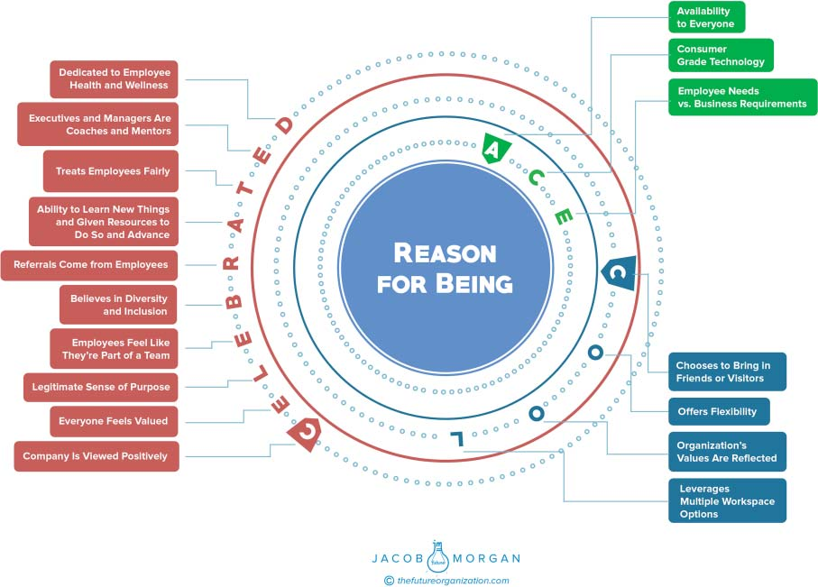

**C H A P T E R** **2**

**Research on Employee**

**Experience**

I certainly didn’t coin the term _employee experience_, but I did create the

frameworks and approaches that you will find in this book. As far as I’m

aware, I’m the only one to create a structured framework of employee

experience that is based on actual data and organizational analysis of hun-

dreds of organizations, so it only makes sense to share how it all came

about. Although new titles, roles, and practice areas are emerging around

employee experience regularly, there’s a lot of confusion and uncertainty

about what this actually is and what it looks like. Part of the reason for this

is unlike traditional human resources (HR), which is very clearly defined,

employee experience looks quite different depending on the organiza-

tion, and that’s okay. Because this is a very human-centric role, there

should naturally be differences in how various organizations approach

this. I reached out to many chief employee experience officers, direc-

tors, managers, and even HR leaders who are responsible for employee

experience to get their perspective on what this new shift is all about.

Many business executives and leaders I talked to were very candid

and said they weren’t entirely sure what this role focused on, what

experience will become, or even what it will include because it’s so new.

Naturally this presented me a bit of a challenge in writing a book about

this topic. Over the past two years I’ve had a few hundred conversations

with senior executives and employees at various levels. Although I

**11**

**12** **T** **HE** **E** **MPLOYEE** **E** **XPERIENCE** **A** **DVANTAGE**

received many responses when I asked, “What makes up employee

experience?” or “How do you design employee experiences?” a pattern

started to emerge that allowed me to break this down. I started to see

that every organization around the world regardless of size, industry,

or location was investing in and focusing on three areas, which I like

to think of as environments. The environments that affect employee

experience are the technological environment, physical environment,

and cultural environment.

Once I determined these three environments, the next step was to

figure out what the major attributes were within these environments.

In other words, what do employees care about most that create great

technological, physical, and cultural environments?

This wasn’t an easy task because we all care about and value different

things. I took the same approach I used with determining the three expe-

rience environments. I looked for patterns in the many studies, articles,

and research reports I read and added information from the hundreds

of conversations I’ve had with executives and employees at organizations

around the world. Based on that I created a series of questions to measure

organizational effectiveness in each of the three employee experience

environments.

To design great employee experiences and to create a place where

employees truly want to show up, organizations must focus on a Rea-

son for Being followed by 17 attributes that are abbreviated as ACE

technology, COOL physical spaces, and a CELEBRATED culture (see

Figure 2.1).

What I found especially fascinating is that every one of these 17

attributes positively affects the employees and the organization as a

whole. This isn’t one sided so even by investing in the overall success of

the company, the employee experience is also hugely affected positively.

Everyone wins.

Together these 17 attributes make up what I like to call the Employee

Experience Score (ExS). You can get your organization’s EXS by answer-

ing the questions that appear in the Appendix. The collective rankings of

the organizations that I evaluated then comprise the Employee Experi-

ence Index (EEI). You can see the full index as well as get your own EXS

by visiting [https://TheFutureOrganization.com.](./https___TheFutureOrganization.com)

**FIGURE 2.1** **The 17 Employee Experience Attributes**
