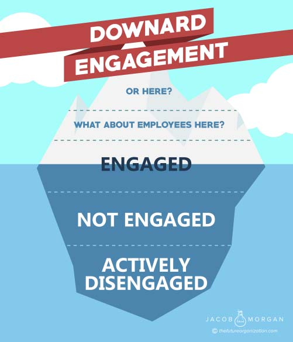
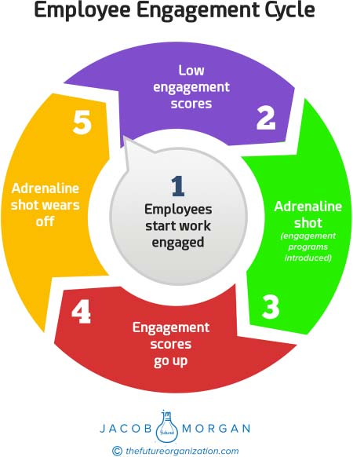
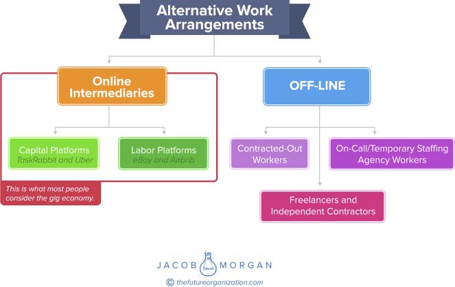

**C H A P T E R** **3**

**Employee Experience**

**Drivers**

You might be wondering why employee experience is gaining traction

just now. After all, customer experience has been around for decades,

so why has it taken so long for organizations to look inward? Not only

that but we’ve also been talking about employee engagement for decades

as well. Clearly there is something going on that is creating this shift,

forcing organizations not only to create new titles and roles but also to

actually redesign the way they are structured and how they operate. In

my previous book, _The Future of Work_, I explored five trends shaping

the future of work, which I will briefly outline here:

1\. **Mobility:** Access to people and information anytime, anywhere, and

on any device

2\. **Millennials and changing demographics:** In addition to the

five-generation workforce, organizations are struggling to adapt to

an entirely new generation of millennials.

3\. **Technology:** Big data, wearables, the Internet of things, AI, and

automation are just some of the new technologies organizations are

trying to figure out.

4\. **New behaviors:** Thanks to social technologies, we are all comfort-

able living a more public life where we share ideas and information

for the world to see.

**17**

**18** **T** **HE** **E** **MPLOYEE** **E** **XPERIENCE** **A** **DVANTAGE**

5\. **Globalization:** The world itself is becoming like one big city

where the boundaries and barriers to doing any type of business are

disappearing.

These five trends are still very relevant today from a broader per-

spective. However, when looking specifically at employee experience, we

need to pay attention to a few other things.

**POOR SUCCESS WITH ENGAGEMENT**

There are all sorts of associations, institutes, and surveys that organi-

zations can use to measure and look at employee engagement. Unfor-

tunately with all the talk of engagement and with all the trainings and

rankings of organizations around the world, engagement has remained

relatively unchanged despite our collective investments. According to

Gallup, which has become the global authority on this topic, worldwide

employee engagement is at 13 percent, 1 which is almost unimaginably

low. Perhaps what’s more shocking is that this number has barely budged

in years! Interestingly enough Aon has global employee engagement

at 65 percent for 2016, with a 3 percent improvement since 2014.2

The fact that these numbers are so far away from each other is another

matter entirely.

This is quite an interesting paradox. Engagement has become one of

the key focus areas for organizations around the world, and the growth in

the industry has never been stronger. Yet somehow the numbers aren’t

budging. How can that be the case?

There are a few issues I see with focusing on employee engagement

and you might have identified others.

**Engagement Measures Downward**

Let’s look at one of the most popular engagement models in the world

today. This particular framework categorizes three types of employees:

1\. **Actively disengaged:** unhappy employees who undermine their

coworkers

**E** **MPLOYEE** **E** **XPERIENCE** **D** **RIVERS** **19**

2\. **Not engaged:** employees who are checked out and sleepwalking

through their jobs

3\. **Engaged:** employees who work with passion, feel connected to the

company, and help move the organization forward

In this model which you can see in figure 3.1, an engaged employee

should be the minimum of what an organization should expect from any-

one. If we’re being honest, then it’s fair to say that an engaged employee

should be an average employee. In grading terms this would be a

**FIGURE 3.1 Employee Engagement Measures Average Employees Who Are Either Below Or Just Above Water, What About the Rest?**

**20** **T** **HE** **E** **MPLOYEE** **E** **XPERIENCE** **A** **DVANTAGE**

C. Hiring for passion and the ability to drive the organization forward

is something any business leader looks for and asks about during an

interview. If employees don’t help move the company forward and they

don’t feel a connection to the company, then they have no business

being there and perhaps we should also ask how they got there to begin

with? Organizations bringing in these types of employees must review

their hiring practices. I know it’s harsh but that doesn’t make it any

less true.

A not engaged employee is the equivalent of a D, and an actively

disengaged employee is a big fat F. So looking at this model, the best that

an organization can do is hire an average employee who will perform as

expected. Everyone else is either below or very below average. Imagine

what kind of an organization this creates, better yet, we know what kinds

of organizations this creates as evidenced by the current engagement

scores around the world.

What about the employees who do feel a sense of passion and who

go above and beyond what is expected of them to help others? Or, what

about the super employees who constantly exceed expectations and act

as brand cheerleaders even when not at work? These types of employees

don’t fit into the traditional model of engagement. This is what I mean

when I say employee engagement is stuck measuring downward instead

of upward. You can be only a C employee or worse when looking at this

type of a model.

**Engagement Has Become the New Annual Review**

Organizations question the value of annual employee reviews yet for

some reason are okay with measuring employee engagement every year.

This makes no sense. In many cases employee engagement surveys are

simply replacing the annual review and are becoming the very thing that

organizations are trying to get rid of! There is no right answer for how

often you should measure employee engagement. That’s something I

believe your people should control and be able to do when and where

they want as often as they want. Organizations need to understand that

this is a dynamic and fluid thing that changes constantly. We are not light

switches that are either on or off.

**E** **MPLOYEE** **E** **XPERIENCE** **D** **RIVERS** **21**

Anything related to people should be measured continuously. Per-

haps you have a short single-question pulse survey weekly, monthly

culture snapshots, semiannual engagement reviews, and a larger state

of the company survey. Of course, this is just an illustrative example

to show that doing one annual survey may not give you an accurate

reflection of what’s going on inside of your company. Some companies

I’ve spoken with don’t even look at people metrics annually. They might

do so only once every few years! If annual reviews don’t do a good job

of measuring employee performance, then annual engagement surveys

don’t make much sense for measuring the pulse of the organization.

Another approach that some organizations, such as General Electric

(GE), take is to run constant surveys to random employees. So you might

do a survey for 1,000 employees one month, another thousand the fol-

lowing month, and so on. The idea is to get employee data and feedback

constantly from a representative sample size of the organization. For an

organization like GE that has over 300,000 employees around the world,

this approach makes much more sense than trying to do one annual

survey. I’ll talk about this a bit later in the book as well.

**Engagement Tends to Look at the Effect but Not the Cause**

In most models the ideal scenario for organizations is to get as many

engaged employees as possible. They do this maniacally as if they are

collecting Pokémon characters. It’s as if for every engaged employee an

organization gets, it will level up and will finally be able to take on that

giant monster! Unfortunately, many organizations get so stuck focusing

on engagement that they forget to take a step back to understand what

causes engagement to begin with let alone understand the impact that

engaged employees are having on the organization. This means

that engagement just boils down to a number, and a number without

context is quite useless. If you recall the famous book and movie

_The Hitchhiker’s Guide to the Galaxy_, the answer to “What’s the mean-

ing of life?” is 42\. It’s just a number as are most employee engagement

scores that organizations receive. You scored a 68? Wonderful! A 92?

Even better! Now what? Does this mean if you get to 100 you can stop?

See what I’m getting at here? The cause is employee experience; the

effect is an engaged workforce.

**22** **T** **HE** **E** **MPLOYEE** **E** **XPERIENCE** **A** **DVANTAGE**

**Engagement Surveys Are Exhaustingly Long**

It’s common for employee engagement surveys to be well over 100 ques-

tions long that ask pretty much everything and anything. This makes me

think of my college days when I had to take multiple choice tests on scant-

rons (remember those?). Those exams were around 30 to 40 questions,

and sometimes we even got a 15-minute break! Who in his or her right

mind would want to sit and take an exam about his or her organization,

and more important, who would actually sit through and answer all the

questions honestly?! Speaking of honesty, let’s not forget that employee

engagement surveys can also be manipulated. I once spoke with a chief

human resources officer of a global company who told me that if she

wanted to increase her employee engagement score quickly, then she

would ask employees to take it once on a cloudy, rainy day and then

again on a sunny day. Boom! Ten point improvement! Some organiza-

tions also have the scary habit of manipulating their engagement scores

by either offering incentives to get people to score higher or reprimand-

ing employees who don’t score their organizations high enough.

**Engagement Acts as an Adrenaline Shot**

One of the things that I find quite fascinating is when people start work-

ing at an organization, they are already engaged. Rarely have I talked to

an employee just starting out at an organization who says, “Man, this job

is terrible!” The exact opposite is actually true. When employees start

working for an organization, they are typically excited to be there and

are very much looking forward to being a part of your team and making

an impact. Think back to the jobs you have had in the past. You may

have been a bit nervous or scared when starting a new job, but chances

are that you rarely started being unhappy or disengaged. So something

happens to turn these already engaged and happy employees into

unhappy and disengaged people. Right about this time the organization

does one of its employee engagement surveys, and when it sees the

negative results, managers say, “What? Our engagement scores are that

low? Quick, we need to do something!” At that point some new perks

might be introduced. Maybe a flexible work approach is implemented,

some office layout changes might happen, and perhaps catered meals

**E** **MPLOYEE** **E** **XPERIENCE** **D** **RIVERS** **23**

a few times a week are introduced because clearly free food makes us

happier. Then things improve a bit on the engagement score temporarily

before dropping off again and the same cycle repeats itself as you can

see in figure 3.2\. Basically engagement in many organizations acts as an

adrenaline shot to temporarily boost employee happiness and satisfaction

whereas employee experience is the ongoing design of the organization.

Unfortunately engagement efforts simply feel like manipulation and

thus doesn’t create trust or loyalty and does nothing to unlock human

potential which also means no business impact for the organization.

**FIGURE 3.2 Employee Engagement as the Short-Term Adrenaline Shot Instead of the Long-Term (Re)design of the Organization 24** **T** **HE** **E** **MPLOYEE** **E** **XPERIENCE** **A** **DVANTAGE**

Employee engagement has been a wonderful tool for us to think

differently about our organizations, but it’s also been used as a bit of a

crutch to justify the existence and importance of human resources (HR)

as a function. We also have to remember that just because you measure

something doesn’t mean you improve it. While there’s nothing wrong

with continuing to measure employee engagement, it’s time for us to

look at a new approach for a rapidly changing world that is focused on

the long-term designing of employee experiences which then yields an

engaged workforce.

In fact, I believe that employee engagement can and should sim-

ply be measured by asking employees one question. What that ques-

tion is can certainly vary from one organization to the next. When doing

research for this book, I wanted to say it should be something along

the lines of “Do you wake up every morning wanting to go to work?”

Although this type of a question is tempting to ask, I don’t think it’s the

right approach. In other words how an employee feels is not a good indi-

cator of engagement, but what he or she actually does is. This is why

I think a question such as “Do you show up to work every day with

the intention of helping others succeed?” is far better suited to mea-

sure engagement. Success in this case is a very subjective metric that

can mean anything from helping people feel good to actually helping

them deliver on a project, but in this case the subjectivity is a good thing.

When I spoke with Pat Wadors, the CHRO at LinkedIn, she told me that

if she could pick just one way to measure engagement at her company,

it would be “If employees show up to work each day wanting to create a

sense of belonging for others.” In Pat’s case she has the data to back up

the significant positive correlation between this criterion and employee

engagement. Focusing on an action is better than focusing on a feeling

because it looks at a tangible impact.

Beth Taska is the CHRO of the world’s largest gym, 24 Hour Fit-

ness. When I met with her in 2016, she echoed what Pat told me. The

whole point of employee engagement is to unlock the discretionary effort

within employees. This is the amount of effort that employees could put

in if they actually wanted to. But what does that mean? If you think

about most of the interactions you have daily with various brands, you

**E** **MPLOYEE** **E** **XPERIENCE** **D** **RIVERS** **25**

will realize that they are very linear and static. There is very little differ-

entiation. Whether you go to a retail store, a supermarket to purchase

groceries, a check-in gate to board a flight, or a restaurant to order food,

you pretty much know what will happen and what to expect. It’s always

the same thing. So how is it that some organizations are able to go above

and beyond to deliver customer experiences? The answer is discretionary

effort. What organizations like LinkedIn and 24 Hour Fitness have fig-

ured out is that when you focus on employee experiences, employees go

above and beyond to help not only one another but also your customers.

Discretionary effort is measured in terms of an action, which is why I

believe that measuring something like “if employees help others become

more successful” is more meaningful and telling than simply asking, “Do

you feel a connection to the organization?”

At organizations like wireless provider T-Mobile, this level of

discretionary effort all comes down to the impact that employees

have on their customers. I spoke with Marty Pisciotti, T-Mobile’s vice

president of employee careers, who told me that across T-Mobile in

the United States, every employee knows the first line of the company

values, “Frontline first, because customers are first.” T-Mobile believes

that frontline employees always come first because the better they are

treated, the better they will treat their customers. T-Mobile realized that

when employees feel like the company cares, they start to act more like

owners who are empowered to truly go above and beyond a traditional

job description. To further get this point across, the company introduced

a program over three years ago that gives all employees—including

those in retail and customer care call centers—stock in the company,

which is vested over a three-year period. These are free shares in the

company that T-Mobile gives to all employees to help them feel like they

are truly making an impact on the business, are vested in the success of

the organization, and are able to unlock their maximum potential.

While employee experience needs to look at many aspects of the

organization and requires several questions to determine and measure,

employee engagement needs just one. So what’s the one question

you could ask your employees to determine whether they are indeed

engaged? Go ask it.

**26** **T** **HE** **E** **MPLOYEE** **E** **XPERIENCE** **A** **DVANTAGE**

**THE WAR FOR TALENT**

When you hear the phrase _the war for talent_, it should make you

wonder, “When have we ever not been in a war for talent?” Ever since

the dawn of modern business, organizations have been seeking to attract

and retain the best possible people they could. This isn’t new. _The_

_war for talent_ is actually a phrase coined in 1997 by Steven Hankin of

McKinsey & Company that is meant to refer to the changing landscape

around attracting and retaining talent, basically, that it’s getting more

challenging. This was 30 years ago. Today it’s not just challenging. It’s

downright hard and complex. In a report called _War for Talent—Time_

_to Change Direction_, KPMG surveyed HR professionals around the

world, and 59 percent reported that “There is a new war for talent and

this time it is different than in the past.” 3

Facebook understands this better than most. It starts with one sim-

ple question, which is “If you had the best talent in the world, what would

you need to do to attract and retain them?” Organizations like Facebook

aren’t just looking for people; they are also looking for the best people.

This is perhaps one of the largest changes we are starting to see. Technol-

ogy is replacing bodies, which means that organizations are looking for

something more We also have to remember that the war for talent isn’t

just about attracting potential employees but also keeping existing ones.

Let’s break the war for talent down a bit further. The war for talent

is being fueled by a few things.

**Skills Gap and Talent Shortage**

A _McKinsey Quarterly_ article by Richard Dobbs, Susan Lund, and Anu

Madgavkar titled “Talent Tensions Ahead: A CEO Briefing” stated that

“new research from the McKinsey Global Institute (MGI) suggests

that by 2020, the world could have 40 million too few college-educated

workers and that developing economies may face a shortfall of 45 million

workers with secondary-school educations and vocational training. In

advanced economies, up to 95 million workers could lack the skills

needed for employment.” 4 The most recent ManpowerGroup Talent

**E** **MPLOYEE** **E** **XPERIENCE** **D** **RIVERS** **27**

Shortage Survey of “more than 41,000 hiring managers in 42 countries

and territories found that 38% of employers are having difficulty filling

jobs.”5 There is little agreement on what is causing this skills gap, what

the potential solutions are, and whether the skills gap is even a real

thing! Most of the executives I speak with acknowledge that the skills

gap is real. Perhaps what makes this even more challenging is that we

aren’t sure what the jobs of the future will be or when they will be

here. Consider that by the time most people graduate from college, the

skills and the things they have learned are mostly rendered obsolete.

This means organizations are looking to hire employees for jobs that

don’t yet exist. Not only do we have a skills gap, but we also have a

skills uncertainty. The number one thing that potential and current

employees can do to succeed in this type of environment is to learn how

to learn. In other words, have the ability to learn new things regularly

and apply the things that you learn to new and current situations and

scenarios. This is further evidenced by the dozens of publicly available

conversations I have had with CHROs at the world’s largest companies.

You can listen to and read about all of these discussions by visiting

[https://thefutureorganization.com/future-work-podcast/.](./https___thefutureorganization.com_future-work-podcast_.md)

What’s fascinating is that organizations that focus on creating

employee experiences aren’t feeling this skills gap as much as those who

aren’t. It appears that in the coming years, organizations are going to

want to hire people, and there just won’t be enough high-skilled labor to

go around.

**Changing Demographics**

According to a report by Robert I. Lerman and Stefanie R. Schmidt

called _An Overview of Economic, Social, and Demographic Trends_

_Affecting the US Labor Market_:

BLS \[Bureau of Labor Statistics\] projections imply that over the

next decade, 40 million people will enter the workforce, about

25 million will leave the workforce, and 109 million will remain.

Although only a modest reduction will take place in the overall **28** **T** **HE** **E** **MPLOYEE** **E** **XPERIENCE** **A** **DVANTAGE**

growth in the workforce (from 1.3 percent per year to 1.1 percent

per year), the composition of growth will generate rising shares of

young (under 25) and older (45 and over) workers and a decline

in the share of middle-age workers.6

We are already starting to see this trend. Today, millennials are

already the largest demographic, surpassing baby boomers in 2016.

By 2020 they are expected to comprise 50 percent of the workforce,

and by 2025 this is expected to be 75 percent of the workforce. We

also see Gen Z (the generation after the millennials) creeping into

the workplace as well, and they currently comprise over 25 million

people in the United States alone. Not only that but also the labor

participation rate in the United States appears to be gradually yet

consistently shrinking. This changing mix of demographics brings new

values, attitudes, expectations, and ways of working. Still, this isn’t new.

Our organizations have always had to adapt to new generations entering

the workforce, but the overall sense is that previous adaptations were

very slow and gradual and have now become more aggressive.

**Changing Face of Talent Competition**

In the past organizations used to compete on a few levels, which were

typically skills and seniority, location, and direct rivals. This meant

that if you lived in San Francisco, you would compete against other

people in the area, or that if you were Coca-Cola, you’d compete

against Pepsi, Ford versus Toyota, Boeing versus Airbus, or McDonald’s

versus Burger King. Today, with the exception of certain specialized

skills and roles, everyone is competing with everyone. Coca-Cola

is competing against Toyota and McDonald’s is competing against

Airbus. Not only that but organizations are also competing on a global

scale (read globalization) in a world where many perceive a skills

shortage in an environment that is seeing traditional employment

and business models change. This competition also extends to the gig

economy, where smart and talented individuals might decide to drive

for Uber or join an online freelance marketplace instead of working

for you.

**E** **MPLOYEE** **E** **XPERIENCE** **D** **RIVERS** **29**

**Psychology (and Sociology)**

Employee experience is very much a psychological and sociological

pursuit as many of the concepts around team building, motivation,

performance, and success are influenced by studies that psychologists

and sociologists have been conducting for decades (there are several

referenced in this book). Any business book that you pick up today is

bound to have several mentions of this. Organizations are now taking

these pursuits more seriously as they try to truly create environments

where people want to show up to work. This is no longer just a challenge

that an organization can overcome with perks, higher pay, or gimmicks.

Instead the business world is turning to the social scientists to really

help them understand why and how people tick. It should come as no

surprise that according to the U.S. Bureau of Labor Statistics, industrial

organizational psychology is one of the fastest growing professions.

These scientists are influencing how we hire and recruit people, design

our office spaces, lead and manage, and even build and run our HR

departments. Organizations such as Johnson & Johnson work with

teams of psychologists for these exact purposes. This too speaks to the

trend toward focusing on longer-term organizational design instead of

shorter-term engagement programs.

**Business Turbulence**

According to Mark J. Perry of the American Enterprise Institute, a

public policy think tank, almost 90 percent of the Fortune 500 have

disappeared since the original list was created in 1955\. 7 In the past

to really disrupt a large global company, you had to be a large global

company. Not only that but also these organizations usually had a

sense of where their threats were coming from. Today competition can

come from a door-to-door fax salesperson (Spanx), a college dropout

(Facebook), a former customer (Netflix), or someone who just raises

a ton of money (Uber and Airbnb). The point is that in a world that

appears to be getting smaller, at a time when change is getting faster,

your competition can come from anywhere, and you’ll never see it until

it’s in your face. In this environment organizations are struggling to hire

the best talent that will help them see potential threats and uncover new **30** **T** **HE** **E** **MPLOYEE** **E** **XPERIENCE** **A** **DVANTAGE**

opportunities. By focusing on employee experience many companies

are hoping to be able to reverse that trend.

**TECHNOLOGY**

The proliferation of mobile devices with global connectivity allows us

to work anywhere and anytime. Videoconferencing and internal social

networks allow us to communicate and collaborate at scale without

any boundaries. On-demand platforms, such as Catalant, Upwork, and

Kaggle, allow organizations to quickly scale their workforce up or down

while being able to access top talent anywhere in the world. Big data (and

its analysis) is allowing us to gain new insight into how we work, why we

work, and what we can do to drive performance, experience, and engage-

ment. Robots and automation are predicted to replace many jobs around

the world, leaving a questionable future of employment. This is why I

was so shocked to see the lack of discussion and debate around automa-

tion and job displacement during the recent presidential election. We

are worried about losing jobs to other countries but it appears that the

larger threat may be losing jobs inside of our country to software and AI.

This is why the discussions around Universal Basic Income are becoming

so prevalent. The idea is that if AI and automation replace many people

around the world, that giving everyone a guaranteed regular income can

solve the financial burden of not having a job. UBI is a widely contested

topic that still has many questions which need to be answered.

The Internet of things promises to create a connected world which

along with artificial intelligence will yield more productivity, efficiency,

and abundance. Virtual and augmented reality will change the way we

interact with physical and virtual worlds by combining and overlaying

the two. The list goes on and on.

Technology is not only enabling us to work more effectively, but it’s

also creating entirely new ways of working in addition to creating new

jobs and eliminating many older ones. What I find fascinating is that in

the past, progressive views around how work can and should be done

were stalled by not having technologies to actually enable those new

ways of working. Today organizations have access to technologies that can

**E** **MPLOYEE** **E** **XPERIENCE** **D** **RIVERS** **31**

enable and empower almost anything that can be thought of. Technology

has caught up to and has indeed far surpassed what our organizations can

actually implement. The sky’s the limit!

I give around 40 keynote talks around the world each year. Regard-

less of the audience or the location I speak at, technology is consistently

ranked as the top (or one of the top) thing that attendees believe will

affect their organizations. Later in the book I’ll explore the role of tech-

nology and automation on employee experience, but a full look at how

technology is affecting the future of work is beyond the scope of this

book. If you want to learn more, there are several great resources on this

very topic, including a free, 150-page report the University of Oxford and

Citi published called _Technology at Work v2.0_.

We must also remember that technology is but one aspect in a

changing world. Before various technologies can be scaled and adopted

there are many other things which must be considered. Futurists use

a framework with the acronym STEEPLE which stands for: Social,

Technological, Economic, Environmental, Political, Legal, and Ethical.

Notice that technology is just one of the seven things which need to be

looked at. Take the autonomous vehicle as an example. There is little

doubt that the technology is there today to produce a fully functioning

self-driving car. But how long will it take for us to see this at scale and

how long before these vehicles will displace all of the human drivers

today? We need to consider things such as insurance, infrastructure,

rules and regulations, ownership, security, production, and much more

before we can see these cars take over. Today the autonomous cars you

see actually have two drivers instead of one. One driver sits in the driver

seat as a backup and another sits in the passenger seat and collects data.

We haven’t even touched on the comfort level of people getting into an

autonomous vehicle or the ethical challenges that we need to explore.

For example, how does a self-driving car decide between an unavoidable

accident where it will either risk the life of the passenger or risk the life

of a bystander?

Technology is indeed a powerful disruptor but it must be placed in

context of what else is required for that technology to scale and have

an impact.

**32** **T** **HE** **E** **MPLOYEE** **E** **XPERIENCE** **A** **DVANTAGE**

**ALTERNATIVE WORK ARRANGEMENTS AND THE GIG ECONOMY**

Does focusing on employee experience even make sense in a world that is

supposedly going to be dominated by freelancers and short-term employ-

ees? There’s been a lot of debate and confusion around this space, so it

only makes sense to explore what’s going on here. The umbrella term

that nontraditional employment models fall under is _alternative work_

_arrangements_. This includes everyone from Uber drivers to construc-

tion workers who work on independent contracts to those of us who work

with staffing agencies for temporary employment. Figure 3.3 should help

clarify what all of this looks like. When most people refer to the gig or

freelance economy, they are specifically referring to people who work

through online intermediary sites, such as Uber, Upwork, and Airbnb.

**FIGURE 3.3 Alternative Work Arrangements**

_Source:_ 8 Lawrence F. Katz and Alan B. Krueger.

**E** **MPLOYEE** **E** **XPERIENCE** **D** **RIVERS** **33**

To make things easier we will refer to this as the _online gig economy_ for

the rest of this section. You will see where that term came from later. With

that context in mind we can look at what’s going on. The image in Figure

3.3 shows the broader category of alternative work and where the online

platforms fit in.

**Growing Fast but Not Dominating**

The first thing we need to understand is that although the online gig

economy is growing, it is by no means going to dominate the workforce,

not even close. The vast majority of us will continue to be full-time

employees the way we are today. It’s true our workforce will be more

dynamic and fluid, but employment as we know it won’t be going

anywhere.

Ted Egan is the chief economist for the Office of the Controller in the

City and County of San Francisco. Recently he released a report called

_The Gig Economy in San Francisco: Prevalence, Growth, and Implica-_

_tions_. In it he cited the JPMorgan Chase Institute, which found that as

of September 2015 in the United States, the “percentage of adults who

earned income from online platforms” (such as Uber, Upwork, Airbnb,

and the like) in the past year was just over 3 percent, and this isn’t even

people who make a full-time living from freelancing (that number is

undoubtedly much smaller). Even in San Francisco, the supposed home

for innovation and technology, wage employment has still been growing

faster than self-employment.9

In a 2016 article by Emily Green for _SFGate_ called “Gig Work

Isn’t Changing Job Landscape, SF Economist Finds,” Robert Habans, a

research associate at the University of California, Los Angeles, Institute

for Research on Labor and Employment, summed up this fascination

with the gig economy (again specifically looking at online intermediaries)

wonderfully. He said, “It’s kind of hard to reconcile that \[findings from

Egan’s report\] with how intensely everybody is talking about the gig

economy, especially in a place like San Francisco. Most recent studies

have failed to demonstrate a wholesale shift toward the gig economy,

including this one.” In that same article Lawrence Mishel, from the **34** **T** **HE** **E** **MPLOYEE** **E** **XPERIENCE** **A** **DVANTAGE**

Economic Policy Institute (and someone whom I had the privilege of

discussing this at length with), said, “Digital platform work is just a small

part of a broader set of employment practices.”10

Another fascinating paper by Seth D. Harris, the former U.S. sec-

retary of labor and now professor at Cornell University, and Alan B.

Krueger, an economist at Princeton University and former chairman on

the White House Council of Economic Advisers, called _A Proposal for_

_Modernizing Labor Laws for Twenty-First-Century Work: The “Inde-_

_pendent Worker_ found that “about 600,000 workers, or 0.4 percent of

total U.S. employment, work with an online intermediary in the gig econ-

omy,” such as Uber or TaskRabbit.11

Lawrence F. Katz, a professor of economics at Harvard, and Alan B.

Krueger, published a fantastic presentation called “The Rise of Alterna-

tive Work Arrangements & the ‘Gig’ Economy.” The term they used to

refer to online intermediaries is the _online gig economy_, which is what I

have used here.

Although they have found the online gig economy to be quite

tiny, they also found that it is growing remarkably quickly. In fact they

cited Diana Farrell and Fiona Greig’s 2016 finding that there was a

10× increase in the percentage of adults participating in the online gig

economy each month and a 47× increase in the cumulative percentage

of adults who have ever participated in the online gig economy. These

are truly remarkable numbers. Another interesting but perhaps not sur-

prising finding from the presentation is that Uber could represent half to

two-thirds of all online gig economy work. If you were to remove Uber

from the equation, the online gig economy would be almost nonexistent.

However, if we look at the broader category of alternative work

arrangements, we appear to see a very different story, one of much

larger growth and impact. According to same presentation by Katz

and Krueger, “All net U.S. employment growth since 2005 appears to

be in alternative work arrangements.” This category has grown from

10.1 percent of all employment in February 2005 to an estimate of

15.8 percent at the end of 2015, or around 24 million people, based

on Katz and Krueger’s analysis of their 2015 survey Bureau of Labor

Statistics data. 12

**E** **MPLOYEE** **E** **XPERIENCE** **D** **RIVERS** **35**

Another piece of evidence I’ll mention here is a great article pub-

lished by Josh Zumbrun and Anna Louie Sussman in the _Wall Street_

_Journal_ called “Proof of a ‘Gig Economy’ Revolution Is Hard to Find.”

According to the article, “Official government data shows around 95%

of those who report having jobs are accounted for on the formal payroll of

U.S. employers, little changed from a decade ago.” The article continues,

“But the share of people who hold multiple jobs is also in decline—only

4.8% of workers do, down from 5.5% in 2005 and 6.3% in 1995.” 13

These are a few of the many studies that have been done that show

that the gig economy as we know it (looking at online intermediaries) is

tiny (but growing). The studies I mention here have been conducted with

academic rigor and are among the best efforts I have seen undertaken to

quantify the true size of the gig economy. I want to stress the importance

here of the academic rigor because there are plenty of other studies that

have the size of the gig economy exponentially larger. These studies are

oftentimes done by organizations that have a vested interest in inflating

numbers and they do so by asking questions guaranteed to do so. For

example they might ask if in the past 12 months you have done some

form of work for money, which falls outside the realm of a traditional

job, if you answer “yes” then oftentimes you are labeled as a freelancer.

There are all sorts of things that I might do once a year like go sky diving,

scuba diving, try a new food, and the like. But I don’t tell people I’m a

sky or scuba diver!

**The Effect on Employee Tenure**

Another popular theory that has been circulating is that employee tenure

is in rapid decline and that in the near future we will all be portfolio

employees where instead of working for a single employer, we will work

for many employers at the same time. As someone who has made a living

based on portfolio model \[I work with over 40 companies a year\], I’d

be happy to see this become reality, but again, the data doesn’t seem to

support this direction.

According to the U.S. Census Bureau data Craig Copeland cited,

“Data show that the overall median tenure of workers—the midpoint of **36** **T** **HE** **E** **MPLOYEE** **E** **XPERIENCE** **A** **DVANTAGE**

wage and salary workers’ length of employment in their current jobs—

was slightly higher in 2014, at 5.5 years, compared with 5.0 years in

1983.” 14 Granted the report is three years old, but it’s the most cur-

rent one as of this writing. I find this quite interesting because from all

the executives whom I speak with, there is a consensus that employee

tenure is not what it used to be and is in fact shrinking. It’s hard to look

at national averages and then apply those averages to specific compa-

nies. As you can imagine if you are in a hot labor market, such as San

Francisco or New York, the tenure might be different than if you’re

in a part of the country like Wyoming or Minnesota. The industry also

has a dramatic impact. Those in the technology industry won’t have the

same tenure as those in the construction industry. Although the data

shows that tenure seems to be growing, many of the executives I speak

with would disagree and dispute these numbers as they relate to their

respective organizations.

This isn’t just an American thing either. According to the Chartered

Institute of Personnel and Development in the United Kingdom, which

published a report called “Megatrends: The Trends Shaping Work and

Working Lives”:

While self-employment has increased in the last 30 years, some

four-fifths of people working in the UK are still permanent

employees. In addition, the average period of time people spend

with an employer did not shift greatly between the mid-1970s

and the mid-2000s, albeit with some changes within the overall

average. Furthermore, our evidence suggests that job turnover

in the UK has been falling over the past decade—meaning that

fewer people change employers each year.15

Are all of these reports perfect and all the numbers 100 percent

accurate? Absolutely not. It’s hard for anyone to provide accurate

numbers around how large the alternate work category is, especially the

online gig economy portion of that. That’s because the U.S. government

stopped collecting any data on the contingent workforce many years ago.

However, early in 2016 Tom Perez, the U.S. secretary of labor,

**E** **MPLOYEE** **E** **XPERIENCE** **D** **RIVERS** **37**

announced that the government will once again start tracking this data

as a part of the 2017 population survey. This is very exciting because

we will finally get some accurate numbers around how big this space

really is.

Does this mean we don’t need to pay attention to the gig economy

or alternative work arrangements? Of course not. Instead of just look-

ing at total numbers today, it’s also helpful for us to look at where things

might be going. The numbers can sometimes appear to be conflicting,

but based on all the research and data that exist, it’s safe to say that today

the gig economy as it pertains to online platforms is a very tiny fraction

of the workforce. Alternative work arrangements in general (including

the gig economy) are growing and adoption rates are staggeringly high.

However, today many people are using these platforms as ways to aug-

ment existing work arrangements and income. This forces us to ask a

broader economical question, “Why is it that so many people feel the

need to augment their existing incomes, and if we paid them more, would

they continue to do so?”

Data also shows that employee tenure isn’t shrinking as rapidly

as previously thought. It may actually be increasing but slightly. It’s

important to keep in mind that this is simply an average. Although I have

personally heard of many accounts of decreasing employee tenure from

various executives at global organizations, they don’t represent the aver-

age. This is yet another reason why people analytics has to be leveraged

so that each organization can understand its own truths. As Wayne

Gretzky famously said, “I skate to where the puck is going to be, not

where it has been.” While we are still in the relatively early stages of

alternative work and the gig economy, organizations should absolutely

stay aware of the changes that are happening in this space.

This should be enough information to get you to think again when

you hear someone talking about the end of employment as we know it.

This should also help you understand why employee experience is so

crucial, because full-time employment isn’t going away in the near future.

So the long answer to “Does focusing on employee experience even make

sense in a world that is supposedly going to be dominated by freelancers

and short-term employees?” is a resounding yes.

**38** **T** **HE** **E** **MPLOYEE** **E** **XPERIENCE** **A** **DVANTAGE**

**PEOPLE ANALYTICS**

This is a core foundation for being able to create employee experiences.

Ranjan Dutta is the director of people analytics at Pricewaterhouse-

Coopers (PwC), and he leads a team of hundreds of leaders who

work with organizations around the world on their people analytics

strategies. When we spoke he told me that organizations have three

things that essentially make up their business: money, material, and

people. In today’s world any company can replicate your business model,

the goods you produce, or the services you offer. The one thing that

organizations cannot copy is your people. People are your greatest com-

petitive advantage. So how do organizations get the very best out of their

people? This is what people analytics helps organizations do. It gives

organizations the data and the insight they need to make people-related

decisions. People analytics also empowers organizations to test ideas and

run experiments.

According to Ranjan marketing has gone through this very evolu-

tion. If you recall, decades ago marketing wasn’t very data driven. It was

based on ideas and intuition and was very touchy-feely. Today marketing

is based on all sorts of data. Organizations are doing customer segmen-

tation, journey mapping, doing competitor analysis, and measuring and

testing every aspect of how people interact with brands and their prod-

ucts. Amazon tests its home page many times a day. In fact, the home

page I see will be different from the home page you see. Amazon uses

data to make decisions around what content their visitors should see.

What if we could apply a similar concept inside of organizations?

The concept of scientific management was based on the idea of using

metrics and measurement to improve how employees work. Employees

were literally timed with stopwatches to shave seconds off their tasks.

We’ve come a long way since then, and today HR organizations (and

others) around the world are staffing up with data scientists and analysts

to help them make sense of all the data they have on their employees (big

data) and to figure out what other data can be collected. This is quite a

new and emerging area of practice. Many large organizations I have spo-

ken with have yet to build advanced capabilities around it, but they are all

**E** **MPLOYEE** **E** **XPERIENCE** **D** **RIVERS** **39**

planning to. Organizations today have lots of data about their employees,

including salary, tenure, satisfaction, ratings and reviews, performance,

and much more. The trouble is that few organizations have a way of

putting all of this information together to understand their employees.

The data is actually quite diverse and combines everything from

organizational data (such as looking at an organizational chart or rev-

enue) to individual data (such as compensation and tenure) to emotional

or psychological data (such as engagement and job satisfaction). But

what about other external data that an employee provides as well?

On a resume you can look at where employees went to school, what

they majored in, what their GPA was, what extracurricular activities they

participated in, what awards they won, whom they are connected to, and

so on. I believe resumes are on their way out and are being replaced by

sites such as LinkedIn, which make it easy to get all sorts of data about

a prospective candidate or a current employee. As you can see, the data

sources are diverse, and the amount of data is vast.

In 2016 I traveled to Zürich, Switzerland, to meet with a large finan-

cial institution. During a discussion with its executive leaders, they shared

two interesting facts with me. The first was that people tend to stay at

this company for a long time, and the second was that when people do

leave the company, it usually happens at around the two-year mark. My

two questions were then “Why do people stay at the company for a long

time?” and “What is it about the two-year mark that causes employees to

leave?” The organization didn’t know either. Granted it is in the process

of building up a people analytics team to be able to answer exactly these

types of questions. For a long time we also assumed that people who go to

top-tier universities and get high GPAs will also perform better inside of

our organizations. Well, people analytics has now helped us realize that

where you went to school and how well you did in school don’t predict

how well you will do at work.

What if you knew:

● What qualities make a great manager

● When employees get burned out

● What makes employees most productive **40** **T** **HE** **E** **MPLOYEE** **E** **XPERIENCE** **A** **DVANTAGE**

● Why employees leave or stay

● How to get teams to collaborate across teams and geographies

● How to get employees to be healthier

● How activities outside of work affect employees at work

This is just a smidgeon of what people analytics can help you figure

out. If you notice, these aren’t just HR challenges. These are also busi-

ness challenges that affect every team across the company, from sales

and marketing to manufacturing, research and development, HR, and

customer service. Essentially every organization is going to become its

own research firm that will be able to ask and answer any questions that

arise. Prasad Setty is the vice president, people analytics and compensa-

tion, at Google, and he has a saying: “All people decisions at Google are

based on data and analytics.”

**People Analytics in Action**

Anshul Sheopuri is the director of the people analytics team at IBM,

which now comprises over 70 employees and started around 2010, so

these guys have been doing this for seven years already and are consid-

ered veterans in the people analytics game. Thanks to this team, IBM

has been able to reduce employee churn by 2 percent by using data

analytics to enable managers to deliver personalized coaching and guid-

ance to employees. They also launched something called Blue Matching,

which was designed to improve internal mobility inside of the company,

as opposed to employees looking for opportunities outside of the com-

pany. Using analytics, employees get personalized job alerts based on

their skills, performance, location, and area of expertise. To date over

40,000 employees have participated, and almost 500 job placements have

been made. These are 500 potential employees who would have left IBM

to go elsewhere.

Microsoft also saw an issue with internal mobility and because of

people analytics was able to make policy changes that made it easier for

employees to move around inside of the company instead of going else-

where. Using various data points, such as compensation, tenure, and job

**E** **MPLOYEE** **E** **XPERIENCE** **D** **RIVERS** **41**

performance, LinkedIn is able to create a type of heat map that helps

managers better determine when an employee might be a potential flight

risk, that is, he or she is getting ready or wants to leave the organization

to look for other opportunities. This allows LinkedIn to intervene before

that happens.

PwC wanted to test out the value of people analytics internally,

so it asked Ranjan and his team (composed of 25 people analytics

practitioners who focus internally at PwC) for a kind of test project. Like

LinkedIn, PwC wanted to see if they could predict which employees

would leave the company at around the 12-month mark. Sure enough

right around that time, the company started to notice that the people

Ranjan and his team identified as going to leave actually started leaving.

PwC also had a big assumption around recruiting from Ivy League

schools. It believed that employees who were recruited from the top-tier

universities would perform better than everyone else. Thanks to people

analytics, this was proved false. In fact employees who were recruited

from non–Ivy League schools performed better than those who were.

This allowed PwC to redistribute its recruiting funds and focus on

different universities.

Ashley Goodall is the senior vice president of leadership and team

intelligence at Cisco, and when I spoke with him he made a great point

that too many organizations get stuck using people analytics to com-

pute averages instead of focusing on what he believes to be far more

important, excellence. In other words it’s far more useful to understand

something such as what the best leaders do and how the best teams work

instead of how leaders and teams work on average. This concept of aver-

ages is what many organizations around the world then use to assign

people an annual performance ranking, which Cisco has since gotten rid

of. Cisco actually also got rid of its annual employee engagement survey

as well. By the time it would launch the survey and then analyze it, slice

and dice it by function, share it, develop a plan around it, and actually

implement it, at least five months would go by. At that point the man-

agers would respond to the information and say something like “Great,

thanks for the plan but unfortunately four people are no longer on the

team, we have shifted gears to focus on a new project, and half the team **42** **T** **HE** **E** **MPLOYEE** **E** **XPERIENCE** **A** **DVANTAGE**

now works from home.” The problem with most people analytics efforts

is that they provide data that is too broad, to people who can’t do anything

with it, at a period when no action can be taken. To solve this problem

Cisco has shifted its approach to focus on experience and engagement

at the team level. I should also point out that at Cisco many employees

are a part of more than one team, working across functions and regions.

In fact, when Ashley and his team were doing their research, they found

that over 25 percent of the teams at Cisco were unaccounted for, mean-

ing they didn’t know these teams even existed because they weren’t on

the organizational chart!

Today, any team leader at Cisco can run an eight-question pulse sur-

vey anytime he or she wants to get an idea of what’s going on in the team.

These responses are then analyzed and reported back in a matter of two

to six days instead of six months. Then, the analysis is customized based

on what the leader’s strengths are and provides strategies around how to

improve. From these eight questions Cisco can look at team information

and organizational information (by aggregating individual team–based

information). Ashley admitted that Cisco doesn’t have all the answers,

but they are learning and adapting as they go, always with the aim of

empowering teams to become better.

Organizations must do their own internal research to find out their

own truth. What I mean by that is it’s easy for us to read research reports

and studies from analyst and consulting firms and then assume that what

we read applies to us. If a study says millennials are job-hopping, then

it means our millennials are job hoppers. If a study says diversity is an

issue, then diversity must be an issue for us. If a research report says

engagement is at an all-time low, then our engagement must be at an

all-time low. None of these conclusions make sense. Although looking

at external research can provide some broader context around certain

things, the information should all be taken with a grain of salt. If you

truly want answers to questions and if you truly want to know what the

research says, then conduct your own inside of your organization. That’s

the only way to make business decisions, especially those that pertain to

your people.

**E** **MPLOYEE** **E** **XPERIENCE** **D** **RIVERS** **43**

**The Future of People Analytics**

According to Ben Waber, the founder and CEO of Humanyze, this is all

just the tip of the iceberg. I first met Ben in Madrid, where we were both

speaking at a conference. Ben got his PhD at Massachusetts Institute of

Technology in the Human Dynamics group and has studied behavioral

analytics for many years. His company creates badges (just like employee

ID badges) that employees wear at work. Except these badges are differ-

ent. They are equipped with a variety of sensors, such as radio-frequency

ID that allow the badges to act like true ID badges, Bluetooth that mea-

sures someone’s location in an office, infrared that can tell who you are

facing, and a microphone that measures not what you say, but how you

say it and how much time you spend speaking. These are things that actu-

ally measure human behavior, which according to Ben is something that

most organizations don’t measure.

This type of data can be used to help organizations understand things

such as whether marketing is talking to engineering, whether the man-

ager of a team actually spends time with his or her people, what the

top-performing employees in certain roles do differently, and how the

most successful salespeople speak with their customers. Although orga-

nizations oftentimes do A/B testing for customer-facing initiatives, this

type of approach is rarely done inside of organizations simply because

the behavioral data doesn’t exist, but eventually it will. This will allow

organizations to optimize and improve everything from how teams are

structured to how compensation packages are created. Imagine being

able to A/B test how work gets done regularly. Ben acknowledges that

survey data is still useful and important to have, but it paints only a part

of the picture. In the next decade or so, only a handful of companies will

get to this level of behavior analytics.

In most organizations I have observed, the people analytics func-

tion sits in HR or sometimes it’s a separate function. This makes perfect

sense because HR typically deals with people. The challenge today is

that many HR teams don’t have this capability because it’s a new skill set.

HR has primarily always been about dealing with people and their inter-

actions, legal, hiring, and firing versus actually analyzing people from a **44** **T** **HE** **E** **MPLOYEE** **E** **XPERIENCE** **A** **DVANTAGE**

data science perspective. However, as this area becomes more advanced,

it is quite possible that it will grow into its own department that reports

directly to the CEO.

There is, of course, a dark side to people analytics because data can

be used to make decisions that either positively affect people or nega-

tively affect people. For example, people analytics can be used for calcu-

lating mass layoffs or for determining ways to manipulate people. This is

a delicate balance that organizations have to be careful of, not to men-

tion the potential creepy factor of employees having data collected about

their every move and action! Not only that but people analytics mod-

els are designed by people which means they will be inherently flawed.

In her wonderful book, _Weapons of Math Destruction_, Cathy O’Neil

tells the story of a middle-school teacher named Sarah Wysocki who

was let go from a job with the Washington DC school district because

an algorithm decided that she was doing a poor job. The school district

was determined to improve underperforming schools by eliminating bad

teachers. Although she got rave reviews from the principal and from par-

ents, somehow she was classified as being in the bottom 2% of teachers.

It turns out the elementary school where Susan’s students came from

was one of several schools under investigation for a high likelihood of

cheating on standardized tests by teachers who were erasing the wrong

answers and filling in the correct ones. They did this to help preserve

their own jobs. This meant that when Susan’s students took standardized

tests where no cheating was involved, their scores dropped considerably,

thus making it look like they weren’t getting the education they should

have been. Naturally the teacher was to blame. In this situation the algo-

rithm would have no way of picking this up and as a result Susan and

over 200 other teachers were fired. This story illustrates just how impor-

tant it is for us to not place all of our decision-making eggs in the people

analytics basket.

Today we are still at the very early stages of what’s possible. Per-

haps the biggest challenge for companies today is organizing, cleaning,

aggregating, and standardizing data, a project that can easily take years,

depending on the size of the organization.

**E** **MPLOYEE** **E** **XPERIENCE** **D** **RIVERS** **45**

With technology advances and the integration of AI, you will one

day be able to use voice commands to ask a smart assistant (think Siri,

Cortana, Watson, Viv, or Echo) things like:

● “What’s the employee turnover?”

● “Who are the top three employees on my team at risk for leaving the

organization?”

● “How many contingent workers are we using, and how much are we

paying them each year?”

● “What are the top skills and weaknesses on my team?”

● “Which teams are the highest performing inside of our organization?”

● “I need to build a new marketing team in California composed of five

individuals; which employees should I consider?”

People analytics is absolutely growing into a core business capability

that every organization must invest in heavily and it’s the foundation of

employee experience

**TRANSPARENCY**

If you were to rewind the clock 10 to 15 years ago and you worked for an

organization that wasn’t really treating people well, what could you do?

There really wasn’t much transparency in the workplace, and employees

didn’t have much of a voice. This meant that most organizations could

pretty much treat employees however they wanted. These organizations

had cash and they had brand power, which translated to being able to

attract the best talent. Brand power today ain’t what it used to be. You

don’t automatically want to work for a company like Starbucks, Disney,

or Ford, just because of the name. These organizations are having to try

much harder to get the people they need and want.

Today’s world is very different. Not only do we see enormous busi-

ness turbulence, competition, and pace of change, but also employees

today have a voice that they’ve never had before. Man are they using it!

Hundreds of sites around the world rank organizations on everything **46** **T** **HE** **E** **MPLOYEE** **E** **XPERIENCE** **A** **DVANTAGE**

from being a best place to work to being a diverse organization to offer-

ing great flexibility to having an environment with the least amount of

stress and everything in between. Combine this with social media

sites and transparent career sites like Glassdoor, and you’re living in a

whole other business world. Organizations cannot afford not to invest

in employee experience if even for this one reason. People can and will

know everything about your organization even before speaking with

anyone who works there. This includes salary information, benefits

packages, what your corporate culture is like, questions asked during

the interview process, and everything and anything in between. When

most people go shopping at a big-box retailer, they usually already know

what they want and how much they should pay for it. That’s because

they have already done the research and know exactly what they want.

This same logic applies to the world of people and organizations. If you

invest in employee experience, then it pays off in spades because your

organization will quickly become known as an amazing place to work.

This is something that organizations such as Google, Facebook, Riot

Games, and World Wide Technology have figured out rather quickly.

Together, these powerful drivers are forcing organizations to cre-

ate places where employees genuinely want to show up to work, where

employees are able to bring their ideas, their dreams, their aspirations,

their hopes, and even their fears to work. We all deserve to work for this

type of organization, and the vast majority of employees around the world

don’t. It’s time to fix that.

**NOTES**

1\. Mann, Annamarie, and Jim Harter. “The Worldwide Employee Engagement

Crisis.” Gallup. January 7, 2016\. [http://www.gallup.com/businessjournal/188033/](./http___www.gallup.com_businessjournal_188033_worldwide-employee-engagement-crisis.aspx)

[worldwide-employee-engagement-crisis.aspx.](./http___www.gallup.com_businessjournal_188033_worldwide-employee-engagement-crisis.aspx)

2\. Aon. _2016 Trends in Global Employee Engagement_. 2016\. [www.aon.com/ecuador/](./http___www.aon.com_ecuador_attachments_Engagement2016.pdf)

[attachments/Engagement2016.pdf.](./http___www.aon.com_ecuador_attachments_Engagement2016.pdf)

3\. KPMG International. _War for Talent—Time to Change Direction_. June 2014.

[https://home.kpmg.com/content/dam/kpmg/pdf/2014/07/war-for-talent.pdf.](./https___home.kpmg.com_content_dam_kpmg_pdf_2014_07_war-for-talent.pdf)

4\. Dobbs, Richard, Susan Lund, and Anu Madgavkar. “Talent Tensions Ahead: A CEO

Briefing.” _McKinsey Quarterly_, November 2012\. [http://www.mckinsey.com/global-](./http___www.mckinsey.com_global-themes_employment-and-growth_talent-tensions-ahead-a-ceo-briefing.md)

[themes/employment-and-growth/talent-tensions-ahead-a-ceo-briefing.](./http___www.mckinsey.com_global-themes_employment-and-growth_talent-tensions-ahead-a-ceo-briefing.md)

**E** **MPLOYEE** **E** **XPERIENCE** **D** **RIVERS** **47**

5\. ManPower Group. “2015 Talent Shortage Results.” 2015\. [http://www.manpower](./http___www.manpowergroup.com_talent-shortage-2015.md)

[group.com/talent-shortage-2015.](./http___www.manpowergroup.com_talent-shortage-2015.md)

6\. Lerman, Robert I., and Stefanie R. Schmidt. _An Overview of Economic, Social, and_

_Demographic Trends Affecting the US Labor Market_. The Urban Institute. Febru-

ary 1999\. [https://www.dol.gov/dol/aboutdol/history/herman/reports/futurework/](./https___www.dol.gov_dol_aboutdol_history_herman_reports_futurework_conference_trends_trends%5Ftoc.htm)

[conference/trends/trends\_toc.htm.](./https___www.dol.gov_dol_aboutdol_history_herman_reports_futurework_conference_trends_trends%5Ftoc.htm)

7\. Perry, Mark J. “Fortune 500 Firms 1955 v. 2016: Only 12% Remain, Thanks

to the Creative Destruction That Fuels Economic Prosperity.” _AEIdeas_ (blog),

December 13, 2016\. [https://www.aei.org/publication/fortune-500-firms-1955-v-](./https___www.aei.org_publication_fortune-500-firms-1955-v-2016-only-12-remain-thanks-to-the-creative-destruction-that-fuels-economic-prosperity_.md)

[2016-only-12-remain-thanks-to-the-creative-destruction-that-fuels-economic-](./https___www.aei.org_publication_fortune-500-firms-1955-v-2016-only-12-remain-thanks-to-the-creative-destruction-that-fuels-economic-prosperity_.md)

[prosperity/.](./https___www.aei.org_publication_fortune-500-firms-1955-v-2016-only-12-remain-thanks-to-the-creative-destruction-that-fuels-economic-prosperity_.md)

8\. Katz, Lawrence F., and Alan B. Krueger. “The Rise and Nature of Alternative Work

Arrangements in the United States, 1995–2015.” National Bureau of Economic

Research. September 2016\. [http://www.nber.org/papers/w22667.](./http___www.nber.org_papers_w22667.md)

9\. Egan, Ted. _The Gig Economy in San Francisco: Prevalence, Growth, and Implica-_

_tions_. Office of the Controller Office of Economic Analysis. July 5, 2016\. [sfcontroller](./http___sfcontroller.org_sites_default_files_Gig%20Economy.final%5F.pdf)

[.org/sites/default/files/Gig%20Economy.final\_.pdf.](./http___sfcontroller.org_sites_default_files_Gig%20Economy.final%5F.pdf)

10\. Green, Emily. “Gig Work Isn’t Changing Job Landscape, SF Economist Finds.”

_SFGate_, July 5, 2016\. [http://www.sfgate.com/bayarea/article/Gig-work-isn-t-](./http___www.sfgate.com_bayarea_article_Gig-work-isn-t-changing-job-landscape-SF-8340347.php)

[changing-job-landscape-SF-8340347.php.](./http___www.sfgate.com_bayarea_article_Gig-work-isn-t-changing-job-landscape-SF-8340347.php)

11\. Harris, Seth D., and Alan B. Krueger. _A Proposal for Modernizing Labor Laws for_

_Twenty-First-Century Work: The “Independent Worker_.” The Hamilton Project.

December 2015\. [http://www.hamiltonproject.org/assets/files/modernizing\_labor\_](./http____http___www.hamiltonproject.org_assets_files_modernizing%5Flabor%5Flaws%5Ffor%5Ftwenty%5Ffirst%5Fcentury%5Fwork%5Fkrueger%5Fharris.pdf)

[laws\_for\_twenty\_first\_century\_work\_krueger\_harris.pdf.](./http____http___www.hamiltonproject.org_assets_files_modernizing%5Flabor%5Flaws%5Ffor%5Ftwenty%5Ffirst%5Fcentury%5Fwork%5Fkrueger%5Fharris.pdf)

12\. Katz, Lawrence F., and Alan B. Krueger. “The Rise of Alternative Work Arrange-

ments & the ‘Gig’ Economy.” _Katz and Krueger Alt Work Deck_ (Scribd slide deck).

March 14, 2016\. [https://www.scribd.com/doc/306279776/Katz-and-Krueger-Alt-](./https___www.scribd.com_doc_306279776_Katz-and-Krueger-Alt-Work-Deck.md)

[Work-Deck.](./https___www.scribd.com_doc_306279776_Katz-and-Krueger-Alt-Work-Deck.md)

13\. Zumbrun, Josh, and Anna Louie Sussman. “Proof of a ‘Gig Economy’ Revolution

Is Hard to Find.” _Wall Street Journal_, July 26, 2015\. [http://www.wsj.com/articles/](./http___www.wsj.com_articles_proof-of-a-gig-economy-revolution-is-hard-to-find-1437932539.md)

[proof-of-a-gig-economy-revolution-is-hard-to-find-1437932539.](./http___www.wsj.com_articles_proof-of-a-gig-economy-revolution-is-hard-to-find-1437932539.md)

14\. Copeland, Craig. “Employee Tenure Trends, 1983–2014.” _ERBI.org Notes_ 36, no. 2

(February 2015): 2–3.

15\. Chartered Institute of Personnel and Development. _Megatrends: The Trends_

_Shaping Work and Working Lives_. July 2013\. [https://www.cipd.co.uk/Images/](./https___www.cipd.co.uk_Images_megatrends%5F2013-job-turnover-slowed-down%5Ftcm18-11402.pdf)

[megatrends\_2013-job-turnover-slowed-down\_tcm18-11402.pdf.](./https___www.cipd.co.uk_Images_megatrends%5F2013-job-turnover-slowed-down%5Ftcm18-11402.pdf)
