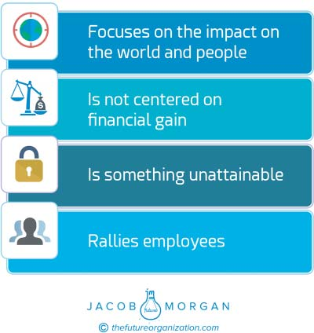
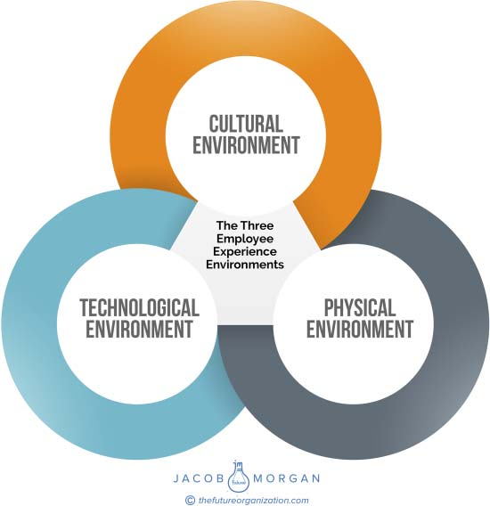
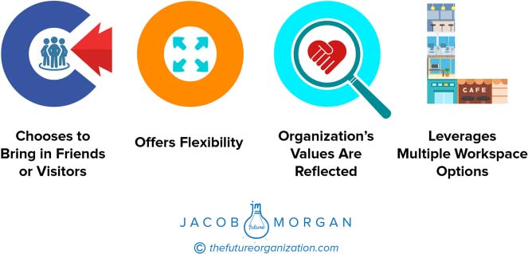

# **PART II**

**The Reason for Being and the Three**

**Employee Experience Environments**

Organizations seeking to create amazing employee experiences need

to start with a Reason for Being, which acts as the foundation for the

three employee experience environments—technology, the physical

space, and culture. In this section of the book, we will look at what all

of these components are, examples of what organizations are doing in

these respective areas, and some things that you might be able to do at

your organization.

**49**

**C H A P T E R** **4**

**Reason for Being**

We’ve all heard of mission statements that typically set out to explain the

purpose of the organization. Oftentimes they talk about being the market

leader, providing shareholder value, delivering superior customer experi-

ence, or something else along these lines. Although these statements may

talk about what the organization is trying to do, they don’t go beyond that

to make the leap from business to human. These statements or ideas do

little to inspire employees (or anyone else for that matter) or to encourage

action. Organizations that deliver amazing employee experiences tran-

scend this basic concept of a mission statement by connecting what the

organization does to the people who are actually affected. In other words,

it answers the question “What impact does the organization have on the

world and on the community around it?” This isn’t about shareholder

value, customer service, or profits, so you won’t find any of these things

mentioned. A great Reason for Being is also something that is unattain-

able, which forces the organization to keep thinking and dreaming big.

Last, this needs to be something that rallies employees and ignites them;

why should they care and why should they stand by you? You can see the

four attributes of a Reason for Being in figure 4.1 below.

In a _New York Times_ article titled “The Incalculable Value of Finding

a Job You Love,” Robert H. Frank, a professor of Cornell University,

stated, “One of the most important dimensions of job satisfaction is how

you feel about your employer’s mission.”1 This is based on a book he

wrote called W_hat Price the Moral High Ground?_ This, of course, should

**51**

**52** **T** **HE** **E** **MPLOYEE** **E** **XPERIENCE** **A** **DVANTAGE**

**FIGURE 4.1 A Reason for Being**

come as no surprise, but it should also force us to move beyond typical

mission statements.

Look at the following statements and ask yourself whom they belong

to and how they make you feel. Do these read like typical mission state-

ments or Reasons for Being? The differences are quite stark. Which

companies would you rather work for?

**STATEMENTS FROM LEADING ORGANIZATIONS**

People working together as a lean, global enterprise for automotive lead-

ership, as measured by: Customer, Employee, Dealer, Investor, Sup-

plier, Union/Council, and Community Satisfaction.

Belong Anywhere.

**R** **EASON FOR** **B** **EING** **53**

\[Company name\] is committed to our customers and employees, and

dedicated to delivering the highest levels of satisfaction in the imple-

mentation and ongoing support of our solutions.

To be a leader in the distribution and merchandising of food, pharmacy,

health and personal care items, seasonal merchandise, and related

products and services.

To refresh the world, to inspire moments of optimism and happiness, and

to create value and make a difference.

To inspire and nurture the human spirit—one person, one cup and one

neighborhood at a time.

To offer the finest service that assures customer satisfaction with cost

efficient structure and shortest delivery time.

To be the leading supplier of semiconductor fabrication solutions

worldwide—through innovation and enhancement of customer

productivity with systems and service solutions.

To organize the world’s information and make it universally accessible

and useful.

Use our pioneering spirit to responsibly deliver energy to the world

You can go through these and clearly tell the difference between org-

anizations that are following the mission statement 101 guide and

organizations that are creating a Reason for Being. Here’s the list of

companies mentioned above (in order).

Ford

Airbnb

McKesson

Kroger

Coca-Cola

Starbucks

EY

Applied Materials

Google

ConocoPhillips

**54** **T** **HE** **E** **MPLOYEE** **E** **XPERIENCE** **A** **DVANTAGE**

You can think of the Reason for Being as the umbrella that covers the

three employee experience environments. Employee experience starts

from there and affects the physical space, technology, and culture of the

organization.

Salesforce.com does an excellent job of this. Its Reason for Being

states:

Salesforce.org is based on a simple idea: leverage Salesforce’s

technology, people, and resources to help improve commu-

nities around the world. We call this integrated philanthropic

approach the 1-1-1 model because it started with a commitment

to leverage 1% of Salesforce’s technology, people, and resources

to improve communities around the world. By encouraging and

enabling companies to adopt the 1-1-1 model, Salesforce.org is

helping to spark a worldwide corporate giving revolution.

This statement clearly focuses on the impact on the world (improve

communities around the world), is not centered on financial gain (in fact

the only mention of anything around money deals with how much it gives,

not how much it gets), is something unattainable (there are countless

communities around the world), and definitely rallies employees who

want to make a difference.

Very few organizations around the world incorporate their philan-

thropic efforts directly into the goal of the company and why it actually

exists, especially if this isn’t a part of their core business. Salesforce.com

has become known around the world not just as a technology company

but also as an organization that wants to improve the world. This belief

and philosophy has been with the company since its creation decades

ago and is one of the reasons why Saleforce was among the top scoring

companies featured in this book.

From here we can start to look at an organization’s Employee Experi-

ence Score (ExS), which is determined by looking at 17 variables inside

of an organization. These are the 17 things that employees care about

most when it comes to technology, physical workplace, and culture:

● Consumer grade technology

● Technology availability

● Technology focusing on employee needs

**R** **EASON FOR** **B** **EING** **55**

● Workplace options

● Values reflected in the physical space

● Being proud to bring in friends or visitors

● Workplace flexibility and autonomy

● A sense of purpose

● Fair treatment

● Feeling valued

● Managers acting like coaches and mentors

● Feeling like you’re part of a team

● Ability to learn something new, advance, and get the resources to do

both

● Referring others to work at your organization

● Diversity and inclusion

● Health and wellness

● Brand perception

You can see the actual questions used to evaluate the ExS in the

Appendix, where you can see how your organization ranks. You can also

check out [https://TheFutureOrganization.com ](./https___TheFutureOrganization.com)to see the full rankings

and to take the assessment online. These 17 attributes are what the

most forward-thinking and progressive organizations around the world

are investing in. As you read more about each one of these variables,

you will also notice that they uncover more than what appears on the

surface. For example, looking at things such as being proud to bring

in friends or visitors or feeling a sense of purpose at the organization

reveals things that are not directly asked in the survey, such as having a

connection to the organization or feeling excitement about the brand.

You will see many of these as you read more about the 17 variables.

Out of the 252 organizations that I ranked and evaluated for all of

these variables, only 15 of them can be considered Experiential Organi-

zations, that is, the very best at providing employee experiences. In order

of rank these 15 organizations are:

1\. Facebook

2\. Apple

3\. Google

4\. LinkedIn **56** **T** **HE** **E** **MPLOYEE** **E** **XPERIENCE** **A** **DVANTAGE**

5\. Ultimate Software

6\. Airbnb

7\. Microsoft

8\. Riot Games

9\. Accenture

10\. Salesforce.com

11\. Hyland Software

12\. Cisco

13\. Amazon

14\. Adobe

15\. World Wide Technology

These comprise just 6 percent of the organizations I analyzed, which

shows that there is still a tremendous amount of growth and opportu-

nity for organizations around the world to focus on employee experience.

So what is it that these organizations are doing that others aren’t, and

perhaps more important, what’s the value of investing in employee expe-

rience? Many of the examples in this book will be of these leading orga-

nizations that I analyzed. However, there will also be a few examples of

organizations that I didn’t analyze but whose executives I had the oppor-

tunity to get to know and speak with, which I believe are also doing

unique things around employee experience.

In the next few chapters I’ll explore what the 17 attributes actu-

ally mean, what they measure, and what organizations are doing related

to these attributes. An entire book can easily be devoted to each one

of the 17 attributes (and some have books about them). I want to stress

that it is not my intention to provide a strategy for each one of these

17 variables. I simply want to convey why and how they are a part of the

overall employee experience.

**THE THREE EMPLOYEE EXPERIENCE ENVIRONMENTS**

Although employee experience can appear to be a daunting and some-

what nebulous concept, you should take comfort in knowing that any-

thing and everything your organization does now and in the future will

**R** **EASON FOR** **B** **EING** **57**

**FIGURE 4.2 The Three Employee Experience Environments**

fall into just three potential environments, which represent technology,

the physical space, and your culture (see Figure 4.2). Let’s look at each

one these in more detail and look at the specific variables that make

them up.

**NOTE**

1\. Frank, Robert H. “The Incalculable Value of Finding a Job You Love.” _New York_

_Times_, July 22, 2016\. [http://www.nytimes.com/2016/07/24/upshot/first-rule-of-the-](./http___www.nytimes.com_2016_07_24_upshot_first-rule-of-the-job-hunt-find-something-you-love-to-do.html_%5Fr=0)

[job-hunt-find-something-you-love-to-do.html?\_r=0.](./http___www.nytimes.com_2016_07_24_upshot_first-rule-of-the-job-hunt-find-something-you-love-to-do.html_%5Fr=0)

**C H A P T E R** **5**

**The Physical Environment**

The physical environment is the one in which employees actually work,

and it comprises 30 percent of the employee experience. This is our

surroundings and includes everything from the art that hangs on the

wall to the catered meals the organization may offer to the cubicles or

open floor plan employees may sit in. It’s no secret why our physical

space matters. We all want to spend our workdays in environments that

energize and inspire us. These types of workspaces help us feel more

creative, engaged, and connected to the company we work for. Not only

that but also the physical environments in which we work act as sym-

bols that represent the organization and our decision to be there. Great

physical environments act as positive symbols and representations. Poor

physical spaces act as negative ones. This was first discovered by Edgar

Schein, a former professor at the Massachusetts Institute of Technology

(MIT) Sloan School of Management and author of the book _Organiza-_

_tional Culture and Leadership_. In this book he talks about three levels

of organizational culture, which are artifacts, values, and assumptions.

According to Schein, all three of these things must align, and there are a

lot of parallels between these three levels and the three employee expe-

rience environments that are explored in this book.

Interestingly enough, with the rise of coworking locations, global

connectivity, and collaboration technologies, many people believe that

offices are going to die. This is only somewhat true. The traditional idea of

**59**

**60** **T** **HE** **E** **MPLOYEE** **E** **XPERIENCE** **A** **DVANTAGE**

an office is indeed going to die—the one with gray walls, brown carpets,

and lines of cubicle farms. However, the buildings themselves are going

through a bit of an office design renaissance, and instead of disappearing,

offices are reemerging as employee experience centers. According to

commercial real estate firm CBRE, commercial real estate (at least

in the United States) is at a seven-year high, and organizations such

as Amazon, Cisco, Samsung, Whirlpool, General Electric, Schneider

Electric, Deloitte, Microsoft, LinkedIn, and many others are investing

many millions of dollars into creating these employee experience

centers, for a very good reason. As the world of work continues to

evolve and change, so do the environments in which the work actually

gets done.

It’s like redesigning a car by upgrading the engine and leaving the

interior the same—it might be more powerful but if it’s not pleasant to

spend time in, you won’t want to drive it! A recent study by furniture

manufacturer Steelcase called “The Privacy Crisis” found that nearly

90 percent of workers around the world are less than satisfied with

their work environments, which means that there is a lot of room for

improvement. 1

In 2010 _British Journal of Management_ published a study by Craig

Knight and S. Alexander Haslam from Exeter University called “Your

Place or Mine? Organizational Identification and Comfort as Mediators

of Relationships Between the Managerial Control of Workspace and

Employees’ Satisfaction and Well-Being.” In the study they found that

there is a social identity that employees have with their workspaces, and

the physical environment can affect the psychological comfort of the

employees who work there.

To create a great physical environment for employees, organizations

need to focus on the following major characteristics, which are abbrevi-

ated as COOL (see Figure 5.1):

● Chooses to bring in friends or visitors

● Offers flexibility

● Organization’s values are reflected

● Leverages multiple workspace options

**T** **HE** **P** **HYSICAL** **E** **NVIRONMENT** **61**

**FIGURE 5.1 COOL Office Spaces**

**CHOOSES TO BRING IN FRIENDS OR VISITORS**

Why do organizations such as Airbnb, LinkedIn, Zappos, and Google let

you bring your friends or family members to work? Facebook actually

lets any employee bring up to four visitors at any time to see the campus,

eat, and hang out. This is actually encouraged. But for what? It certainly

takes time, effort, and resources to host and guide people around who

don’t actually work there so why make the investment?

It turns out there’s a lot you can learn about an organization that

is willing to open up its doors to others. From what I have observed,

these types of organizations tend to have more focus on overall employee

well-being, create a sense of community and diversity, drive innovation,

and do a better job of connecting what the organization does back to the

employees. In a sense, they have to because they are living and working

in a metaphorical glass house that anyone can see into. These compa-

nies invest heavily in creating great employee experiences, which is why

they feel confident opening their doors. They are holding themselves

accountable.

As I mentioned above our offices are evolving into employee expe-

rience centers—museum-like places where employees can feel a sense **62** **T** **HE** **E** **MPLOYEE** **E** **XPERIENCE** **A** **DVANTAGE**

of awe, curiosity, inspiration, joy, and pride. We all want to feel proud of

the spaces we work in. The physical workspace helps create a connection

between the organization and the employees who work there. Ultimately

the physical environment is a reflection of the values of the organiza-

tion (which is another key criterion of designing employee experiences

discussed later in this chapter). Employees who work in great physical

environments typically feel a sense of pride and joy when it comes to their

office space. They want to show it off when they are given the opportunity

to do so.

When I was younger I worked for various organizations in roles that

included a grocery clerk, telemarketer, movie theater usher, marketing

analyst, and strategy consultant. When I worked at Whole Foods Market

as a grocery clerk, I would always be proud when people walked into my

so-called office. It was always well organized, clean, and modern looking.

Interestingly enough, years later when I worked as a consultant for a

400,000-person company, I would have dreaded for any of my friends or

family members to come visit me in my dreary cubicle. To this day I look

back at my fond memories of working at Whole Foods, which I consider

one of the best jobs I’ve ever had.

One of the easiest and most effective ways an organization can get

a sense of whether employees feel proud of their workspaces and a

connection to the organization is by seeing whether employees bring in

their friends and family members when and if allowed. Funny enough,

you rarely hear about a company with an unattractive work environment

offering something like this! I always encourage organizations to open

their doors to friends, family members, and strangers if possible. Let

people take tours, speak with employees, and get a sense of what it’s like

to work there.

If your organization is uncomfortable doing so, then chances are that

the environment in which employees work is not seen as something to

be proud of (assuming you don’t have any legal issues preventing people

from coming into the office).

In addition, opening your doors can also be a great talent and recruit-

ment strategy, assuming that you have an inspiring environment where

your employees work. It’s why so many business leaders from around the

world flock to Silicon Valley to see what the organizations there are doing.

**T** **HE** **P** **HYSICAL** **E** **NVIRONMENT** **63**

If you have a great physical workspace, why wouldn’t you want to show it

to others? You can bet that when nonemployees walk through the door

and think, “Man, this must be a cool place to work,” they will be checking

out your job listings page when they get home. Of course, the opposite

is also true, which is why the physical space is so important.

The rationale behind looking at this variable as a function of

employee experience is quite straightforward. If employees feel like

they work in a beautiful and modern environment, they will typically

leverage the opportunity to show it to visitors and friends. Do you have

the confidence to open your doors to others?

**What This Measures**

● Pride in the employee’s workplace

● Excitement about the organization

● Connection between employees and the organization

**What You Can Do**

● Open up your organization to friends and family members of employ-

ees and even the public who might want to do a tour (assuming you

have a space worth looking at; if not, that’s a bigger issue!).

● Think of your physical environment as an employee experience center

instead of as an office.

See Table 5.1 to see who some of the highest- and lowest-scoring

companies for this variable are.

**TABLE 5.1 Chooses to Bring in Friends or Visitors**

**Some Highest-Scoring** **Some Lowest-Scoring** **Organizations** **Organizations**

Apple Gilead Sciences Facebook World Fuel Services LinkedIn Safeway Riot Games Sears **64** **T** **HE** **E** **MPLOYEE** **E** **XPERIENCE** **A** **DVANTAGE**

**OFFERS FLEXIBILITY**

I explored this in considerable depth in my previous book, _The Future_

_of Work_. Workplace flexibility continues to be a massive area of desire

for employees and focus for organizations. We live in a hyperconnected

global world where work-life balance has been obliterated and replaced

by work-life integration. This means we take our personal lives to work

and our work lives home. To continue to work in this type of environ-

ment, we have to abandon the notion of the 9 to 5 workday and instead

shift toward allowing employees to work anytime from locations of their

choosing whenever possible. Granted, this type of work environment

is not suited or available for every type of role, for example manu-

facturing. Still, employees should have as much flexibility and choice

as possible.

Consider the following statistics from Global Workplace Analytics:

● Half of the U.S. workforce has jobs in which at least partial telework is

possible, and one-quarter to one-fifth of the workforce works remotely

with some frequency.

● Eighty percent to 90 percent of U.S. employees would like to telework

part-time at minimum. Two or three days per week appears to be the

right amount, allowing enough time for on-site collaborative work and

off-site concentrative work.

● Because studies show employees are away from their desk as much as

60 percent of their workday, Fortune 1000 companies worldwide are

entirely redesigning their space. 2

However, workplace flexibility doesn’t simply mean letting employ-

ees work from home. Flexibility refers to employees genuinely being able

to pick when and where they work whether it means coming into an

office, working from home, going to a coffee shop or coworking facility,

or going anywhere else where they can get their jobs done. According

to FlexJobs, a site that allows employees to search for the best flexible
