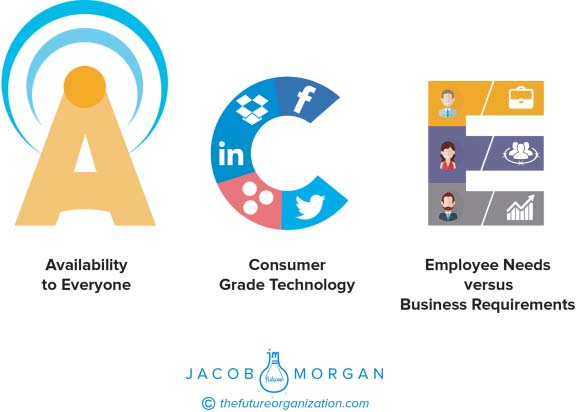

**C H A P T E R** **6**

**The Technological**

**Environment**

In 2016 I delivered a talk to a large organization where I explored how

the workplace is changing. After my talk I held some candid discussions

where employees could share pretty much anything they wanted with

me. In almost every conversation I had employees told me how much

they loved the people whom they worked with and the work they did.

Still, many of them were extremely frustrated and unhappy with the com-

pany they were a part of. Several were already interviewing elsewhere.

Naturally my response was “Why would you want to leave an organiza-

tion where you love the people and the work?” At this particular company

the answer was technology. Employees were extremely frustrated with

the tools they were using to get their jobs done. Information would go

missing, it would take too many steps to complete simple tasks, things

would freeze up, and the interfaces were quite literally from the 1980s.

This made their jobs much harder to do, which in turn caused

employees to get upset with one another and resent the organization for

not doing anything to improve the situation.

Although we view technology as something that lives in a sep-

arate nonhuman bucket, technology has a palpable impact on the

organization—it’s what we use to communicate, collaborate, and actu-

ally get our jobs done. If the tools break down, then everything else

around them, including the human relationships, also breaks down.

**77**

**78** **T** **HE** **E** **MPLOYEE** **E** **XPERIENCE** **A** **DVANTAGE**

The technological environment includes everything from the apps

you use to the hardware and software to the user interface and design.

Any technologies you use to get your job done are a part of the tech-

nological environment, whether they be videoconferencing platforms,

internal social networks, task management tools, human resources (HR)

software, billing and invoicing systems, or anything in between. This is

also where we typically hear the phrase _digital transformation_ mentioned

as organizations struggle to apply these technologies to all aspects of how

employees work.

Technology is what helps enable much of the future of work and

employee experience—it acts as the glue and the nervous system that

power the organization. To improve the overall employee experience,

organizations must create an ACE technological environment. If you’re

interested in learning more about technology deployments (specifi-

cally those related to social collaboration), I wrote a 340-page book

specifically about this topic called _The Collaborative Organization_ which

came out in 2012.

To create a great technological environment for employees, organi-

zations need to focus on the following major characteristics, which are

abbreviated as ACE (see Figure 6.1):

● Availability to everyone

● Consumer grade technology

● Employee needs versus business requirements

**AVAILABILITY TO EVERYONE**

Although many organizations have good intentions, they oftentimes seg-

ment and isolate certain employees who get access to new technologies.

For example, the engineering team has a great new platform that only

it is allowed to use. I’ve interviewed many employees who feel a bit

neglected when they know that their peers are getting access to technolo-

gies that they don’t have access to. And why can’t they access these new

technologies? “It wasn’t approved for everyone.” Employees are the

ones doing the actual work, so they should clearly have a say in the types

**T** **HE** **T** **ECHNOLOGICAL** **E** **NVIRONMENT** **79**

**FIGURE 6.1 ACE Technology**

of technologies that they are using, especially if another team or

department already has access to it. Technology availability also becomes

even more of an issue when we look at flexible work arrangements.

Typically the teams that have the technologies in place to support flexible

work (videoconferencing, internal social networks, task and project

management tools, and the like) are the ones who actually get to take

advantage of it.

It’s not hard to see why this can cause problems, resentment, and

frustration, thus negatively affecting the overall employee experience.

Technology that is granted to one subset of employees should be made

available to all if they want it and are aware of it. Organizations have long

approached technology deployments from a multiyear pilot program

standpoint, but all the chief information officers and chief technology

officers I speak with agree that with the rapid pace of technological

change, this type of model no longer works and isn’t practical. By the time

your organization settles on something it wants to roll out effectively, **80** **T** **HE** **E** **MPLOYEE** **E** **XPERIENCE** **A** **DVANTAGE**

a few years will go by, the workforce won’t look the same, and the tech-

nologies you are implementing will already be out of date. A study by

_MIT Sloan Management Review_ and Capgemini Consulting reported

by Michael Fitzgerald, Nina Kruschwitz, Didier Bonnet, and Michael

Welch called “Embracing Digital Technology: A New Strategic Imper-

ative” found that 63 percent of respondents said the pace of technology

change in their organization is too slow. 1

Although some pilot projects are perfectly fine to have, long-term

technology access to only a subset of employees actually does far more

harm than good. One of the ways to make sure you create a great techno-

logical environment is by making the technologies available to everyone

who works there.

The San Diego Zoo is 100-year-old nonprofit with a lofty goal of try-

ing to end extinction. To date it has over 3,000 employees who range from

cashiers to zoologists and botanists to animal trainers and office workers.

It’s one of the most diverse organizations in existence. I spent some time

with Tim Mulligan, chief human resources officer, and Steisha Ponczoch,

HR manager, to learn more about how the zoo can possibly equip such a

diverse workforce with technology. Surely if it can do it, anyone can.

Not that long ago all the training and education that was done at the

San Diego Zoo was done in classrooms with books, binders, and note tak-

ing. The company didn’t even allow employees to be on their cell phones

while on the job. It has come a long way since then! Today it has a robust

online training and learning management system that allows employees

to learn on their own time. Any employee (including the animal trainers)

can access essential training for free at their fingertips from any com-

puter, including those provided in the two Learning Labs that Tim and

his team have created for staff use.

A few years ago a strategic decision was made to go paperless, and

since then all personnel files are stored online where they can be accessed

when needed. All HR forms are now completed electronically as well,

including onboarding paperwork, which, in the first year of implemen-

tation, eliminated over 100,000 sheets of paper for that process alone.

This move has since inspired other departments to archive and process

paperlessly, helping the zoo conserve natural resources.

**T** **HE** **T** **ECHNOLOGICAL** **E** **NVIRONMENT** **81**

Beyond using technology for work, Mulligan developed a program

to provide even greater access to technology that employees can use

in their personal lives as well. The Z-Tech program offers interest-

free payroll deductions on dozens of the latest tech products, such as

computers, cameras, tablets, printers, smart watches, and even gaming

consoles. This incredibly successful program has helped hundreds of

employees, who otherwise either may not have had the funds up front

to purchase them or may have gotten stuck with high-interest financing,

gain access to technology.

In today’s world there is really no excuse for why every employee at

your company can’t have access to technology.

**What This Measures**

● Commitment to driving innovation, collaboration, and communication

across the organization

● Focus on enabling the organization as a whole

● Technological adeptness

**What You Can Do**

● Whenever possible default to giving employees more access, not less.

● Be as transparent as you can with new technology decisions and

deployments.

See Table 6.1, which shows some of the highest- and lowest-scoring

companies for this variable.

**TABLE 6.1 Availability to Everyone**

**Some Highest-Scoring** **Some Lowest-Scoring** **Organizations** **Organizations**

Facebook World Fuel Services Apple Southern Ohio Medical Center Google Gilead Sciences Riot Games Gilbane **82** **T** **HE** **E** **MPLOYEE** **E** **XPERIENCE** **A** **DVANTAGE**

**CONSUMER GRADE TECHNOLOGY**

Over the past few years we’ve placed an unhealthy emphasis on deploying

enterprise grade technologies. Although there is no standard definition

of what this actually means, it usually refers to technology that is suited to

the needs of a large organization versus being used by individuals or con-

sumers (consumer grade technology). Ideally this means it’s more robust,

securer, more flexible, and more geared for IT professionals to manage

and deploy. But really what this ends up meaning inside of large organiza-

tions is clunky, outdated software. I’ve seen many of these technologies,

and I’m always amazed that people actually use them. I’m sure many

readers of this book can relate.

I equate this to the organization buying a giant bulletproof tank when

employees really want and need something more stylish, maneuverable,

flexible, modern, and attractive. This is why so many new enterprise tools

today are modeling themselves after technologies we use in our per-

sonal lives all the time (platforms such as Twitter, LinkedIn, Facebook, or

Google). In a sense, the consumer technologies are becoming enterprise

technologies. A simpler way for organizations to look at this is by giving

tools to employees that actually look like they are designed for humans

and not for rocket scientists or developers (yes, they are humans too!).

My definition of a consumer grade technology is something that is so well

designed, useful, and valuable that you would consider using something

similar in your personal life if it existed.

Think of the file-sharing tools you use at work. Would you use some-

thing similar in your life to organize your personal information? What

about the billing and invoice system you have? Would you use the same

technology to organize your personal finances? What about your cus-

tomer relationship management system? Would you store your contacts

using the same technology? You can see the direction this is going in.

We have access to so many amazing technologies and platforms in our

personal lives, but for some reason when we show up to work, we are

stuck using the same tools we used to use decades earlier. Imagine if you

still had one of those old TVs at home where you had to get up and phys-

ically change the channel. What if you had a rotary phone in your home

**T** **HE** **T** **ECHNOLOGICAL** **E** **NVIRONMENT** **83**

or an old IBM Commodore computer? (I’ve never seen one but I hear

they were all the rage back in the day!)

This is why organizations like The Royal Bank of Scotland have

rolled out Facebook at Work (the business version of Facebook) to over

100,000 employees. They recognize that employees use Facebook in

their personal lives and want something that emulates that experience

in the workplace. Roche, the 90,000-person company that specializes in

research-focused health care, recently switched over to G Suite (for-

merly called Google for Work) for the same reasons. These are just

two of the many organizations around the world that focus on giving

employees tools that emulate the platforms and technologies they would

use in their personal lives. There are a few benefits to doing this.

Most of the time when organizations deploy new, complex technol-

ogy solutions, there’s a lot of training and education that is required to

teach employees how and why to use these new tools. Granted, educa-

tion and training is needed for any type of change, but when employ-

ees are familiar with the technologies, they are much more likely to get

up to speed quicker. Familiarity also removes complexity which means

employees will actually use the tools. Consumer grade technologies are

also more modern, more user friendly, and in general better looking than

their traditional enterprise counterparts. Again this increases the likeli-

hood of adoption, but it also has a bit of the _cool_ factor, which employees

certainly value and appreciate. Deploying consumer grade technologies

is a big factor for the technological environment.

**What This Measures**

● Forward-thinking approach to technology across the organization

● Creating a modern work experience

● Enabling employees to be most effective and engaged in their jobs

**What You Can Do**

● Shift your thinking away from enterprise grade to consumer grade

technologies.

● Look at the technologies employees use in their personal lives, and see

what technological attributes you can bring into the organization.

**84** **T** **HE** **E** **MPLOYEE** **E** **XPERIENCE** **A** **DVANTAGE**

**TABLE 6.2 Consumer Grade Technology**

**Some Highest-Scoring** **Some Lowest-Scoring** **Organizations** **Organizations**

Microsoft Honeywell Apple SAS Google Northwestern Mutual Riot Games Target

See Table 6.2, which shows some of the highest- and lowest-scoring

companies for this variable.

**EMPLOYEE NEEDS VERSUS BUSINESS REQUIREMENTS**

Let’s imagine for a moment that you walk into a car dealership and

tell one of the sales representatives that you’re looking for a car. He or

she greets you and says, “Tell me what you’re looking for?” and you

respond by saying, “Well it needs to be able to fit five people, has to have

great horsepower and torque, must be painted blue, and has to have all

the new modern features of today’s car.” The dealer says, “Perfect,

I have something for you.” He or she then proceeds to wheel out a

Frankenstein-like monstrosity that has five seats all on the left side of the

car, a massive engine on the right side of the car, a steering wheel that’s

attached to the roof, and splotchy blue paint. “That will be $60,000.

How do you want to pay?”

You’re shocked! “I can’t pay for this, that’s not a car!”

“Sure it is. It has everything you wanted. See, I wrote it down here.”

That’s the difference between focusing on the needs of the employ-

ees versus the requirements of the business. Most IT departments simply

go through a checklist of items instead of understanding how and why

employees work. The problem with this, as outlined in the Frankencar

example above, is that the way employees work rarely aligns with the

technical checklist of the organization.
