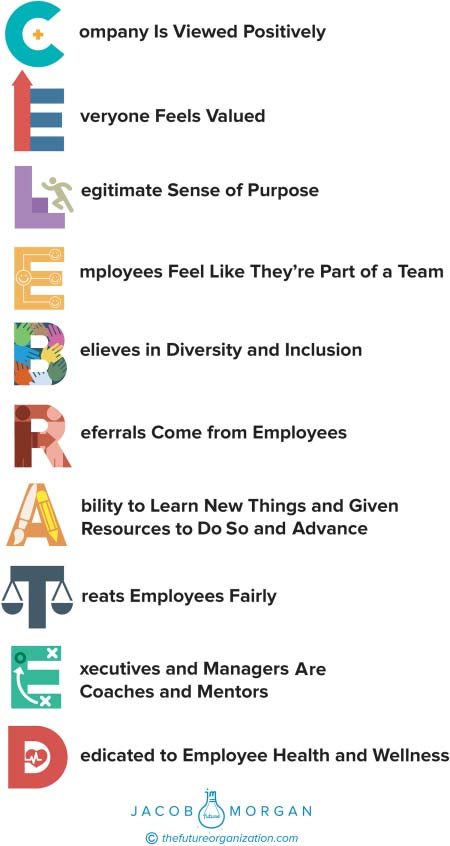

**C H A P T E R** **7**

**The Cultural Environment**

Out of all the employees and business leaders whom I have interviewed

over the years, the vast majority of them have always told me that cul-

ture is what they care about most. Unlike the previous two environments,

the cultural environment isn’t the one that you can see, touch, taste, or

breathe in. This is the only environment that you feel. That feeling is the

pit in your stomach when you don’t want to go to work or the excitement

and butterflies you get from wanting to go to work. Simply put, the cul-

tural environment is the vibe of your organization and the actions that

are taken to create that vibe or feeling.

The culture of the organization determines how employees are

treated, the products or services that are created, the partnerships that

are established, and even how employees actually get their jobs done.

What’s fascinating about culture, though, is that it exists regardless of

whether the organization realizes it or decides to create it. A technologi-

cal environment doesn’t exist without actual things that the organization

deploys. A physical environment doesn’t exist unless the organization cre-

ates or designates one. But the corporate culture is like air. It’s around all

the employees who work there even if they aren’t always aware of it. This

is why it’s so crucial to actually create and design a culture instead of just

letting it exist. So what does the cultural environment actually look like?

**89**

**90** **T** **HE** **E** **MPLOYEE** **E** **XPERIENCE** **A** **DVANTAGE**

There are 10 attributes that organizations must focus on to create a

CELEBRATED culture (see Figure 7.1):

● Company is viewed positively

● Everyone feels valued

● Legitimate sense of purpose

● Employees feel like they’re part of a team

● Believes in diversity and inclusion

● Referrals come from employees

● Ability to learn new things and given the resources to do so and

advance

● Treats employees fairly

● Executives and managers are coaches and mentors

● Dedicated to employee health and wellness

**COMPANY IS VIEWED POSITIVELY**

Have you ever dated someone who you thought was a great catch, and

then all of your friends and family members told you that they didn’t like

him or her (please tell me I’m not the only one)? Even if you thought this

person was the one, you started to have doubts and reservations about

this person. The same is true in the business world. If you start work-

ing for an organization that you believe to be a good fit and then hear

about how much people don’t like the company you are working for, you

will start having doubts. This doesn’t necessarily mean you will quit the

company, but your overall employee experience will be affected nega-

tively. I’m sure you can think of several examples of organizations that

have treated animals cruelly, represented unethical business practices,

harmed employees or the environment, or treated customers unfairly.

Keep in mind that this isn’t just about employees viewing the company

positively but the public as well. We live in a very open and transpar-

ent world, so when an organization does something wrong or unethical,

people tend to find out. Similarly when an organization is admired and

revered, people want to work there.

**T** **HE** **C** **ULTURAL** **E** **NVIRONMENT** **91**

**FIGURE 7.1 CELEBRATED Culture**
