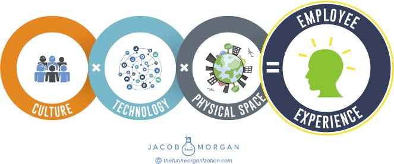

**C H A P T E R** **8**

**The Employee Experience**

**Equation**

The Reason for Being guides how the organization acts when it comes

to creating employee experiences. To better visualize the 17 variables

that create COOL spaces, ACE technology, and a CELEBRATED

culture, I created something called the employee experience equation

which you can see in figure 8.1\. The goal is to show that all three of these

environments are required to create the overall employee experience

and the more of the environments you can execute on, the better that

experience is going to be.

The original version of this concept had + signs instead of × signs,

but the more I started to dig into these environments, the more I real-

ized how much of a dramatic impact they had on one another. This led me

to understand that although culture, technology, and the physical envi-

ronment are very distinct from one another, they each help empower

and support the other. For example, one of the attributes of the physical

environment is flexibility, yet flexibility is not possible without having the

right technologies in place. One of the attributes of the cultural environ-

ment is allowing employees to learn and grow. Again this is not possi-

ble without having the right technologies in place to allow learning and

education at scale in a modern way. We can see in these examples that

although technology is its own entity, it also has an impact on the physical

and the cultural environments. This same exercise can be done with any

**131**

**132** **T** **HE** **E** **MPLOYEE** **E** **XPERIENCE** **A** **DVANTAGE**

**FIGURE 8.1 The Employee Experience Equation**

of the three environments. As a result the employee experience equation

isn’t so much a linear addition as it is an exponential evolution. Organiza-

tions that focus on all three of these environments will see a dramatically

larger impact when compared with organizations that focus on just one

or even two of the environments.

No single environment can get to its maximum potential without hav-

ing the support of the other two. This is one of the reasons why so many

organizations around the world are struggling with not only improving

employee engagement but also justifying the investments required. They

are stuck focusing on just a small part of the big picture, and even that

small part isn’t being executed on well.

Thinking of the overall employee experience in this type of equation

helps organizations realize that all three environments are crucial and

have a much greater impact than the sum of their individual parts. This

will become quite clear when you get to the Chapter 11 which focuses

on the business value of employee experience.
