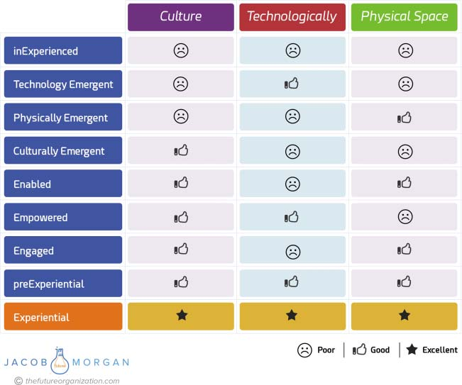

## Chapter 7) and the COOL physical space (see Chapter 5) attributes.

Again, the cultural environment is the most challenging one to execute

on. In engaged organizations you will find employees who have a sense

of purpose, managers who act as coaches and mentors, a flatter organiza-

tional structure, and physical workspaces that are modern, are beautiful,

and focus on creating multiple floor plans. The big challenge for engaged

organizations is providing employees access to the right tools to do their

jobs effectively. Although engaged organizations have gone quite far with

how well they are able to execute on the cultural and the physical space,

not having a great technological environment holds both of these other

two environments back. For example, organizations that try to abolish

annual reviews, offer amazing management training solutions, or enable

real-time communication and collaboration will find that these are not

possible and are not as effective without being supported by great tech-

nologies. If you look at the physical environment, you can’t enable flexible

work, Activity Based Working, or any type of effective employee mobility

without having the right technologies in place. Based on this it’s not hard

to see how poor technology can negatively affect both the cultural and

the physical environments.

**140** **T** **HE** **E** **MPLOYEE** **E** **XPERIENCE** **A** **DVANTAGE**

Remember, technology is the glue that holds the organization

together, and it’s what allows many of the themes discussed in this

book to actually manifest. Engaged organizations struggle with trying to

execute on employee experience simply because they don’t have all the

tools to do so. Examples of organizations in this category include Mars,

General Mills, and Nestlé.

**Empowered**

If your organization has a great technological and cultural environment

but lacks in the physical environment, then it is classified as being

empowered. Empowered organizations can actually be extremely effec-

tive because employees love the people they work with and the company

they work for, and they have access to technology that enables them

to do their best work. Still, even in these types of organizations, the

employee experience could be improved by investing in the physical

environment that employees actually work in. As we saw in the first half

of the book, the physical space is a crucial environment to invest in. In

empowered organizations you will still find plenty of cubicles and closed

offices that dominate the overall office design, which oftentimes can

leave employees feeling a bit uninspired, unengaged, and unmotivated.

In the case of Sanofi mentioned in Chapter 5, we also saw how having

a physical environment layered with cubicles and offices reserved for

executives can contribute to a strict hierarchy, thus negatively affecting

culture. Remember that the physical environment is the easiest way for

us to determine the values and vibe of an organization. The good news

is that making changes to the physical workspace is probably the easiest

thing (out of the three) to do. Not only that but also it can also be quite

fun. Examples of organizations in this category include IBM, Disney,

and MasterCard.

**Enabled**

These types of organizations are great at the physical and technological

environments, but sadly, when it comes to culture, they are a bit behind

the curve. This means employees have access to the best technologies

**T** **HE** **N** **INE** **T** **YPES OF** **O** **RGANIZATIONS** **141**

and work in a beautiful office environment, but the work they are doing

feels a bit empty. Many of the human needs of employees are simply

not met. The cultural environment is the one that employees care about

most, so when it’s not being invested in properly, it can really have a nega-

tive impact on the employee experience. Enabled organizations are very

productive and efficient almost like a modern-day assembly line. Things

just get done but at the cost of the overall employee well-being. In these

types of organizations employees come to view their jobs as simply a pay-

check, one they’re happy to receive and work for, but still just a paycheck.

As a result burnout happens more frequently, and issues begin to arise

with attracting and retaining top talent. Examples of organizations in this

category include FedEx, USAA, and Pfizer.

**PREEXPERIENTIAL**

These are organizations that do quite well on all the employee experi-

ence environments but they aren’t amazing at them. You can expect to

see many of the attributes of COOL spaces (Chapter 5), ACE technology

(Chapter 6), and a CELEBRATED culture (Chapter 7) implemented in

the organization, which is fantastic. Employees at preExperiential orga-

nizations also tend to be quite happy, but when an opportunity comes

along to join an Experiential Organization, they will likely make the leap!

PreExperiential organizations also start to see a fair amount of the busi-

ness value associated with investing in employee experience, but as we

will see later on, it pales in comparison with what the leading organi-

zations are seeing. If you feel like your organization is doing a good, but

not great, job in all three employee experience environments, then you’re

working for a preExperiential organization. Examples of organizations in

this category include Dow Chemical, IKEA, and Whirlpool.

**EXPERIENTIAL**

This is the cream of the crop. Only 6 percent of the 252 organizations

I analyzed fell into the Experiential category. Ultimately these are the **142** **T** **HE** **E** **MPLOYEE** **E** **XPERIENCE** **A** **DVANTAGE**

companies that are best at creating an environment where people truly

want, not need, to show up to work. This is the ideal scenario for most

organizations and the employees who work there, which means the orga-

nization has a great Reason for Being and has mastered COOL spaces,

ACE technology, and creating a CELEBRATED culture. Experiential

organizations are the ones that have mastered the art and science of

creating employee experiences. As changes in technology, design trends,

and workplace values and attitudes continue to change, the experiential

organizations will undoubtedly have to adapt. I’ll look at more of

the business value in Chapter 11\. The very best organizations were

**FIGURE 9.1 The Nine Employee Experience Categories**

**T** **HE** **N** **INE** **T** **YPES OF** **O** **RGANIZATIONS** **143**

already listed in Part 2, but examples include Google, Airbnb, Accenture,

Linkedin, Microsoft, and Cisco.

Figure 9.1 provides a nice and simple breakdown of all of these.

When looking at these nine categories, it’s also important to note that

organizations can easily move up and down this list and skip around from

one category to another. This isn’t simply a linear series of movements.

It’s quite conceivable that an organization can be classified as Experi-

ential and then, as a result of inaction, slip down to Engaged and then

return to Experiential.
