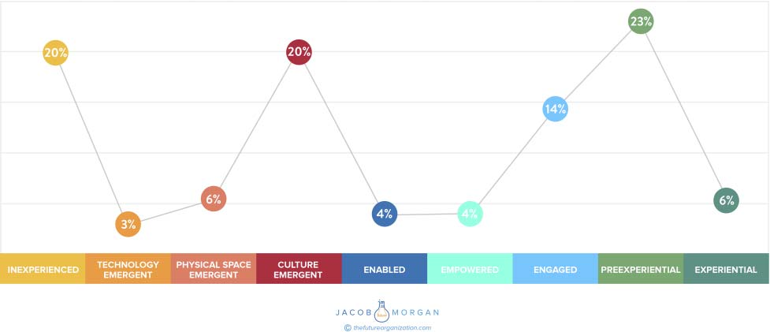

**C H A P T E R** **10**

**Employee Experience**

**Distribution**

In Figure 10.1 below you can see the breakdown of how many organiza-

tions fall into each type of category but I’ve also written what percentage

of the 252 organizations make up each category below:

1\. inExperienced (20 percent)

2\. Technologically emergent (3 percent)

3\. Physically emergent (6 percent)

4\. Culturally emergent (20 percent)

5\. Engaged (14 percent)

6\. Empowered (4 percent)

7\. Enabled (4 percent)

8\. preExperiential (23 percent)

9\. Experiential (6 percent)

There are a few interesting insights we can draw from this data:

● Almost half (49 percent) of the 252 organizations I analyzed are

focusing on either none (20 percent) or one (29 percent) of the three

employee experience environments. This is an astonishingly high

number.

**145**

**FIGURE 10.1** **Percentage of Companies by Employee Experience Category**
