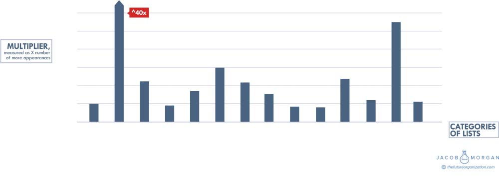

**C H A P T E R** **11**

**The Business Value**

**of Employee Experience**

Why bother investing in employee experience? Who cares about culture,

technology, the physical work environment, and this weird thing called

a Reason for Being? Is there really any value to investing in employee

experience and becoming an Experiential Organization? As it turns out

there is—a lot of it.

Before going on let’s do a quick recap of the nine types of organi-

zations so that you can easily reference the list when reading about and

seeing the comparisons.

**inExperienced**—Poor at culture, technology, and physical space

**Technology Emergent**—Good at technology, poor at culture and phys-

ical space

**Physically Emergent**—Good at physical space, poor at culture and

technology

**Culturally Emergent**—Good at culture, poor at physical space and

technology

**Enabled**—Good at culture and physical space, poor at technology

**Empowered**—Good at culture and technology, poor at physical space

**Engaged**—Good at culture and physical space, poor at technology

**preExperiential**—Good at culture, technology, and physical space

**Experiential**—Amazing at culture, technology, and physical space

**149**

**150** **T** **HE** **E** **MPLOYEE** **E** **XPERIENCE** **A** **DVANTAGE**

Throughout this section I will also reference nonExperiential

Organizations. These comprise all the above categories except the Expe-

riential Organizations (eight categories above). In other words, every

organization except for the top 6 percent makes up the nonExperiential

group.

To figure out the business impact of employee experience, I looked at

four things. The first was anecdotal and observational data that executives

shared with me. I had quite a few executives tell me that they observed

a more productive workforce, a larger talent pipeline, improved levels of

innovation, increased morale, and the like. They didn’t have solid data

to show this, but they did see and experience it, which was still a posi-

tive piece of data to look at. The second thing I did was look at dozens

of other lists and rankings of leading organizations to see whether Expe-

riential Organizations appeared on those lists and rankings more often

than organizations in other categories. For example, would an Experi-

ential Organization appear on a most innovative company list or a best

customer service list more often than any other category of organiza-

tions? Next, I looked at metrics around employee turnover, median pay,

average profit, employee growth, and average revenue to see how Expe-

riential Organizations compared to others. Last, I wanted to compare

stock price performance of various categories of organizations against

each other and against the Standard & Poor’s 500 and the NASDAQ.

Just for fun I also did a comparison of Experiential Organizations and

Glassdoor’s 2016 Best Places to Work list (for large companies) and _For-_

_tune’s_ 100 Best Companies to Work For in 2016, which is based on data

from Great Place to Work.

Before actually doing any of the data collection for this book, I had a

hunch that companies such as LinkedIn, Cisco, Airbnb, and other Expe-

riential Organizations would score high on the Employee Experience

Index. I’ve visited their offices and spoken with their executive teams,

so I was aware of the considerable time and investment that these com-

panies were putting into designing employee experiences. I also believed

that these companies should appear on various leading organizations lists

(and rank higher) more often than other types of companies. However,

with research and data analysis, you never really know what the outcome

**T** **HE** **B** **USINESS** **V** **ALUE OF** **E** **MPLOYEE** **E** **XPERIENCE** **151**

is going to be until you actually see the results. Fortunately in this case,

the data showed that the Experiential Organizations absolutely dominate

every other category of organizations.

Figure 11.1 below shows the comparison between Experiential

Organizations and the other eight types of organizations. You can

see how much more often Experiential Organizations appeared on

leading lists for innovation, customer service, employee happiness, and

employer attractiveness and on a few other miscellaneous lists I found.

You can also see how Experiential Organizations compare on various

financial and business metrics.

I sliced and diced the data all sorts of ways to compare not only how

these nine organizations compare against one another but also how the

single top category of Experiential Organizations compares against

the other eight categories of organizations combined (simply called

nonExperiential). I didn’t include every single chart and comparison in

this book because that alone would take up many dozens of pages.

For these comparisons you will see various numbers that represent

multipliers. This means that if you see a number such as 3.8 it means that

the Experiential Organizations appeared on the particular list 3.8× more

frequently than the other categories of organizations.

Let’s look at these areas in more detail.

**CUSTOMER SERVICE**

To start I looked at whether Experiential Organizations appeared on vari-

ous customer service lists more frequently and higher up than other orga-

nizations. I looked at a few lists, including the 24/7 Wall Street Customer

Service Hall of Fame rankings, Temkin Customer Service Ratings, and

the American Customer Satisfaction Index. Experiential Organizations

appeared on these lists 2× as often as every other category of organi-

zation combined. When comparing Experiential (the best) versus inEx-

perienced (the worst) organizations, this number almost doubled. The

lowest gap appeared between the Experiential and the preExperiential

(second best) Organizations. In that case the multiplier was 1.3, still a

**12.0**

**10.0**

**8.0**

**6.0**

**4.0**

**2.0**

**0.0**

**Top HR**

**Innovation**

**Brand Value**

**Most Powerful**

**Customer Service** **Green Companies**

**Admiration & Respect** **Employee Happiness** **Smartest Companies**

**Employer Attractiveness** **Great Places for Diversity**

**Top 100 Exponential Quotient** **Great Places for Camaraderie**

**Best Place to Work for Millennials**

**FIGURE 11.1** **Frequency of Experiential Organization Appearances on Lists**
