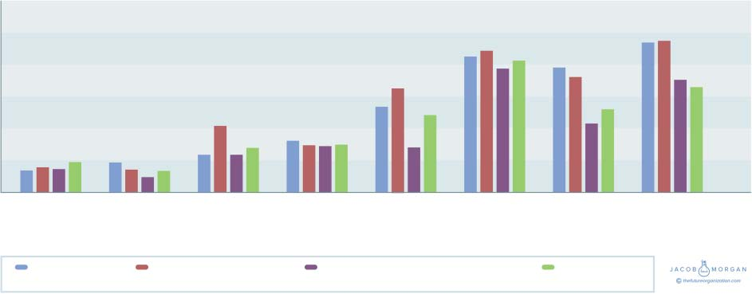

**C H A P T E R** **12**

**Business Metrics and**

**Financial Performance**

Comparing the nine categories on these lists clearly reveals some inter-

esting insights. However, I wanted to take this one step further and look

at some financial data and business performance metrics. I looked at

data provided by organizations such as Yahoo! Finance, PayScale, and

_Fortune_. Although I couldn’t find every metric for every company, I was

certainly able to cover the vast majority of them. I compared Experiential

Organizations with other categories based on employee turnover, median

pay, revenue per employee, and profit per employee. Figure 12.1 looks

at Experiential Organizations versus nonExperiential, and Figure 12.2

provides a breakdown of how Experiential Organizations perform versus

all the other categories of organizations.

Experiential Organizations had 20 percent fewer employees,

40 percent lower turnover, 1.5× the employee growth, 2.1× the average

revenue, 4.4× the average profit, 2.9× more revenue per employee, and

4.3× more profit per employees when compared with nonExperiential

Organizations. I’d recommend you reread that last sentence a few times

and let those numbers sink in. Looking at these numbers also makes it

quite clear that Experiential Organizations are also the most productive.

This should convince even the most skeptical reader or executive that

investing in employee experience does have a significant financial impact

on the organization. Another interesting thing to note is that, perhaps

**157**

**4.5**

**4** **4.2**

**4.0**

**3.5**

**3**

**2.8**

**2.5**

**2** **2.1**

**Multiplier**

**1.5**

**1.5** **1.5**

**1**

_(measured as X number higher or lower)_ **0.5** **0.76** **0.6**

**0**

**Average** **Employee** **Employee** **Employee** **Average** **Average** **Revenue** **Profit per**

**Employees** **Turnover** **Growth** **Pay** **Revenue** **Profit** **per** **Employee**

**(%)** **(%)** **Employee**

**Business Metric** 

**FIGURE 12.1** **Business Metrics for Experiential Organizations**

**6**

**5**

**4**

**3**

**Multiplier**

**2**

_measured as X number higher or lower_ **1**

**0**

**Average** **Employee** **Employee** **Employee** **Average** **Average** **Revenue per** **Profit per**

**Employees** **Turnover** **Growth** **Pay** **Revenue** **Profit** **Employee** **Employee**

**Business Metric** 

**Experiential vs.** **Experiential vs. Emergent** **Experiential vs. Engaged,** **Experiential vs.** 

**inExperienced** **Categories** **Empowered, & Enabled** **preExperiential**

**FIGURE 12.2** **Business Metric Comparison by Organizational Category**
