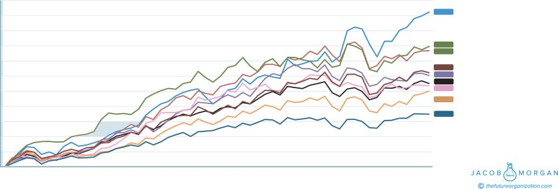
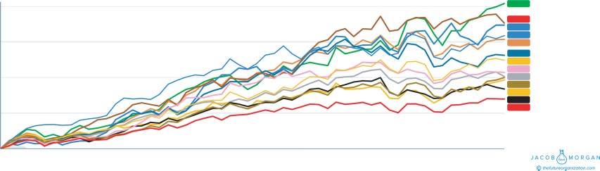

## **per**

$95,000 $63,000

**Pay** **Employee**

**per**

$88,000 $20,000

**Profit** **Employee**

million

**Profit** $900,000 $4

**per**

$150,000 $50,000

**Revenue** **Employee**

**Metrics**

**urnover** 4,000 6,700 **T**

**Business**

**B**

illion

**CME** b

**A** billion

**Revenue** $10.5 $5

**and**

**A**

**CME**

**A** 70,000 **mployees** 100,000

**E**

**12.1** A B

**BLE**

**A**

**T** **Company** ACME ACME

$3,200

$3,000 $3,046 **Experiential**

$2,800

$2,600 $2,593 **Glassdoor Best Places to Work**

$2,536 **preExperiential**

$2,400

$2,245 **Fortune Best Companies to Work to**

$2,200 $2,211 **Emergent Categories**

$2,103 **Empowered/Engaged/Enabled**

$2,000 $2,073 **inExperienced**

**Stock Price** $2,003 **NASDAQ**

$1,800

$1,699 **S&P 500**

$1,600

$1,400

$1,200

$1,000

Jan 2012 Feb 2012 Mar 2012 Apr 2012 May 2012 June 2012 July 2012 Aug 2012 Sept 2012 Oct 2012 Nov 2012 Dec 2012 Jan 2013 Feb 2013 Mar 2013 Apr 2013 May 2013 June 2013 July 2013 Aug 2013 Sept 2013 Oct 2013 Nov 2013 Dec 2013 Jan 2014 Feb 2014 Mar 2014 Apr 2014 May 2014 June 2014 July 2014 Aug 2014 Sept 2014 Oct 2014 Nov 2014 Dec 2014 Jan 2015 Feb 2015 Mar 2015 Apr 2015 May 2015 June 2015 July 2015 Aug 2015 Sept 2015 Oct 2015 Nov 2015 Dec 2015 Jan 2016 Feb 2016 Mar 2016 Apr 2016 May 2016 June 2016 July 2016 Aug 2016 Sept 2016 Oct 2016

**Date**

**FIGURE 12.3** **Category Stock Price Performance with $1,000 Investment**

$3,200 $3,046 **Experiential**

$2,764 **Technology Emergent** $2,740 **Enabled** $2,593 **Glassdoor Best Places to Work**

$2,500 $2,536 **preExperiential**

$2,313 **Culture Emergent** $2,245 **Fortune Top Companies to Work For** $2,073 **inExperienced**

$2,000 $2,012 **Engaged**

$2,003 **NASDAQ**

**Stock Price** $1,841 $1,969 **Empowered**

**Physical Space Emergent**

$1,500 $1,699 **S&P 500**

$1,000

\-13 \-13 13 \-13 \-14 \-14 \-14 \-15 \-15 \-16

Jan-12 Mar-12May-12Jul-12Sep-12Nov-12Jan Mar May-13Jul-Sep-13Nov Jan-14Mar May July-14Sep-14Nov Jan-15Mar-15May-15Jul-15Sep Nov Jan Mar-16 May-16Jul-16Sep-16

**Date**

**FIGURE 12.4** **All Company Stock Price Comparison with $1,000 Investment**
