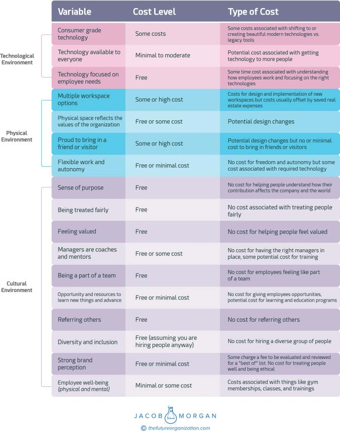

**C H A P T E R** **13**

**The Cost of Employee**

**Experience**

One of the things that organizations always get concerned about is

cost. Specifically, I hear comments like “We don’t have the budget that

company X has.” This usually happens because of an overemphasis on

things such as free gourmet food, designer office spaces, and crazy perks

like free dry cleaning, massages, and on-site dog walking. It’s true; these

things do cost money but the majority of things that shape the employee

experience are actually free. What’s the cost of treating people well,

giving them flexibility and autonomy, hiring a diverse group of people,

and giving them the opportunity to learn and grow? How we treat our

people is free. Let’s look at the 17 variables again below and see which

ones require the most significant investment.

The majority of the 17 variables that employees care about most at

work actually require little financial investment. Still, there are plenty of

things that do cost a considerable amount. You can see a cost breakdown

in Figure 13.1\. A common example is office space and design. It’s not

exactly free to transition from cubicles and closed spaces to gorgeous

floor plans with wooden floors, tons of natural light, cool-looking confer-

ence rooms, and standing desks. General Electric (GE) recently went

through this change, and I had the opportunity to visit its new offices

in Boston while hosting one of our Future of Work Forums. Walking

into the building, you’d think you’re visiting a start-up in San Francisco.

It turns out that all the employees working in this location used to

**167**

**168** **T** **HE** **E** **MPLOYEE** **E** **XPERIENCE** **A** **DVANTAGE**

**FIGURE 13.1 Cost of Employee Experience Variables**
