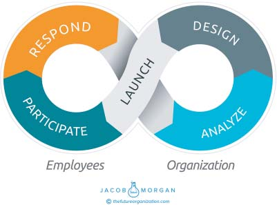

# **PART IV**

**Building the experiential**

**organization**

**171**

**C H A P T E R** **14**

**System 1 versus System 2**

**Experiences**

Daniel Kahneman is one of the world’s most renowned psychologists,

winner of the Nobel Memorial Prize in Economic Sciences, and author

of the best-selling book _Thinking, Fast and Slow_. In his book he describes

two types of modes of thought, System 1 and System 2\. System 1 think-

ing is very fast, is instinctive, and doesn’t require much focus or attention.

It’s essentially your brain on autopilot. For example, if I were to ask you,

“1 + 1 = ?” you would immediately know the answer. System 2 think-

ing, on the other hand, is more purposeful, slower, and more deliberate.

It’s something that requires us to take a step back to process.

As an example consider the following riddle. A bat and a ball costs

$1.10\. The bat costs $1 more than the ball. How much does the ball cost?

The immediate response that most people jump to is 10 cents because

$1 plus $0.10 is equal to $1.10, right? But if you take a step back, you

will realize that if the ball costs $0.10 and the bat costs $1 more than the

ball, then the bat must cost $1.10\. However, if you add those two num-

bers together ($1.10 for the bat and $0.10), then you get $1.20, which is

not the correct answer. Only after adding a little bit of brainpower and

conscious thought will you be able to figure out that the correct answer

is the ball must cost $0.05\. This means the bat costs $1.05, and when you

add these two numbers together, you get $1.10.

**173**

**174** **T** **HE** **E** **MPLOYEE** **E** **XPERIENCE** **A** **DVANTAGE**

Although Dr. Kahneman explored decision-making and cognitive

biases in his book, I think it’s great for us to apply this to how orga-

nizations approach and design employee experiences. Today, most

organizations in the world are stuck with System 1 experiences. That is,

they think of employee experience as a checklist of short-term initiatives

that they can invest in. Looking at the 17 variables above, many might

be tempted to turn this into a checklist that requires little thinking or

effort. Just print it out and go down the list. Create a diversity program,

implement new training and advancement solutions, give people great

tools and a fancy workplace, and boom! You’re done. Unfortunately

this is exactly the pitfall that many organizations fell into concerning

employee engagement. Checklists and steps are great for putting

together furniture and baking cakes, but in this case simply ticking off

the boxes won’t result in great employee experiences.

Every organization has some kind of management training pro-

gram, but how many organizations offer emotional intelligence and

self-awareness modules as a part of that training the way Pandora does?

Every company has a diversity initiative, but how many companies

make diversity a part of the executive compensation structure the way

Sodexo does?

Every company says it wants to create a sense of purpose, but how

many companies actually help every employee truly understand what his

or her impact is the way the San Diego Zoo does?

Every company says it wants to give employees great tools to work

with, but how many companies truly take the time to understand how

employees work, conduct A/B tests, and hold focus groups and interviews

the way Facebook does?

Hopefully you get the point that I’m trying to drive home here. The

three employee experience environments and the variables that com-

prise them are of course crucial. These are what employees care about

most but they are just ingredients. You’ve no doubt heard the saying “It’s

not what you say; it’s how you say it,” which is applicable here. It’s not just

about what you do; it’s also how you do it. Everyone can implement the

concepts in this book, but few can do an amazing job. The key point that

I mentioned at the start of this book and one of the big differences of the

**S** **YSTEM** **1** **VERSUS** **S** **YSTEM** **2 E** **XPERIENCES** **175**

Experiential Organizations is that they simply know their people better

than any other organization and they genuinely care about them. This is

what allows these organizations to move beyond checklists to execute on

these variables so well.

Organizations must shift to System 2 experiences, which are

conscientious and purposeful efforts that are based on data, design,

and employee contributions. I had the opportunity to speak with Marc

Merrill, who is the co-CEO and cofounder of the wildly popular Riot

Games, which is famous for creating _League of Legends_, one of the most

widely played multiplayer games that has ever been created. In 2010

this was a 60-person company, but now it has over 2,000 employees

around the world. Riot Games is one of the Experiential Organizations,

and it has won numerous other awards for its culture and workplace.

When I spoke with Marc about how Riot Games approaches employee

experience and why it is able to build such a people-centric organization,

his response was quite simple: “If organizations really want to focus on

people and make it a priority, then make it a real priority.” This type of

mentality is what sets the Experiential Organizations apart from all the

others. It’s the difference between saying something is a priority and

actually making it a priority. When an organization truly makes some-

thing a priority, you can physically see and feel the changes that take

place. It’s analogous to saying you want to get in shape versus actually

eating right and going to the gym. With that frame of reference, Riot

Games is definitely one of the most in-shape companies on the planet!

Out of the 252 organizations I analyzed in this book, virtually all

of them are in some way executing on the 17 variables mentioned

above. You’d be hard-pressed to find a company today that isn’t thinking

about new workplace design approaches, challenging conventional

management theories, implementing diversity programs, or wanting to

treat all employees fairly. It’s not like all organizations are villainous, and

these three environments and 17 variables are some kind of superhero

secrets. They aren’t. What sets the Experiential Organizations apart

from everyone else isn’t so much about what they do as it is about how

they do it.

**C H A P T E R** **15**

**The Employee Experience**

**Design Loop**

We have the Reason for Being, the three environments, and the 17 vari-

ables that create employee experiences. But, it’s still a bit hard to grasp

what all of that actually means and how it comes together. The world

changes quickly and this means that our organizations have to change

quickly as well. Employee experience is a moving target, which means

that all the things in this book aren’t simply a checklist that you can go

through. The way the things in this book get delivered will change dra-

matically over time. As a result I find it helpful to think of employee

experience as an ongoing and never ending back-and-forth interaction

between employees and the organization. In other words it’s like a dance

where both partners need to take the appropriate steps for it to make

sense. Except in this dance, the music never stops, and neither does the

dancing! This is actually one of the most effective ways for organizations

to truly get to know their workforce. Let’s start with conceptualizing what

this dance actually looks like (see Figure 15.1).

This infinity loop shows an ongoing relationship or a continuum

between employees and the organization. There is no break and it’s

designed to flow a bit like water smoothly around the loop. It’s also

worth noting that your organization will have many of these design

loops going on concurrently, which I’ll look at more closely below. While

some organizations have purposefully deployed a similar model, others

**177**

**178** **T** **HE** **E** **MPLOYEE** **E** **XPERIENCE** **A** **DVANTAGE**

**FIGURE 15.1 Employee Experience Design Loop**

have a similar process without actually realizing it. In other words they

just haven’t taken a step back to visualize and think about what their

employee experience design process actually looks like. However, this

model resonates with every executive I have shown it to. The full loop

has just six sections, which I will describe. You can start anywhere but to

make things easier I’ll start with the top left.

**RESPOND**

During this step of the experience loop, employees provide feedback to

the organization. In most companies today employees are already talk-

ing about what it’s like to work there but oftentimes nobody is listening.

Employees provide feedback and ideas about anything and everything

that can range from a workplace flexibility program to menu items in the

cafeteria to management training and development to office design. This

can also be extended to performance management as well (and should

be). It’s a bit analogous to social media. Many brands today are actively

engaged with their customers on social channels such as Facebook and

Twitter, and they have to respond to all sorts of comments ranging from

**T** **HE** **E** **MPLOYEE** **E** **XPERIENCE** **D** **ESIGN** **L** **OOP** **179**

product issues and outages to compliments to downright angry feedback.

These social tools that most of us use in our personal lives act as the

delivery mechanism and communication medium between consumers

and the organization (in addition to more traditional channels such as

e-mail and phone support). The point is that as a customer, you have a

direct path to brands, and if you use social technologies, you usually get

a faster response.

We need to think of employee feedback in much the same way.

Employees can (and should be able to) provide feedback via apps,

internal social networks, surveys, focus groups, one-on-one interviews,

or any other mechanism that your organization allows and provides

for. I will say that it is absolutely crucial to have a real-time feedback

mechanism in place.

The important thing here is that this has to happen on an ongoing

basis. Simply doing an annual survey to collect feedback is too much of

a drawn-out process. With the pace of change that we are all living and

working through, the communication, collaboration, and feedback need

to happen in real time. Instead of just a single large survey, it makes

more sense to leverage multiple feedback points concurrently and con-

tinuously. This may include a weekly manager check-in, a monthly pulse

survey, a quarterly open discussion, a semiannual experience snapshot,

an annual state of employee experience report, and an open platform

that employees can use anytime they want. Of course, this is just an

example, but it shows that organizations cannot simply rely on one form

of response from employees. There should be multiple and they should

be used as often as possible. Typically organizations have to actually ask

employees for feedback, but why not make it so that employees can share

information anytime they want?

**Enablers**

● Technologies must be in place to allow real-time communication and

dialogue.

● Managers must be comfortable receiving and asking for feedback

● Transparency must be the default culture mode.

● The organization must be prepared to take action.

**180** **T** **HE** **E** **MPLOYEE** **E** **XPERIENCE** **A** **DVANTAGE**

**ANALYZE**

Next comes the analysis part, where the organization tries to extract as

much insight as possible from the feedback to make the next design deci-

sion. This part can be rather messy and tricky, and it’s where the concept

of people analytics comes into play. There is no employee experience

without people analytics. This can come in the form of structured data

(employee satisfaction, performance, etc.) or unstructured data (observ-

ing employees or conducting interviews). The challenge for organizations

here is how to make sense of the data that is being collected and then

draw some insight from it. This needs to happen as quickly as possible

to be able to take action in a timely way. You don’t want employees to

provide feedback only for it to take the organization six months to ana-

lyze and sort through it. Ultimately the big question that organizations

need to answer during this stage of the experience loop is “What have we

learned from the employee feedback we received?”

Here are some examples of some of the analysis and insight you

might glean.

**Scenario 1 Analysis Reveals**

The highest-performing teams at our company have managers who are

more hands-on with career development. Employees appreciate the con-

cern and the effort managers put in and feel like they are genuinely

interested and invested in the success of employees.

**Scenario 1 Insight for Your Organization**

Explore creating a specific training program for your leaders that

encourages them to have more discussions around career development

with their employees, which includes follow-up discussions. Test how

often the discussions should be had, what kinds of conversations should

take place, and what types of career advancement employees are

looking for.

**T** **HE** **E** **MPLOYEE** **E** **XPERIENCE** **D** **ESIGN** **L** **OOP** **181**

**Scenario 2 Analysis Reveals**

Employees don’t use the assigned seating areas they have been given.

Instead they roam around the office and work in various locations.

Employees want more freedom when it comes to their physical space

and need a change of scenery during the day to stay engaged and

productive. They also like running into new people.

**Scenario 2 Insight for Your Organization**

Look at creating a physical environment where employees don’t have

assigned desks but where they can make any space their temporary home.

Look at why employees keep moving around and design spaces based on

that. Test creating communities or neighborhoods where teams might be

colocated or intermingled.

**Scenario 3 Analysis Reveals**

Annual employee reviews are not viewed as effective by either employees

or managers. Employees believe the feedback they receive is too gen-

eral, too late, and not actionable. Managers don’t like stack ranking their

employees but feel stuck always having to rate someone below average

even though he or she really isn’t.

**Scenario 3 Insight for Your Organization**

Develop a new performance management system where feedback

happens in real time and where the information being shared between

manager and employee is more goal oriented and purposeful. Leverage

technology so that this can happen anywhere and anytime.

**Analysis Enablers**

Hopefully you see what I’m getting at here. Ideally your organization

will also have some concrete numbers for these things so that you can **182** **T** **HE** **E** **MPLOYEE** **E** **XPERIENCE** **A** **DVANTAGE**

measure effectiveness and improvements in the changes you are making.

You might find that 80 percent of your employees want you to increase

investment in diversity and inclusion programs and that as a result your

retention increases by 10 percent. Whenever possible try to have some

numbers in place, again fueled with people analytics.

**Enablers**

● A people analytics team devoted to analyzing data and gathering

insight

● Technologies that allow the data to be aggregated and collected in a

uniform way

● Nontechnology-centric ways to collect data, such as focus groups or

one-on-one discussions

**DESIGN**

At this stage employees have provided feedback, and the organization

has analyzed the feedback to get some insight. The next stage is actually

to create something based on that feedback and insight. What is your

organization going to do based on what was learned? If you learned the

employees are unhappy with the level of communication and collabora-

tion, what’s your solution? If employees want more workplace flexibility,

how are you going to make that happen? If you find out that annual

employee reviews are dreaded and hated, can you get rid of them, and

what will you replace them with? This is the point when the organization

actually creates solutions. It’s not recommended to dwell too long in the

design process because it kills the effectiveness of the entire mechanism.

Instead it’s better to think of this process as a series of sprints and itera-

tions where the organization can quickly create something, get feedback,

and then improve. Speed is more valuable than perfection.

**Enablers**

● Cross functional team in place to design and create solutions

● A process in place that allows for quick development (for example, the

Lean Start-up methodology)

**T** **HE** **E** **MPLOYEE** **E** **XPERIENCE** **D** **ESIGN** **L** **OOP** **183**

**LAUNCH**

Here the organization actually releases whatever the _it_ actually is. As men-

tioned at the start of this framework, it could be anything that affects the

employee experience with culture, technology, or the physical workplace.

As far as how organizations officially launch their initiatives, this can be

done in all sorts of ways, including pilot programs, mass announcements

across the organization, and creative marketing campaigns. How you

decide to release something to your employees is completely up to you.

**Enablers**

● Communication mechanism to reach employees

● Champions and brand ambassadors to spread the word

**PARTICIPATE**

Naturally after you launch something what comes next is participation.

After the organization announces and implements something, such as a

new management training program, flexible work initiative, or workplace

layout, employees then use it. This becomes their new reality and their

new way of working.

**Enablers**

● Employee access

● Training and education when necessary

This is the most effective and simplest way for organizations to think

about and design employee experiences. Notice that employees make up

half of the feedback loop, and the organization makes up the other half.

This is quite different from most traditional models, which see the orga-

nization own 100 percent of the employee experience while employees

have no voice. Thankfully we will never go back to that type of model

again. Many organizations use this type of approach without even real-

izing. However, once you conceptualize this process, it makes it much

easier to structure how experiences are designed.

**184** **T** **HE** **E** **MPLOYEE** **E** **XPERIENCE** **A** **DVANTAGE**

The faster and more frequently you repeat this process, the better.

Ideally you will have many of these types of experience design loops

happening regularly. You may be looking at a new manager training

program while redesigning your physical environment, investing in a

diversity initiative, and rolling out a new technology platform. This

employee experience design loop is simply a new of way of introducing

things into the organization and can be applied to pretty much anything.

Let’s walk through two real-life examples of this whole process.

**EXAMPLE: GENERAL ELECTRIC**

This process drove an entire organizational overhaul. General Electric

(GE) is a multinational conglomerate with over 300,000 employees

around the world. To learn more about the transformation, I spoke with

Susan Peters, the chief human resources officer at GE, and Paul Davies,

the employee experience leader at GE.

**Respond**

Employees at GE participate in regular employee surveys and discus-

sions with their managers. Initially, the survey was done every 18 to

24 months, and the discussions with managers weren’t happening as

often as they should. Naturally this made it challenging to get a pulse on

the company. As the company grew it became more difficult to get things

done. Too many checks and balances and too much bureaucracy crept

into the company. In fact during an interview for _Fortune_ magazine,

its CEO, Jeff Immelt, said that one of his biggest regrets is that “We

just got too slow.”1 One of the things it wanted to do to enhance its

overall employee experience was make things simpler, and simplification

became one of Immelt’s key talking points in his internal and even

his external meetings and discussions. Employees were constantly

providing feedback to managers and executives that things were too

slow, especially when it came to anything related to performance, talent

management, and feedback.

**T** **HE** **E** **MPLOYEE** **E** **XPERIENCE** **D** **ESIGN** **L** **OOP** **185**

**Analyze**

Through GE’s employee survey, it was obvious that employees around

the world felt there were many opportunities to reduce the bureaucracy

and speed things up. In the past, its employee survey was administered

every 18 to 24 months, and it often took months to compile results and

communicate them back to employees. By then it was too late to do

anything meaningful because the information and the guidance given

to employees were already stale. Today, GE still surveys its employees at

scale, but results are visible real time. Insights are solicited much more

frequently. Leaders can make changes based on the feedback sooner than

they have even been able to previously. This went from months, to days.

From the feedback that GE received, it became very apparent that it

needed to make changes in process, culture, and technology.

**Design**

The team at GE worked to create something called FastWorks. In its

first iteration, it was created as a way of thinking about launching prod-

ucts. As FastWorks evolved, this methodology led to numerous types

of projects, not just involving products, but also involving processes.

Whether it was FastWorks for projects or the FastWorks Everyday pro-

cess, the focus was on customer outcomes, testing, and iterating. This

evolution of FastWorks helped GE create Performance Development,

which is an entire new model of assessing employees. It moved from

the Employee Management System (EMS) deployed in 1976 to the

new Performance Development. This included new language around

feedback, a new time orientation (real-time vs. once a year), a new tone,

getting rid of ratings, and deploying a new tool called PD@GE that

enabled real-time feedback between employees and managers.

The FastWorks methodology looks like this:

1\. Problem statement

● Identify and try to articulate customer challenges or opportunities.

2\. Leap-of-faith assumptions

● Validate leaps of faith—get customer input early. **186** **T** **HE** **E** **MPLOYEE** **E** **XPERIENCE** **A** **DVANTAGE**

3\. Minimum viable products (MVPs)

● The fastest way to get feedback

4\. Learning metrics

● Get feedback from customers to understand whether you are mak-

ing progress toward their goals.

5\. Pivot or persevere

● Based on customer feedback and learnings, continue to your goal

or iterate on your process.

Through this process GE tested a series of assumptions throughout

2014 in what it called a component MVP. In the fourth quarter of 2014,

it launched a much larger, integrated MVP, designed based on those

learnings of the Performance Development approach. Businesses volun-

teered to be part of this MVP test. GE identified and tested assumptions

in smaller- and bigger-scale experiments with close to 6,000 employees in

this MVP. This is a small group compared with the 170,000+ employ-

ees globally who used the EMS. But, FastWorks taught them that if

something doesn’t work for 6,000 people, it definitely won’t work for

170,000 people.

To summarize, FastWorks is the overall methodology to simply

launch new products and experiment and test to create the most

value for customers. Performance Development came about through

a FastWorks approach. It is an overhaul of assessing and developing

employees, and PD@GE is an app that employees use to provide

feedback to one another, track ongoing priorities, and capture important

conversations, or touchpoints.

**Launch**

GE introduced PD@GE and FastWorks in a phased approach, which

looked like this:

**End of 2012–2013:** Test and introduce FastWorks for major projects

**2013–2014:** Scale FastWorks across businesses and project teams

**2014:** Introduction of growth boards, a governing mechanism with a

rigorous, question-based approach to capital and resource allocation

**T** **HE** **E** **MPLOYEE** **E** **XPERIENCE** **D** **ESIGN** **L** **OOP** **187**

and customer validation, and introduction of the GE Beliefs, to

define the way the company thinks and acts. GE also launched

a pilot of Performance Development to 30,000 employees and

continued to learn and scale until the global announcement in 2016.

**2015–2016:** Scaling of FastWorks across all GE employees, as part of a

larger culture change, by translating FastWorks principles for every-

day use to simplify the way employees work, and focusing on testing

and learning early and often with customers, to become a faster, agile,

simpler, and more customer-driven organization.

PD@GE was introduced to various business populations as it was

scaled across the company. There were marketing materials, including

digital signage, posters, and the like. In 2016, when Performance

Development was announced as the single approach to employee

development, Susan Peters, the chief human resources officer, made

the announcement through push notification using the PD@GE app.

FastWorks has been guiding GE’s approach to Performance Devel-

opment since its inception when the HR team started with mapping

out the problem through the eyes of customer segments (managers,

employees, and the senior leaders who represent the organization)

and defining the vision statement. (approximately 2014). Success was

measured in terms of the impact on customers (managers, employees,

and the organization).

**Participate**

Employees participate in PD@GE (the app and desktop tool) by cap-

turing touchpoint conversations with managers, sending insights to col-

leagues, and continuously tracking or modifying their priorities. Here are

two scenarios for employee use of the PD@GE app.

_Option 1 (an employee experiencing a Performance Development_

_priority-setting touchpoint)_: An employee at GE wants to walk through

the projects they are working on to discuss priorities with their respective

manager. As they do this the manager asks some challenging questions,

such as “What’s the solution you’re providing for your customer?” “Who’s

the end user of this?” “Is it adding value to them?” “How do you know?” **188** **T** **HE** **E** **MPLOYEE** **E** **XPERIENCE** **A** **DVANTAGE**

These are all focused on value and impact versus tactical to dos and

tasks. As the employee leaves the meeting with the manager, they have

a 10-minute window before another upcoming meeting, so they open

their PD@GE app and add new priorities based on the conversation.

A key thing to point out is that employees are trusted by their managers

to update their priorities. They also send their manager an insight that

was learned from the conversation.

_Option 2 (“imagine” scenario)_: Similar to option 1, imagine walking

into your manager’s office. You have a list of the goals that you want to

set for yourself. You have the tactical elements set up, and you are ready

to start working on them. You think you’ll just need to report them out to

your manager and then be on your way. Instead, your manager reviews

the goals and then asks the same strategic questions as in option 1.

You realize that you are missing feedback on one of your priorities.

However, your manager thinks it has potential but pushes you to test it

with your customers and then come back with any adjustments based

on their needs.

As you leave the meeting, you walk down the hall to your next meet-

ing. After your meeting ends, you feel a buzz in your pocket coming

from your phone. You receive a push notification saying, “You have just

received an Insight.” You open the app and see that your manager sent

you a Continue Insight that says: “Thanks for bringing your goals to our

meeting. They were well thought out and aligned to our overall strategy.

I look forward to hearing the results of the tests that you’ll run with your

customers based on that one priority that didn’t have direct input just

yet. Let’s set up another meeting when you feel you have enough detail

to adjust or change that priority.” You’ve just lived and breathed Per-

formance Development at GE. You collaborated with your manager to

create value for your customer. You’ve received real-time feedback that

has helped you learn and grow. And you’re empowered to try something

new, test it, learn from it, and adjust it.

The scope of this project was grandiose to say the least, but it shows

how a large organization like GE was able to leverage the employee expe-

rience feedback loop to drive change and test ideas based on employee

feedback and insight.

**T** **HE** **E** **MPLOYEE** **E** **XPERIENCE** **D** **ESIGN** **L** **OOP** **189**

**EXAMPLE: AIRBNB**

Airbnb is a marketplace that allows people to rent out local listings in

almost every country around the world. Today the company has over

2,000 employees around the world and is a great example of how the

employee experience design loop can be applied to something rather

unconventional . . . food. David McIntyre, Airbnb’s global director of

food (how awesome is that?), explained how the company’s approach

works in the context of the employee experience design loop. It’s

important to point out that at Airbnb, food isn’t a perk or an amenity.

It’s a purposefully designed strategic investment for the company. Its

approach to food can be summed up in one word, _Sobremesa_, which is a

Spanish word meaning “the time you spend at the table after you finish

eating.” At Airbnb food is a way to get employees to talk, engage, share,

collaborate, and build community.

**Respond**

Airbnb provides three meals a day for all of its employees. A menu is

sent out via e-mail before each meal, and at the bottom of these e-mails,

employees can click on a feedback link. There’s also a dedicated e-mail

address for the food services team that employees can use anytime they

want. Finally, the Airbnb team also conducts a food and beverage satis-

faction survey around once a year. Using these mechanisms (in addition

to some in-person conversations), employees provide all sorts of feed-

back to the team, which ranges from general praise to specific requests

for things such as more gluten-free options.

**Analyze**

The food services team considers all the various feedback mechanisms

and then looks at the collected data to determine a few things. First

is general satisfaction of the food and beverage offerings to determine

whether employees are happy with what they receive. Second is the

balance of food options. In the surveys Airbnb seeks to balance healthful, **190** **T** **HE** **E** **MPLOYEE** **E** **XPERIENCE** **A** **DVANTAGE**

indulgent, familiar, and exotic options. Ideally, it would see its menu

show around 25 percent in each of the four categories. Third is the

usage patterns of the employees: which meals and how many meals they

consume in the office. Fourth, David and his team look at how food

affects the culture of the company by asking employees where they

connect with their peers most often. Last, Airbnb tries to determine

how food affects the overall outcomes of the business by looking at

things such as productivity, recruitment, and retention. According to

its data over 90 percent of employees say that the food and beverage

programs help make them more productive, and over half acknowledge

that food affects their decision to work at and stay at Airbnb. Although

Airbnb does look at quantifiable data, sometimes it also makes decisions

based on observations. For example, it might notice that it is getting a lot

of e-mails requesting more vegetarian options, so then that becomes a

priority item.

**Design**

David and his team have a very solid understanding of what the employ-

ees at Airbnb want and need when it comes to food and beverages. As

much of their food as possible comes directly from farmers, so they know

what is in season and what is coming in. The menus are designed quar-

terly based on the four seasons of the year, and everyone from the chef to

the dishwashers provides feedback on the menu choices. The team con-

siders everything from halal and vegetarian options to special gluten-free

or even paleo diets, not to mention food allergies that some employees

might have. The team, of course, must also look at costs and what is prac-

tical and feasible.

The results from the food and beverage satisfaction surveys are

always shared with all the employees so that they have transparency

about why certain decision were made and why some options were

chosen. Each Airbnb office has its own chef (whenever possible), which

means that each is responsible for his or her own cuisine based on local

preferences. There isn’t a single head chef for the entire company. This

allows for much greater personalization.

**T** **HE** **E** **MPLOYEE** **E** **XPERIENCE** **D** **ESIGN** **L** **OOP** **191**

**Launch**

Launching the new food items is a matter of the chefs preparing, cook-

ing, and placing the food out for employees to eat. It’s amazing how much

work goes into this. I’ve visited its headquarters in San Francisco a half

dozen times and am always blown away by the quality and diversity of

options. It also has a pastry chef who devilishly creates little treats that

get wheeled around on carts throughout the day. The main mechanism

for how it actually launches food is its opt-in e-mails, which showcase the

menus of the day along with all the ingredients that are used in prepara-

tion. A picture of a relevant Airbnb listing also accompanies each menu

to help remind employees of the mission of “Belong Anywhere.” This

means that if the menu is inspired by Filipino food, employees will see a

listing from the Philippines.

Airbnb also offers cooking classes and little pop-up shops in various

parts of its offices. For example, it’s common to get an e-mail that says

something along the lines of “Today from 2 to 3 PM we are offering matcha

tea lattes in the upstairs kitchen. Come grab one and say hello to your

coworkers!”

Unlike traditional products or services that take time to create and

are launched once, food is something that all employees consume glob-

ally and multiple times a day.

**Participate**

This is the fun part! Employees get to eat all the amazing things that

David and his team work so hard to create and to prepare. Then they

provide feedback to the team and the cycle repeats!

The employee experience design loop can be applied to any situa-

tion where employees and the organization collaborate and communi-

cate to create something, solve a problem, or identify an opportunity.

Oftentimes organizations are stuck in the _design for_ mind-set, and this

approach really forces them to shift their perspective to the _design with_

mind-set. It’s something many of the Experiential Organizations prac-

tice regularly, and it can also be called _cocreation_. This explains why the **192** **T** **HE** **E** **MPLOYEE** **E** **XPERIENCE** **A** **DVANTAGE**

likes of Google, Airbnb, and Facebook are always ranked as such great

places to work (and why they scored so high in the Employee Experience

Index). Employees are quite literally involved in designing and shaping

their own experiences, and these organizations are obsessed with get-

ting employee feedback. Of course, none of this is possible without an

unrivaled level of transparency.

**NOTE**

1\. [http://fortune.com/2015/06/03/ge-immelt-chat-transcript/.](./http___fortune.com_2015_06_03_ge-immelt-chat-transcript_.md)
