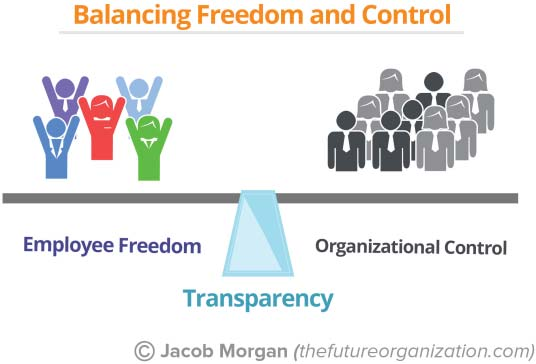

**C H A P T E R** **16**

**The Starbucks Model**

**of Transparency**

As you think about employee experiences, you might realize that the

larger the organization becomes, the more ideas, feedback, and expe-

riences you have to create. If your organization has 5,000 employees

and half of them are contributing ideas or providing feedback regularly,

that’s still many thousands of ideas a year. What about an organization

with 10,000 employees, 100,000 employees, or 300,000 employees? All

of a sudden things can get a little bit out of control, and the employee

experience design loop model starts to break down. Then what’s the solu-

tion? How can an organization listen to the ideas of many thousands

of people and then implement those ideas regularly? The answer is it

can’t. At least not yet. In the future as we start to see more AI in the

workplace, organizations will be able to deliver an amazing amount of

customized experiences. Software will “know” all employees, what they

care about, what they value, what they want, and what they need indi-

vidually. That type of granular view of employees is just not possible or

practical today. You’ve heard of all sorts of smart things, such as the Nest

Thermostat that knows when you’re home, what temperature you like

and when, what time you go to sleep, and what overall temperature con-

ditions you prefer your home to be in. Well what if we took that concept

and applied it to how you work? AI that knows how you work better

than you do!

**193**

**194** **T** **HE** **E** **MPLOYEE** **E** **XPERIENCE** **A** **DVANTAGE**

For many years Starbucks has been a prime example of customer

engagement and innovation through something it launched called “My

Starbucks Idea.” Search for it online and you’ll see what I’m talking

about. Through this site Starbucks allows all customers around the world

to submit ideas for things they would like the company to do or invest

in. Although it seems like Starbucks has since throttled back the focus

on My Starbucks Idea, there have been hundreds of thousands of ideas

submitted by customers. These idea categories range from store atmo-

sphere to social responsibility to food and drink. The way that Starbucks

manages all these ideas is through one magical concept, transparency.

On the site, customers vote up which ideas they would like to see

implemented, and Starbucks lets the community know which ideas

are being evaluated, which ideas are being implemented, which ones

have launched, and even which ideas haven’t gone over well.

With this level of transparency customers are okay with the fact that

not every idea or piece of feedback will be implemented because they

know why. I like to call this the “Oh, okay” moment. It’s when you get a bit

wound up about something, and then once you understand the rationale

for why something happened the way it did, you relax and say, “Oh, okay.”

Starbucks customers know what the company is doing, thinking

about, and implementing. Although organizations always talk about

transparency, imagine implementing this type of concept inside of

your organization that is focused on employees. What would it be

like if your people could provide feedback and ideas around culture,

technology, and their physical work environment and see which ones

are most popular, which the organization is actually thinking about

implementing, and which ones haven’t worked and why? I haven’t seen

any organization take it to this level yet. These types of things might

happen more informally through discussions or conversations, but I

believe implementing this type of concept (powered by technology, of

course) would lead to some interesting results. Transparency is the best

way to balance employee freedom with organizational control. It’s a

seesaw that sees transparency as the balance point in the middle. Not

every organization is quite ready for this level of transparency, which is

understandable. How much transparency should your organization allow

**T** **HE** **S** **TARBUCKS** **M** **ODEL OF** **T** **RANSPARENCY** **195**

for? As much as possible! The image below shows how transparency acts

as the balance between employee freedom and organizational control.

In _Work Rules!_ Laszlo Bock, the former senior vice president of peo-

ple operations at Google, wrote, “If you believe people are good, you

must be unafraid to share information with them.” At Google as much

as possible is “default to open,” meaning “make as much information

open and accessible as possible.” Almost all the entire Google code base,

including Search, YouTube, AdWords, and AdSense, is accessible to a

newly hired software engineer starting from day one. Its intranet portal,

which has all the company road maps and plans along with employee

quarterly goals, is also public for any other employee to see. Google also

does weekly all-hands meetings for many thousands of employees, and

employees have the opportunity to ask literally any question they want to

the most senior executives at the company. Nothing is off limits. Google

does an excellent job of conveying not only what it is working on but also

why it is working on certain things. Bock sums this up brilliantly:

Fundamentally, if you’re an organization that says, “Our peo-

ple are our greatest asset” (as most do), and you mean it, you

must default to open. Otherwise, you’re lying to your people and

to yourself. You’re saying people matter but treating them like **196** **T** **HE** **E** **MPLOYEE** **E** **XPERIENCE** **A** **DVANTAGE**

they don’t. Openness demonstrates to your employees that you

believe they are trustworthy and have good judgement. And giv-

ing them more context about what is happening (and how and

why) will enable them to do their jobs more effectively and con-

tribute in ways a top-down manager couldn’t anticipate.1

**NOTE**

1\. Bock, Laszlo. _Work Rules! Insights from Inside Google That Will Transform How_

_You Live and Lead_. New York: Grand Central, 2015.
