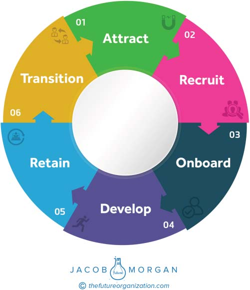

**C H A P T E R** **17**

**The Employee Life Cycle**

To design employee experiences, we first have to think differently about

employees and the journey that they will take with your organization.

The typical employee life cycle follows a process that looks some-

thing like Figure 17.1.

Nobody thinks about his or her time at an organization in this way.

This isn’t really the employee life cycle. This is the organization’s ver-

sion of what it wants the employee life cycle to look like. Right now

this journey is very one sided and quite frankly, inaccurate, which means

whatever experiences your organization is trying to design aren’t based

on how things actually work. As an organization you can try to create as

many neat little buckets and processes as you want, but remember that

they simply reflect how you want things to be, not how they actually are.

It’s like looking at an organizational chart. You may want your company

to function in a nice little pyramid, but anyone with a pulse who has

worked for an organization knows that these charts never (and I really

mean never) reflect how work gets done and how teams are structured.

Some organizations, such as LinkedIn, have been putting a bit of a

modern spin on this to see things from the employee perspective. Nina

McQueen is the vice president of global benefits, mobility, and employee

experience. She along with Pat Wadors (the chief human resources offi-

cer) and the rest of their awesome team have a model they use called the

4-box model. They didn’t create this concept but they did adapt it. Not

the most exciting name in the world, but hey, it works. Essentially it looks

**197**

**198** **T** **HE** **E** **MPLOYEE** **E** **XPERIENCE** **A** **DVANTAGE**

**FIGURE 17.1 Typical Employee Life Cycle**

at the four stages that employees go through while working at LinkedIn.

The four stages are:

**Eager Beaver**—You just started the job, are super excited, and feel like

you can do anything.

**Oh Sh**∗**t (or Oh My)!**—Usually around six months in (can be sooner),

you hit a wall and believe the job is not what you thought it was, or

perhaps the job is too big and overwhelming. You think you aren’t

cut out for this.

**T** **HE** **E** **MPLOYEE** **L** **IFE** **C** **YCLE** **199**

**Okay, I’m Starting to Get It**—You’re able to tackle challenges, com-

plete assignments and big projects, and find your voice. Now you feel

like you truly belong.

**Master**—Now you’re almost too good. As a result you get a little bit

bored and uninspired with the work you are doing. You may even

start to look elsewhere at other opportunities outside of the company.

LinkedIn believes and puts a lot of trust in managers to help guide

employees through these four areas, especially the _Oh My!_ box. Ideally

you should be in all four boxes at the same time. If you find yourself stuck

in one of the areas, such as _Master_, then it’s your job to speak with your

manager or volunteer on something that can help take you back to the

_Eager Beaver_ box (and you are encouraged to do so).

LinkedIn is among the organizations that are thinking about how to

redefine the traditional employee life cycle. The traditional model is still

there as a way to help organizations think about talent, but it’s becoming

a more secondary framework. Your approach may not look like the one

that LinkedIn has, but I can guarantee you one thing. It also doesn’t look

like the one depicted above from decades ago.

These life cycles were great when the organization operated like a

finely oiled machine, where everyone went through the same process

and did the same thing. This isn’t how work gets done anymore. Instead,

the life cycle is being replaced or augmented by specific moments.
