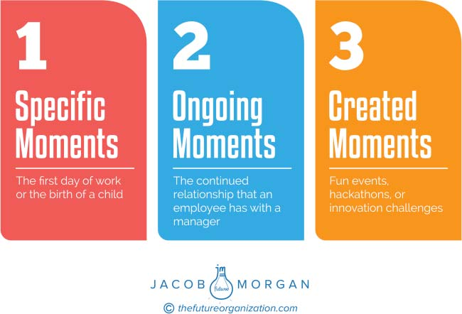

**C H A P T E R** **18**

**Moments That Matter**

**or Moments of Impact**

Instead of thinking of a traditional employee life cycle, it’s more valuable

and effective to think of moments that matter or moments of impact.

The blurring of our personal and work lives means that these moments

also transcend these boundaries. Moments that matter can include things

such as your first day at work, having a child, getting promoted, buying a

house, leaving the company, or anything in between. By focusing on these

moments the organization is able to look at employees as whole individu-

als with unique experiences as opposed to just employees who are there

simply to complete a job. This is what allows organizations to bring a level

of personalization to the workplace. Not every organization will have the

same moments that matter, but regardless of what they are, every organi-

zation can respond by doing something concerning technology, culture,

or the physical work environment.

There are three categories of moments that matter, which you can

see in Figure 18.1.

**SPECIFIC MOMENTS THAT MATTER**

These are specific moments in the life of an employee that have clear

significance. They include things such as your first day on the job, buy-

ing your first house, having a child, and getting promoted. These are

**201**

**202** **T** **HE** **E** **MPLOYEE** **E** **XPERIENCE** **A** **DVANTAGE**

**FIGURE 18.1 Types of Moments That Matter**

common moments that will most likely be shared across the majority of

your workforce. Specific moments that matter are special because they

don’t happen all the time. They may happen all the time to your collective

workforce but not to each employee.

**ONGOING MOMENTS THAT MATTER**

The continued relationship you have with your peers or managers

would be considered an ongoing moment that matters. In other words

these moments can’t be clearly defined. If one day your manager shows

up to work and calls an all-hands meeting just to say thank you for a

project you completed, that is not something that is planned yet can

have a profound impact on your experience. Similarly, if one day your

manager berates you or takes credit for your work, then that too will

**M** **OMENTS** **T** **HAT** **M** **ATTER OR** **M** **OMENTS OF** **I** **MPACT** **203**

forever affect your experience at work but negatively. In both of these

situations these moments aren’t specific things that are planned or

designed for. They just happen. These ongoing moments also include

how employees interact with technology and the physical workspace

that your organization provides.

**CREATED MOMENTS THAT MATTER**

Company-wide parties, team building events, innovation challenges, or

company hackathons are all a part of created moments that matter. These

are moments the organization creates because they and the employees

feel they are important and are oftentimes focused on a specific business

need or challenge.

**MOMENTS THAT MATTER AT CISCO**

One of the companies pioneering the concept of moments that mat-

ter is Cisco. I spoke with its chief people officer, Francine Katsoudas,

to learn more about its approach. This all started a few years ago with

its Our People Deal, an employee-created concept that outlines what

Cisco stands for, what it expects from employees, and what employees

can expect from the company. Listening to employees, Cisco realized

each employee had different milestones and things he or she cared about

that shape his or her experiences. To date, it has 11 moments that matter,

each of which has various elements that fall within it. What’s fascinating

is that these moments came directly from employees who participated

in focus groups, discussions, and surveys, during which they candidly

shared which moments they cared about most during their career jour-

ney. This includes everything from an employee’s first interview to his or

her last day at Cisco, to celebrating one’s birthday with a day off, to hav-

ing five paid days off (outside of vacation time) to volunteer. In a sense

these moments have become the new employee life cycle from the actual

perspectives of the people who work there as opposed to how Cisco

thinks the employee life cycle should look.

**204** **T** **HE** **E** **MPLOYEE** **E** **XPERIENCE** **A** **DVANTAGE**

Although Francine and her team helped design these experiences,

it is the managers whom Cisco relies on to make the employee experi-

ence the best it can be. One particular moment is owned not by a single

team or person but by a cross functional team. Each moment has an

executive sponsor, a team of experts, and a group of individuals work-

ing to design and continuously improve these experiences. Still, it’s not

as though Cisco doesn’t have its own set of challenges. As an organiza-

tion with over 70,000 employees around the world, making sure that the

moments that matter scale across geographies and cultures is not an easy

task. Investing heavily in management training and making sure that the

relevant teams are global in representation are both crucial things to do.

By focusing on moments that matter, Cisco has created an agile and

adaptable model. New moments can always be added or removed based

on employee feedback, and each one has a robust road map that connects

technology and the human touch. Later in Chapter 25 you will see exactly

what these moments at Cisco are.
