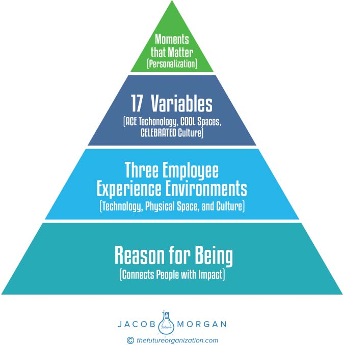

**C H A P T E R** **20**

**The Employee Experience**

**Pyramid**

I like to think of employee experience as a pyramid that has various tiers

that sit on top of one another (see Figure 20.1).

At the base of the pyramid, we have the Reason for Being, which

provides the foundation for how the organization approaches and thinks

about employee experience. The Reason for Being is ultimately what

connects the people to the organization. For example, look at the Rea-

son for Being for Starbucks (a preExperiential Organization), which is

“To inspire and nurture the human spirit – one person, one cup, and one

neighborhood at a time.” When an organization makes a statement like

that, you can and should expect that it has an attitude of caring about its

people. Of course, there are plenty of exceptions to this. Look at Apple,

which scored in the Experiential Category yet has absolutely no Reason

for Being. Its current mission statement is: “Apple designs Macs, the best

personal computers in the world, along with OS X, iLife, iWork and pro-

fessional software. Apple leads the digital music revolution with its iPods

and iTunes online store.”

Compare that with the Reason for Being Steve Jobs first instilled at

the company in the 1980s, which was “To make a contribution to the

world by making tools for the mind that advance humankind.”

Those are two radical statements and commitments from the same

organization, and it’s not surprising that so many people today believe

**209**

**210** **T** **HE** **E** **MPLOYEE** **E** **XPERIENCE** **A** **DVANTAGE**

**FIGURE 20.1 The Employee Experience Pyramid**

that Apple has lost its way and is struggling with creating new and inno-

vative products. A powerful Reason for Being forces the organization

to commit to delivering great employee (and almost always customer)

experiences. It makes the organization accountable, especially in this

transparent world we live in.

**T** **HE** **E** **MPLOYEE** **E** **XPERIENCE** **P** **YRAMID** **211**

On top of that we have the three employee experience environments,

which are culture, technology, and the physical environment. Everything

and anything your organization will ever do concerning employee experi-

ence will fall into these three environments. This includes compensation

and benefits enhancements, flexible work programs, management train-

ing, the tools that employees use to get their jobs done, and everything

in between. Thinking of employee experience as a combination of these

three environments will dramatically help simplify things.

Then we have the 17 variables that make up those environments,

which are COOL spaces (Chapter 5), ACE technology (Chapter 6), and

a CELEBRATED culture (Chapter 7). Based on my analysis these are

the 17 things that employees care about and value most in their organiza-

tions. Through investments in people analytics, your organization will be

able to determine any changes in these 17 variables over time. Remem-

ber that as the world continues to evolve, so must our approaches to and

strategies for providing employee experiences.

At the very top of the pyramid, we have the moments that mat-

ter. These allow organizations to personalize the employee experience as

much as possible. Organizations do this by identifying the key moments

in the life of an employee and then infusing the 17 variables into those

moments whenever possible. Leveraging multiple feedback mechanisms

allows organizations to more effectively and accurately identify these

moments. The moments will differ by organization, which is why it’s

so crucial to ask employees, and to keep asking them, because these

moments can absolutely change.

The employee experience pyramid helps put into perspective how

the various elements fit and work together, kind of like a jigsaw puzzle.

The best companies execute on all of these things.
