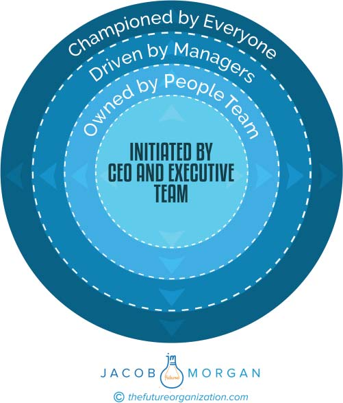

**C H A P T E R** **22**

**Who Owns the Employee**

**Experience?**

It’s easy to say that the employee experience is owned by everyone, but

from what I have observed, when something is said to be owned by every-

one, it’s really owned by no one. Instead, I prefer to look at employee

experience as something of a ripple effect that starts with the most senior

leaders at the organization and extends to every employee regardless of

role or seniority. You can see what this looks like in figure 22.1 below.

**INITIATED BY THE CEO AND EXECUTIVE TEAM**

The entire employee experience of the organization starts with the Rea-

son for Being and the values that the organization chooses to espouse.

This starts at the absolute top of the organization with the CEO and every

member of the executive team. This can be thought of as the foundation

on which the employee experience house is built. The CEO and mem-

bers of the executive team need to embed this Reason for Being into

their talking points both publicly and privately. They also need to make

this a part of how they work, communicate, and interact with employ-

ees, customers, and the public. Basically, the CEO and the executive

team are supposed to be the biggest evangelists of this. When you look

at Experiential Organizations, such as Facebook or Google, they all have

CEOs who are amazing champions of making sure that their people are

**217**

**218** **T** **HE** **E** **MPLOYEE** **E** **XPERIENCE** **A** **DVANTAGE**

**FIGURE 22.1 Employee Experience Ownership Ripple**

taken care of and that their organizations are places where employees

truly want to show up to work. This can’t happen effectively if the top

executives aren’t on board.

One of my favorite examples here comes from John Legere, the

charismatic magenta- and Batman-loving CEO of T-Mobile, a wire-

less provider with over 54,000 employees. Everything about John is

unconventional, including how he encourages drinking games around

his competitors’ earnings calls, regularly responds directly to customers

on social media with his e-mail address, hosts a regular Sunday cooking

show on Facebook Live, or has his entire wardrobe T-Mobile branded,

**W** **HO** **O** **WNS THE** **E** **MPLOYEE** **E** **XPERIENCE** **?** **219**

down to his magenta Converse shoes. John also has millions of people

around the world who follow him on social media and interact with him

regularly. Knowing all of this, it should come as no surprise that John

has some pretty strong opinions about employee experience (and many

other things!).

Ever since he took over as CEO, he’s been on a mission to not only

connect with and inspire his employees but also improve their experi-

ences by removing as many of their pain points as he possibly can. In a

conversation I had with Marty Pisciotti, VP, employee careers, human

resources at T-Mobile, he told me that during John’s first few weeks at

T-Mobile, he was already on the road meeting employees in the regions

to hear firsthand about their challenges. At one of the first large sales

employee meetings, he held an open mic so that employees could ask him

any question they wanted. The first few questions were the predictable

safe questions that any employee could ask without getting in trouble.

After a few of those, John got up, walked over to the mic, and announced,

“I want every question after this to be something that will make you think

that the person who asked it will be fired.” Employee experience is so

crucial to John that all of his executives and managers know the mantra

to “listen to your frontline \[employees who directly interact with the cus-

tomers\], shut up, and do what they say.” It’s not often that you hear about

a CEO who so openly wants to challenge conventional management and

workplace practices.

**OWNED BY THE PEOPLE TEAM**

At places like General Electric and streaming Internet radio company

Pandora, employee experience is a role that exists under the human

resources (HR) department, and the people who lead employee experi-

ence report to a chief HR officer. I’ve also seen scenarios where heads

of employee experience operate a role that runs in parallel with HR,

and the chief employee experience officer is a direct peer. There are

all sorts of combinations you can come up with for how the role and

the functions are structured. Even all the top companies don’t have **220** **T** **HE** **E** **MPLOYEE** **E** **XPERIENCE** **A** **DVANTAGE**

similar approaches. Airbnb has a chief employee experience officer

and someone else responsible for more traditional HR. Adobe has an

executive vice president of both customer and employee experience.

At Cisco there’s a chief people officer, and at Accenture there’s a chief

leadership and human resources officer. The point is that all of these

models and scenarios are perfectly acceptable, and they can all work

(and they do). There isn’t a one-size-fits-all approach as far as what the

makeup of these teams looks like from a function and role perspective.

Ultimately this group of people is responsible for guiding employee

experience across the organization. They usually start the discussions,

come up with strategies for how to execute on experience, test ideas, pro-

vide guidance based on people analytics, and otherwise take ownership of

making sure the entire company champions employee experience. These

guys are like the secret task force that the company can turn to. This

doesn’t mean that they have to make all the decisions or that nothing gets

done without their input. It simply means that they help guide and steer

the ship, but everyone participates in getting it to the right destination.

The main goal of the people team is to help put employee experience at

the very center of the organization.

**DRIVEN BY MANAGERS**

Every manager at an organization is responsible for driving and creating

employee experiences. This means helping make sure the 17 variables

above are being implemented and recognized by employees, identify-

ing the key moments that matter, getting to know the whole employee,

and encouraging employees to speak up and help shape their own expe-

riences. When looking at the future of work, the manager isn’t the one

who sits at the top of the pyramid. The manager is the one at the very

bottom of the pyramid who lifts everyone else up. The manager is a

servant, a coach, and a mentor whose goal is twofold: First managers

must help make sure that employees actually want to show up to work,

and second managers should help make their employees more successful

**W** **HO** **O** **WNS THE** **E** **MPLOYEE** **E** **XPERIENCE** **?** **221**

than they are. When I look at all the most successful organizations that

I analyzed in this book, the one thing they all have in common when it

comes to management is an enormous amount of trust in making sure

their managers are helping create an amazing employee experience.

Internet radio company Pandora is one of the best examples of this.

Music is a very personalized thing, so it’s natural that Pandora takes the

concept of personalized experiences quite seriously and does this by rely-

ing heavily on managers. Because the company is publicly traded, there

are, of course, some standard HR policies and rules that are put into

place around things such as compensation, vacation time, and the like.

But outside of these traditional things, the managers are responsible for

shaping and creating the experiences for over 2,300 employees.

All employees have their own agreements with their managers on

how they prefer to work and what they expect and need to get their

jobs done. These aren’t driven by blanket policies or rules that every

employee has to follow. To be able to create personalized experiences,

all the managers at Pandora go through a training program that includes

modules that focus on self-awareness and emotional intelligence. The

rationale for doing this is that before you can lead others, you must

first know more about yourself. Only then can managers at Pandora

lead with humility, empathy, and an awareness of what their personal

biases might be.

For example, managers at many organizations would typically see

going out to happy hour as a kind of team building and bonding activity.

However, what if you work in a team with a Type A personality (outgo-

ing, ambitious, competitive, and perhaps impatient) project manager, an

introverted software developer, and a very extroverted sales professional?

Clearly going out drinking might not make sense here. At organizations

like Pandora, managers are trained to see things through the eyes of their

team members and then act accordingly. This is what allows the managers

to do things such as treat people fairly, help foster a sense of purpose,

make others feel valued, and the like. The leaders at Pandora genuinely

understand their employees individually, so they know what they care

about and what they value.

**222** **T** **HE** **E** **MPLOYEE** **E** **XPERIENCE** **A** **DVANTAGE**

**CHAMPIONED BY EVERYONE**

As I mentioned at the start of the book, the overlap between employee

needs, wants, and expectations, and the organizational design of those

employee needs, wants, and expectations is where employee experience

is created. This means that every employee from the intern to the CEO

needs to get into the habit of sharing, collaborating, and providing feed-

back around what they want their work experience to look like.

Looking at this framework I want to stress a few key points. Although

the people team inside of your organization may be responsible for help-

ing guide everyone else, this concept of employee experience needs to

be embedded everywhere and practiced by everyone. Think of employee

experience as the sun, and the rest of your company rotates around it.
