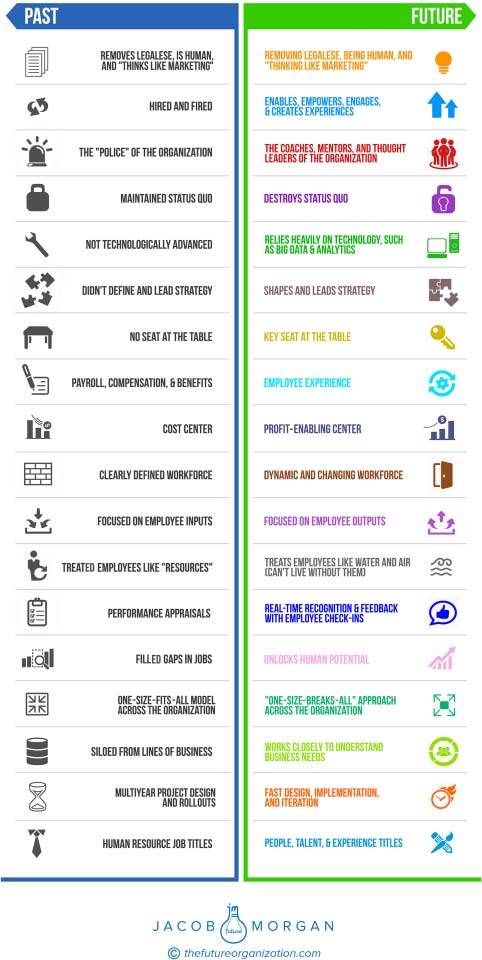
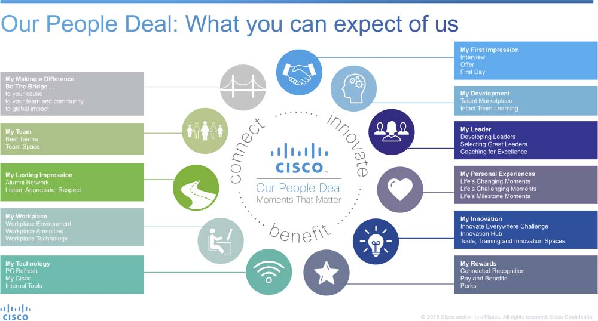

**232** **T** **HE** **E** **MPLOYEE** **E** **XPERIENCE** **A** **DVANTAGE**

**BUILD A PEOPLE ANALYTICS FUNCTION**

The goal of people analytics is to help organizations make better

informed decisions based on data and research. This is very much an

exciting and growing practice area inside many organizations around

the world, some of which still have all of their employee data stored in

Excel spreadsheets!

Each organization has its own approach to people analytics, includ-

ing what the team does, how large the team is, what its priorities are, and

how the team is structured. David Green, the global director of people

analytics solutions at IBM Kenexa Smarter Workforce, has done an amaz-

ing job of compiling stories and examples that he has been sharing on his

LinkedIn page, which I encourage you to check out. Many of the sto-

ries and examples in this section come from David’s interviews and from

the introductions he has made for me to various people analytics teams.

Although many great case studies, stories, and people analytics examples

exist, they are all rather unique. Still, there are some common attributes

that the most successful people analytics teams share.

**Start Small**

Remember that many of the organizations like IBM, Cisco, and

Microsoft have been in the people analytics game for a few years now,

but even these teams had to start somewhere. Start with the basics,

such as looking at any existing employee data you might have, including

surveys, compensation and performance data, and tenure. See what

insights and what advice or action items you might be able to share

with various business units. Just by looking at these data points, you

might be able to identify the relationship between pay and performance,

the relationship between performance and tenure, and which teams

are the highest performing. Ask a few basic questions, such as:

● What’s the average tenure of employees?

● Which teams perform the best?

● How large is each team?

**W** **HERE TO** **S** **TART** **233**

● Do people who get paid more stay longer?

● Do people with more senior job titles stay longer?

If you recall, one of the best ways to create employee experiences

is by knowing your people and that starts with people analytics. Every-

thing you do and all the data you look at should be centered on knowing

your workforce better. This team is typically composed of data scien-

tists, visualization specialists, engineers, and other very smart people who

understand how to collect, analyze, visualize, and interpret data. It’s com-

mon to find several PhDs on people analytics teams. This function also

needs to work with the various lines of business to understand their chal-

lenges and potential solutions.

I recently spoke with Alexis Fink, who is the general manager, talent

intelligence and analytics at Intel Corporation, which has around 100,000

employees. Her people analytics team comprises 25 really smart individ-

uals. She had some great advice for organizations looking to begin their

people analytics journey.

The first thing organizations should do is to start with what she

calls “the what questions.” These are basic questions about composition

and patterns in your workforce, such as “What is the average team

size?” “What’s the diversity of our workforce?” “What is the average

tenure?” These are basic questions that organizations should be able to

answer based on data they already collect. If your organization isn’t col-

lecting any data, well, then you have much bigger things to worry about!

Once basic data is in place, the next step is to look at the “why ques-

tions.” Examples of these are “Why is one group more successful than

another?” “Why are the high-performing managers doing things differ-

ently?” “Why does this group of employees have more internal move-

ment than a comparison group?”

Ideally, organizations can then look at predictive questions. These

include “Employees with these attributes are more likely to leave—what

we can do to stop that?” or “What are the factors that are driving effective

team performance, and what can the organization do to affect that?” This

level is where the ability to foresee and even change the path of your labor

force comes into play!

**234** **T** **HE** **E** **MPLOYEE** **E** **XPERIENCE** **A** **DVANTAGE**

These three question layers can be thought of as a type of maturity

model. Start with “the what questions” and work your way up.

**Identify the Required Skills**

According to an article that David Green wrote called “The HR \[human

resources\] Analytics journey at Shell,” the 100,000-person oil and gas

company focused its capabilities and skills on six areas (taken verbatim

from the article):

1\. Data Science and Statistics: data cleaning, merging and modelling

2\. HR Practice, Policies and Procedures: best practice and Shell

specific

3\. Business Understanding: what is employee performance and what is

the impact of employees on particular business results

4\. Consulting: Effective communication/storytelling and building ana-

lytics capabilities

5\. Assessments/Psychometrics: Design, validation and evaluation of

behavioral assessments

6\. Employee Surveys: Design and evaluation of employee surveys2

Dawn Klinghoffer is the general manager of the HR business

insights team at Microsoft (one of the Experiential Organizations).

In another great article by David Green called, “The HR Analytics

Journey at Microsoft,” Dawn shared how they structure their people

analytics efforts. The HRBI (Human Resources Business Insights) orga-

nization is made up of four teams (again taken verbatim from the article),

which are:

1\. Workforce Data Insights—this team is focused on providing analytics

and reporting to the HR Line organizations supporting our busi-

nesses. Typical skill sets include: MBAs with consulting and business

analytics skills.

2\. Workforce Data Programs—a team providing analytics, measure-

ment and reporting for our COEs \[Centers of Excellence\] and

**W** **HERE TO** **S** **TART** **235**

the programs that they run. Skill sets: Program managers with

experiences in business analytics as well as MBAs.

3\. Workforce Data Solutions—this team owns our analytics and report-

ing tools & technology, and comprises team members with more of

a technical background—Skill sets: experience in IT and/or program

management on the technical side.

4\. Advanced Analytics & Research—this team specializes in advanced

analytics & research and comprises skill sets such as industrial/

organizational psychology, statisticians, and mathematicians.3

According to Klinghoffer organizations should start with something

that is very doable and beneficial, such as looking at attrition. This can be

broken down by certain locations, functions, teams, seniority levels, and

the like. Exit surveys can be conducted to help provide data for attrition.

Alexis from Intel identified three core groups of skills that organiza-

tions should look for:

1\. HR domain knowledge—understanding things such as the recruiting

process, job structuring, compensation, and leadership and manage-

ment advancement approaches

2\. Analytics mastery—true expertise with numbers, analysis, and data

sets. Oftentimes these people have higher education degrees, such

as PhDs. Data visualization is also a crucial skill, but oftentimes those

who are good at analytics are also good at data visualization.

3\. Data management expertise—ability to know how to access, compile,

clean, manage, and organize data in a meaningful and usable way.

Oftentimes three different people possess these three skills. Chances

are your organization already has these people in house. It’s just a matter

of bringing them together.

A lot of the success of people analytics depends on making sure that

humans are filling out the right information, completely, accurately, con-

sistently, and in a standardized way. Depending on how well your orga-

nization has been doing on this front, it can take weeks or years before

the people analytics function can provide valuable insights.

**236** **T** **HE** **E** **MPLOYEE** **E** **XPERIENCE** **A** **DVANTAGE**

**Have Executive Support, Typically the Chief People Officer**

Every people analytics team I have spoken with has mentioned this as

being a crucial factor for long-term success. In most organizations the

people analytics function actually sits within HR (or whatever the people

function at your organization is called). Ideally, you will have the support

of many executives from different business units who all see the value of

people analytics. After all, even though this function might sit within HR,

the data and insight can be applied across the entire organization. Execu-

tive support helps ensure resources are being allocated, expectations are

being managed, and decisions are being pushed through.

Alexis also pointed out a few other areas of consideration when look-

ing to garner support. It’s important to remember that in many orga-

nizations, the primary currency of HR has always been relationships,

intuition, guidance, and what many would consider to be soft skills. Some

might view a shift toward analytics as something that can threaten their

jobs because it has the potential to eliminate the need for those soft skills.

It’s important to manage this relationship and help team members under-

stand that both soft skills and data are vital and must work together. Last,

people analytics teams should learn to build a strong relationship with

legal teams because labor and employment laws are quite strict, and not

everything that the people analytics team is able to do is considered legal.

It’s important to understand where these lines are drawn.

**Train the Organization**

People analytics is still very much an emerging area of practice, which

means that the majority of employees inside of your organization might

not know what this team does, how to leverage its skills, or even what

questions to start asking. As Henry Ford famously said, “If I had asked

people what they wanted, they would have said faster horses.” It’s helpful

to provide guidance to the organization on what the purpose of this team

is and how other departments and functions can leverage the skills of

the people analytics team. This will help them understand how to ask the

right questions.

**W** **HERE TO** **S** **TART** **237**

**Tell Stories**

Most data and analytics teams comprise some very smart people with

PhDs. Although the work they do is fascinating and valuable, it’s quite

useless if the right people aren’t able to understand the insight in a

meaningful way. Imagine a people analytics team is presenting what they

learned about a particular marketing team to the leader of that division.

If they show off their calculations, the models they used, and what the

findings of their analysis were, then the marketing leader probably won’t

take much action. However, if this same people analytics team is able to

create a narrative around what the data means, then chances are much

higher that the marketing team will take action.

**BUILD OR IMPROVE THE EXPERIENCE TEAM**

Let’s face it; HR used to be boring, outdated, and inspiring. I know it’s

hard to hear but it’s true.

That’s because this function was traditionally responsible for things

such as hiring, firing, compensation, talent acquisition, and governance.

Although these things were and continue to be important, they aren’t

exactly innovating how work gets done, and they are certainly not

focused on employee experience. However, today we’re starting to see

a new HR that is virtually an unrecognizable function. In fact, the very

name and title of HR are starting to disappear and are getting replaced

by more human-centric roles and names, such as people, talent, and

experience departments. This people-centric aspect of the organization

is becoming a core component of how work gets done, and sitting at the

very center of everything is employee experience. Of course, this isn’t

about just changing the title of HR leaders. It’s about getting them to

think and act differently.

Although many of the traditional components of HR still do exist,

this group of professionals is now on the very forefront of exploring what

the future of work is going to look like. HR is responsible for figuring

out how to create an organization where people want to show up to

work. This is a very exciting and unique challenge and opportunity. **238** **T** **HE** **E** **MPLOYEE** **E** **XPERIENCE** **A** **DVANTAGE**

Everything that I explored in this book is something that HR teams

around the world are going to be tasked with guiding, but the organiza-

tion as a whole will be tasked with implementing it. The role of HR has

morphed into organizational design and innovation that has to look at

the technologies employees use to work, the spaces in which they work,

and the culture employees are surrounded by.

BMC Software has over 6,000 employees around the world, and it is

one of the few organizations that has a chief employee experience offi-

cer. Her name is Monika Fahlbusch. I spoke with at length with Monika

to understand how her role and the HR function are evolving to focus

on employee experience. BMC Software used to have a chief human

resources officer, but as many other forward-thinking organizations have

realized, both that function and the naming of that function have worn

out their welcome. Monika and her team wanted to create something

that better reflected what this new role and function was really about,

employee experience. BMC Software, like many other organizations, has

a customer experience team, but rarely do organizations apply this same

approach or mentality to look inward at employees.

According to Monika HR needs to have an innovative mind-set

that goes beyond traditional HR policies. HR professionals must be

the agents of change, creative thought leaders, and the spokespeople

for the employees they support. This is what prompted BMC Software

to make what many would consider radical changes.

Monika owns all of HR, facilities and real estate, employee com-

munications, community (external giving), and even IT! All of these

things fit quite nicely into the three employee experience environments

explored in this book. Out of all the organizations I have researched and

spoken with, this has been the only instance where I have heard of IT

reporting to HR. According to Monika, this new organization that we

are going to see will be designed using data and stories. It’s going to be

up to HR (or whatever this team will be called) to ask, listen, and act on

this information.

Google’s People Operations team comprises one-third traditional

HR practitioners, one-third consultants from top-tier strategy consul-

tancies, and one-third analytically minded professionals who have at

**W** **HERE TO** **S** **TART** **239**

least a master’s degree in something such as organizational psychology,

mathematics, or physics. This approach may or may not work for you,

but it has certainly worked for Google.

Figure 25.1 shows how the role of traditional HR is evolving.

Regardless of how you decide to structure employee experience

at your organization, the main point is that this a new and emerging

role whose purpose is to create a place where people genuinely want to

show up to work by focusing on culture, technology, and the physical

workspace. This isn’t simply about changing the name of the HR

function to _employee experience_. All the factors and variables discussed

in this book must become a part of your team’s arsenal.

**DEPLOY FEEDBACK TOOLS/MECHANISMS**

Every one of the Experiential Organizations listed in this book has thor-

ough feedback mechanisms that connect the voice of the employee to

the decisions that the organization makes. Without this bridge there is no

such thing as employee experience. The goal is to create the employee

experience design loop, which was discussed earlier in this book where

I looked at how General Electric (GE) and Airbnb were implementing

this kind of process. Feedback in an organization can happen in only two

ways: in person or through technology.

**In-Person Feedback**

Perhaps the largest area of impact where organizations are seeing the

implementation of feedback mechanisms is during the annual perfor-

mance review. Organizations such as Adobe, T-Mobile, Cisco, and others

have made a dramatic shift away from this framework to instead focus on

more real-time conversations that happen regularly. In these oftentimes

informal discussions leaders are encouraged to not only get to know their

people on a professional level but also inquire about their aspirations,

goals, and dreams. These open and candid conversations allow managers

and executives to better make decisions that affect their people.

**240** **T** **HE** **E** **MPLOYEE** **E** **XPERIENCE** **A** **DVANTAGE**

**FIGURE 25.1 Evolution of HR**

**W** **HERE TO** **S** **TART** **241**

**Feedback via Technology**

As we saw in the GE example earlier, technology is a powerful mech-

anism for creating a real-time communication, collaboration, and feed-

back system. For the past few years we have seen organizations around

the world invest heavily in internal social networks, custom-built apps,

videoconferencing solutions, and other technologies that allow employ-

ees to stay connected to one another and information anywhere, anytime,

and on any device. Creating this type of connected organization means

that feedback can be provided in real time from anyone.

BMC Software does an outstanding job of this with several tech-

nologies it deployed and built (based on employee feedback). These

include a new employee intranet built from the ground up and shifting

away from traditional unified communications solutions to a more

mobile friendly and modern workforce. Along with some other tech-

nology enhancements, employees at BMC Software are able to provide

feedback to one another anywhere, anytime, and on any device, creating

a truly mobile workforce.

In August of 2015 the _New York Times_ published a rather scathing

article by Jodi Kantor and David Streitfeld about Amazon called “Inside

Amazon: Wrestling Big Ideas in a Bruising Workplace,” which made

it sound like the company is one of the world’s worst places to work.

A handful of employees were used as sources for the article. I found that

quite interesting because Amazon is one of the Experiential Organiza-

tions that scored exceptionally high in areas such as having a physical

space that reflects the values of the organization, diversity and inclusion,

and having a sense of purpose. However, Amazon also scored poor (for

an Experiential Organization) in areas such as having managers who

act as coaches and mentors and investing in the well-being of employ-

ees, both of which were huge points of contention in the _New York_

_Times_ article.

After this article was published Amazon made several changes, and

perhaps the most impactful is the introduction and the widespread scale

of Amazon Connections, an internal system used to collect employee

feedback. Originally this was used just for blue-collar workers but has

since been rolled out to white-collar workers as well. According to a

Bloomberg article by Spencer Soper, “Amazon Wants to Know How

Its Employees Feel Every Day,” “Dubbed Amazon Connections, the **242** **T** **HE** **E** **MPLOYEE** **E** **XPERIENCE** **A** **DVANTAGE**

internal system poses questions daily to employees to collect responses

on topics such as job satisfaction, leadership and training opportunities.”

Teams then compile and analyze the feedback into daily reports,

which are shared with Amazon.4 This is certainly a noble effort by the

company to make sure that it is constantly focusing on creating great

employee experiences. Not coincidentally, all the factors mentioned

in the Bloomberg article are also part of the 17 employee experience

variables discussed in this book.

**IMPLEMENT COOL SPACES, ACE TECHNOLOGY,**

**AND CELEBRATED CULTURE**

Through people analytics and feedback mechanisms, your organization

should get a very solid sense of what your employees care about and

why. This foundation is what will allow you to go from using the 17 vari-

ables above as a checklist to using them as a framework to create amazing

employee experiences. Depending on how aggressive you want to be, you

can tackle as many of these simultaneously as you want. In fact some of

them actually go hand in hand.

**Technological Environment**

**Consumer grade technology:** Deploy technologies that are modern,

beautiful, and useful. Stay away from legacy systems.

**Available to everyone:** Give everyone access to every technology (hard-

ware and software) whenever and wherever possible.

**Focused on employee needs:** Understand how and why employees

work before giving them tools your organization thinks they need.

Talk to them, interview them, and observe them.

**Physical Environment**

**Workspace options:** Forget about open or closed spaces. Create mul-

tiple workspaces based on how employees work. Give them choice.

**Values reflected in the workspace:** Avoid having your values seen as

lip service. Try to create physical manifestations of your values in the

workplace.

**W** **HERE TO** **S** **TART** **243**

**Being proud to bring in friends or visitors:** Allow friends, visitors,

and strangers to tour your spaces. If you aren’t ready to do this, then

revamp your workspace! Your workspaces are employee experience

centers.

**Workplace flexibility and autonomy:** Focus on inputs, not outputs.

Implement flexible work programs and treat your people like adults.

Let them have autonomy and flexibility but also the accountabil-

ity that comes with them. Work-life balance has become work-life

integration.

**Cultural Environment**

**Sense of purpose:** Show employees the impact they are having on

customers, the community, and the world. Make the connection

between work and impact by telling and sharing stories.

**Fair treatment:** Teach employees about biases and how to avoid them.

Provide open communication channels for employees to share con-

cerns or issues without judgment or penalty. Create employee com-

mittees to help ensure fair treatment.

**Feeling valued:** Listen and acknowledge employees and make changes

to the organization based on their feedback. Provide adequate com-

pensation and benefits. Recognize employees for the hard work they

do by creating special programs around this.

**Managers acting like coaches and mentors:** Get rid of the old stereo-

typical manager mentality. Hire and train managers to focus on the

success of their people. Create ongoing and open conversations

about work and life between employees.

**Feeling like you’re part of a team:** Acknowledge team, not just indi-

vidual, performance. Create communities of passion and of inter-

est. Allow employees to share their stories and experience with one

another and with the world.

**Ability to learn something new and advance and get the resources**

**to do so:** Give employees access to multiple learning resources

whether they be proprietary or third party. Understand what

employees want and need when they talk about advancement.

**Referring others:** Most organizations in the world have referral

programs, but simply giving employees money won’t get you more **244** **T** **HE** **E** **MPLOYEE** **E** **XPERIENCE** **A** **DVANTAGE**

candidates. Focus on the employee experience, and others will refer

prospects because they want to, not because they are being paid to

do so.

**Diversity and inclusion:** Partner with third-party organizations that

focus on diversity and inclusion, and make this an initiative that is

tied to executive compensation. Create internal groups and com-

mittees around various diversity and inclusion efforts. Adjust hiring

approaches if needed.

**Health and wellness:** Invest in the whole employee, not just the physi-

cal or mental aspect. This means going beyond just a gym and healthy

food options. Do your best to take care of your people.

**Brand perception:** Share stories of the impact your organization is hav-

ing on employees and the community. Participate in the various lists

and rankings that rank and highlight exceptional organizations. Strive

to be an ethical organization that positively affects all those who come

in contact with it.

**EXAMPLE: ADOBE**

Adobe is one the Experiential Organizations that I researched for this

book, and here’s what it is doing for each one of the 17 variables, some-

times quoted directly from its website. 5

**Technological Environment**

**Consumer Grade Technology**

● Employees are offered a variety of laptops, tablets, monitors, Adobe

software, and so on and can select the technologies that work best for

them and their job function.

● They also have access to Adobe software, which is built with the con-

sumer grade mind-set.

**Available to Everyone**

● All of the 15,000+ employees at Adobe have access to Adobe’s creative

software and a 24/7 digital learning environment where they can learn

professional skills anywhere and anytime.

**W** **HERE TO** **S** **TART** **245**

**Focused on Employee Needs**

● In addition to the modern software, hardware, and device options

that employees have at their disposal, they have access to workspaces

with state-of-the-art videoconferencing, interactive whiteboards, and

a robust intranet platform where employees have access to real-time

company information, development resources, and tools they need to

be effective in their roles.

● All of these things are based on what employees need and want to be

successful at work.

**Physical Environment**

**Workspace Options**

● The spaces at Adobe are modern and vibrant, with a largely open

floor plan. There are also plenty of communal areas and alterna-

tive workspaces, such as cafes, telephone booths, outside patios,

conference rooms, and other community spaces.

**Values Reflected in the Workspace**

● The core values at Adobe are “Genuine, Exceptional, Innovative &

Involved.”

● Adobe has completely redesigned its 143,000-square-feet headquar-

ters in the Bay Area to include a modern and innovative vibe, which

includes a game area, a gym, meditation spaces, and even an artisan

sandwich shop.

● Adobe has a program called Kickbox where any employee is able to

get access to a $1,000 prepaid credit card and an innovation workshop

to come up with a new idea or concept.

● The mainly open floor plan, gorgeous new design, Kickbox program,

implementation of the enhanced workplace technologies, and invest-

ments in the community and diversity all help make the Adobe values

come to life.

**246** **T** **HE** **E** **MPLOYEE** **E** **XPERIENCE** **A** **DVANTAGE**

**Being Proud to Bring in Friends or Visitors**

● Adobe sites in San Jose, San Francisco, Seattle, and Lehi offer an

annual Adobe Field Trip once a year where employees bring family

to work to participate in a variety of fun activities.

● Adobe regularly hosts tours for students, and employees are able to

bring in friends for a tour pretty much anytime they want.

**Workplace Flexibility and Autonomy**

● The working relationships are owned and defined by the employee and

manager. Together they determine the flexibility and autonomy needs.

There’s no official company-wide policy that everyone must follow.

● Adobe is also piloting a flexibility plan for employees who are return-

ing from a lengthy leave to ease back into work (for example, from

maternity leave).

**Cultural Environment**

**Sense of Purpose**

● Adobe measures purpose (as it defines it). In fact, 91 percent of

employees believe that Adobe and its products have a positive impact

on society.

● Adobe works hard to help foster a sense of purpose in three ways:

● Provide rich volunteer opportunities

● Connect employees directly to the customer experience

● Create a sense of pride in Adobe as a company

● Adobe makes sure it hires people who have a genuine interest and

drive to change the world and affect communities positively.

● Leadership capability training is also available for all employees at

every level to help them accelerate and grow their careers.

**Fair Treatment**

● Adobe has several networks, including AccessAdobe, AdobeProud

(LGBTQ), Adobe & Women, Asian Employee Network, Black Em-

ployee Network, Hispanic & Latino Employee Network, and Veterans

Employee Network, to “help foster an inclusive work environment.”

**W** **HERE TO** **S** **TART** **247**

● It received a perfect score and the recognition of being a Best Place to

Work for LGBTQ Equality on the Human Rights Campaign’s Corpo-

rate Equality Index.

● Adobe partners “with Stanford University’s Clayman Institute for Gen-

der Research as well as Catalyst to access resources, research, events

and a community of diversity and inclusion leaders.”

**Feeling Valued**

● For careers, Adobe developed a learning environment that fosters a

learning culture that includes a leadership development program for

all employees and access to real-time skills development through a dig-

ital learning platform. In addition, Adobe offers an educational reim-

bursement program of $10,000 per year to help employees who want

to pursue further education.

● Employees are recognized for their innovation, and commitment to

customers and one another, through various awards, such as Founder’s

Awards and team awards.

● Adobe has great wellness and financial benefits for employees and

their loved ones.

● Various community celebration events are held throughout the year

for employees.

● Adobe does company check-in surveys (it was one of the first major

companies to abolish annual reviews). Each employee receives a sur-

vey once a year, but not everyone will take it at the same time. There

are four survey periods per year, and employees are randomly selected

to take it during one of the assigned periods. Adobe then gets the feed-

back and modifies whatever is needed.

**Managers Acting like Coaches and Mentors**

● Adobe offers several programs to encourage mentorship and coaching.

● “Development programs for female employees include the Women’s

Executive Shadow Program, Worldwide Field Operations Leadership

Circles, Voice & Influence Circles and WOMEN Unlimited,” along

with an annual women’s summit.

**248** **T** **HE** **E** **MPLOYEE** **E** **XPERIENCE** **A** **DVANTAGE**

● A yearlong Campus to Adobe Life development program is available

for hires right out of a university. Throughout the first calendar year

of joining Adobe, university hires are automatically enrolled. This

program is designed to complement the comprehensive onboarding

and integration plan managers have for their employees. The Campus

to Adobe Life program includes regular one-on-one sessions with

a professionally trained Co-Active coach and events for socializing,

networking, and building business acumen.

● Adobe managers have a genuine interest in the success of their people

and provide individual coaching and mentoring to employees.

**Feeling like You’re Part of a Team**

● Adobe Life is a behind-the-scenes look of what it’s like to work at the

company. This program features tweets from employees, a magazine

(which highlights everything from outstanding employees to commu-

nity involvement efforts), and photos.

● By creating all these communities and sharing the content about them,

employees very much feel like they are a part of a team.

**Ability to Learn Something New and Advance and Get the**

**Resources to Do So**

● All employees are encouraged to become learn-it-alls.

● Adobe has a dedicated page on its intranet that curates learning

opportunities to amplify skills and offers learning resources from its

Leading@Adobe program and external resources, such as [Lynda.com,](./http___Lynda.com)

Harvard ManageMentor, Safari, getAbstract, and its Goldmine

Research Portal.

● Employees are offered memberships to Catalyst (the leading nonprofit

organization with a mission to accelerate progress for women through

workplace inclusion), and Aperian Global (learning resource for indi-

viduals and teams to perform effectively worldwide).

● Employees also receive discounts if they’d like to pursue learning with

General Assembly, Udemy, or Udacity.

● Adobe offers lateral moves into different business units to advance

skills or offers promotions to more senior roles.

**W** **HERE TO** **S** **TART** **249**

● For fiscal year 2016 year to date, 22 percent of filled positions at Adobe

were from internal transfers. Year to date approximately 15 percent of

Adobe’s employees were promoted.

**Referring Others**

● Although Adobe does offer a referral bonus of $2,000 in the United

States, this amount varies by country. It specifically looks for

high-performing individuals who can help advance Adobe’s industry

leadership and people who reinforce the company’s values: “Genuine,

Exceptional, Innovative & Involved.”

● Employees can submit the resumes of people they’d like to refer

directly to their hiring manager and a recruiter along with a note that

explains why their referral would be a great addition to Adobe.

● The employee referral rate is between 25 percent and 30 percent.

**Diversity and Inclusion**

● In July 2016 Adobe released equal pay data for the U.S. workforce,

and in 2015, it strengthened its family leave policies for employees in

the United States, India, and Australia.

● Adobe is “working to diversify the tech industry through our Youth

Coding Initiative, GenHERation sponsorship, GEM \[National

Consortium for Graduate Degrees for Minorities in Engineering

and Science\] Fellowship program, and other strategic investments.”

It partners with organizations such as Girls Who Code, Black Girls

Code, CodeNow, Urban Arts Partnership, Technovation, ChickTech,

City Year, and Code as a Second Language “to further drive global

impact.”

**Health and Wellness**

● Adobe invests in programs to support employees so that they can be

at their best every day. Benefits include medical, dental, vision, 401(k)

plan, and exchange stock portfolio.

● There’s no specified amount of vacation days or paid time off for

full-time Adobe employees, and every five years employees earn a

sabbatical.

**250** **T** **HE** **E** **MPLOYEE** **E** **XPERIENCE** **A** **DVANTAGE**

● Big-growth locations provide on-site gyms, and Adobe offers up to

$360 per year for gym memberships, bike share memberships, fitness

classes, massages, nutritional counseling, financial advice, and much

more to help employees and their families maintain a well-rounded,

healthy lifestyle.

● Some locations also offer locally sourced foods.

**Brand Perception**

● Interbrand recently listed Adobe as a top riser and a top-growing

brand, ranked number 63 on the list of 100 companies, up five spots

from last year. Adobe debuted in 2009 at number 95.

● Adobe is known as an employer of choice around the world—listed

on _Fortune_’s Best 100 Companies to Work For; Best Place to Work

in India, Germany, Australia and the United Kingdom; Best Multina-

tional Place to Work, Most inDemand Employer on LinkedIn; Glass-

door’s Best Place to Work; and CareerBliss’s Happiest Companies to

Work For; _Forbes_’s Most Innovative Companies, and others.

● Ranked as an Experiential Organization

Highlighting this list of what Adobe is investing in doesn’t even

begin to do justice to the immense work that the company has put into

employee experience. However, hopefully this will give you a sense of

what some of those investments were and continue to be. Like the other

Experiential Organizations featured in this book, Adobe genuinely cares

about its people and it shows.

**IDENTIFY AND CREATE MOMENTS THAT MATTER**

**(OR MOMENTS OF IMPACT)**

What are the key moments in the lives of your people? This is the first

question that organizations have to answer. Cisco has a great framework

it uses for this.

You can see the 11 moments in Figure 25.2.

**FIGURE 25.2** **Cisco’s Our People Deal**

_Source:_ 6 Cisco.
