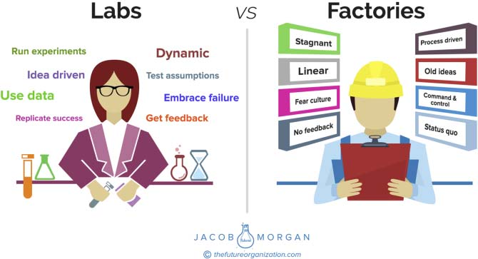

**252** **T** **HE** **E** **MPLOYEE** **E** **XPERIENCE** **A** **DVANTAGE**

Let’s look at what these moments that matter actually are:

**First Impression:** Cisco knows it has only one chance to make a first

impression on employees. That’s why it’s improving the interview,

offer, and first day experiences with the intersection of human touch

and digital.

**My Development:** Cisco is upgrading, organizing, and communicating

development tools and offerings to help employees continue to learn

and grow professionally.

**My Leader:** Great teams need great leaders. Cisco is developing tools

and processes for leaders to understand and lead with their unique

strengths. Cisco inspires curiosity to explore how to become a great

team leader.

**My Personal Experiences:** Developing programs that help Cisco

deliver the right support for employees experiencing major life

events while adapting to regional and cultural needs, including

having a baby, planning for college, caring for an elderly parent, or

dealing with a family crisis

**My Innovation**: Empowering every employee to innovate and make

a meaningful difference. Cisco is currently focused on its second

Innovate Everywhere Challenge and creating a centralized hub for

innovation.

**My Rewards:** Striving to create a meaningful rewards experience—

including perks, benefits, pay, and recognition—that encourages

productivity, attracts and retains talent, and is one size fits one

(personalized).

**My Technology:** Simplifying, centralizing, and personalizing Cisco’s

technology solutions—things such as Refresh, eStore, and CEC

\[Cisco Employee Connection, its internal website\]—to help

employees be more productive every day.

**My Workplace:** Cisco is creating a connected workspace that empowers

employees to collaborate, innovate, and deliver amazing outcomes

for their teams and customers.

**My Lasting Impression:** Initiatives that foster a positive and respectful

transition from Cisco, show appreciation for employees’ time with

**W** **HERE TO** **S** **TART** **253**

the company, and create an environment for a lifelong relationship

through an alumni network.

**My Team:** Performance lives in teams so Cisco identified what char-

acterizes its best teams and shared tools with its people to bring

out the best in their teams—lifting the overall performance of the

organization.

**My Making a Difference:** Cisco is committed to helping employees

support causes and the communities they care about, accelerate

social change, and invest in a better tomorrow. Cisco is currently

doing this by focusing on enhancing volunteering, donations, and

corporate social responsibility initiatives.

The framework that Cisco provides here can be a great starting point

for any organization. You will notice that Cisco uses all three types of

moments that matter: specific, ongoing, and created. For example, First

Impression comprises a few very specific moments, such as the interview

process and an employee’s first day on the job. My Leader addresses the

ongoing relationship that an employee has with his or her team. My Inno-

vation allows Cisco to create specific moments, such as innovation jams.

Your organization can start with perhaps two or three moments that

matter and then expand from there. Identifying these moments doesn’t

need to be a complicated or tedious task. Encourage leaders to have

one-on-one conversations with employees, hold focus groups at various

career stages, conduct a few surveys, and leverage whatever technology

solutions you might have to get employees to open up. Have a conversa-

tion with your people, and ask them what they care about and why. Lever-

aging the people analytics team will help identify what these moments

actually are and will allow you to easily categorize the moments that mat-

ter into one of the three categories I talked about earlier.

**THINK OF YOUR ORGANIZATION LIKE A LAB**

**INSTEAD OF A FACTORY**

You probably haven’t heard of Sir Richard Arkwright, but he was actually

quite a well-known inventor and entrepreneur. Arkwright is credited **254** **T** **HE** **E** **MPLOYEE** **E** **XPERIENCE** **A** **DVANTAGE**

with being the creator of the modern-day factory (his did cotton

spinning). This was the first time in modern business when people

were reduced to mere replaceable commodities at scale. Factories

were behemoths that had more and better resources to produce more

product cheaper and so they did quite well. This factory model was

then copied all over the world until Henry Ford further revolutionized

this concept with mass production via assembly line. Factory jobs were

long, hard, monotonous, and repetitive. Organizations that operate like

factories see environments where employees adhere to a dress code,

work in similar spaces, don’t ask questions or share ideas, commute to

and from the office to show up and leave at the same time every day,

and work in an environment that is routine, repetitive, and focused on

maintaining the status quo. Organizations that operate like laboratories

are different, as shown in Figure 25.3.

One of the fascinating things about Experiential Organizations is

that they view themselves more like laboratories than factories. These

**FIGURE 25.3 Key Differences Between Labs and Factories, Labs Will Succeed, Factories Will Not**

**W** **HERE TO** **S** **TART** **255**

organizations don’t claim to have all the answers or the best solutions to

employee experience (or the future of work for that matter). Experiential

Organizations embrace failure, rely on data to make decisions, test new

ideas, embrace employee feedback, and encourage and support their

people. Not only is this simply the right thing to do, but it also serves

as a unique business advantage because the best way to mitigate risks

or identify opportunities is by experimenting or testing ideas. Airbnb

treats its physical space like software where it is constantly testing and

implementing new workspace designs to see what works best. Google

tested numerous approaches to get employees to eat healthier foods at

work before realizing that the best solution was to put the healthy food

choices in transparent containers at eye level and the unhealthy options

in translucent containers below eye level. Cisco is testing out a new

approach to talent that emulates a freelance marketplace inside of

the organization. LinkedIn is playing around with the idea of giving

employees badges for new skills they earn at work. The list goes on

and on. Think of your organization more like a laboratory and less like

a factory.

**NOTES**

1\. Bock, Laszlo. _Work Rules! Insights from Inside Google That Will Transform How_

_You Live and Lead_. New York: Grand Central, 2015.

2\. [https://www.linkedin.com/pulse/hr-analytics-journey-shell-david-green.](./https___www.linkedin.com_pulse_hr-analytics-journey-shell-david-green.md)

3\. [https://www.linkedin.com/pulse/people-analytics-interviews-3-dawn-klinghoffer-](./https___www.linkedin.com_pulse_people-analytics-interviews-3-dawn-klinghoffer-microsoft-green.md)

[microsoft-green.](./https___www.linkedin.com_pulse_people-analytics-interviews-3-dawn-klinghoffer-microsoft-green.md)

4\. [https://www.bloomberg.com/news/articles/2015-10-09/amazon-asks-corporate-](./https___www.bloomberg.com_news_articles_2015-10-09_amazon-asks-corporate-employees-for-feedback-on-work.md)

[employees-for-feedback-on-work.](./https___www.bloomberg.com_news_articles_2015-10-09_amazon-asks-corporate-employees-for-feedback-on-work.md)

5\. [http://www.adobe.com/diversity.html.](./http___www.adobe.com_diversity.html)

6\. Courtesy of Cisco.
