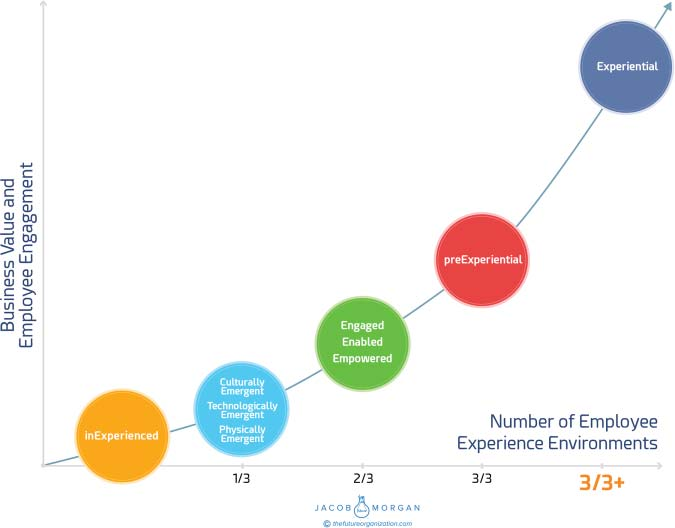

**C H A P T E R** **27**

**Size, Industry, and**

**Location Don’t Matter**

As you can imagine, it’s quite a bit easier to focus on employee experi-

ences if you’re a growing company that has to invest actively in culture,

new technologies, and physical spaces. Newer companies don’t have

the baggage of dealing with many of the outdated workplace practices

and approaches that plague many of the older and larger organizations

around the world. The concept of employee experience applies to

any organization regardless of size, industry, or location. Smaller, less

established organizations have the benefit of being able to make these

changes quicker without having to get rid of older approaches, but on

the other hand, these smaller organizations also have fewer resources

to work with.

I’ll be honest; larger organizations here are going to have a more

challenging time, simply because these organizations have more people,

which means more bureaucracy, and because they usually have to change

many years of doing things. Although some of the Experiential Orga-

nizations mentioned in this book are young disruptors, such as Airbnb

and Facebook, there are also plenty of larger, more established players

that have had to make considerable investments and changes. Consider

Microsoft, which was founded in 1975 and has around 115,000 employ-

ees around the world, or Apple, which was founded in 1976 and has

around 115,000 employees as well.

**261**

**262** **T** **HE** **E** **MPLOYEE** **E** **XPERIENCE** **A** **DVANTAGE**

The size, industry, or location of an organization is not an excuse

for not investing in employee experience. It’s simply a matter of priority

and commitment. Still, I will acknowledge that all the Experiential

Organizations can be considered technology companies. It’s hard to say

whether this is a coincidence or is industry specific. After all there are

many other technology companies, such as HP and Ingram Micro, which

scored rather poorly. It’s becoming harder to differentiate organizations

by industry as every company is becoming a technology company. For

those that prefer to stick to traditional industry definitions though, rest

assured that plenty of nontechnology companies were quite close to

becoming Experiential Organizations. Starbucks, Nike, Humana, Capital

One, Dow Chemical, St. Jude Children’s Research Hospital, Best Buy,

Whirlpool, and dozens of others were all ranked as preExperiential,

meaning they were in the second-highest category of organizations.

I fully expect that over time, we will see more organizations follow

what I like to call the path to the Experiential Organization.

As I mentioned earlier in this book, organizations can just as easily

fall backward as they can move forward. You can see this in figure 27.1.

Any organization can follow the approaches outlined here. But, several

specific traits of Experiential Organizations outlined in this book truly

set them apart from everyone else.

**ALWAYS IMPROVE**

As you saw throughout this book, even the Experiential Organizations are

flawed. That doesn’t keep them from constantly trying to improve. These

organizations know the areas they are lacking in, and they are constantly

looking for ways to get better. It’s okay to admit you are not perfect but

always reach for the stars.

**THINK LIKE A LABORATORY**

As new approaches get introduced and as the discussions about the

future of work continue to evolve, the Experiential Organizations evolve.

**S** **IZE** **, I** **NDUSTRY** **,** **AND** **L** **OCATION** **D** **ON** **’** **T** **M** **ATTER** **263**

**FIGURE 27.1 Path to the Experiential Organization**

These companies think of themselves as laboratories that are constantly

testing, experimenting, and using data to evolve. Try to break things

and then rebuild them where they come out better faster and stronger.

Think of the various hackathons that organizations like LinkedIn and

T-Mobile host.

**MOVE BEYOND CHECKLISTS**

I’ve repeated this numerous times. Any organization can follow the

approaches outlined in this book, but simply implementing a program

around the 17 variables won’t guarantee anything. The variables and **264** **T** **HE** **E** **MPLOYEE** **E** **XPERIENCE** **A** **DVANTAGE**

environments outlined in this book are simply the things that employees

care about most. I did my best to share some frameworks, models, and

ideas for how you can design and implement them, but I recommend

that you build on this with your own take. Remember, employee

experience is not just about what you do but also about how you do it.

**PUT PEOPLE AT THE CENTER AND KNOW THEM**

If you truly want to be an Experiential Organization, then put your peo-

ple at the center. Don’t just talk about or say how much you care about

your employees. Actually do something about employee experience.

If employee experience is a priority, then you should make significant

investments in this space. Redesign your organization to put people at

the center.

Experiential Organizations truly know their people, not just from

a people analytics standpoint but also from an individual manager to

employee perspective. Employees are viewed as whole people with

passions, fears, interests, and aspirations.

**DESIGN WITH, NOT FOR**

It’s tempting to create things for your employees, but the right approach

is to create things with them. Be as transparent as you can, and ask

for feedback often both via technology and via in-person discussions.

Create the employee experience design loop, and bring employees into

the experience design process whenever and wherever you can.

**CARE**

You can’t teach this or somehow create a sense of caring. This ultimately

stems from the executives running the organization and the managers

who are leading the teams. If your leaders don’t care about people, actu-

ally care, then no amount of effort or investment in employee experience

will yield results.

**S** **IZE** **, I** **NDUSTRY** **,** **AND** **L** **OCATION** **D** **ON** **’** **T** **M** **ATTER** **265**

**FOCUS ON WHAT MAKES YOU UNIQUE**

You’ve read about dozens of organizations in this book. Some of the

examples you will be able to relate to and others you won’t. Don’t worry

about copying anyone else. Use the examples and the stories in this book

to focus on what makes you unique, and build on that as much as you

can. People work at your company not because you’re copying Google or

Facebook, but because you are you.
